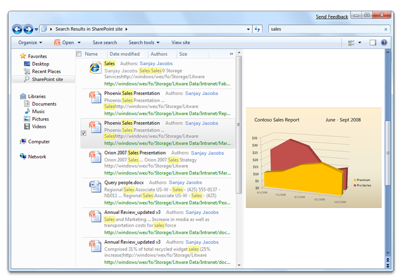
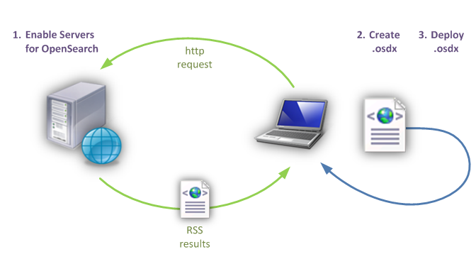
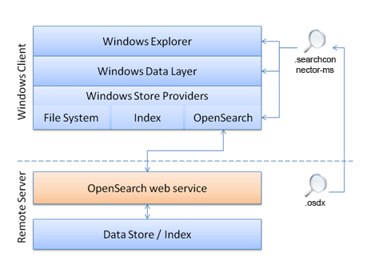

# Getting Started with Federated Search in Windows

Windows 7 support for search federation to remote data stores using OpenSearch technologies enables users to access and interact with their remote data from within Windows Explorer. You can build a web-based data store that can be searched using Windows federated search and enable rich integration of your remote data sources with Windows Explorer without having to write or deploy any Windows client-side code.

This topic is organized as follows:

-   [What is Federated Search?](#what-is-federated-search)
-   [Steps for Building Federated Search](#steps-for-building-federated-search)
-   [How Federated Search Works](#how-federated-search-works)
-   [Sending Queries and Returning Search Results in RSS or Atom](#sending-queries-and-returning-search-results-in-rss-or-atom)
-   [Federated Search Examples](#federated-search-examples)
-   [Additional Resources](#additional-resources)
-   [Related topics](#related-topics)

## What is Federated Search?

Windows 7 supports the connection of external sources to the Windows client through the [OpenSearch](https://github.com/dewitt/opensearch) protocol. This enables users to search a remote data store and view results from within Windows Explorer. The [OpenSearch](https://github.com/dewitt/opensearch) v1.1 standard defines simple file formats that can be used to describe how a client should query the web service for the data store and how the service should return results to be rendered by the client. Windows federated search connects to web services that receive [OpenSearch](https://github.com/dewitt/opensearch) queries, and returns results in either the RSS or Atom XML format.

The following screen shot illustrates the search results obtained after remotely searching a SharePoint site.



## Steps for Building Federated Search

To build federated search, perform the following steps:

1.  Enable your data store to be searched from Windows Explorer by providing an [OpenSearch](https://github.com/dewitt/opensearch)-compatible web service that can return results in RSS or Atom format.
2.  Create an OpenSearch Description (.osdx) file that describes how to connect to the web service and how to map any custom elements in your RSS or Atom XML.
3.  Deploy the search connectors to Windows client computers with an .osdx file.

The following diagram illustrates the steps for building federated search.



## How Federated Search Works

Communication between Windows Explorer and your [OpenSearch](https://github.com/dewitt/opensearch) web service is performed through the Windows Data Layer. The Windows Data Layer can communicate with different types of data stores through Windows Store Providers. Each provider specializes in communicating with data stores that support a particular protocol and have specific capabilities. For example, the following illustration sows how the [OpenSearch](https://github.com/dewitt/opensearch) provider communicates with data stores that provide a web service that supports the [OpenSearch](https://github.com/dewitt/opensearch) standard.



To enable your data store to support federated search in Windows 7, you must perform a number of tasks. The following table lists tasks for enabling your data store, what is required to accomplish each task, and where to find documentation.


| Task                                                                                                     | Requirement                                                                                                                                                                                            | Documentation                                                                                                                                                                                                             |
|----------------------------------------------------------------------------------------------------------|--------------------------------------------------------------------------------------------------------------------------------------------------------------------------------------------------------|---------------------------------------------------------------------------------------------------------------------------------------------------------------------------------------------------------------------------|
| Enable your data store to be searched by Windows Explorer.<br/>                                    | Build an OpenSearch-compatible web service.<br/> Create an OpenSearch Description (.osdx) file.<br/>                                                                                       | [Connecting Your web Service in Windows Federated Search](-search-federated-search-web-service.md)<br/> [Enabling Your Data Store in Windows Federated Search](-search-federated-search-data-store.md)<br/> |
| Actively deploy your web service to users within an enterprise.<br/>                               | Supply an .osdx file to your users, copy it locally, and make it accessible to the user via a shortcut.<br/>                                                                                     | [Deploying Search Connectors in Windows Federated Search](-search-federated-search-deploying.md)<br/>                                                                                                              |
| Enumerate search results in Windows Explorer in response to a query.<br/>                          | Implement a web service that accepts a query string and returns results in RSS or Atom format.<br/>                                                                                              | [Connecting Your web Service in Windows Federated Search](-search-federated-search-web-service.md)<br/>                                                                                                            |
| Enable users to add your data store to their Windows Explorer.<br/>                                | Create an .osdx file and supply it to your users.<br/>                                                                                                                                           | [Enabling Your Data Store in Windows Federated Search](-search-federated-search-data-store.md)<br/>                                                                                                                |
| Display your items as file-like items in Windows Explorer.<br/>                                    | Return a URL to the file or content stream by using **enclosure** or **media:content** elements<br/> Supply a file name extension or a MIME type that the client computer recognizes.<br/> | [Enabling Your Data Store in Windows Federated Search](-search-federated-search-data-store.md)<br/>                                                                                                                |
| Display custom properties in Windows Explorer, beyond those defined in RSS or Atom standards.<br/> | Provide additional metadata by using another XML namespace in your RSS/Atom output.<br/> Add a property map to your .osdx file.<br/>                                                       | [Creating an OpenSearch Description File in Windows Federated Search](-search-federated-search-osdx-file.md)<br/>                                                                                                  |
| Customize the properties that are displayed for your items in Windows Explorer.<br/>               | Add proplist mappings to your .osdx file.<br/>                                                                                                                                                   | [Creating an OpenSearch Description File in Windows Federated Search](-search-federated-search-osdx-file.md)<br/>                                                                                                  |
| Display a custom webpage view of your items in the preview pane.<br/>                              | Return distinct link and enclosure values.<br/> Map a URL value to the **System.WebPreviewUrl** Windows Shell property.<br/>                                                               | [Creating an OpenSearch Description File in Windows Federated Search](-search-federated-search-osdx-file.md)<br/>                                                                                                  |
| Display a command bar button in Windows Explorer that rolls the query over to your website.<br/>   | Provide a `Url format="text/html"` template in the .osdx file.<br/>                                                                                                                              | [Creating an OpenSearch Description File in Windows Federated Search](-search-federated-search-osdx-file.md)<br/>                                                                                                  |


 

## Sending Queries and Returning Search Results in RSS or Atom

When the user types a term into the search box in the upper-right corner of Windows Explorer, the query is sent to the [OpenSearch](https://github.com/dewitt/opensearch) provider, which then sends the query to the remote data store. The remote web service responds to the query by providing results in an XML document, typically referred to as a feed, in one of two supported formats (RSS or Atom). Each result item in the feed includes XML child elements to represent or describe item metadata, such as the title, URL, description, thumbnail image, and so forth. The [OpenSearch](https://github.com/dewitt/opensearch) provider is responsible for mapping the XML element values to Windows Shell system properties that can be used by Windows applications.

## Federated Search Examples

The following example OpenSearch Description (.osdx) file consists of `ShortName` and `Url` elements, which are the minimum required child elements to connect an external data store to the Windows client through the OpenSearch protocol.


```
<OpenSearchDescription xmlns="https://a9.com/-/spec/opensearch/1.1/">
        <ShortName>My web Service</ShortName>
        <Url format="application/rss+xml" template="https://example.com/rss.php?query={searchTerms}&amp;start={startIndex}&amp;cnt={count}" />
        </OpenSearchDescription>
```


The following example illustrates how to make a web-enabled data store searchable in RSS format, and how to specify that one search item be returned:


```
<rss version="2.0" xmlns:media="https://search.yahoo.com/mrss/" xmlns:example="https://example.com/namespace">
   <channel>
      <title>Search Results</title>
      <item>
         <title>An example result</title>
         <link>https://example.com/pictures.aspx?id=01</link>
         <description>This is a test of the emergency search results system. If this were a real emergency result, then you would be reading something more useful.</description>
         <pubDate>Wed, 1 Oct 2008 23:12:00 GMT</pubDate>
         <media:content url="https://example.com/pictures/picture01.jpg" fileSize="212889" type="image/jpeg" height="768" width="1024"/>
         <media:thumbnail url="https://example.com/thumbnails/picture01.jpg" height="120" width="160"/>
         <example:dateTaken>Mon, 22 Sep 2008 23:12:00 GMT</example:dateTaken>
      </item>
   </channel>
</rss>
```


The following example illustrates how to map properties to default system properties so that displayed items are sorted and grouped:


```
<author>Sanjay Jacobs</author>
                <category>Nature</category>
                <pubDate>Thu, 24 Apr 2008 2003 21:34:38 GTMT</pubDate>
```


The following example illustrates how to adds a thumbnail image display to each item in Windows Explorer:


```
<media:thumbnail>    
```


## Additional Resources

For additional information about implementing search federation to remote data stores using OpenSearch technologies in Windows 7 and later, see "Additional Resources" at [Federated Search in Windows](-search-federated-search-overview.md).

## Related topics

<dl> <dt>

[Federated Search in Windows](-search-federated-search-overview.md)
</dt> <dt>

[Connecting Your web Service in Windows Federated Search](-search-federated-search-web-service.md)
</dt> <dt>

[Enabling Your Data Store in Windows Federated Search](-search-federated-search-data-store.md)
</dt> <dt>

[Creating an OpenSearch Description File in Windows Federated Search](-search-federated-search-osdx-file.md)
</dt> <dt>

[Following Best Practices in Windows Federated Search](-search-fedsearch-best.md)
</dt> <dt>

[Deploying Search Connectors in Windows Federated Search](-search-federated-search-deploying.md)
</dt> </dl>

 

 


