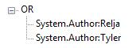
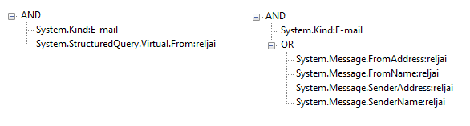

# Querying Process in Windows Search

This topic is organized as follows:

-   [About Querying in Windows Search](#about-querying-in-windows-search)
    -   [Local and Remote Queries](#local-and-remote-queries)
    -   [Structured Query API Overview](#structured-query-api-overview)
-   [Querying Scenarios](#querying-scenarios)
    -   [Condition Extraction and Query Parsing](#condition-extraction-and-query-parsing)
    -   [Querying the Index](#querying-the-index)
-   [Related topics](#related-topics)

## About Querying in Windows Search

Querying in Windows Search is based on the following four approaches:

-   [Advanced Query Syntax](-search-3x-advancedquerysyntax.md) (AQS)
-   Natural Query Syntax (NQS)
-   Structured Query Language (SQL)
-   Structured query interfaces

AQS is the default query syntax used by Windows Search to query the index and to refine and narrow search parameters. AQS is primarily user facing, and can be used by users to build AQS queries, but can also be used by developers to build queries programmatically. In Windows 7, canonical AQS was introduced and must be used to programmatically generate AQS queries. In Windows 7 and later, a shortcut menu option can be available based on whether an AQS condition is met. For more information, see "Getting Dynamic Behavior for Static Verbs by Using Advanced Query Syntax" in [Creating Context Menu Handlers](../shell/context-menu-handlers.md). AQS queries can be limited to specific types of files, which are known as file kinds. For more information, see [File Types and Associations](../shell/fa-intro.md). For reference documentation on the relevant properties, see [System.Kind](../properties/props-system-kind.md), and [System.KindText](../properties/props-system-kindtext.md).

NQS is a query syntax that is more relaxed than AQS, and is similar to human language. NQS can be used by Windows Search to query the index if NQS is selected instead of the default, AQS.

SQL is a text language that defines queries. SQL is common across many different database technologies. Windows Search uses SQL, implements a subset of it, and extends it by adding elements to the language. Windows Search SQL extends the standard SQL-92 and SQL-99 database query syntax to enhance its usefulness with text-based searches. All features of Windows Search SQL are compatible with Windows Search on Windows XP and Windows Server 2003, and later. For more information about Windows Search SQL, see [Querying the Index with Windows Search SQL Syntax](-search-sql-windowssearch-entry.md), and [Overview of Windows Search SQL Syntax](-search-sql-ovwofsearchquery.md).

The structured query APIs are described later in this topic. For reference documentation on the structured query APIs, see [Querying Interfaces](-search-querying-interfaces-entry-page.md). Interfaces such as [**ISearchQueryHelper**](/windows/desktop/api/Searchapi/nn-searchapi-isearchqueryhelper) help construct SQL strings from a set of input values. This interface converts AQS user queries to Windows Search SQL and specifies query restrictions that can be expressed in SQL but not in AQS. [**ISearchQueryHelper**](/windows/desktop/api/Searchapi/nn-searchapi-isearchqueryhelper) also obtains an OLE DB connection string to connect to the Windows Search database.

### Local and Remote Queries

You can execute your queries either locally or remotely. A local query using the [FROM clause](-search-sql-from.md) is shown in the following example. A local query queries the local SystemIndex catalog only.


```
FROM SystemIndex
```


A remote query using the [FROM clause](-search-sql-from.md) is shown in the following example. Adding ComputerName transforms the previous example into a remote query.


```
FROM [<ComputerName>.]SystemIndex
```


By default, Windows XP and Windows Server 2003 do not have Windows Search installed. Only Windows Search 4 (WS4) provides remote query support. Previous versions of Windows Desktop Search (WDS), such as 3.01 and earlier, do not support remote querying. With Windows Explorer you can query the local index of a remote computer for file system items (items handled by the "file:" protocol).

To retrieve an item by remote query, the item must meet the following requirements:

-   Be accessible via Universal Naming Convention (UNC) path.
-   Exist on the remote computer to which the client has access.
-   Have its security set to allow the client to have Read access.

Windows Explorer has features for sharing items, including a "Public" share (\\\\Machine\\Public\\...) in the **Network and Sharing Center**, and a "Users" share (\\\\Machine\\Users\\...) for items shared via the Sharing Wizard. After you share the folder(s), you can query the local index by specifying the remote computer's machine name in the FROM clause, and a UNC path on the remote computer in the SCOPE clause. A remote query using the FROM and SCOPE clauses is shown in the following example.


```
SELECT System.ItemName FROM MachineName.SystemIndex WHERE SCOPE='file://MachineName/<path>' 
```


The examples provided here use SQL.

### Structured Query API Overview

A structured query provides the ability to search for information by Boolean combinations of queries over individual properties. In this topic we outline the functionality of the most important structured query APIs and methods. For reference documentation on the structured query APIs, see [Querying Interfaces](-search-querying-interfaces-entry-page.md).

### IQueryParser

The [**IQueryParser::Parse**](/windows/desktop/api/Structuredquery/nf-structuredquery-iqueryparser-parse) method parses a user input string, and produces an interpretation in the form of an [**IQuerySolution**](/windows/desktop/api/Structuredquery/nn-structuredquery-iquerysolution). If the *pCustomProperties* parameter of that method is not null, then it is an enumeration of [**IRichChunk**](/windows/desktop/api/Structuredquerycondition/nn-structuredquerycondition-irichchunk) objects(one for each recognized custom property). The other [**IQueryParser**](/windows/desktop/api/Structuredquery/nn-structuredquery-iqueryparser) methods permit the application to set several options, such as locale, a schema, a word breaker, and handlers for various types of named entities. [**IQueryParser::GetSchemaProvider**](/windows/desktop/api/Structuredquery/nf-structuredquery-iqueryparser-getschemaprovider) returns an [**ISchemaProvider**](/windows/desktop/api/Structuredquery/nn-structuredquery-ischemaprovider) interface for browsing the loaded schema.

### IQuerySolution : IConditionFactory

The [**IQuerySolution**](/windows/desktop/api/Structuredquery/nn-structuredquery-iquerysolution) interface provides all information about the result of parsing an input string. Because **IQuerySolution** is also an [**IConditionFactory**](/windows/desktop/api/Structuredquery/nn-structuredquery-iconditionfactory) interface, additional condition tree nodes can be created. The [**IQuerySolution::GetQuery**](/windows/desktop/api/Structuredquery/nf-structuredquery-iquerysolution-getquery) method produces a condition tree for the interpretation. **IQuerySolution::GetQuery** also returns the semantic type.

### IConditionFactory

[**IConditionFactory**](/windows/desktop/api/Structuredquery/nn-structuredquery-iconditionfactory) creates condition tree nodes. If the *simplify* parameter of [**IConditionFactory::MakeNot**](/windows/desktop/api/Structuredquery/nf-structuredquery-iconditionfactory-makenot) is **VARIANT\_TRUE**, then the resulting [**ICondition**](/windows/desktop/api/Structuredquerycondition/nn-structuredquerycondition-icondition) is simplified, and need not be a negation node. If the *pSubConditions* parameter of [**IConditionFactory::MakeAndOr**](/windows/desktop/api/Structuredquery/nf-structuredquery-iconditionfactory-makeandor) is not null, then that parameter should be an enumeration of [**ICondition**](/windows/desktop/api/Structuredquerycondition/nn-structuredquerycondition-icondition) objects, and become subtrees.[**IConditionFactory::MakeLeaf**](/windows/desktop/api/Structuredquery/nf-structuredquery-iconditionfactory-makeleaf) constructs a leaf node with a specified property name, operation, and value. The string in the *pValueType* parameter should be the name of a semantic type from the schema. If the *expand* parameter is **VARIANT\_TRUE** and the property is virtual, the resulting condition tree is typically a disjunction resulting from expanding the property to its defined constituents. If not null, the *pPropertyNameTerm*, *pOperatorTerm*, and *pValueTerm* parameters should identify terms indicating the property, operation, and value.

### ICondition : IPersistStream

The [**ICondition**](/windows/desktop/api/Structuredquerycondition/nn-structuredquerycondition-icondition) interface is a single node in a condition tree. The node can be a negation node, AND node, OR node, or a leaf node. For a non-leaf node [**ICondition::GetSubConditions**](/windows/desktop/api/structuredquerycondition/nf-structuredquerycondition-icondition-getsubconditions) returns an enumeration of the subtrees. For a leaf node the following methods of [**ICondition**](/windows/desktop/api/Structuredquerycondition/nn-structuredquerycondition-icondition) return the following values:

-   [**GetComparisonInfo**](/windows/desktop/api/structuredquerycondition/nf-structuredquerycondition-icondition-getcomparisoninfo) returns the property name, operation, and value.
-   [**GetValueType**](/windows/desktop/api/structuredquerycondition/nf-structuredquerycondition-icondition-getvaluetype) returns the semantic type of the value, which was specificied in the *pszValueType* parameter of [**IConditionFactory::MakeLeaf**](/windows/desktop/api/Structuredquery/nf-structuredquery-iconditionfactory-makeleaf).
-   [**GetValueNormalization**](/windows/desktop/api/structuredquerycondition/nf-structuredquerycondition-icondition-getvaluenormalization) returns a string form of the value. (If the value was already a string, this form will be normalized with regard to case, accents, and so forth.)
-   [**GetInputTerms**](/windows/desktop/api/structuredquerycondition/nf-structuredquerycondition-icondition-getinputterms) returns information about which parts of the input sentence generated the property name, the operation, and the value.
-   [**Clone**](/windows/desktop/api/structuredquerycondition/nf-structuredquerycondition-icondition-clone) returns a deep copy of a condition tree.

### IRichChunk

Each [**IRichChunk**](/windows/desktop/api/Structuredquerycondition/nn-structuredquerycondition-irichchunk) object identifies a token span and a string. **IRichChunk** is a utility interface that represents information about a span (typically a span of tokens) identified by a starting position and length. This span information includes a string and/or a **VARIANT**.

### IConditionGenerator

The [**IConditionGenerator**](/windows/desktop/api/Structuredquery/nn-structuredquery-iconditiongenerator) interface is provided by the application to handle recognition and condition tree generation for a named entity type. A condition generator is given to an [**IQueryParser**](/windows/desktop/api/Structuredquery/nn-structuredquery-iqueryparser) through [**IQueryParser::SetMultiOption**](/windows/desktop/api/Structuredquery/nf-structuredquery-iqueryparser-setmultioption). [**IQueryParser**](/windows/desktop/api/Structuredquery/nn-structuredquery-iqueryparser) calls [**IConditionGenerator::Initialize**](/windows/desktop/api/Structuredquery/nf-structuredquery-iconditiongenerator-initialize) with an [**ISchemaProvider**](/windows/desktop/api/Structuredquery/nn-structuredquery-ischemaprovider) for the currently loaded schema. Doing so permits [**IConditionGenerator**](/windows/desktop/api/Structuredquery/nn-structuredquery-iconditiongenerator) to obtain any schema information that is required. When parsing an input string, **IQueryParser** calls the [**IConditionGenerator::RecognizeNamedEntities**](/windows/desktop/api/Structuredquery/nf-structuredquery-iconditiongenerator-recognizenamedentities) method of each [**IConditionGenerator**](/windows/desktop/api/Structuredquery/nn-structuredquery-iconditiongenerator), so that the occurrence of named entities it recognizes in the input string can be reported. **IQueryParser** can make use of the current locale and should make use of the tokenization of the input as it needs to report the token spans of any named entities.

When [**IQueryParser**](/windows/desktop/api/Structuredquery/nn-structuredquery-iqueryparser) is about to emit a leaf node, and the semantic type of the value matches the named entity type for an [**IConditionGenerator**](/windows/desktop/api/Structuredquery/nn-structuredquery-iconditiongenerator), **IQueryParser** calls [**IConditionGenerator::GenerateforLeaf**](/windows/desktop/api/Structuredquery/nf-structuredquery-iconditiongenerator-generateforleaf) with the information for the node to be generated. If the [**IConditionGenerator**](/windows/desktop/api/Structuredquery/nn-structuredquery-iconditiongenerator) returns S\_OK, it should return a condition tree (which does not have to be a leaf node), and inform **IQueryParser** whether to suppress the alternative string interpretation that it would normally generate as a precaution.

### ITokenCollection

The [**ITokenCollection::NumberOfTokens**](/windows/desktop/api/Structuredquery/nf-structuredquery-itokencollection-numberoftokens) method returns the number of tokens.[**ITokenCollection::GetToken**](/windows/desktop/api/Structuredquery/nf-structuredquery-itokencollection-gettoken) returns information about the *i*th token. The beginning and length are character positions in the input string. The returned text will be non-null only if there is a text overriding the characters from the input string. This is used, for example, to override a dash in the input string with NOT when that dash is in a context where it should be interpreted as a negation.

### INamedEntityCollector

[**IConditionGenerator**](/windows/desktop/api/Structuredquery/nn-structuredquery-iconditiongenerator) calls [**INamedEntityCollector::Add**](/windows/desktop/api/Structuredquery/nf-structuredquery-inamedentitycollector-add) for each named entity it recognized. The spans are token spans. It must always be the case that *beginSpan* ? *beginActual* < *endActual* ? *endSpan*. *beginSpan* and *endSpan* may differ from *beginActual* and *endActual* if the named entity begins and/or ends with semantically insignificant tokens such as quotation marks (that are nevertheless covered by the named entity). The value must be expressed as a string and will subsequently appear in a call to [**IConditionGenerator::GenerateForLeaf**](/windows/desktop/api/Structuredquery/nf-structuredquery-iconditiongenerator-generateforleaf).

### ISchemaProvider

The [**ISchemaProvider**](/windows/desktop/api/Structuredquery/nn-structuredquery-ischemaprovider) interface can be used to browse a loaded schema for entities (types) and relations (properties). Here's what it's individual methods do:

-   [**Entities**](/windows/desktop/api/Structuredquery/nf-structuredquery-ischemaprovider-entities) returns an enumeration of every entity ([**IEntity**](/windows/desktop/api/Structuredquery/nn-structuredquery-ientity)) in the schema.
-   [**RootEntity**](/windows/desktop/api/Structuredquery/nf-structuredquery-ischemaprovider-rootentity) returns the root entity of the schema. For a flat schema, the main type of every [**IQuerySolution**](/windows/desktop/api/Structuredquery/nn-structuredquery-iquerysolution) is returned.
-   [**GetEntity**](/windows/desktop/api/Structuredquery/nf-structuredquery-ischemaprovider-getentity) finds an entity by name and returns S\_FALSE if there is no such entity in the schema.
-   [**MetaData**](/windows/desktop/api/Structuredquery/nf-structuredquery-ischemaprovider-metadata) returns an enumeration of [**IMetaData**](/windows/desktop/api/Structuredquery/nn-structuredquery-imetadata) interfaces.

### IEntity

The [**IEntity**](/windows/desktop/api/Structuredquery/nn-structuredquery-ientity) interface is a schema entity that represents a type that has a name, has a number of named relationships to other types (properties), and derives from a base entity. Here's what its individual methods do:

-   [**IEntity::Relationships**](/windows/desktop/api/Structuredquery/nf-structuredquery-ientity-relationships) returns an enumeration of [**IRelationship**](/windows/desktop/api/Structuredquery/nn-structuredquery-irelationship) objects, one for each outgoing relation of this type. Each outgoing relation of an entity has a name.
-   [**IEntity::GetRelationship**](/windows/desktop/api/Structuredquery/nf-structuredquery-ientity-getrelationship) finds a relationship by name, and returns S\_FALSE if there is no such relationship for this entity.
-   [**IEntity::MetaData**](/windows/desktop/api/Structuredquery/nf-structuredquery-ientity-metadata) returns an enumeration of [**IMetaData**](/windows/desktop/api/Structuredquery/nn-structuredquery-imetadata) interfaces, one for each metadata pair of this entity.
-   [**IEntity::DefaultPhrase**](/windows/desktop/api/Structuredquery/nf-structuredquery-ientity-defaultphrase) returns a default phrase to facilitate generating an AQS or NQS restatement of a condition tree.

### IRelationship

The [**IRelationship**](/windows/desktop/api/Structuredquery/nn-structuredquery-irelationship) interface represents a relationship between two entities: a source and a destination. Here's what it's individual methods do:

-   [**IRelationship::IsReal**](/windows/desktop/api/Structuredquery/nf-structuredquery-irelationship-isreal) reports whether a relationship is real. For example, if entity A derives from entity B and inherits a relationship named R from it, A may still have its own relationship named R. However, the relationship beween A and R must have the same destination type as that of B, and the only reason for it to exist is to store metadata specific to B. Such a relationship of B is said not to be real.
-   [**IRelationship::Medadata**](/windows/desktop/api/Structuredquery/nf-structuredquery-irelationship-metadata) returns an enumeration of [**IMetaData**](/windows/desktop/api/Structuredquery/nn-structuredquery-imetadata) interfaces, one for each metadata pair of this entity.
-   [**IRelationship::DefaultPhrase**](/windows/desktop/api/Structuredquery/nf-structuredquery-irelationship-defaultphrase) returns the default phrase to use for this relationship in restatements. Each relationship has a default phrase that denotes it to facilitate generating an AQS or NQS restatement of a condition tree.

### IMetaData

Metadata are key-value pairs that are each associated with either an entity, a relationship, or the whole schema. Because keys are not necessarily unique, a collection of metadata can be thought of as a multi-map. [**IMetaData::GetData**](/windows/desktop/api/Structuredquery/nf-structuredquery-imetadata-getdata) is called to retrieve the key and value for a metatdata pair.

## Querying Scenarios

The following scenarios describe the use of structured query APIs in Windows Search in common querying scenarios, such as creating a condition tree and querying the index.

### Condition Extraction and Query Parsing

When a query is created, its scope is defined by telling the system where to search. This restricts the search results. After the scope is defined, a filter is applied, and a filter set is returned. Search results are restricted by building a condition tree with leaf nodes, similar to a graph. Those conditions are then extracted. A condition tree is a Boolean combination (AND, OR, NOT) of leaf conditions, each of which relates a property, through an operation, to a value. A leaf node represents a restriction on a single property to a value through some operations.

A filter restriction requires a logical expression that describes the restriction. Defining this expression starts with the [**ICondition**](/windows/desktop/api/Structuredquerycondition/nn-structuredquerycondition-icondition) interface, which is used to create a single node in a condition tree. Because there is only one condition in the following example, the tree does not change.


```C++
    
    [
        object,
        uuid(0FC988D4-C935-4b97-A973-46282EA175C8),
        pointer_default(unique)
    ]
    interface ICondition : IPersistStream
    {
        HRESULT GetConditionType([out, retval] CONDITION_TYPE* pNodeType);
        HRESULT GetSubConditions([in] REFIID riid, [out, retval, iid_is(riid)] void** ppv);
        [local] HRESULT GetComparisonInfo([out, annotation("__deref_opt_out")] LPWSTR *ppszPropertyName, [out, annotation("__out_opt")] CONDITION_OPERATION *pOperation, [out, annotation("__out_opt")] PROPVARIANT *pValue);
        HRESULT GetValueType([out, retval] LPWSTR* ppszValueTypeName);
        HRESULT GetValueNormalization([out, retval] LPWSTR* ppszNormalization);
        [local] HRESULT GetInputTerms([out, annotation("__out_opt")] IRichChunk** ppPropertyTerm, [out, annotation("__out_opt")] IRichChunk** ppOperationTerm, [out, annotation("__out_opt")] IRichChunk** ppValueTerm);
        HRESULT Clone([out, retval] ICondition** ppc);
    };


```


If there is more than one filter condition, then AND and other Boolean operators are used to achieve a single tree. AND-trees and OR-trees represent conjunctions and disjunctions of their subtrees. A NOT-tree represents the negation of its single subtree. AQS provides a text approach to achieving logical expressions with Boolean operators, and is often simpler.

In the next example we convert the condition tree ([**ICondition**](/windows/desktop/api/Structuredquerycondition/nn-structuredquerycondition-icondition)) into visual form. The query parser, using the [**IQueryParser**](/windows/desktop/api/Structuredquery/nn-structuredquery-iqueryparser) interface, converts the [**ICondition**](/windows/desktop/api/Structuredquerycondition/nn-structuredquerycondition-icondition) into a rich text formatted (RTF) query string. The [**IQueryParser::RestateToString**](/windows/desktop/api/Structuredquery/nf-structuredquery-iqueryparser-restatetostring) method returns the query text, while the [**IQueryParser::Parse**](/windows/desktop/api/Structuredquery/nf-structuredquery-iqueryparser-parse) method produces an [**IQuerySolution**](/windows/desktop/api/Structuredquery/nn-structuredquery-iquerysolution) interface. The following example shows how to do all that.


```C++
    [
        object,
        uuid(2EBDEE67-3505-43f8-9946-EA44ABC8E5B0),
        pointer_default(unique)
    ]
    interface IQueryParser : IUnknown
    {
        HRESULT Parse([in] LPCWSTR pszInputString, [in] IEnumUnknown* pCustomProperties, [out, retval] IQuerySolution** ppSolution);
        HRESULT SetOption([in] STRUCTURED_QUERY_SINGLE_OPTION option, [in] PROPVARIANT const* pOptionValue);
        HRESULT GetOption([in] STRUCTURED_QUERY_SINGLE_OPTION option, [out, retval] PROPVARIANT* pOptionValue);
        HRESULT SetMultiOption([in] STRUCTURED_QUERY_MULTIOPTION option, [in] LPCWSTR pszOptionKey, [in] PROPVARIANT const* pOptionValue);
        HRESULT GetSchemaProvider([out, retval] ISchemaProvider** ppSchemaProvider);
        HRESULT RestateToString([in] ICondition* pCondition, [in] BOOL fUseEnglish, [out] LPWSTR* ppszQueryString);
        HRESULT ParsePropertyValue([in] LPCWSTR pszPropertyName, [in] LPCWSTR pszInputString, [out, retval] IQuerySolution** ppSolution);
        HRESULT RestatePropertyValueToString([in] ICondition* pCondition, [in] BOOL fUseEnglish, [out] LPWSTR* ppszPropertyName, [out] LPWSTR* ppszQueryString);
    };

```


The main input of [**IQueryParser::Parse**](/windows/desktop/api/Structuredquery/nf-structuredquery-iqueryparser-parse) is a user input string to be parsed, but the application can also inform the query parser of any properties it has recognized in the input (from application-specific syntax). The output of **IQueryParser::Parse** is an [**IQuerySolution**](/windows/desktop/api/Structuredquery/nn-structuredquery-iquerysolution), which provides all information pertaining to that parse invocation. There are methods for obtaining the input string, how the input string was tokenized, any parse errors, and the parsed query as condition tree, represented by an [**ICondition**](/windows/desktop/api/Structuredquerycondition/nn-structuredquerycondition-icondition). The following example shows ...


```C++
    [
        object,
        uuid(D6EBC66B-8921-4193-AFDD-A1789FB7FF57),
        pointer_default(unique)
    ]
    interface IQuerySolution : IConditionFactory
    {
        [local] HRESULT GetQuery([out, annotation("__out_opt")] ICondition** ppQueryNode, [out, annotation("__out_opt")] IEntity** ppMainType);
        HRESULT GetErrors([in] REFIID riid, [out, retval, iid_is(riid)] void** ppParseErrors);
        [local] HRESULT GetLexicalData([out, annotation("__deref_opt_out")] LPWSTR* ppszInputString, [out, annotation("__out_opt")] ITokenCollection** ppTokens, [out, annotation("__out_opt")] LCID* pLocale, [out, annotation("__out_opt")] IUnknown** ppWordBreaker);
    }    

    

```


In the previous example, [**IQuerySolution::GetQuery**](/windows/desktop/api/Structuredquery/nf-structuredquery-iquerysolution-getquery) could obtain any information about the query including the original text, tokens that comprise the text, or the condition tree. Examples of possible returned query values are listed in the following table.


| Examples of returned query values                        | Description                                                                                               |
|----------------------------------------------------------|-----------------------------------------------------------------------------------------------------------|
| `  author:relja OR author:tyler`                         | The query text that [**IQueryParser::RestateToString**](/windows/desktop/api/Structuredquery/nf-structuredquery-iqueryparser-restatetostring) returns |
| `?author?, ?:?, ?relja?, ?OR?, ?author?, ?:?, ?tyler?`   | The break-down of tokens                                                                                  |
|  | An unresolved condition tree                                                                              |


 

The initial condition tree that is returned is unresolved. In an unresolved condition tree, date and time references, such as `date:yesterday`, are not converted to absolute time. Also, virtual properties are not expanded. Virtual properties are properties that act as aggregates of multiple properties.

For example, the query `kind:email from:reljai` produces the following unresolved and resolved condition trees. The unresolved condition tree is to the left, and the resolved condition tree is to the right.



The resolved tree can be obtained by calling [**IConditionFactory::Resolve**](/windows/desktop/api/Structuredquery/nf-structuredquery-iconditionfactory-resolve). However, passing [**SQRO\_DONT\_RESOLVE\_DATETIME**](/windows/desktop/api/Structuredquery/ne-structuredquery-structured_query_resolve_option) leaves the date and time unresolved. There are advantages to an unresolved condition tree, because an unresolved condition tree contains information about the query. Each leaf node points to the tokens returned by [**IQuerySolution::GetLexicalData**](/windows/desktop/api/Structuredquery/nf-structuredquery-iquerysolution-getlexicaldata), which correspond to the property, operator, and value when using the [**IRichChunk**](/windows/desktop/api/Structuredquerycondition/nn-structuredquerycondition-irichchunk) interface. The following example shows ...


```C++
    interface ITokenCollection : IUnknown
    {
        HRESULT NumberOfTokens(ULONG* pCount);
        HRESULT GetToken([in] ULONG i, [out, annotation("__out_opt")] ULONG* pBegin, [out, annotation("__out_opt")] ULONG* pLength, [out, annotation("__deref_opt_out")] LPWSTR* ppsz);
    };

ICondition:: GetInputTerms([out, annotation("__out_opt")] 
IRichChunk** ppPropertyTerm, [out, annotation("__out_opt")] 
IRichChunk** ppOperationTerm, [out, annotation("__out_opt")] 
IRichChunk** ppValueTerm);

    interface IRichChunk : IUnknown
    {
        HRESULT GetData([out, annotation("__out_opt")] ULONG* pFirstPos, [out, annotation("__out_opt")] ULONG* pLength, [out, annotation("__deref_opt_out")] LPWSTR* ppsz, [out, annotation("__out_opt")] PROPVARIANT* pValue);
    }
```


### Querying the Index

There are several approaches to querying the index. Some are based on the SQL and others are based on AQS. You can also query the Windows Search index programmatically by using [querying interfaces](./-search-querying-interfaces-entry-page.md). There are three interfaces that are specific to querying the index: [**ISearchQueryHelper**](/windows/desktop/api/Searchapi/nn-searchapi-isearchqueryhelper), [**IRowsetPrioritization**](/windows/desktop/api/Searchapi/nn-searchapi-irowsetprioritization), and [**IRowsetEvents**](/windows/desktop/api/Searchapi/nn-searchapi-irowsetevents). For conceptual information, see [Querying the Index Programmatically](-search-3x-wds-qryidx-overview.md).

You can develop a component or helper class to query the index by using the [**ISearchQueryHelper**](/windows/desktop/api/Searchapi/nn-searchapi-isearchqueryhelper) interface. This interface is implemented as a helper class to [**ISearchCatalogManager**](/windows/desktop/api/Searchapi/nn-searchapi-isearchcatalogmanager) (and [**ISearchCatalogManager2**](/windows/desktop/api/Searchapi/nn-searchapi-isearchcatalogmanager2)), and is obtained by calling [**ISearchCatalogManager::GetQueryHelper**](/windows/desktop/api/Searchapi/nf-searchapi-isearchcatalogmanager-getqueryhelper). For conceptual information, see [Querying the Index with ISearchQueryHelper](-search-3x-wds-qryidx-searchqueryhelper.md).

[**ISearchQueryHelper**](/windows/desktop/api/Searchapi/nn-searchapi-isearchqueryhelper) permits you to:

-   Obtain an OLE DB connection string to connect to the Windows Search database.
-   Convert AQS user queries to Windows Search SQL.
-   Specify query restrictions that can be expressed in SQL but not in AQS.

Indexing prioritization and rowset events are supported in Windows 7 and later. With [**IRowsetPrioritization**](/windows/desktop/api/Searchapi/nn-searchapi-irowsetprioritization) there is a priority stack that enables the client to request that the scopes used in a particular query be given higher than normal priority. [**IRowsetEvents**](/windows/desktop/api/Searchapi/nn-searchapi-irowsetevents) provides notification of changes to items in rowsets, including the addition of new items, the deletion of items, and the modification of item data. Using rowset event notifications ensures that the results for existing queries are as up to date as possible. For conceptual information, see [Indexing Prioritization and Rowset Events in Windows 7](indexing-prioritization-and-rowset-events.md).

## Related topics

<dl> <dt>

[Indexing, Querying and Notifications in Windows Search](-search-3x-wds-included-in-index.md)
</dt> <dt>

[What is Included in the Index](-search-indexing-process-overview.md)
</dt> <dt>

[Indexing Process in Windows Search](-search-indexing-process-overview.md)
</dt> <dt>

[Notifications Process in Windows Search](-search-3x-wds-support.md)
</dt> <dt>

[URL Formatting Requirements](url-formatting-requirements.md)
</dt> </dl>

 

 
