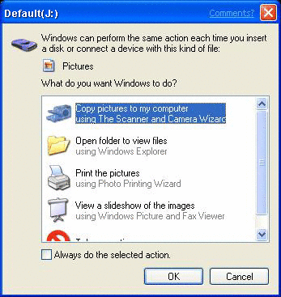
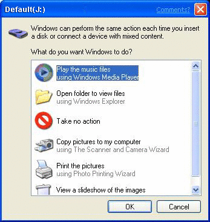
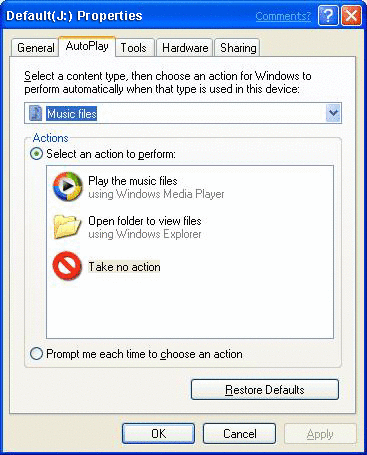

# Using and Configuring AutoPlay

When the Shell detects the insertion of new media or the attachment of a hot-plug device, the contents of the device or media are determined. AutoPlay, depending on its current settings, does one of the following.

- Plays the content automatically.
- Displays a dialog box prompting the user to choose a default handler for a single content type.
- Presents, in the case of mixed content, a list of available handler applications to launch. The chosen handler then automatically plays its associated content type.
- Displays a standard folder view of the files.
- Does nothing if, earlier, the user had chosen **Take no action** for that content type as well as specified **Always do the selected action**.

If the contents do not meet the criteria for AutoPlay, the event is then passed to Windows Image Acquisition (WIA).

The following topics discuss the setup and use of AutoPlay.

- [Preparing Hardware and Software for Use with AutoPlay](#preparing-hardware-and-software-for-use-with-autoplay)
- [How AutoPlay Searches Media](#how-autoplay-searches-media)
- [Defining Single and Mixed Content Types](#defining-single-and-mixed-content-types)
- [Sample Scenarios](#sample-scenarios)
    - [AutoPlay for Storage Devices with Picture Media](#autoplay-for-storage-devices-with-picture-media)
    - [AutoPlay for Music File Playback Devices and Storage Devices Containing Music Media](#autoplay-for-music-file-playback-devices-and-storage-devices-containing-music-media)
    - [AutoPlay for Video Playback on First Presentation](#autoplay-for-video-playback-on-first-presentation)
- [Assigning Default Handler Applications](#assigning-default-handler-applications)
- [Handling Media Containing Mixed Content Types](#handling-media-containing-mixed-content-types)
- [AutoPlay User Interfaces](#autoplay-user-interfaces)
    - [Single Content Type Dialog Box](#single-content-type-dialog-box)
    - [Mixed Media Dialog Box](#mixed-media-dialog-box)
    - [Property Page](#property-page)

## Preparing Hardware and Software for Use with AutoPlay

Several pieces of information need to appear in the registry for AutoPlay to function. These pieces of information interact and reference each other to form the full AutoPlay environment. This document presents the setup of each of these pieces of information as an individual stand-alone procedure.

See the following topics for additional instructions.

- [How To Assign a Device Handler to a Device](how-to-assign-a-device-handler-to-a-device.md)
- [How To Specify an Icon, Label, or Device Handler for a Device Using a Device Group](how-to-specify-an-icon--label--or-device-handler-for-a-device-using-a-device-group.md)
- [How To Specify an Icon, Label, or Device Handler for a Device Using a Device Class](how-to-specify-an-icon--label--or-device-handler-for-a-device-using-a-device-class.md)
- [How To Prevent AutoPlay for a Component](how-to-prevent-autoplay-for-a-component.md)
- [How To Register a Handler for a Device Event](how-to-register-a-handler-for-a-device-event.md)
- [How To Use AutoPlay Events in Running Applications](how-to-use-autoplay-events-in-running-applications.md)
- [How To Register an Event Handler](how-to-register-an-event-handler.md)

## How AutoPlay Searches Media

AutoPlay searches for media four directory levels below the root directory to find known file types. It uses the PerceivedType value associated with a file name extension in the registry to determine the file category, whether it is an image, an audio file, or a video file. With this information, AutoPlay launches the appropriate handler for that device and file type. For more information, see [Perceived Types and Application Registration](fa-perceivedtypes.md).

## Defining Single and Mixed Content Types

AutoPlay defines three main content categories.

- Pictures
- Music
- Video

A medium is considered to contain a single content type if all of the files on the medium fall into only one of these three categories. Note that this does not mean that the files must be of the same *file* type; .jpg, .gif, and .bmp are different file types, but one content type (pictures).

If supported content types are present on the medium, but no single content type can account for 100 percent of the total, then the medium is considered to contain mixed content type and is handled accordingly. For more information, see [Handling Media Containing Mixed Content Types](#handling-media-containing-mixed-content-types).

## Sample Scenarios

The following scenarios provide a basic understanding of what to expect from AutoPlay.

### AutoPlay for Storage Devices with Picture Media

1.  The user attaches a USB SanDisk CompactFlash reader device that already has media inserted containing 100 percent picture content type in the form of .jpg files.
2.  Notification displays **Found New Hardware - SanDisk ImageMate**.
3.  AutoPlay launches the appropriate image application.

Similarly, when the user inserts that same CompactFlash media into the reader when the reader is already attached to the system, the media insert event also causes AutoPlay to launch the image slide show application. The user has the option of going to the Properties page of the SanDisk media device to change the default to another registered AutoPlay application, such as the Scanner and Camera Wizard or Picture It!.

### AutoPlay for Music File Playback Devices and Storage Devices Containing Music Media

1.  The user attaches a USB Diamond Rio MP3 Player.
2.  Notification displays **Found New Hardware - Diamond Rio MP3 Player**.
3.  AutoPlay plays the files using its registered default handler—for instance, Windows Media Player.

Similarly, if the user inserts any media containing .mp3 files (for example, CompactFlash, SmartMedia, Memory Stick, or CD-ROM) that account for 100 percent of the total supported content into a storage device, the media insert event would also cause AutoPlay to play the files using the Windows Media Player. The user can access the property sheet of the storage device and change the default action to another registered AutoPlay application, such as WinAmp or Real Player.

### AutoPlay for Video Playback on First Presentation

1.  The user plugs in a 1394 digital video camera for the first time.
2.  The user is presented with a simple dialog box that asks what application to run. The choices are to run one of the registered AutoPlay applications or to open a folder to view files. The user may set the selected behavior to be saved as the default action for later digital video camera hot-plug events.

## Assigning Default Handler Applications

A fresh installation of Windows finds AutoPlay with a set of registered handler applications. Applications registered by default during a Windows installation are as follows.

| Media Type | Applications | 
|------------|--------------|
| Pictures | <ul><li>Slide Show (default)</li><li>Camera and Scanner Wizard</li><li>Printing Wizard</li><li>Open folder</li></ul> | 
| Music | <ul><li>Windows Media Player (default)</li><li>Open folder</li></ul> | 
| Video | <ul><li>Windows Media Player (default)</li><li>Open folder</li></ul> | 

 

In the case of non-supported types, users are asked to assign the default setting for the AutoPlay action associated with each storage device on its first introduction to the system. At that time, the user is prompted to choose an action from a provided list of registered applications or to display a folder view listing the media content. The user also has the option of choosing to be prompted each time the media type is detected rather than saving any particular application as a default.

> [!Note]  
> Device manufacturers have the option of registering and assigning default applications to be used with their particular products. In these cases, the dialog box offering a choice to the user is not displayed.

 

To be offered as a handler option by AutoPlay, newly installed applications must register themselves in the registry. For details, see [Preparing Hardware and Software for Use with AutoPlay](#preparing-hardware-and-software-for-use-with-autoplay).

Users can always change the default AutoPlay handler for any storage device or content type. The AutoPlay property page is accessible for change in the property sheet of the storage device in **My Computer**.

For examples of user prompts and property pages, see [AutoPlay User Interfaces](#autoplay-user-interfaces).

## Handling Media Containing Mixed Content Types

When AutoPlay is presented with a mixed content medium, it requires user input before it can take action. In this case, the user is presented with a dialog box containing a filtered list of all appropriate registered applications available for the content types present on the media. The user can choose one of these applications to AutoPlay that particular content type, while the rest remain untouched. As the composition of mixed content media varies with each individual disc, there is no option to save this choice as a default.

For examples of user prompts, see [AutoPlay User Interfaces](#autoplay-user-interfaces).

## AutoPlay User Interfaces

There are three possible user interfaces.

- A dialog box that prompts the user to enter an action for a single content type
- A dialog box that prompts the user to enter an action for mixed content types
- A property page

### Single Content Type Dialog Box

A dialog box similar to the following is displayed when any supported media not yet assigned a default AutoPlay action is presented to the system.

Users can do one of the following.

- Choose an action from the list of registered applications.
- List the files on the medium in a normal folder view.
- Take no action.

A user can also save a choice as the default action for this medium by clicking the **Always do the selected action** box. Once this choice is made, the dialog is not shown again. However, in Windows XP Service Pack 1 (SP1), if a new application that can handle a particular media type is added to the computer, the dialog is once again presented to the user, giving them the opportunity to select the new application as the default AutoPlay action. Applications can also set themselves as the default selection when they are installed.

Windows XP SP1 also adds a feature that retains the user's choice of AutoPlay action if they do not click the **Always do the selected action** box. If a user chooses an AutoPlay action for a single instance, the next time that dialog is presented for that media type, the same action is the default selection.

For an application to be included in the list of possible actions, it must be registered with AutoPlay. For more information, see [Preparing Hardware and Software for Use with AutoPlay](#preparing-hardware-and-software-for-use-with-autoplay).

### Mixed Media Dialog Box

The following dialog box is displayed when any medium containing a mix of supported file types is presented to the system. This is essentially the same as the single content medium dialog box but with two significant differences. First, the available action options consist of a filtered list of applications relevant to all content types present on the medium. Second, there is no option to choose a permanent default action because the content types and percentages of mixed content media are too unpredictable.

For an application to be included in the list of possible actions, it must be registered with AutoPlay. For more information, see [Preparing Hardware and Software for Use with AutoPlay](#preparing-hardware-and-software-for-use-with-autoplay).

### Property Page

The following is a sample AutoPlay property page for a DVD/CD-ROM device.

Each device type offers an appropriate subset of content types for AutoPlay configuration. In turn, each content type, when selected, offers an appropriate list of action options in the list box. A different action can be chosen for each content type.

 

 

