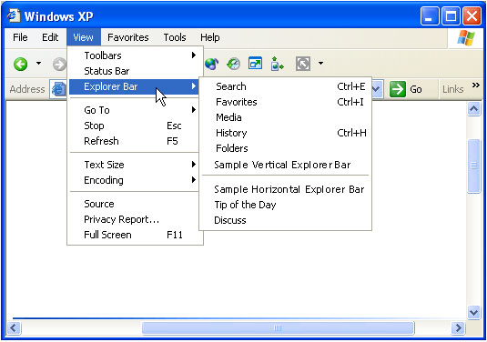

# Creating Custom Explorer Bars, Tool Bands, and Desk Bands

The Explorer Bar was introduced with Microsoft Internet Explorer 4.0 to provide a display area adjacent to the browser pane. It is basically a child window within the Windows Internet Explorer window, and it can be used to display information and interact with the user in much the same way. Explorer Bars are most commonly displayed as a vertical pane on the left side of the browser pane. However, an Explorer Bar can also be displayed horizontally, below the browser pane.


There is a wide range of possible uses for the Explorer Bar. Users can select which option they want to see in several different ways, including selecting it from the **Explorer Bar** submenu of the **View** menu, or clicking a toolbar button. Internet Explorer provides several standard Explorer Bars, including Favorites and Search.

One of the ways you can customize Internet Explorer is by adding a custom Explorer Bar. When implemented and registered, it will be added to the **Explorer Bar** submenu of the **View** menu. When selected by the user, the Explorer Bar's display area can then be used to display information and take user input in much the same way as a normal window.



To create a custom Explorer Bar, you must implement and register a *band object*. Band objects were introduced with version 4.71 of the Shell and provide capabilities similar to those of normal windows. However, because they are Component Object Model (COM) objects and contained by either Internet Explorer or the Shell, they are implemented somewhat differently. Simple band objects were used to create the sample Explorer Bars displayed in the first graphic. The implementation of the vertical Explorer Bar sample will be discussed in detail in a later section.

## Tool Bands

A *tool band* is a band object that was introduced with Microsoft Internet Explorer 5 to support the Windows radio toolbar feature. The Internet Explorer toolbar is actually a [rebar control](../controls/rebar-controls.md) that contains several [toolbar controls](../controls/toolbar-control-reference.md). By creating a tool band, you can add a band to that rebar control. However, like Explorer Bars, a tool band is a general purpose window.


Users display a toolbar by selecting it from the **Toolbars** submenu of the **View** menu or from the shortcut menu that is displayed by right-clicking the toolbar area.

## Desk Bands

Band objects can also be used to create *desk bands*. While their basic implementation is similar to Explorer Bars, desk bands are unrelated to Internet Explorer. A desk band is basically a way to create a dockable window on the desktop. The user selects it by right-clicking the taskbar and selecting it from the **Toolbars** submenu.


Initially, desk bands are docked on the taskbar.


The user can then drag the desk band to the desktop, and it will appear as a normal window.


## Implementing Band Objects

The following topics are discussed.

- [Band Object Basics](#band-object-basics)
- [Band Registration](#band-registration)
- [A Simple Example of a Custom Explorer Bar](#a-simple-example-of-a-custom-explorer-bar)

### Band Object Basics

Although they can be used much like normal windows, band objects are COM objects that exist within a container. Explorer Bars are contained by Internet Explorer, and desk bands are contained by the Shell. While they serve different functions, their basic implementation is very similar. The primary difference is in how the band object is registered, which in turn controls the type of object and its container. This section discusses those aspects of implementation that are common to all band objects. See [A Simple Example of a Custom Explorer Bar](#a-simple-example-of-a-custom-explorer-bar) for additional implementation details.

In addition to [**IUnknown**](/windows/win32/api/unknwn/nn-unknwn-iunknown) and [**IClassFactory**](/windows/win32/api/unknwn/nn-unknwn-iclassfactory), all band objects must implement the following interfaces.

- [**IDeskBand**](/windows/win32/api/shobjidl_core/nn-shobjidl_core-ideskband)
- [**IObjectWithSite**](/windows/win32/api/ocidl/nn-ocidl-iobjectwithsite)
- [**IPersistStream**](/windows/win32/api/objidl/nn-objidl-ipersiststream)

In addition to registering their class identifier (CLSID), the Explorer Bar and desk band objects must also be registered for the appropriate component category. Registering the component category determines the object type and its container. Tool bands use a different registration procedure and do not have a category identifier (CATID). The CATIDs for the three band objects that require them are:


| Band Type               | Component Category |
|-------------------------|--------------------|
| Vertical Explorer Bar   | CATID\_InfoBand    |
| Horizontal Explorer Bar | CATID\_CommBand    |
| Desk Band               | CATID\_DeskBand    |


 

See [Band Registration](#band-registration) for further discussion of how to register band objects.

If the band object is to accept user input, it must also implement [**IInputObject**](/windows/win32/api/shobjidl_core/nn-shobjidl_core-iinputobject). To add items to the shortcut menu for Explorer Bar or desk bands, the band object must export [**IContextMenu**](/windows/win32/api/shobjidl_core/nn-shobjidl_core-icontextmenu). Tool bands do not support shortcut menus.

Because band objects implement a child window, they must also implement a window procedure to handle Windows messaging.

Band objects can send commands to their container through the container's [**IOleCommandTarget**](/windows/win32/api/docobj/nn-docobj-iolecommandtarget) interface. To obtain the interface pointer, call the container's [**IInputObjectSite::QueryInterface**](/windows/win32/api/unknwn/nf-unknwn-iunknown-queryinterface(q)) method and ask for IID\_IOleCommandTarget. You then send commands to the container with [**IOleCommandTarget::Exec**](/windows/win32/api/docobj/nf-docobj-iolecommandtarget-exec). The command group is CGID\_DeskBand. When a band object's [**IDeskBand::GetBandInfo**](/windows/win32/api/shobjidl_core/nn-shobjidl_core-ideskband) method is called, the container uses the *dwBandID* parameter to assign the band object an identifier that is used for three of the commands. Four **IOleCommandTarget::Exec** command IDs are supported.

-   DBID\_BANDINFOCHANGED

    The band's information has changed. Set the *pvaIn* parameter to the band identifier that was received in the most recent call to [**IDeskBand::GetBandInfo**](/windows/win32/api/shobjidl_core/nn-shobjidl_core-ideskband). The container will call the band object's **IDeskBand::GetBandInfo** method to request the updated information.

-   DBID\_MAXIMIZEBAND

    Maximize the band. Set the *pvaIn* parameter to the band identifier that was received in the most recent call to [**IDeskBand::GetBandInfo**](/windows/win32/api/shobjidl_core/nn-shobjidl_core-ideskband).

-   DBID\_SHOWONLY

    Turn other bands in the container on or off. Set the *pvaIn* parameter to the VT\_UNKNOWN type with one of the following values:

    

    | Value | Description                                                                                                 |
    |-------|-------------------------------------------------------------------------------------------------------------|
    | pUnk  | A pointer to the band object's [**IUnknown**](/windows/win32/api/unknwn/nn-unknwn-iunknown) interface. All other desk bands will be hidden. |
    | 0     | Hide all desk bands.                                                                                        |
    | 1     | Show all desk bands.                                                                                        |

    

     

-   DBID\_PUSHCHEVRON

    [Version 5](versions.md). Display a chevron menu. The container sends an [**RB\_PUSHCHEVRON**](../controls/rb-pushchevron.md) message, and the band object receives an [RBN\_CHEVRONPUSHED](../controls/rbn-chevronpushed.md) notification that prompts it to display the chevron menu. Set the [**IOleCommandTarget::Exec**](/windows/win32/api/docobj/nf-docobj-iolecommandtarget-exec) method's *nCmdExecOpt* parameter to the band identifier received in the most recent call to [**IDeskBand::GetBandInfo**](/windows/win32/api/shobjidl_core/nn-shobjidl_core-ideskband). Set the **IOleCommandTarget::Exec** method's *pvaIn* parameter to the VT\_I4 type with an application-defined value. It passes back to the band object as the *lAppValue* value of the RBN\_CHEVRONPUSHED notification.

### Band Registration

A band object must be registered as an OLE in-process server that supports apartment threading. The default value for the server is a menu text string. For Explorer Bars, it will appear in the **Explorer Bar** submenu of the Internet Explorer **View** menu. For tool bands, it will appear in the **Toolbars** submenu of the Internet Explorer **View** menu. For desk bands, it will appear in the **Toolbars** submenu of the taskbar's shortcut menu. As with menu resources, placing an ampersand (&) in front of a letter will cause it to be underlined and enable keyboard shortcuts. For example, the menu string for the vertical Explorer Bar shown in the first graphic is "Sample &Vertical Explorer Bar".

Initially, Internet Explorer retrieves an enumeration of the registered Explorer Bar objects from the registry using the component categories. To increase performance, it then caches this enumeration, causing subsequently added Explorer Bars to be overlooked. To force Windows Internet Explorer to rebuild the cache and recognize a new Explorer Bar, delete the following registry keys during the registration of the new Explorer Bar:

**HKEY\_CURRENT\_USER**\\**Software**\\**Microsoft**\\**Windows**\\**CurrentVersion**\\**Explorer**\\**Discardable**\\**PostSetup**\\**Component Categories**\\**{00021493-0000-0000-C000-000000000046}**\\**Enum**

**HKEY\_CURRENT\_USER**\\**Software**\\**Microsoft**\\**Windows**\\**CurrentVersion**\\**Explorer**\\**Discardable**\\**PostSetup**\\**Component Categories**\\**{00021494-0000-0000-C000-000000000046}**\\**Enum**

> [!Note]  
> Because an Explorer Bar cache is created for each user, your setup application may need to enumerate all the user registry hives or add a per-user stub to run when the user first logs on.

 

In general, the basic registry entry for a band object will appear as follows.

```
HKEY_CLASSES_ROOT
   CLSID
      {Your Band Object's CLSID GUID}
         (Default) = Menu Text String
         InProcServer32
            (Default) = DLL Path Name
            ThreadingModel = Apartment
```

Tool bands must also have their object's CLSID registered with Internet Explorer. To do this, assign a value under **HKEY\_LOCAL\_MACHINE**\\**Software**\\**Microsoft**\\**Internet Explorer**\\**Toolbar** named with the tool band object's CLSID GUID as shown here. Its data value is ignored, so the value type is unimportant.

```
HKEY_LOCAL_MACHINE
   Software
      Microsoft
         Internet Explorer
            Toolbar
               {Your Band Object's CLSID GUID}
```

There are several optional values that can also be added to the registry. For instance, the following value is necessary if you want to use the Explorer Bar to display HTML The value shown is not an example, but the actual value that should be used.

```
HKEY_CLASSES_ROOT
   CLSID
      {Your Band Object's CLSID GUID}
         Instance
            CLSID
               (Default) = {4D5C8C2A-D075-11D0-B416-00C04FB90376}
```

Used in conjunction with the value shown above, the following optional value is also necessary if you want to use the Explorer Bar to display HTML. This value should be set to the location of the file that contains the HTML content for the Explorer Bar.

```
HKEY_CLASSES_ROOT
   CLSID
      {Your Band Object's CLSID GUID}
         Instance
            InitPropertyBag
               Url
```

Another optional value defines the default width or height of the Explorer Bar, depending on whether it is vertical or horizontal, respectively.

```
HKEY_CURRENT_USER
   Software
      Microsoft
         Internet Explorer
            Explorer Bars
               {Your Band Object's CLSID GUID}
                  BarSize
```

The BarSize value should be set to the width or height of the bar. The value requires eight bytes and is placed in the registry as a binary value. The first four bytes specify the size in pixels, in hexadecimal format, starting from the leftmost byte. The last four bytes are reserved and should be set to zero.

As an example, the full registry entries for an HTML-capable Explorer Bar with a default width of 291 (0x123) pixels are shown here.

```
HKEY_CLASSES_ROOT
   CLSID
      {Your Band Object's CLSID GUID}
         (Default) = Menu Text String
         InProcServer32
            (Default) = DLL Path Name
            ThreadingModel = Apartment
         Instance
            CLSID
               (Default) = {4D5C8C2A-D075-11D0-B416-00C04FB90376}
            InitPropertyBag
               Url = Your HTML File
HKEY_CURRENT_USER
   Software
      Microsoft
         Internet Explorer
            Explorer Bars
               {Your Band Object's CLSID GUID}
                  BarSize = 23 01 00 00 00 00 00 00
```

You can handle registration of a band object's CATID programmatically. Create a component categories manager object (CLSID\_StdComponentCategoriesMgr) and request a pointer to its [**ICatRegister**](/windows/win32/api/comcat/nn-comcat-icatregister) interface. Pass the band object's CLSID and CATID to [**ICatRegister::RegisterClassImplCategories**](/windows/win32/api/comcat/nf-comcat-icatregister-registerclassimplcategories).

### A Simple Example of a Custom Explorer Bar

This example goes through the implementation of the sample vertical Explorer Bar shown in the introduction.

The basic procedure for creating a custom Explorer Bar is as follows.

1.  [Implement the functions needed by the DLL](#dll-functions).
2.  [Implement the required COM interfaces.](#required-interface-implementations)
3.  [Implement any desired optional COM interfaces.](#optional-interface-implementations)
4.  [Register the object's CLSID and, if required, component category.](#clsid-registration)
5.  Create a child window of Internet Explorer, sized to fit the Explorer Bar's display region.
6.  [Use the child window to display information and interact with the user.](#the-window-procedure)

The very simple implementation used in the Explorer Bar sample could actually be used for either type of Explorer Bar, or a desk band, by simply registering it for the appropriate component category. More sophisticated implementations will need to be customized for each object type's display region and container. However, much of this customization can be accomplished by taking the sample code and extending it by applying familiar Windows programming techniques to the child window. For example, you can add controls for user interaction, or graphics for a richer display.

### DLL Functions

All three objects are packaged in a single DLL, which exposes the following functions.

- [**DllMain**](../dlls/dllmain.md)
- [**DllCanUnloadNow**](/windows/win32/api/combaseapi/nf-combaseapi-dllcanunloadnow)
- [**DllGetClassObject**](/windows/win32/api/combaseapi/nf-combaseapi-dllgetclassobject)
- [**DllRegisterServer**](/windows/win32/api/olectl/nf-olectl-dllregisterserver)

The first three functions are standard implementations and will not be discussed here. The Class Factory implementation is also standard.

### Required Interface Implementations

The vertical Explorer Bar sample implements the four required interfaces: [**IUnknown**](/windows/win32/api/unknwn/nn-unknwn-iunknown), [**IObjectWithSite**](/windows/win32/api/ocidl/nn-ocidl-iobjectwithsite), [**IPersistStream**](/windows/win32/api/objidl/nn-objidl-ipersiststream), and [**IDeskBand**](/windows/win32/api/shobjidl_core/nn-shobjidl_core-ideskband) as part of the CExplorerBar class. The constructor, destructor, and **IUnknown** implementations are straightforward, and will not be discussed here. See the sample code for details.

The following interfaces are discussed in detail.

- [IObjectWithSite](#iobjectwithsite)
- [IPersistStream](#ipersiststream)
- [IDeskBand](#ideskband)

### IObjectWithSite

When the user selects an Explorer Bar, the container calls the corresponding band object's [**IObjectWithSite::SetSite**](/windows/win32/api/ocidl/nf-ocidl-iobjectwithsite-setsite) method. The *punkSite* parameter will be set to the site's [**IUnknown**](/windows/win32/api/unknwn/nn-unknwn-iunknown) pointer.

In general, a [**SetSite**](/windows/win32/api/ocidl/nf-ocidl-iobjectwithsite-setsite) implementation should perform the following steps:

1.  Release any site pointer that is currently being held.
2.  If the pointer passed to [**SetSite**](/windows/win32/api/ocidl/nf-ocidl-iobjectwithsite-setsite) is set to **NULL**, the band is being removed. **SetSite** can return S\_OK.
3.  If the pointer passed to [**SetSite**](/windows/win32/api/ocidl/nf-ocidl-iobjectwithsite-setsite) is non-**NULL**, a new site is being set. **SetSite** should do the following:
    1.  Call [**QueryInterface**](/windows/win32/api/unknwn/nf-unknwn-iunknown-queryinterface(q)) on the site for its [**IOleWindow**](/windows/win32/api/oleidl/nn-oleidl-iolewindow) interface.
    2.  Call [**IOleWindow::GetWindow**](/windows/win32/api/oleidl/nf-oleidl-iolewindow-getwindow) to obtain the parent window's handle. Save the handle for later use. Release [**IOleWindow**](/windows/win32/api/oleidl/nn-oleidl-iolewindow) if it is no longer needed.
    3.  Create the band object's window as a child of the window obtained in the previous step. Do not create it as a visible window.
    4.  If the band object implements [**IInputObject**](/windows/win32/api/shobjidl_core/nn-shobjidl_core-iinputobject), call [**QueryInterface**](/windows/win32/api/unknwn/nf-unknwn-iunknown-queryinterface(q)) on the site for its [**IInputObjectSite**](/windows/desktop/api/shobjidl_core/nn-shobjidl_core-iinputobjectsite) interface. Store the pointer to this interface for use later.
    5.  If all steps are successful, return S\_OK. If not, return the OLE-defined error code indicating what failed.

The Explorer Bar sample implements [**SetSite**](/windows/win32/api/ocidl/nf-ocidl-iobjectwithsite-setsite) in the following way. In the following code *m\_pSite* is a private member variable that holds the [**IInputObjectSite**](/windows/desktop/api/shobjidl_core/nn-shobjidl_core-iinputobjectsite) pointer and *m\_hwndParent* holds the parent window's handle. In this sample, window creation is also handled. If the window does not exist, this method creates the Explorer Bar's window as an appropriately sized child of the parent window obtained by **SetSite**. The child window's handle is stored in *m\_hwnd*.


```C++
STDMETHODIMP CDeskBand::SetSite(IUnknown *pUnkSite)
{
    HRESULT hr = S_OK;

    m_hwndParent = NULL;

    if (m_pSite)
    {
        m_pSite->Release();
    }

    if (pUnkSite)
    {
        IOleWindow *pow;
        hr = pUnkSite->QueryInterface(IID_IOleWindow, reinterpret_cast<void **>(&pow));
        if (SUCCEEDED(hr))
        {
            hr = pow->GetWindow(&m_hwndParent);
            if (SUCCEEDED(hr))
            {
                WNDCLASSW wc = { 0 };
                wc.style         = CS_HREDRAW | CS_VREDRAW;
                wc.hCursor       = LoadCursor(NULL, IDC_ARROW);
                wc.hInstance     = g_hInst;
                wc.lpfnWndProc   = WndProc;
                wc.lpszClassName = g_szDeskBandSampleClass;
                wc.hbrBackground = CreateSolidBrush(RGB(255, 255, 0));

                RegisterClassW(&wc);

                CreateWindowExW(0,
                                g_szDeskBandSampleClass,
                                NULL,
                                WS_CHILD | WS_CLIPCHILDREN | WS_CLIPSIBLINGS,
                                0,
                                0,
                                0,
                                0,
                                m_hwndParent,
                                NULL,
                                g_hInst,
                                this);

                if (!m_hwnd)
                {
                    hr = E_FAIL;
                }
            }

            pow->Release();
        }

        hr = pUnkSite->QueryInterface(IID_IInputObjectSite, reinterpret_cast<void **>(&m_pSite));
    }

    return hr;
}
```


The sample's [**GetSite**](/windows/win32/api/ocidl/nf-ocidl-iobjectwithsite-getsite) implementation simply wraps a call to the site's [**QueryInterface**](/windows/win32/api/unknwn/nf-unknwn-iunknown-queryinterface(q)) method, using the site pointer saved by [**SetSite**](/windows/win32/api/ocidl/nf-ocidl-iobjectwithsite-setsite).


```C++
STDMETHODIMP CDeskBand::GetSite(REFIID riid, void **ppv)
{
    HRESULT hr = E_FAIL;

    if (m_pSite)
    {
        hr =  m_pSite->QueryInterface(riid, ppv);
    }
    else
    {
        *ppv = NULL;
    }

    return hr;
}
```


### IPersistStream

Internet Explorer will call the Explorer Bar's [**IPersistStream**](/windows/win32/api/objidl/nn-objidl-ipersiststream) interface to allow the Explorer Bar to load or save persistent data. If there is no persistent data, the methods must still return a success code. The **IPersistStream** interface inherits from [**IPersist**](/windows/win32/api/objidl/nn-objidl-ipersist), so five methods must be implemented.

- [**IPersist::GetClassID**](/windows/win32/api/objidl/nf-objidl-ipersist-getclassid)
- [**IPersistStream::IsDirty**](/windows/win32/api/objidl/nf-objidl-ipersiststream-isdirty)
- [**IPersistStream::Load**](/windows/win32/api/objidl/nf-objidl-ipersiststream-load)
- [**IPersistStream::Save**](/windows/win32/api/objidl/nf-objidl-ipersiststream-save)
- [**IPersistStream::GetSizeMax**](/windows/win32/api/objidl/nf-objidl-ipersiststream-getsizemax)

The Explorer Bar sample does not use any persistent data and has only a minimal implementation of [**IPersistStream**](/windows/win32/api/objidl/nn-objidl-ipersiststream). [**IPersist::GetClassID**](/windows/win32/api/objidl/nf-objidl-ipersist-getclassid) returns the object's CLSID (CLSID\_SampleExplorerBar), and the remainder return either S\_OK, S\_FALSE, or E\_NOTIMPL.

### IDeskBand

The [**IDeskBand**](/windows/win32/api/shobjidl_core/nn-shobjidl_core-ideskband) interface is specific to band objects. In addition to its one method, it inherits from [**IDockingWindow**](/windows/desktop/api/shobjidl_core/nn-shobjidl_core-idockingwindow), which in turn inherits from [**IOleWindow**](/windows/win32/api/oleidl/nn-oleidl-iolewindow).

There are two [**IOleWindow**](/windows/win32/api/oleidl/nn-oleidl-iolewindow) methods: [**GetWindow**](/windows/win32/api/oleidl/nf-oleidl-iolewindow-getwindow) and [**IOleWindow::ContextSensitiveHelp**](/windows/win32/api/oleidl/nf-oleidl-iolewindow-contextsensitivehelp). The Explorer Bar sample's implementation of **GetWindow** returns the Explorer Bar's child window handle, *m\_hwnd*. Context-sensitive Help is not implemented, so **ContextSensitiveHelp** returns **E\_NOTIMPL**.

The [**IDockingWindow**](/windows/desktop/api/shobjidl_core/nn-shobjidl_core-idockingwindow) interface has three methods.

- [**IDockingWindow::ShowDW**](/windows/desktop/api/shobjidl_core/nf-shobjidl_core-idockingwindow-showdw)
- [**IDockingWindow::CloseDW**](/windows/desktop/api/shobjidl_core/nf-shobjidl_core-idockingwindow-closedw)
- [**IDockingWindow::ResizeBorderDW**](/windows/desktop/api/shobjidl_core/nf-shobjidl_core-idockingwindow-resizeborderdw)

The [**ResizeBorderDW**](/windows/desktop/api/shobjidl_core/nf-shobjidl_core-idockingwindow-resizeborderdw) method is not used with any type of band object and should always return E\_NOTIMPL. The [**ShowDW**](/windows/desktop/api/shobjidl_core/nf-shobjidl_core-idockingwindow-showdw) method either shows or hides the Explorer Bar's window, depending on the value of its parameter.


```C++
STDMETHODIMP CDeskBand::ShowDW(BOOL fShow)
{
    if (m_hwnd)
    {
        ShowWindow(m_hwnd, fShow ? SW_SHOW : SW_HIDE);
    }

    return S_OK;
}
```


The [**CloseDW**](/windows/desktop/api/shobjidl_core/nf-shobjidl_core-idockingwindow-closedw) method destroys the Explorer Bar's window.


```C++
STDMETHODIMP CDeskBand::CloseDW(DWORD)
{
    if (m_hwnd)
    {
        ShowWindow(m_hwnd, SW_HIDE);
        DestroyWindow(m_hwnd);
        m_hwnd = NULL;
    }

    return S_OK;
}
```


The remaining method, [**GetBandInfo**](/windows/win32/api/shobjidl_core/nn-shobjidl_core-ideskband), is specific to **IDeskBand**. Internet Explorer uses it to specify the Explorer Bar's identifier and viewing mode. Internet Explorer also may request one or more pieces of information from the Explorer Bar by filling the **dwMask** member of the [**DESKBANDINFO**](/windows/desktop/api/shobjidl_core/ns-shobjidl_core-deskbandinfo) structure that is passed as the third parameter. **GetBandInfo** should store the identifier and viewing mode and fill the **DESKBANDINFO** structure with the requested data. The Explorer Bar sample implements **GetBandInfo** as shown in the following code example.


```C++
STDMETHODIMP CDeskBand::GetBandInfo(DWORD dwBandID, DWORD, DESKBANDINFO *pdbi)
{
    HRESULT hr = E_INVALIDARG;

    if (pdbi)
    {
        m_dwBandID = dwBandID;

        if (pdbi->dwMask & DBIM_MINSIZE)
        {
            pdbi->ptMinSize.x = 200;
            pdbi->ptMinSize.y = 30;
        }

        if (pdbi->dwMask & DBIM_MAXSIZE)
        {
            pdbi->ptMaxSize.y = -1;
        }

        if (pdbi->dwMask & DBIM_INTEGRAL)
        {
            pdbi->ptIntegral.y = 1;
        }

        if (pdbi->dwMask & DBIM_ACTUAL)
        {
            pdbi->ptActual.x = 200;
            pdbi->ptActual.y = 30;
        }

        if (pdbi->dwMask & DBIM_TITLE)
        {
            // Don't show title by removing this flag.
            pdbi->dwMask &= ~DBIM_TITLE;
        }

        if (pdbi->dwMask & DBIM_MODEFLAGS)
        {
            pdbi->dwModeFlags = DBIMF_NORMAL | DBIMF_VARIABLEHEIGHT;
        }

        if (pdbi->dwMask & DBIM_BKCOLOR)
        {
            // Use the default background color by removing this flag.
            pdbi->dwMask &= ~DBIM_BKCOLOR;
        }

        hr = S_OK;
    }

    return hr;
}
```


### Optional Interface Implementations

There are two interfaces that are not required, but that may be useful to implement: [**IInputObject**](/windows/win32/api/shobjidl_core/nn-shobjidl_core-iinputobject) and [**IContextMenu**](/windows/win32/api/shobjidl_core/nn-shobjidl_core-icontextmenu). The Explorer Bar sample implements **IInputObject**. Refer to the documentation for information on how to implement **IContextMenu**.

### IInputObject

The [**IInputObject**](/windows/win32/api/shobjidl_core/nn-shobjidl_core-iinputobject) interface must be implemented if a band object accepts user input. Internet Explorer implements [**IInputObjectSite**](/windows/desktop/api/shobjidl_core/nn-shobjidl_core-iinputobjectsite) and uses **IInputObject** to maintain proper user input focus when it has more than one contained window. There are three methods that need to be implemented by an Explorer Bar.

- [**IInputObject::UIActivateIO**](/windows/win32/api/shobjidl_core/nf-shobjidl_core-iinputobject-uiactivateio)
- [**IInputObject::HasFocusIO**](/windows/win32/api/shobjidl_core/nf-shobjidl_core-iinputobject-hasfocusio)
- [**IInputObject::TranslateAcceleratorIO**](/windows/win32/api/shobjidl_core/nf-shobjidl_core-iinputobject-translateacceleratorio)

Internet Explorer calls [**UIActivateIO**](/windows/win32/api/shobjidl_core/nf-shobjidl_core-iinputobject-uiactivateio) to inform the Explorer Bar that it is being activated or deactivated. When activated, the Explorer Bar sample calls [**SetFocus**](/windows/win32/api/winuser/nf-winuser-setfocus) to set the focus to its window.

Internet Explorer calls [**HasFocusIO**](/windows/win32/api/shobjidl_core/nf-shobjidl_core-iinputobject-hasfocusio) when it is attempting to determine which window has focus. If the Explorer Bar's window or one of its descendants has focus, **HasFocusIO** should return S\_OK. If not, it should return S\_FALSE.

[**TranslateAcceleratorIO**](/windows/win32/api/shobjidl_core/nf-shobjidl_core-iinputobject-translateacceleratorio) allows the object to process keyboard accelerators. The Explorer Bar sample does not implement this method, so it returns S\_FALSE.

The sample bar's implementation of [**IInputObjectSite**](/windows/desktop/api/shobjidl_core/nn-shobjidl_core-iinputobjectsite) is as follows.


```C++
STDMETHODIMP CDeskBand::UIActivateIO(BOOL fActivate, MSG *)
{
    if (fActivate)
    {
        SetFocus(m_hwnd);
    }

    return S_OK;
}

STDMETHODIMP CDeskBand::HasFocusIO()
{
    return m_fHasFocus ? S_OK : S_FALSE;
}

STDMETHODIMP CDeskBand::TranslateAcceleratorIO(MSG *)
{
    return S_FALSE;
};
```


### CLSID Registration

As with all COM objects, the Explorer Bar's CLSID must be registered. For the object to function properly with Internet Explorer, it must also be registered for the appropriate component category (CATID\_InfoBand). The relevant code section for the Explorer Bar is shown in the following code example.


```C++
HRESULT RegisterServer()
{
    WCHAR szCLSID[MAX_PATH];
    StringFromGUID2(CLSID_DeskBandSample, szCLSID, ARRAYSIZE(szCLSID));

    WCHAR szSubkey[MAX_PATH];
    HKEY hKey;

    HRESULT hr = StringCchPrintfW(szSubkey, ARRAYSIZE(szSubkey), L"CLSID\\%s", szCLSID);
    if (SUCCEEDED(hr))
    {
        hr = E_FAIL;
        if (ERROR_SUCCESS == RegCreateKeyExW(HKEY_CLASSES_ROOT,
                                             szSubkey,
                                             0,
                                             NULL,
                                             REG_OPTION_NON_VOLATILE,
                                             KEY_WRITE,
                                             NULL,
                                             &hKey,
                                             NULL))
        {
            WCHAR const szName[] = L"DeskBand Sample";
            if (ERROR_SUCCESS == RegSetValueExW(hKey,
                                                NULL,
                                                0,
                                                REG_SZ,
                                                (LPBYTE) szName,
                                                sizeof(szName)))
            {
                hr = S_OK;
            }

            RegCloseKey(hKey);
        }
    }

    if (SUCCEEDED(hr))
    {
        hr = StringCchPrintfW(szSubkey, ARRAYSIZE(szSubkey), L"CLSID\\%s\\InprocServer32", szCLSID);
        if (SUCCEEDED(hr))
        {
            hr = HRESULT_FROM_WIN32(RegCreateKeyExW(HKEY_CLASSES_ROOT, szSubkey,
                 0, NULL, REG_OPTION_NON_VOLATILE, KEY_WRITE, NULL, &hKey, NULL));
            if (SUCCEEDED(hr))
            {
                WCHAR szModule[MAX_PATH];
                if (GetModuleFileNameW(g_hInst, szModule, ARRAYSIZE(szModule)))
                {
                    DWORD cch = lstrlen(szModule);
                    hr = HRESULT_FROM_WIN32(RegSetValueExW(hKey, NULL, 0, REG_SZ, (LPBYTE) szModule, cch * sizeof(szModule[0])));
                }

                if (SUCCEEDED(hr))
                {
                    WCHAR const szModel[] = L"Apartment";
                    hr = HRESULT_FROM_WIN32(RegSetValueExW(hKey, L"ThreadingModel", 0,  REG_SZ, (LPBYTE) szModel, sizeof(szModel)));
                }

                RegCloseKey(hKey);
            }
        }
    }

    return hr;
}
```


Registration of band objects in the sample uses normal COM procedures.

In addition to the CLSID, the band object server must also be registered for one or more component categories. This is actually the main difference in implementation between the vertical and horizontal Explorer Bar samples. This process is handled by creating a component categories manager object (CLSID\_StdComponentCategoriesMgr) and using the [**ICatRegister::RegisterClassImplCategories**](/windows/win32/api/comcat/nf-comcat-icatregister-registerclassimplcategories) method to register the band object server. In this example, component category registration is handled by passing the Explorer Bar sample's CLSID and CATID to a private function—**RegisterComCat**—as shown in the following code example.


```C++
HRESULT RegisterComCat()
{
    ICatRegister *pcr;
    HRESULT hr = CoCreateInstance(CLSID_StdComponentCategoriesMgr, NULL, CLSCTX_INPROC_SERVER, IID_PPV_ARGS(&pcr));
    if (SUCCEEDED(hr))
    {
        CATID catid = CATID_DeskBand;
        hr = pcr->RegisterClassImplCategories(CLSID_DeskBandSample, 1, &catid);
        pcr->Release();
    }
    return hr;
}
```


### The Window Procedure

Because a band object uses a child window for its display, it must implement a window procedure to handle Windows messaging. The band sample has minimal functionality, so its window procedure only handles five messages:

- [**WM\_NCCREATE**](../winmsg/wm-nccreate.md)
- [**WM\_PAINT**](../gdi/wm-paint.md)
- [**WM\_COMMAND**](../menurc/wm-command.md)
- [**WM\_SETFOCUS**](../inputdev/wm-setfocus.md)
- [**WM\_KILLFOCUS**](../inputdev/wm-killfocus.md)

The procedure can easily be expanded to accommodate additional messages to support more features.


```C++
LRESULT CALLBACK CDeskBand::WndProc(HWND hwnd, UINT uMsg, WPARAM wParam, LPARAM lParam)
{
    LRESULT lResult = 0;

    CDeskBand *pDeskBand = reinterpret_cast<CDeskBand *>(GetWindowLongPtr(hwnd, GWLP_USERDATA));

    switch (uMsg)
    {
    case WM_CREATE:
        pDeskBand = reinterpret_cast<CDeskBand *>(reinterpret_cast<CREATESTRUCT *>(lParam)->lpCreateParams);
        pDeskBand->m_hwnd = hwnd;
        SetWindowLongPtr(hwnd, GWLP_USERDATA, reinterpret_cast<LONG_PTR>(pDeskBand));
        break;

    case WM_SETFOCUS:
        pDeskBand->OnFocus(TRUE);
        break;

    case WM_KILLFOCUS:
        pDeskBand->OnFocus(FALSE);
        break;

    case WM_PAINT:
        pDeskBand->OnPaint(NULL);
        break;

    case WM_PRINTCLIENT:
        pDeskBand->OnPaint(reinterpret_cast<HDC>(wParam));
        break;

    case WM_ERASEBKGND:
        if (pDeskBand->m_fCompositionEnabled)
        {
            lResult = 1;
        }
        break;
    }

    if (uMsg != WM_ERASEBKGND)
    {
        lResult = DefWindowProc(hwnd, uMsg, wParam, lParam);
    }

    return lResult;
}
```


The WM\_COMMAND handler simply returns zero. The WM\_PAINT handler creates the simple text display shown in the Explorer Bar example in the introduction.


```C++
void CDeskBand::OnPaint(const HDC hdcIn)
{
    HDC hdc = hdcIn;
    PAINTSTRUCT ps;
    static WCHAR szContent[] = L"DeskBand Sample";
    static WCHAR szContentGlass[] = L"DeskBand Sample (Glass)";

    if (!hdc)
    {
        hdc = BeginPaint(m_hwnd, &ps);
    }

    if (hdc)
    {
        RECT rc;
        GetClientRect(m_hwnd, &rc);

        SIZE size;

        if (m_fCompositionEnabled)
        {
            HTHEME hTheme = OpenThemeData(NULL, L"BUTTON");
            if (hTheme)
            {
                HDC hdcPaint = NULL;
                HPAINTBUFFER hBufferedPaint = BeginBufferedPaint(hdc, &rc, BPBF_TOPDOWNDIB, NULL, &hdcPaint);

                DrawThemeParentBackground(m_hwnd, hdcPaint, &rc);

                GetTextExtentPointW(hdc, szContentGlass, ARRAYSIZE(szContentGlass), &size);
                RECT rcText;
                rcText.left   = (RECTWIDTH(rc) - size.cx) / 2;
                rcText.top    = (RECTHEIGHT(rc) - size.cy) / 2;
                rcText.right  = rcText.left + size.cx;
                rcText.bottom = rcText.top + size.cy;

                DTTOPTS dttOpts = {sizeof(dttOpts)};
                dttOpts.dwFlags = DTT_COMPOSITED | DTT_TEXTCOLOR | DTT_GLOWSIZE;
                dttOpts.crText = RGB(255, 255, 0);
                dttOpts.iGlowSize = 10;
                DrawThemeTextEx(hTheme, hdcPaint, 0, 0, szContentGlass, -1, 0, &rcText, &dttOpts);

                EndBufferedPaint(hBufferedPaint, TRUE);

                CloseThemeData(hTheme);
            }
        }
        else
        {
            SetBkColor(hdc, RGB(255, 255, 0));
            GetTextExtentPointW(hdc, szContent, ARRAYSIZE(szContent), &size);
            TextOutW(hdc,
                     (RECTWIDTH(rc) - size.cx) / 2,
                     (RECTHEIGHT(rc) - size.cy) / 2,
                     szContent,
                     ARRAYSIZE(szContent));
        }
    }

    if (!hdcIn)
    {
        EndPaint(m_hwnd, &ps);
    }
}
```


The WM\_SETFOCUS and WM\_KILLFOCUS handlers inform the site of a focus change by calling the site's [**IInputObjectSite::OnFocusChangeIS**](/windows/desktop/api/shobjidl_core/nf-shobjidl_core-iinputobjectsite-onfocuschangeis) method.


```C++
void CDeskBand::OnFocus(const BOOL fFocus)
{
    m_fHasFocus = fFocus;

    if (m_pSite)
    {
        m_pSite->OnFocusChangeIS(static_cast<IOleWindow*>(this), m_fHasFocus);
    }
}
```


Band objects provide a flexible and powerful way to extend the capabilities of Internet Explorer by creating custom Explorer Bars. Implementing a desk band enables you to extend the capabilities of normal windows. Although some COM programming is required, it ultimately serves to provide a child window for your user interface. From there, the bulk of the implementation can use familiar Windows programming techniques. While the example discussed here has only limited functionality, it illustrates all the necessary features of a band object and it can be readily extended to create a unique and powerful user interface.

 

 
