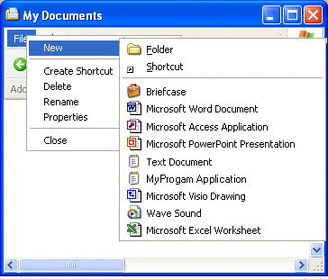

# Extending Shortcut Menus

Right-clicking an object normally causes the display of a *shortcut menu*. This menu contains a list of commands that the user can select to perform various actions on the object. This section is an introduction to shortcut menus for file system objects.

- [Shortcut Menus for File System Objects](#shortcut-menus-for-file-system-objects)
- [Shortcut Menu Verbs](#shortcut-menu-verbs)
    - [Canonical Verbs](#canonical-verbs)
    - [Extended Verbs](#extended-verbs)
- [Extending the Shortcut Menu for a File Type](#extending-the-shortcut-menu-for-a-file-type)
- [Extending the Shortcut Menu for Predefined Shell Objects](#extending-the-shortcut-menu-for-predefined-shell-objects)
- [Registering an Application to Handle Arbitrary File Types](#registering-an-application-to-handle-arbitrary-file-types)
- [Extending the New Submenu](#extending-the-new-submenu)

Additional information is available here:

- [How To Define Extended Verbs](how-to-define-extended-verbs.md)
- [How To Associate Verbs with DDE Commands](how-to-associate-verbs-with-dde-commands.md)

## Shortcut Menus for File System Objects

When a user right-clicks an object, such as a file, that is displayed in Windows Explorer or on the desktop, a shortcut menu appears with a list of commands. The user can then perform an action on the file, such as opening or deleting it, by selecting the appropriate command.

Because shortcut menus are often used for file management, the Shell provides a set of default commands, such as Cut and Copy, that appear on the shortcut menu for any file. Note that although Open With is a default command, it is not displayed for some standard file types, such as .wav. The following illustration of the sample My Documents directory, which was also used as an example in [Customizing Icons](icon.md), shows a default shortcut menu that was displayed by right-clicking MyDocs4.xyz.


The reason that MyDocs4.xyz shows a default shortcut menu is that it is not a member of a registered [file type](fa-file-types.md). On the other hand, .txt is a registered file type. If you right-click one of the .txt files, you will instead see a shortcut menu with two additional commands in its upper section: **Open** and **Print**.


Once a file type is registered, you can extend its shortcut menu with additional commands. They are displayed above the default commands when any file of that type is right-clicked. Although most of the commands added in this way are common ones, such as **Print** or **Open**, you are free to add any command that a user might find helpful.

All that is required to extend the shortcut menu for a file type is to create a registry entry for each command. A more sophisticated approach is to implement a *shortcut menu handler*, which allows you to extend the shortcut menu for a file type on a file-by-file basis. For more information, see [Creating Context Menu Handlers](context-menu-handlers.md).

## Shortcut Menu Verbs

Each command on the shortcut menu is identified in the registry by its *verb*. These verbs are the same as those used by [**ShellExecuteEx**](/windows/desktop/api/Shellapi/nf-shellapi-shellexecuteexa) when launching applications programmatically. For further information about the use of **ShellExecuteEx**, see the discussion in [Launching Applications](launch.md).

A verb is a simple text string that is used by the Shell to identify the associated command. Each verb corresponds to the *command string* used to launch the command in a console window or batch (.bat) file. For example, the **open** verb normally launches a program to open a file. Its command string typically looks something like this:

``` syntax
"My Program.exe" "%1"
```

"%1" is the standard placeholder for a command line parameter provided with the filename. For instance, it can specify a particular page to display in a tabbed view.

> [!Note]  
> If any element of the command string contains or might contain spaces, it must be enclosed in quotation marks. Otherwise, if the element contains a space, it will not parse correctly. For instance, "My Program.exe" will launch the application properly. If you use My Program.exe, the system will attempt to launch "My" with "Program.exe" as its first command line argument. You should always use quotation marks with arguments such as "%1" that are expanded to strings by the Shell, because you cannot be certain that the string will not contain a space.

 

Verbs can also have a *display string* associated with them, which is displayed on the shortcut menu instead of the verb string itself. For example, the display string for **openas** is Open With. Like normal menu strings, including an ampersand (&) in the display string allows keyboard selection of the command.

### Canonical Verbs

In general, applications are responsible for providing localized display strings for the verbs they define. However, to provide a degree of language independence, the system defines a standard set of commonly used verbs called *canonical verbs*. A canonical verb can be used with any language, and the system automatically generates a properly localized display string. For instance, the **open** verb's display string will be set to Open on an English system, and to Öffnen on a German system.

The canonical verbs include:


| Value      | Description                                                                                 |
|------------|---------------------------------------------------------------------------------------------|
| open       | Opens the file or folder.                                                                   |
| opennew    | Opens the file or folder in a new window.                                                   |
| print      | Prints the file.                                                                            |
| explore    | Opens Windows Explorer with the folder selected.                                            |
| find       | Opens the **Windows Search** dialog box with the folder set as the default search location. |
| openas     | Opens the **Open With** dialog box.                                                         |
| properties | Opens the object's property sheet.                                                          |


 

The printto verb is also canonical but is never displayed. It allows the user to print a file by dragging it to a printer object.

### Extended Verbs

When the user right-clicks an object, the shortcut menu contains all the normal verbs. However, there could be commands that you want to support but not have displayed on every shortcut menu. For example, you could have commands that are not commonly used or that are intended for experienced users. For this reason, you can also define one or more *extended verbs*. These verbs are also character strings and are similar to normal verbs. They are distinguished from normal verbs by the way they are registered. To have access to the commands associated with extended verbs, the user must right-click an object while pressing the SHIFT key. The extended verbs will then be displayed along with the normal verbs.

## Extending the Shortcut Menu for a File Type

The simplest way to extend the shortcut menu for a file type is with the registry. To do this, add a **Shell** subkey below the key for the ProgID of the application associated with the [file type](fa-file-types.md). Optionally, you can define a *default verb* for the file type by making it the default value of the **Shell** subkey.

The default verb is displayed first on the shortcut menu. Its purpose is to provide the Shell with a verb it can use when [**ShellExecuteEx**](/windows/desktop/api/Shellapi/nf-shellapi-shellexecuteexa) is called but no verb is specified. The Shell does not necessarily select the default verb when **ShellExecuteEx** is used in this fashion. For Shell [versions 5.0](versions.md) and later, found on Windows 2000 and later systems, the Shell uses the first available verb from the following list. If none are available, the operation fails.

-   The open verb
-   The default verb
-   The first verb in the registry
-   The openwith verb

For Shell versions prior to [version 5.0](versions.md), omit the third item.

Below the **Shell** subkey, create one subkey for each verb you want to add. Each of these subkeys will have a **REG\_SZ** value set to the verb's display string. You can omit the display string for canonical verbs because the system will automatically display a properly localized string. If you omit the display string for noncanonical verbs, the verb string will be displayed. For each verb subkey, create a **command** subkey with the default value set to the command string.

The following illustration shows a shortcut menu for the .myp file type used in [File Types](fa-file-types.md) and [Customizing Icons](icon.md). It now has open, doit, print, and printto verbs on its shortcut menu, with doit as the default verb. The shortcut menu looks like this.


The registry entries used to extend the shortcut menu shown in the preceding illustration are:

```
HKEY_CLASSES_ROOT
   .myp
      (Default) = MyProgram.1
   MyProgram.1
      (Default) = MyProgram Application
      Shell
         (Default) = doit
         open
            command
               (Default) = C:\MyDir\MyProgram.exe "%1"
         doit
            (Default) = &Do It
            command
               (Default) = C:\MyDir\MyProgram.exe /d "%1"
         print
            command
               (Default) = C:\MyDir\MyProgram.exe /p "%1"
         printto
            command
               (Default) = C:\MyDir\MyProgram.exe /p "%1" "%2" %3 %4
```

Although the **Open With** command is above the first separator, it is automatically created by the system and does not require a registry entry. The system automatically creates display names for the canonical verbs open and print. Because doit is not a canonical verb, it is assigned a display name, "&Do It", which can be selected by pressing the D key. The printto verb does not appear on the shortcut menu, but including it allows the user to print files by dropping them on a printer icon. In this example, %1 represents the file name and %2 the printer name.

Verbs can be suppressed through policy settings by adding a SuppressionPolicy value to the verb's key. Set the value of SuppressionPolicy to the policy ID. If the policy is turned on, the verb and its associated shortcut menu entry are suppressed. For possible policy ID values, see the [**RESTRICTIONS**](/windows/desktop/api/shlobj_core/ne-shlobj_core-restrictions) enumeration.

## Extending the Shortcut Menu for Predefined Shell Objects

Many predefined Shell objects have shortcut menus that can be extended. Register the command in much the same way that you register typical file types, but use the name of the predefined object as the file type name.

A list of predefined objects can be found in the *Predefined Shell Objects* section of [Creating Shell Extension Handlers](handlers.md). Those predefined Shell objects whose shortcut menus can be extended by adding verbs in the registry are marked in the table with the word "Verb."

## Registering an Application to Handle Arbitrary File Types

The preceding sections of this document have discussed how to define shortcut menu items for a particular file type. Among other things, defining the shortcut menu allows you to specify how the associated application opens a member of the file type. However, as discussed in [File Types](fa-file-types.md), applications can also register a separate default procedure to be used when a user attempts to use your application to open a file type that you have not associated with the application. This topic is discussed here because you register the default procedure in much the same way you register shortcut menu items.

The default procedure serves two basic purposes. One is to specify how your application should be invoked to open an arbitrary file type. You could, for instance, use a command-line flag to indicate that an unknown file type is being opened. The other purpose is to define the various characteristics of a file type, such as the shortcut menu items and the icon. If a user associates your application with an additional file type, that type will have these characteristics. If the additional file type was previously associated with another application, these characteristics will replace the originals.

To register the default procedure, place the same registry keys you created for your application's ProgID under the application's subkey of **HKEY\_CLASSES\_ROOT**\\**Applications**. You can also include a FriendlyAppName value to provide the system with a friendly name for your application. The application's friendly name may also be extracted from its executable file, but only if the FriendlyAppName value is absent. The following registry fragment shows a sample default procedure for MyProgram.exe that defines a friendly name and several shortcut menu items. The command strings include the /a flag to notify the application that it is opening an arbitrary file type. If you include a **DefaultIcon** subkey, you should use a generic icon.

```
HKEY_CLASSES_ROOT
   Applications
      MyProgram.exe
         FriendlyAppName = Friendly Name
         shell
            open
               command
                  (Default) = C:\MyDir\MyProgram.exe /a "%1"
            print
               command
                  (Default) = C:\MyDir\MyProgram.exe /a /p "%1"
            printto
               command
                  (Default) = C:\MyDir\MyProgram.exe /a /p "%1" "%2" %3 %4
```

## Extending the New Submenu

When a user opens the **File** menu in Windows Explorer, the first command is **New**. Selecting this command displays a submenu. By default, it contains two commands, **Folder** and **Shortcut**, that allow users to create subfolders and shortcuts. This submenu can be extended to include file creation commands for any file type.

To add a file-creation command to the **New** submenu, your application's files must have a [file type](fa-file-types.md) associated with them. Include a **ShellNew** subkey under the key for the file name extension. When the **File** menu's **New** command is selected, the Shell will add it to the **New** submenu. The command's display string will be the descriptive string that is assigned to the program's ProgID.

Assign one or more data values to the **ShellNew** subkey to specify the file creation method. The available values follow.


| Value    | Description                                                                                                                                                   |
|----------|---------------------------------------------------------------------------------------------------------------------------------------------------------------|
| Command  | Executes an application. This is a **REG\_SZ** value specifying the path of the application to be executed. For example, you could set it to launch a wizard. |
| Data     | Creates a file containing specified data. Data is a **REG\_BINARY** value with the file's data. Data is ignored if either NullFile or FileName is specified.  |
| FileName | Creates a file that is a copy of a specified file. FileName is a **REG\_SZ** value, set to the fully qualified path of the file to be copied.                 |
| NullFile | Creates an empty file. NullFile is not assigned a value. If NullFile is specified, the Data and FileName values are ignored.                                  |


 

The following illustration shows the **New** submenu for the .myp file type used as an example in [File Types](fa-file-types.md) and [Customizing Icons](icon.md). It now has a command, **MyProgram Application**. When a user selects **MyProgram Application** from the **New** submenu, the Shell creates a file named "New MyProgram Application.myp" and passes it to MyProgram.exe.



The registry entry is now as follows:

```
HKEY_CLASSES_ROOT
   .myp
      (Default) = MyProgram.1
      MyProgram.1
         ShellNew
            NullFile
   MyProgram.1
      (Default) = MyProgram Application
      DefaultIcon
         (Default) = C:\MyDir\MyProgram.exe,2
      Shell
         (Default) = doit
         open
            command
               (Default) = C:\MyDir\MyProgram.exe "%1"
         doit
            (Default) = &Do It
            command
               (Default) = C:\MyDir\MyProgram.exe /d "%1"
         print
            command
               (Default) = C:\MyDir\MyProgram.exe /p "%1"
         printto
            command
               (Default) = C:\MyDir\MyProgram.exe /p "%1" "%2" %3 %4
```

 

 


