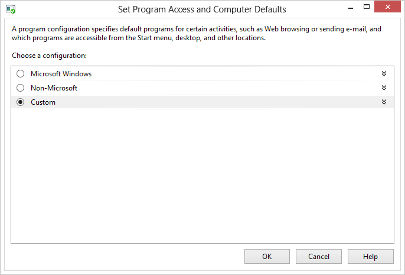
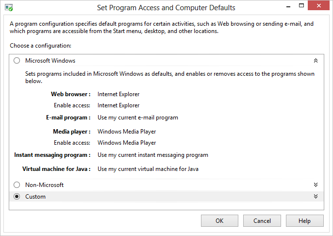
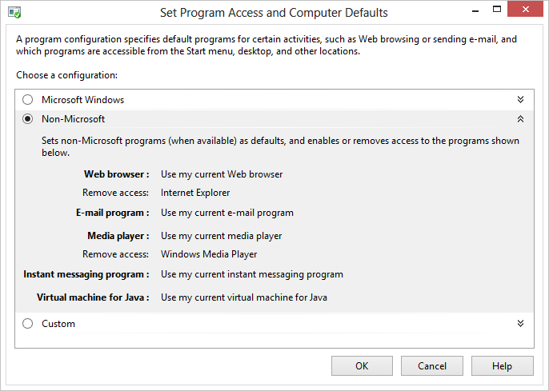
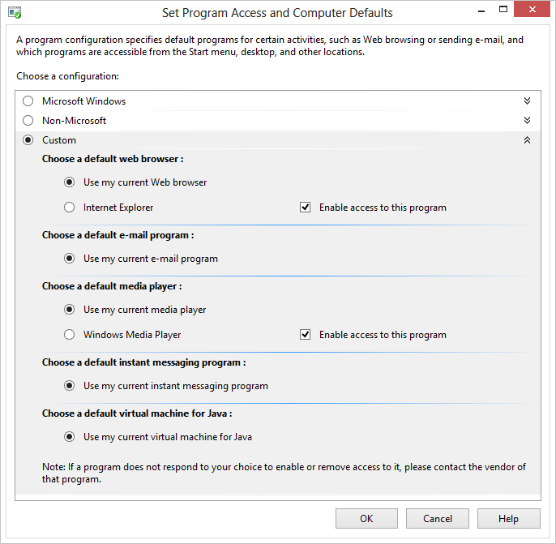
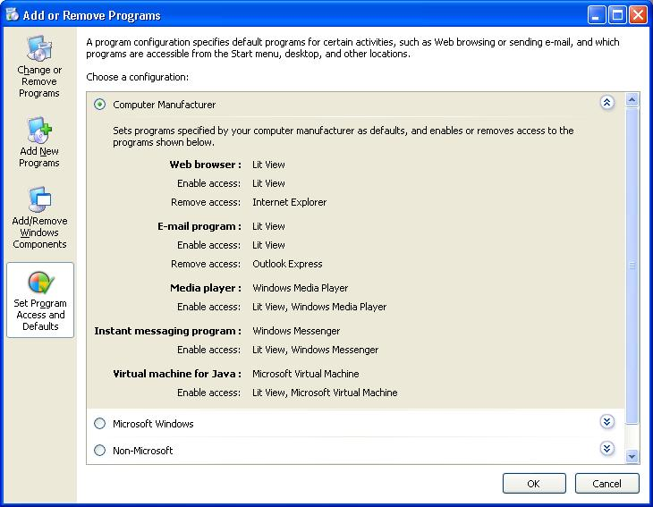

# Set Program Access and Computer Defaults (SPAD)

This topic discusses the **Set Program Access and Computer Defaults (SPAD)** feature found in Control Panel. SPAD is located under the [Default Programs](default-programs.md) Control Panel item in Windows Vista and later versions of Windows. In Windows XP, it is located in the **Add or Remove Programs** item and titled **Set Program Access and Defaults**.

> [!IMPORTANT]
> This topic does not apply for Windows 10. The way that default file associations work changed in Windows 10. For more information, see the section on **Changes to how Windows 10 handles default apps** in [this post](https://blogs.windows.com/bloggingwindows/2015/05/20/announcing-windows-10-insider-preview-build-10122-for-pcs/).

 

-   [Using the Set Program Access and Computer Defaults Tool](#using-the-set-program-access-and-computer-defaults-tool)
    -   [An Overview of Set Program Access and Computer Defaults](#an-overview-of-set-program-access-and-computer-defaults)
    -   [The LastUserInitiatedDefaultChange Registry Value](#the-lastuserinitiateddefaultchange-registry-value)
-   [Filtering the Add or Remove Programs List](#filtering-the-add-or-remove-programs-list)
-   [Additional Resources](#filtering-the-add-or-remove-programs-list)
-   [Related topics](#related-topics)

## Using the Set Program Access and Computer Defaults Tool

> [!Note]  
> As of Windows 8, SPAD configures defaults on a per-user basis for the current user. Prior to Windows 8, SPAD set per-computer defaults. When a per-user default has not yet been configured by the user, the system will prompt them to set a per-user default rather than falling back on a per-machine default. It's possible that the per-machine defaults were never seen by users in Windows Vista and Windows 7 if they had previously set per-user defaults, because per-user defaults override per-computer defaults in those operating systems.

 

In Windows XP, **Set Program Access and Defaults** is a tool found as an option in Control Panel's **Add or Remove Programs** item. In Windows Vista and later, it is located under the [Default Programs](default-programs.md) Control Panel item. For [registered](reg-middleware-apps.md) programs, it performs the following functions:

-   Enables the choice of default programs for each client type (up to Windows 7 only).
-   Enables control of the display of the program's icons, shortcuts, and menu entries.
-   Provides a set of preset default program choices. (Windows XP Service Pack 1 (SP1) only)

This tool is used for the following five client types.

-   Browser
-   Email
-   Instant messenging program
-   Media player
-   Virtual machine for Java

### An Overview of Set Program Access and Computer Defaults

The Windows 8 **Set Program Access and Computer Defaults** page is shown in the following screen shot.



Three possible configuration options are presented to the user, with the option for OEMs to present a fourth option titled "Computer Manufacturer".

-   [Microsoft Windows](#microsoft-windows)
-   [Non-Microsoft](#non-microsoft)
-   [Custom](#custom)
-   [Computer Manufacturer](#computer-manufacturer)

### Microsoft Windows

The **Microsoft Windows** configuration consists of a set of default programs provided with Windows, as shown in the following screen shot.



Selecting the **Microsoft Windows** configuration also enables the display of the icons, shortcuts, or menu entries for each program registered for any of the five client types. Those icons, shortcuts, and menu entries are available to the user in the **Start** menu or Start screen, on the desktop, and in all other locations to which they were added.

### Non-Microsoft

The **Non-Microsoft** configuration, shown in the following screen shot, is used for registered applications on the user's system that are not produced by Microsoft. These applications can be preinstalled on the user's system, or they can be non-Microsoft applications that the user has installed.

> [!Note]  
> Applications must register to appear on this page. For instructions on registering an application, see [Registering Programs with Client Types](reg-middleware-apps.md).

 



Selecting the **Non-Microsoft** option also removes access to the icons, shortcuts, and menu entries of the Microsoft programs listed in the [Microsoft Windows](#microsoft-windows) configuration for all client types that have them. These Microsoft icons, shortcuts, and menu entries are removed from the **Start** menu, the desktop, and other locations to which they were added.

### Custom

The **Custom** configuration, shown in the following screen shot, enables users to customize their systems with any combination of Microsoft and non-Microsoft programs registered as default possibilities for the five client types. This is the only one of the four options available in Windows 2000 Service Pack 3 (SP3).



All options presented in the [Microsoft Windows](#microsoft-windows) and [Non-Microsoft](#non-microsoft) configurations are available to the user in the **Custom** section, as well as any additionally installed Microsoft applications that are not part of Windows. The **Use my current web browser** radio button is preselected, as shown in the preceding screen shot. There is no way to determine the current default browser from the UI. Invoking web links or files in Windows is the only way to discover the current default browser.

When a user selects the **Enable access to this program** check box for a program, that program's icons, shortcuts, and menu entries are displayed in the Start menu or Start screen, on the desktop, or in any other location where they were installed. Clearing this option should remove those icons, shortcuts, and menu entries, however, how these options behave is entirely up to the application vendor. Windows does not control how access is enabled or removed throughout the UI. It is also important to understand that applications are not required to register for **Set Program Access and Computer Defaults**.

### Computer Manufacturer

A fourth category titled "Computer Manufacturer" can appear in the SPAD window on some systems. Computer manufacturers can choose to preconfigure their computers with a custom set of defaults, choosing from the same selections available in the [Custom](#custom) configuration. (For illustrative purposes, a fictional set of applications called LitWare is registered for use with all client types.) A user can return to the computer manufacturer's default configuration at any time by choosing the **Computer Manufacturer** option, as shown in the following Windows XP screen shot.

> [!Note]  
> This configuration does not appear on all systems. For details, refer to the OEM Preinstallation Kit (OPK).

 



### The LastUserInitiatedDefaultChange Registry Value

The LastUserInitiatedDefaultChange value has been added to the registry to assist applications in recognizing and respecting the user's default choices. The value holds REG\_BINARY data in the form of a [**FILETIME**](/windows/win32/api/minwinbase/ns-minwinbase-filetime) structure that contains the date and time (in Coordinated Universal Time (UTC)) of the last time the user changed a default choice through the **Set Program Access and Computer Defaults** tool. This value is found under the following subkey.

```
HKEY_LOCAL_MACHINE
   SOFTWARE
      Clients
         ClientTypeName
            LastUserInitiatedDefaultChange = FILETIME
```

The following scenario uses this value for an application that monitors file associations.

1.  An application internally records the time when it was last set as the default program for its client type (either at installation or at a later time).
2.  The application detects that the default program for its client type has been changed to a program other than itself or the application it represents (in the case of background helper programs). Not supported in Windows 8.
3.  The application reads the value of LastUserInitiatedDefaultChange (the time stamp of the last user-initiated default change) and compares it to the time stamp value it has stored for its own choice as default.
4.  If LastUserInitiatedDefaultChange is later than the application's stored value, then no action should be taken by that application because the change was explicitly requested by the user through the **Set Program Access and Defaults** tool.
5.  The application no longer monitors that file association until it is again chosen as the default. Not supported in Windows 8.

By adhering to such a scheme, the user's wishes are respected and their ultimate ownership of their systems is maintained.

## Filtering the Add or Remove Programs List

> [!Note]  
> This section applies to Windows XP Service Pack 2 (SP2) and later and Windows Server 2003 and later.

 

In Windows XP and Windows Server 2003, the list of applications displayed in the **Change or Remove Programs** tab under **Add or Remove Programs** can be filtered by the user to exclude entries for application updates. In these versions of Windows, this is accomplished through a **Show updates** check box at the top of the window. The **Show updates** option is not selected by default, so updates are *not* shown unless the user chooses to show them. Changes to the check box state persist when **Add or Remove Programs** is closed; if a user chooses to show the updates, they continue to be shown until the user clears the check box.

> [!Note]  
> The Windows XP SP2 update itself is an exception to the filtering. It is always displayed regardless of the check box state.

 

In Windows Vista and later, application updates are displayed on a separate page in Control Panel dedicated to updates alone. This page is shown when the user clicks the **View installed updates** task link. There is no user-selectable option to show updates on the same page as installed programs. Despite the change in UI, the mechanism for registering as an update to an installed program remains the same as in earlier versions of Windows.

Microsoft and non-Microsoft applications that use the Windows Installer do not need to do anything further for their updates to be recognized as updates. Non-Microsoft applications that do not use Windows Installer must declare certain values in the registry as part of their installation to be recognized as an update to an existing program.

The following example illustrates which registry values to declare for an installation to be recognized as an update to an existing program.

1.  The parent application must add its uninstall information in a subkey under the **HKEY\_LOCAL\_MACHINE**\\**Software**\\**Microsoft**\\**Windows**\\**CurrentVersion**\\**Uninstall** subkey. See the [Installation](/previous-versions/ms997548(v=msdn.10)) topic for more information on using the **Uninstall** subkey.
2.  Each update to that parent application also must add its information as a subkey of the **Uninstall** subkey. It should use a particular naming convention of its choice, attempting to avoid potential conflicts with other programs. The following conventions are reserved as subkey names by Microsoft for use with Windows updates.
    -   IEUpdate
    -   OEUpdate
    -   "KB" followed by six digits, for example "KB123456"
    -   "Q" followed by six digits, for example "Q123456"
    -   Six digits, for example "123456"
3.  In addition to the standard uninstall information added for the parent application, the subkeys for each update additionally must include two of the following three entries. Their values are of type REG\_SZ.
    -   **ParentKeyName**. This value is required. This is the name of the parent's subkey declared in step 1. This associates the update with the program.
    -   **ParentDisplayName**. This value is required. If no subkey matches that named in ParentKeyName, this value is used as a placeholder parent program to be displayed in **Add or Remove Programs**.
    -   **InstallDate**. This value is optional. It should use the form `yyyymmdd` to specify the date. This date is used for the **Installed On** information displayed next to the update's entry in the UI. If there is no **InstallDate** entry or if it is present but has no value assigned to it, the following occurs:
        -   Operating system versions other than Windows Vista and Windows 7: No **Installed On** information is shown.
        -   Windows Vista and later: A default date is used. This is the "last modified" date for any of the entries under that update's subkey. This is normally the day that the update was added to the registry. However, because it is a "last modified" date, any subsequent change to any of the subkey's entries causes the InstallDate value to be changed to the date of that change.

The following example shows the pertinent registry entries for an update to the LitWare Deluxe application.

```
HKEY_LOCAL_MACHINE
   Software
      Microsoft
         Windows
            CurrentVersion
               Uninstall
                  LitWare
                     DisplayName = LitWare Deluxe
                     UninstallString = "C:\Program Files\LitWare\LitWare Deluxe\litware.exe" /uninstall
                  LitWare_Update123456
                     DisplayName = LitWare Deluxe Update 123456. Fixes printing problems.
                     UninstallString = "C:\Program Files\LitWare\LitWare Deluxe\Updates\123456.exe" /uninstall
                     ParentKeyName = LitWare
                     ParentDisplayName = LitWare Deluxe
                     InstallDate = 20050513
```

Non-Microsoft applications that do not supply the appropriate registry information, such as updates produced before this option was available, continue to be displayed normally in the list of installed programs and are not filtered out.

Update filtering in operating system versions other than Windows Vista and Windows 7 is normally a user-controlled setting and should be respected as such by applications. However, in an enterprise environment, administrators can control whether users are given the option to filter updates through the DontGroupPatches registry value, as shown in the following example.

```
HKEY_LOCAL_MACHINE
   Software
      Microsoft
         Windows
            CurrentVersion
               policies
                  Uninstall
                     DontGroupPatches = 0 or 1
```

This value is of type REG\_DWORD and is interpreted as follows.


| DontGroupPatches value             | Meaning                                                                                                                                                                                                             |
|------------------------------------|---------------------------------------------------------------------------------------------------------------------------------------------------------------------------------------------------------------------|
| 0                                  | The **Show updates** check box is displayed to the user. Filtering depends on whether the user has checked this box or not.                                                                                         |
| 1                                  | The **Show updates** check box is removed from the UI. Updates are not filtered from the list. This value essentially reverts to Windows XP SP1 behavior, before the **Show updates** functionality was introduced. |
| DontGroupPatches entry not present | This is equivalent to setting the value to 0.                                                                                                                                                                       |


 

DontGroupPatches has no effect in Windows Vista and Windows 7, where the UI contains no check box and registered updates are always filtered.

> [!Note]  
> Policies are set only by administrators. Applications should not alter this value. For more information on how to set a registry-based Group Policy, see [Group Policy](/previous-versions/windows/desktop/Policy/group-policy-start-page) or [Windows Server Group Policy](/windows/deployment/deploy-whats-new).

 

## Additional Resources

-   [Registering Programs with Client Types](reg-middleware-apps.md)
-   [Installation](/previous-versions/ms997548(v=msdn.10))
-   [Configuring Add/Remove Programs with Windows Installer](../msi/configuring-add-remove-programs-with-windows-installer.md)

## Related topics

<dl> <dt>

[Best Practices for File Associations](fa-best-practices.md)
</dt> <dt>

[File Association Sample Scenario](fa-sample-scenarios.md)
</dt> <dt>

[Guidelines for Managing Default Applications in Windows Vista and Later](vista-managing-defaults.md)
</dt> <dt>

[Default Programs](default-programs.md)
</dt> </dl>

 

 
