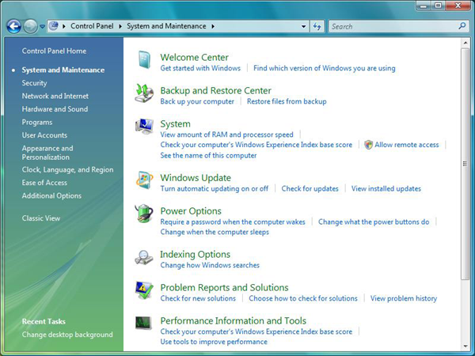
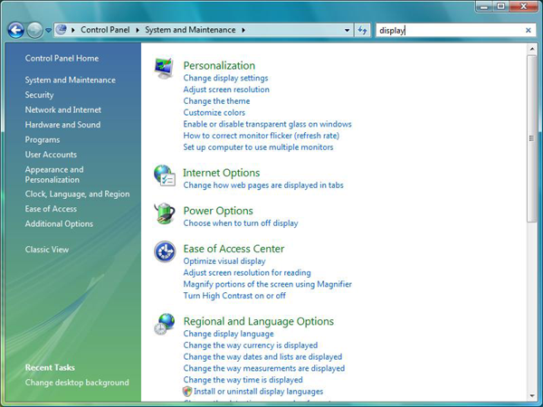

# Creating Searchable Task Links for a Control Panel Item

As of Windows Vista, the Control Panel category view provides task links beneath each Control Panel item's icon as shown here.



When a user enters text in the **Search** box in the upper right of the window, the search results include these task links as shown here for a search on the word "display".



This topic discusses the following:

- [Task Link Best Practices](#task-link-best-practices)
- [Creating a Task XML File](#creating-a-task-xml-file)
- [Localizing Task Links](#localizing-task-links)
- [Keywords and Searching](#keywords-and-searching)
- [Related topics](#related-topics)

## Task Link Best Practices

It is recommended that you provide task links for your Control Panel items as an aid to users searching for functionality. It is also possible to add keywords to the task links so that a user can find them even without knowing a task's title or terminology.

The best task links serve three purposes:

1.  Provide a shortcut to the functionality of the Control Panel item.
2.  Provide keywords so that users can search using their own language. A user may want to type "compaction" because he or she knows the technical term. A user may type "DB too big", or "database filesize". Adding suitable keywords to the task means that users can find your Control Panel item.
3.  Provide hints about what the Control Panel item does. When a user sees the links beneath a Control Panel item's icon, they can get more information about what the Control Panel item is used for than the name and icon alone can provide.

Task links should be end-user focused, not technology- or feature-focused. For example, "Enable database compaction" would be bad wording because it is technical jargon unfamiliar to the majority of users. "Make my database file smaller" is better because it mentions the user's actual end goal rather than the mechanism to get there. The goal is not to oversimplify, but rather to phrase the task in terms of what the user wants to accomplish.

## Creating a Task XML File

Task links are defined in an XML file. This section provides the details of an example .xml file that defines three task links for a Control Panel item called **Notepad**. It defines titles, keywords, and the command lines for the task links. It also illustrates how to specify which task links appear under which category. A Control Panel item that is registered to appear in more than one category has the option of showing different links depending on the category. Explanations of the various elements and information provided are given as comments in the XML itself.


```
<?xml version="1.0" ?>
<applications xmlns="http://schemas.microsoft.com/windows/cpltasks/v1" 
              xmlns:sh="http://schemas.microsoft.com/windows/tasks/v1">
    
    <!-- Notepad -->
    <application id="{0052D9FC-6764-4D29-A66F-2F3BD9E2BB40}"> 
    <!-- This GUID must match the GUID you created for your Control Panel item,
         and registered in namespace -->
    
        <!-- Solitaire -->
        <sh:task id="{3B75A7AE-C4E4-4E5A-9420-7CECCDA75425}"> 
            <!-- This is a generated GUID, specific to this task link -->
            <sh:name>Play solitaire</sh:name>
            <sh:keywords>solitare;game;cards;ace;diamond;heart;club;single</sh:keywords>
            <sh:command>%ProgramFiles%\Microsoft Games\Solitaire\solitaire.exe</sh:command>
        </sh:task>

        <!-- Task Manager -->
        <sh:task id="{BF46D6AA-B5E6-4EE1-9E5B-ED017272B9F9}" needsElevation="true"> 
            <!-- This is a generated GUID, specific to this task link -->
            <!-- The needsElevation="true" attribute means that the task 
                 appears with a shield icon next to it. Adding this attribute 
                 does not cause the .exe to require elevation - it just adds an 
                 icon to tell users that the command already requires it -->
            <sh:name>See running processes</sh:name>
            <sh:keywords>taskmgr;taskman;running processes;threads;cpu;</sh:keywords>
            <sh:command>taskmgr.exe</sh:command>
        </sh:task>

        <!-- IE -->
        <sh:task id="{DE3A6DCC-C18A-4BBF-9227-11856D7B4422}">
            <sh:name>Open Internet Explorer</sh:name>
            <sh:keywords>IE;web;browser;net;Internet;ActiveX;plug-in;plugin</sh:keywords>
            <sh:command>iexplore.exe</sh:command>
        </sh:task>
        
        <!-- Category assignments -->

        <!-- Appearance and Personalization -->
        <category id="1"> 
        <!-- These idref attributes refer to the GUIDs of the tasks defined above. A maximum of five tasks are shown per category. -->
            <sh:task idref="{3B75A7AE-C4E4-4E5A-9420-7CECCDA75425}"/>   
            <sh:task idref="{BF46D6AA-B5E6-4EE1-9E5B-ED017272B9F9}"/>
            <sh:task idref="{DE3A6DCC-C18A-4BBF-9227-11856D7B4422}"/>
        </category>
        
        <!-- Programs -->
        <category id="8"> 
            <sh:task idref="{3B75A7AE-C4E4-4E5A-9420-7CECCDA75425}">
                <sh:name>Click here to play</sh:name>
                <!-- This overrides the defined text. When the Notepad Control 
                     Panel item appears in the Programs category, it uses the 
                     "Click here to play" text for this Solitaire link, instead 
                     of "Play solitaire". -->
            </sh:task>
            <sh:task idref="{BF46D6AA-B5E6-4EE1-9E5B-ED017272B9F9}"/>
            <sh:task idref="{DE3A6DCC-C18A-4BBF-9227-11856D7B4422}"/>
       </category>
   </application>
</applications>
```


> [!Note]  
> As of Windows 7, a Control Panel item can be identified by its canonical name rather than its executable name: the **<sh:controlpanel>** element can be used in place of **<sh:command>**. The **<sh:controlpanel>** element also provides an attribute to specify the page of the item to which it should open. The following shows an example of the **<sh:controlpanel>** element:

 


```
<sh:controlpanel name="Microsoft.Presentation" page="pageWallpaper"/>
```


## Localizing Task Links

The text for the task links' titles and keywords can be stored in a string table in the Control Panel item's module. In that case, the format used in the XML file becomes:


```
<sh:task id="{3B75A7AE-C4E4-4E5A-9420-7CECCDA75425}"> 
    <!-- This is a generated GUID, specific to this task link -->
    <sh:name>@myTextResources.dll,-100</sh:name>
    <sh:keywords>@myTextResources.dll,-101</sh:keywords>
    <sh:command>%ProgramFiles%\Microsoft Games\Solitaire\solitaire.exe</sh:command>
</sh:task>
```


In this example, the text for the task's name appears in string resource ID 100 in myTextResources.dll, and the text for the keywords appears in string resource ID 101.

## Keywords and Searching

The Control Panel search finds task links based on their name and also on their keywords. It matches each word in the search with the prefix of words in the name and keywords. For example, the query string "cpu" would match the task "See running processes" in the earlier example because "cpu" is in the keyword list. The query string "pro" would also find that result because the title word "processes" begins with that string. Note that the query only matches prefixes. The query string "rocess" would not match a result because that string, while part of the title word "process", does not begin that word.

When a search query contains multiple tokens, all the tokens must match the prefix of some keyword or part of the task title for a result. The query "cpu level" would not match, because "level" is not in the keyword set. The query "cpu run" would give a result, because "cpu" matches a keyword, and "run" is the prefix of the word "running" in the task's title.

Control Panel does not automatically provide spelling correction or variations such as plurals or hyphenation. Matches are also case-insensitive. To ensure a successful keyword list, it is recommended to provide variations yourself, such as for this task link that involves screen savers: "screensavers;screen-savers;screen savers;"

There is no need to add the singular "screensaver", because a query that finds "screensavers" will also find "screensaver" due to the prefix match. A user typing even part of the word, like "screensa" will still see a match on a task link that has "screensavers" as a keyword. For languages where plural forms change the word, it is necessary to put all the forms a user could reasonably be expected to type into the keywords.

As a convention, Microsoft has omitted small words like "how do I" or "I want to" from the set of keywords. The expectation is that most users will simply type the most important words such as "mouse", "high contrast", or "video driver" to get results.

## Related topics

<dl> <dt>

[Control Panel Items](control-panel-applications.md)
</dt> <dt>

[User Experience Guidelines](user-experience-guidelines.md)
</dt> <dt>

[Registering Control Panel Items](registering-control-panel-items.md)
</dt> <dt>

[Using CPLApplet](using-cplapplet.md)
</dt> <dt>

[Control Panel Message Processing](message-processing.md)
</dt> <dt>

[Executing Control Panel Items](executing-control-panel-items.md)
</dt> <dt>

[Extending System Control Panel Items](extending-system-control-panel-items.md)
</dt> <dt>

[Assigning Control Panel Categories](assigning-control-panel-categories.md)
</dt> <dt>

[Accessing the Control Panel in Safe Mode under Windows Vista](accessing-the-cp-in-safe-mode-under-vista.md)
</dt> </dl>

 

 


