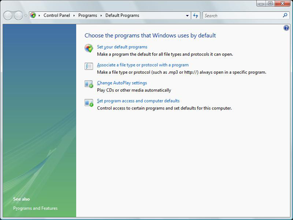
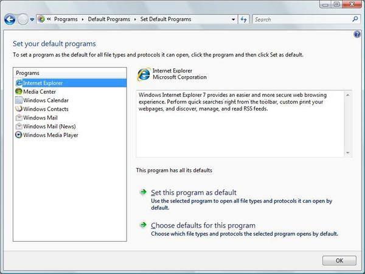
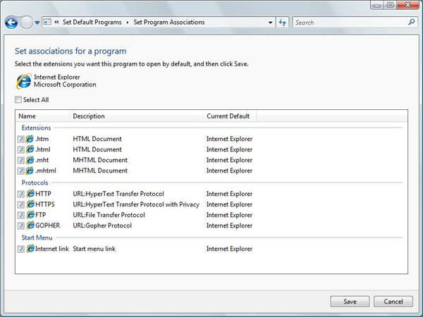
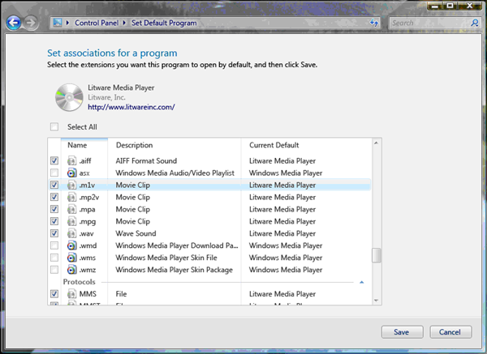
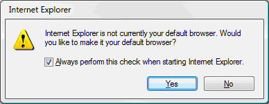

# Default Programs

Use **Default Programs** to set the default user experience. Users can access **Default Programs** from Control Panel or directly from the **Start** menu. [Set Program Access and Computer Defaults (SPAD)](cpl-setprogramaccess.md) tool, the primary defaults experience for users in Windows XP, is now one part of **Default Programs**.

> [!IMPORTANT]
> This topic does not apply for Windows 10. The way that default file associations work changed in Windows 10. For more information, see the section on **Changes to how Windows 10 handles default apps** in [this post](https://blogs.windows.com/windowsexperience/2015/05/20/announcing-windows-10-insider-preview-build-10122-for-pcs/).

 

When a user sets program defaults using **Default Programs**, the default setting applies only to that user and not to other users who might use the same computer. **Default Programs** provides a set of APIs (deprecated in Windows 8) that enable independent software vendors (ISVs) to include their programs or applications in the defaults system. The API set also helps ISVs better manage their status as defaults.

This topic is organized as follows:

-   [Introduction to Default Programs and Its Related API Set](#introduction-to-default-programs-and-its-related-api-set)
-   [Registering an Application for Use with Default Programs](#registering-an-application-for-use-with-default-programs)
    -   [ProgIDs](#progids)
    -   [Registration Subkey and Value Descriptions](#registration-subkey-and-value-descriptions)
    -   [RegisteredApplications](#registeredapplications)
    -   [Full Registration Example](#full-registration-example)
-   [Becoming the Default Browser](#becoming-the-default-browser)
-   [Default Programs UI](#default-programs-ui)
-   [Best Practices for Using Default Programs](#best-practices-for-using-default-programs)
    -   [During Installation](#during-installation)
    -   [After Installation](#after-installation)
-   [Additional Resources](#additional-resources)
-   [Related topics](#related-topics)

## Introduction to Default Programs and Its Related API Set

**Default Programs** is primarily designed for applications that use standard file types such as .mp3 or .jpg files or standard protocols, such as HTTP or mailto. Applications that use their own proprietary protocols and file associations do not typically use the **Default Programs** functionality.

After you register an application for **Default Programs** functionality, the following options and functionality are available by using the API set:

-   Restore all registered defaults for an application. Deprecated for Windows 8.
-   Restore a single registered default for an application. Deprecated for Windows 8.
-   Query for the owner of a specific default in a single call instead of searching the registry. You can query for the default of a file association, protocol, or **Start** menu canonical verb.
-   Launch a UI for a specific application where a user can set individual defaults.
-   Remove all per-user associations.

**Default Programs** also provides a UI that enables you to register an application in order to provide additional information to the user. For example, a digitally signed application can include a URL to the manufacturer's home page.

Use of the associated API set can help an application function correctly under the user account control (UAC) feature introduced in Windows Vista. Under UAC, an administrator appears to the system as a standard user, so that administrator cannot typically write to the **HKEY\_LOCAL\_MACHINE** subtree. This restriction is a security feature that prevents a process from acting as an administrator without the administrator's knowledge.

Installation of a program by a user is typically performed as an elevated process. However, attempts by an application to modify default association behaviors at a machine level post-installation will be unsuccessful. Instead, defaults must be registered on a per-user level, which prevents multiple users from overwriting each other's defaults.

The hierarchical registry structure for file and protocol associations gives precedence to per-user defaults over machine-level defaults. Some applications include points in their code that temporarily elevate their rights when they claim defaults registered in **HKEY\_LOCAL\_MACHINE**. These applications might experience unexpected results if another application is already registered as the per-user default. Use of **Default Programs** prevents this ambiguity and guarantees expected results on a per-user level.

## Registering an Application for Use with Default Programs

This section shows you the registry subkeys and values needed to register an application with **Default Programs**. It includes a full example.

This section contains the following topics:

-   [ProgIDs](#progids)
-   [Registration Subkey and Value Descriptions](#registration-subkey-and-value-descriptions)
-   [RegisteredApplications](#registeredapplications)
-   [Full Registration Example](#full-registration-example)

**Default Programs** requires each application to register explicitly the file associations, MIME associations, and protocols for which the application should be listed as a possible default. You register the associations by using the following registry elements, which are explained in detail later in this topic under [Registration Subkey and Value Descriptions](#registration-subkey-and-value-descriptions):

```
HKEY_LOCAL_MACHINE
   %ApplicationCapabilityPath%
      ApplicationDescription
      ApplicationName
      Hidden
      FileAssociations
         .file-extension1
         .file-extension2
         ...
         .file-extensionX
      MIMEAssociations
         MIME
      Startmenu
         StartmenuInternet
         Mail
      UrlAssociations
         url-scheme
   SOFTWARE
      RegisteredApplications
         Unique Application Name = %ApplicationCapabilityPath%
```

The following example shows the registry entries for a fictional Contoso browser that is called WebBrowser:

```
HKEY_LOCAL_MACHINE
   SOFTWARE
      Contoso
         WebBrowser
            Capabilities
               ApplicationDescription = This award-winning Contoso browser is better than ever. Search the Internet and find exactly what you want in just seconds. Use integrated tabs and new phishing detectors to enhance your Internet experience.
               FileAssociations
                  .htm = ContosoHTML
                  .html = ContosoHTML
                  .shtml = ContosoHTML
                  .xht = ContosoHTML
                  .xhtml = ContosoHTML
               Startmenu
                  StartmenuInternet = Contoso.exe
               UrlAssociations
                  http = Contoso.Url.Http
                  https = Contoso.Url.Https
                  ftp = Contoso.Url.ftp
   SOFTWARE
      RegisteredApplications
         Contoso.WebBrowser.1.06 = SOFTWARE\Contoso\WebBrowser\Capabilities
```

### ProgIDs

An application must provide a specific [ProgID](fa-progids.md). Be sure to include all the information that is typically written into the generic default subkey for the extension. For example, the fictional Litware media player provides the application-specific **HKEY\_LOCAL\_MACHINE**\\**SOFTWARE**\\**Classes**\\**LitwarePlayer11.AssocFile.MP3** subkey. That subkey includes all the information in the generic default subkey **HKEY\_LOCAL\_MACHINE**\\**SOFTWARE**\\**Classes**\\**.mp3** plus any additional information that you want the application to register. This ensures that if the user restores the .mp3 association to the Litware player, the Litware player's information is intact and has not been overwritten by another application. (Overwriting might occur if the default subkey is the only source of that information.)

When you map a ProgID to a file name extension or protocol, an application can map one-to-one or one-to-many. In the Contoso example, ContosoHTML points to a single ProgID that provides shellexecute information for the .htm, .html, .shtml, .xht, and .xhtml extensions. Because a different ProgID exists for each protocol, when you use protocols you enable each protocol to have its own execution string.

When your MIME type can be viewed inline in a browser, the ProgID for the MIME type must contain the **CLSID** subkey that uses the class identifier (CLSID) of the corresponding application. This CLSID is used in a lookup against the CLSID in the MIME database that is stored in **HKEY\_LOCAL\_MACHINE**\\**SOFTWARE**\\**Classes**\\**MIME**\\**Database**\\**Content Type**. If your MIME type is not intended to be viewed inline in a browser, this step can be omitted.

### Registration Subkey and Value Descriptions

This section describes the individual registry subkeys and values used in registering an application with **Default Programs**, as illustrated previously.

### Capabilities

The **Capabilities** subkey contains all the **Default Programs** information for a specific application. The placeholder %ApplicationCapabilityPath% refers to the registry path from either **HKEY\_CURRENT\_USER** or **HKEY\_LOCAL\_MACHINE** to the application's **Capabilities** subkey. This subkey contains the significant values shown in the following table.


| Value                  | Type                       | Meaning                                                                                                                                                                                                                                                                                                                                                                                                                                                                                                                                                                                 |
|------------------------|----------------------------|-----------------------------------------------------------------------------------------------------------------------------------------------------------------------------------------------------------------------------------------------------------------------------------------------------------------------------------------------------------------------------------------------------------------------------------------------------------------------------------------------------------------------------------------------------------------------------------------|
| ApplicationDescription | REG\_SZ or REG\_EXPAND\_SZ | **Required**. To enable a user to make an informed default assignment choice, an application must provide a string that describes the application's capabilities. Although the previous Contoso example assigns the description directly to the ApplicationDescription value, applications typically provide the description as a resource that is embedded in a .dll file to facilitate localization. If ApplicationDescription is not provided, the application does not appear in UI lists of potential default programs.                                                            |
| ApplicationName        | REG\_SZ or REG\_EXPAND\_SZ | **Optional.** The name by which the program appears in the Default Programs UI. If this data is not provided by the application, the name of the executable program that is associated with the first registered ProgID for the application is used in the UI. ApplicationName must always match the name that is registered under [RegisteredApplications](#registeredapplications). You can use ApplicationName if you want different application types, such as a browser and an email client, to point to the same executable file while they appear as different names.<br/> |
| Hidden                 | REG\_DWORD                 | **Optional.** Set this value to 1 to suppress the application from the list of programs in the **Set your default programs** dialog. If this value is 0 or not present, then the application appears in the list normally.                                                                                                                                                                                                                                                                                                                                                              |


 

### FileAssociations

The **FileAssociations** subkey contains specific file associations that are claimed by the application. These claims are stored as values, with one value for each extension. Associations point to an application-specific ProgID instead of a generic ProgID. However, all associations are not required to point to the same ProgID.

### MIMEAssociations

The **MIMEAssociations** subkey contains specific MIME types that are claimed by the application. These claims are stored as values, with one value for each MIME type. The value name for each MIME type must exactly match the MIME name that is stored in the MIME database. The value must also be assigned an application-specific ProgID that contains the corresponding CLSID of the application.

### Startmenu

The **Startmenu** subkey is associated with the user-assignable **Internet** and **E-mail** entries in the **Start** menu. An application must register separately as a contender for those entries. For more information, see [Registering Programs with Client Types](reg-middleware-apps.md).

> [!Note]  
> As of Windows 7, there are no longer **Internet** and **E-mail** entries in the **Start** menu. The registry data associated with the **E-mail** entry is still used for the default MAPI client, but the registry data associated with the **Internet** entry is not used by Windows at all.

 

By associating the **Start** menu registration of an application with its **Default Programs** registration, the application appears as a potential default in the **Set associations** UI. If the user has chosen the application as the default and then chooses to restore all application defaults later, the application is restored to its **Start** menu position for that user. For more information and an illustration, see the [Default Programs UI](#default-programs-ui) section later in this topic.

The **Startmenu** subkey has two entries: StartMenuInternet and Mail, which correspond to the canonical **Internet** and **E-mail** positions in the **Start** menu. An application assigns either StartMenuInternet or Mail a value equal to the name of the application's registered subkey under **HKEY\_LOCAL\_MACHINE**\\**SOFTWARE**\\**Clients**\\**StartMenuInternet** or **HKEY\_LOCAL\_MACHINE**\\**SOFTWARE**\\**Clients**\\**Mail** (as described in [Registering Programs with Client Types](reg-middleware-apps.md)).

In the case of the **E-mail** canonical position in the **Start** menu, it represents the default MAPI client and is therefore assumed capable of handing MAPI calls. Under Windows 7, while there is no longer an **E-mail** canonical position in the **Start** menu, this subkey continues to be used for the default MAPI client. An application claiming the mail default should register as a MAPI handler under the following subkey:

```
HKEY_LOCAL_MACHINE
   SOFTWARE
      Clients
         Mail
            CanonicalName
```

If a mail client cannot support MAPI but still wants to contend for the **Start** menu **E-mail** canonical position, it can register a command line under the following subkey:

```
HKEY_LOCAL_MACHINE
   SOFTWARE
      Clients
         Mail
            CanonicalName
               shell
                  open
                     command
```

Also, under **HKEY\_LOCAL\_MACHINE**\\**SOFTWARE**\\**Clients**\\**Mail**\\*CanonicalName* add a default value with the application name.

These entries allow the application to be launched from the **Start** menu's **E-mail** position. Note that MAPI calls are still made to the application, and either fall through to the prior MAPI handler, or fail if no MAPI handler has been set. For more information, see [Registering Programs with Client Types](reg-middleware-apps.md).

### UrlAssociations

The **UrlAssociations** subkey contains the specific URL protocols that are claimed by the application. These claims are stored as values, with one value for each protocol. Each protocol must point to an application-specific ProgID instead of to a generic ProgID. As mentioned in the Contoso example, you can use a different ProgID for each protocol in order for each to have its own execution string.

### RegisteredApplications

The full subkey for **RegisteredApplications** is:

**HKEY\_LOCAL\_MACHINE**\\**SOFTWARE**\\**RegisteredApplications**

This subkey provides the operating system with the registry location of the **Default Programs** information for the application. The location is stored as a value whose name must match the name of the application.

### Full Registration Example

This example shows the subkeys and values that are used in registering the fictional Litware media player. The example includes the ProgID entries in order to show how it all fits together.

The following subkey shows the application-specific ProgID for the .mp3 MIME type:

```
HKEY_LOCAL_MACHINE
   SOFTWARE
      Classes
         LitwarePlayer11.MIME.MP3
            CLSID
               (Default) = {CD3AFA76-B84F-48F0-9393-7EDC34128127}
```

Next is the application-specific ProgID that associates the Litware program with the .mp3 file name extension.

```
HKEY_LOCAL_MACHINE
   SOFTWARE
      Classes
         LitwarePlayer11.AssocFile.MP3
            (Default) = MP3 Format Sound
            DefaultIcon
               (Default) = %ProgramFiles%\Litware\litware.dll, 0
            shell
               open
                  command
                     (Default) = %ProgramFiles%\Litware\litware.exe
```

The next entries show the combined ProgID for both the .mpeg MIME type and file name extension.

```
HKEY_LOCAL_MACHINE
   SOFTWARE
      Classes
         LitwarePlayer11.AssocFile.MPG
            (Default) = Movie Clip
            CLSID
               (Default) = {D92B76F4-CFA0-4b93-866B-7730FEB4CD7B}
            DefaultIcon
               (Default) = %ProgramFiles%\Litware\litware.dll, 0
            shell
               open
                  command
                     (Default) = %ProgramFiles%\Litware\litware.exe
```

The next entries register the Litware program in **Default Programs** and use the previously registered ProgIDs

```
HKEY_LOCAL_MACHINE
   SOFTWARE
      Litware
         LitwarePlayer
            Capabilities
               ApplicationDescription = The new Litware Media Player breaks new ground in exciting fictional programs.
               FileAssociations
                  .mp3 = LitwarePlayer11.AssocFile.MP3
                  .mpeg = LitwarePlayer11.AssocFile.MPG
               MimeAssociations
                  audio/mp3 = LitwarePlayer11.MIME.MP3
                  audio/mpeg = LitwarePlayer11.AssocFile.MPG
```

Lastly, this example registers the location of the Litware **Default Programs** registration.

```
HKEY_LOCAL_MACHINE
   SOFTWARE
      RegisteredApplications
         Litware Player = Software\Litware\LitwarePlayer\Capabilities
```

## Becoming the Default Browser

Browser registration must follow the best practices outlined in this topic. When the browser is installed, Windows can present the user with a system notification through which the user can select the browser as the system default. This notification is shown when these conditions are met:

-   The browser's installer calls [**SHChangeNotify**](/windows/desktop/api/shlobj_core/nf-shlobj_core-shchangenotify) with the **SHCNE\_ASSOCCHANGED** flag to tell Windows that new protocol handlers have been registered.
-   Windows detects that one or more new applications have registered to handle both http:// and https:// protocols, and the user has not yet been notified. In other words, none of the following have been shown to the user: a system notification advertising the application, an OpenWith flyout that contains the application, or the Set User Defaults (SUD) Control Panel page for the application.

The following example shows the recommended registration code that the browser's installer should run after it writes its registry keys.

[**SHChangeNotify**](/windows/desktop/api/shlobj_core/nf-shlobj_core-shchangenotify) first notifies the system that new association choices are available. The **SHChangeNotify** call is required to ensure the proper functioning of system defaults.

A [**Sleep**](/windows/win32/api/synchapi/nf-synchapi-sleep) statement then allows time for system processes to handle the notification.


```C++
void NotifySystemOfNewRegistration()
{
    SHChangeNotify(SHCNE_ASSOCCHANGED, SHCNF_DWORD | SHCNF_FLUSH, nullptr, nullptr);
    Sleep(1000);
}
```


If the user dismisses or ignores the resulting notification or flyout without making a new default browser selection, the default browser remains unchanged. Note that the user can also change the default browser at any time through other mechanisms, including Set User Defaults in the Control Panel.

## Default Programs UI

The illustrations in this section show the UI for **Default Programs** as seen by the user.

The following illustration shows the main **Default Programs** window in Control Panel.



When a user chooses the **Set your default programs** option, the following window appears. Users can use this page to assign a default program for all file types and protocols for which the program is a possible default. As shown in the following illustration, all [registered](#registering-an-application-for-use-with-default-programs) programs and the program icon appear in the **Programs** box on the left.



When the user selects a program from the list, the program icon and provider are displayed. If the URL is embedded in the program's digitally signed certificate, the program can also display a URL. Programs that are not digitally signed cannot display a URL.

Descriptive text, which is supplied by the program during registration, is also displayed. This text is required. Beneath the description box is an indication of how many defaults the program is currently assigned out of the full number it is registered to handle.

To assign or restore a program as the default for all files and protocols for which it is registered, the user clicks the **Set this program as default** option.

To assign individual file types and protocols to a program, the user clicks the **Choose defaults for this program** option, which displays a **Set associations for a program** window like the one in the following illustration.

> [!Note]  
> We recommend you call the **Set associations for a program** by using [**IApplicationAssociationRegistrationUI::LaunchAdvancedAssociationUI**](/windows/desktop/api/Shobjidl/nf-shobjidl-iapplicationassociationregistrationui-launchadvancedassociationui).

 



## Best Practices for Using Default Programs

This section provides best practice guidelines for using **Default Programs** when you register applications. It also offers design suggestions for creating an application that provides users with optimal **Default Programs** functionality.

### During Installation

In addition to the installation procedures normally practiced under Windows XP, a Windows Vista or later based application must register with the **Default Programs** feature to take advantage of its functionality.

Perform the following sequence of steps during installation. Steps 1-3 match the steps that were used in Windows XP; step 4 was new in Windows Vista.

1.  Install the necessary binary files.
2.  Write ProgIDs to HKEY\_LOCAL\_MACHINE. Note that applications must create application-specific ProgIDs for their associations.
3.  Register the application with **Default Programs** as previously explained in [Registering an Application for Use with Default Programs](#registering-an-application-for-use-with-default-programs).

### After Installation

This section discusses how the application prompt should first present its default options to each user. It also discusses how an application can monitor its status as the default for its possible associations and protocols.

### First Run Experiences

When the application is run by a user for the first time, it is recommended that the application display UI to the user that typically includes these two choices:

-   Accept the default application settings. This option is selected by default.
-   Customize the default application settings.

Prior to Windows 8, if the user accepts the default settings, your application calls [**IApplicationAssociationRegistration::SetAppAsDefaultAll**](/windows/desktop/api/shobjidl_core/nf-shobjidl_core-iapplicationassociationregistration-setappasdefaultall), which converts all machine-level associations that are declared during installation to per-user settings for that user.

If the user decides to customize the settings, your application calls [**IApplicationAssociationRegistrationUI::LaunchAdvancedAssociationUI**](/windows/desktop/api/Shobjidl/nf-shobjidl-iapplicationassociationregistrationui-launchadvancedassociationui) to display the file association UI. The following illustration shows this window for the fictional Litware media player.



The file association window shows the defaults that the application registered and also shows the current default for other extensions and protocols. After the user finishes customizing their defaults, they click the **Save** button to commit the changes. If the user clicks **Cancel**, the window closes without saving changes.

You should use this UI for your applications instead of creating your own. By doing so, you save the resources that were previously required to develop file association UI. You also guarantee that associations are saved correctly.

### Set an Application to Check Whether It Is the Default

> [!Note]  
> This is no longer supported as of Windows 8.

 

Applications typically check whether they are set as the default when they are run. Set your applications to make this check by calling [**IApplicationAssociationRegistration::QueryAppIsDefault**](/windows/desktop/api/shobjidl_core/nf-shobjidl_core-iapplicationassociationregistration-queryappisdefault) or [**IApplicationAssociationRegistration::QueryAppIsDefaultAll**](/windows/desktop/api/shobjidl_core/nf-shobjidl_core-iapplicationassociationregistration-queryappisdefaultall).

If the application determines that it is not the default, it can present UI that asks the user whether to accept the current situation or to make the application the default. Always include a check box in this UI that is selected by default and that presents the option not to be asked again.

> [!Note]  
> The choice of default should be user driven. An application should never reclaim a default without asking the user.

 

The following illustration shows an example dialog box.



## Additional Resources

-   [**IApplicationAssociationRegistration**](/windows/desktop/api/shobjidl_core/nn-shobjidl_core-iapplicationassociationregistration)
-   [**IApplicationAssociationRegistrationUI**](/windows/desktop/api/Shobjidl/nn-shobjidl-iapplicationassociationregistrationui)

## Related topics

<dl> <dt>

[Best Practices for File Associations](fa-best-practices.md)
</dt> <dt>

[File Association Sample Scenario](fa-sample-scenarios.md)
</dt> <dt>

[Guidelines for Managing Default Applications in Windows Vista and Later](vista-managing-defaults.md)
</dt> <dt>

[Set Program Access and Computer Defaults (SPAD)](cpl-setprogramaccess.md)
</dt> </dl>

 

 
