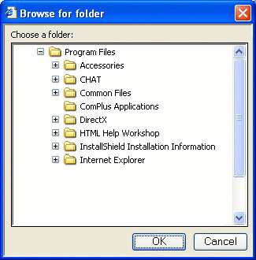

# Getting a Folder's ID

Before you can make use of a namespace object, you need a way to identify it. This means obtaining either its pointer to an item identifier list (PIDL) or, in the case of file system objects, its path. This section discusses two of the simpler ways to obtain object IDs.

For a more powerful approach that will work with any folder, use the [**IShellFolder**](/windows/win32/api/shobjidl_core/nn-shobjidl_core-ishellfolder) interface. See [Getting Information About the Contents of a Folder](folder-info.md) for more details.

-   [The OpenFiles Dialog Box](#the-openfiles-dialog-box)
-   [The SHBrowseForFolder Dialog Box](#the-shbrowseforfolder-dialog-box)
-   [Special Folders and CSIDLs](#special-folders-and-csidls)
-   [A Simple Example of How to Use CSIDLs and SHBrowseForFolder](#a-simple-example-of-how-to-use-csidls-and-shbrowseforfolder)

## The OpenFiles Dialog Box

To enable the user to navigate the namespace and select a folder, your application can use the [**IFileDialog**](/windows/win32/api/shobjidl_core/nn-shobjidl_core-ifiledialog) interface. Calling this interface with the **FOS\_PICKFOLDERS** flag launches the [Open Files](../dlgbox/open-and-save-as-dialog-boxes.md) common dialog box in "pick folders" mode.

For Windows Vista and later, this is the recommended way to pick folders.

## The SHBrowseForFolder Dialog Box

To enable the user to navigate the namespace and select a folder, your application can simply invoke [**SHBrowseForFolder**](/windows/desktop/api/shlobj_core/nf-shlobj_core-shbrowseforfoldera). Calling this function launches a dialog box with a UI that works somewhat like the [Open or SaveAs](../dlgbox/open-and-save-as-dialog-boxes.md) common dialog boxes.

When the user selects a folder, [**SHBrowseForFolder**](/windows/desktop/api/shlobj_core/nf-shlobj_core-shbrowseforfoldera) returns the folder's fully qualified PIDL and its display name. If the folder is in the file system, the application can convert the PIDL to a path by calling [**SHGetPathFromIDList**](/windows/desktop/api/shlobj_core/nf-shlobj_core-shgetpathfromidlista). The application can also restrict the range of folders that the user can select from by specifying a root folder. Only folders that are below that root in the namespace will appear. The following illustration shows the **SHBrowseForFolder** dialog box, with the root folder set to Program Files.



A simple example of how to use [**SHBrowseForFolder**](/windows/desktop/api/shlobj_core/nf-shlobj_core-shbrowseforfoldera) is provided later.

## Special Folders and CSIDLs

A number of commonly used folders are designated as *special* by the system. These folders have a well-defined purpose, and most of them are present on all systems. Even if they are not present initially, their names and locations are still defined, so they can be added later. The collection of special folders includes all of the system's standard virtual folders, such as Printers, My Documents, and Network Neighborhood. It also includes a number of standard file system folders, such as Program Files and System.

Even though the folders are a standard component of all systems, their names and locations in the namespace can vary. For example, the System directory is C:\\Winnt\\System32 on some systems and C:\\Windows\\System32 on others. In the past, environment variables provided a way to determine the name and location of a special folder on any particular system. The Shell now provides a more robust and flexible way to identify special folders, [**CSIDLs**](csidl.md). You should generally use them instead of environment variables.

CSIDLs provide a uniform way of identifying and locating special folders, regardless of their name or location on a particular system. Unlike environment variables, CSIDLs can be used with virtual folders as well as file system folders. Each special folder has a unique CSIDL assigned to it. For example, the Program Files file system folder has a CSIDL of **CSIDL\_PROGRAM\_FILES**, and the Network Neighborhood virtual folder has a CSIDL of **CSIDL\_NETWORK**.

A CSIDL is used in conjunction with one of several Shell functions to retrieve a special folder's PIDL, or a special file system folder's path. If the folder does not exist on a system, your application can force it to be created by combining its CSIDL with **CSIDL\_FLAG\_CREATE**. The CSIDL can be passed to the following functions:

-   [**SHGetFolderLocation**](/windows/desktop/api/shlobj_core/nf-shlobj_core-shgetfolderlocation), which retrieves the PIDL of a special folder.
-   [**SHGetFolderPath**](/windows/desktop/api/shlobj_core/nf-shlobj_core-shgetfolderpatha), which retrieves the path of a file system special folder.

Note that these two functions were introduced with version 5.0 of the Shell and supersede the [**SHGetSpecialFolderLocation**](/windows/desktop/api/shlobj_core/nf-shlobj_core-shgetspecialfolderlocation) and [**SHGetSpecialFolderPath**](/windows/desktop/api/shlobj_core/nf-shlobj_core-shgetspecialfolderpatha) functions.

## A Simple Example of How to Use CSIDLs and SHBrowseForFolder

The following sample function, PidlBrowse, illustrates how to use CSIDLs to retrieve a folder's PIDL, and use [**SHBrowseForFolder**](/windows/desktop/api/shlobj_core/nf-shlobj_core-shbrowseforfoldera) to have the user select a folder. It returns the PIDL and display name of the selected folder.


```
LPITEMIDLIST PidlBrowse(HWND hwnd, int nCSIDL, LPSTR pszDisplayName)
{
    LPITEMIDLIST pidlRoot = NULL;
    LPITEMIDLIST pidlSelected = NULL;
    BROWSEINFO bi = {0};

    if(nCSIDL)
    {
        SHGetFolderLocation(hwnd, nCSIDL, NULL, NULL, &pidlRoot);
    }

    else
    {
        pidlRoot = NULL;
    }

    bi.hwndOwner = hwnd;
    bi.pidlRoot = pidlRoot;
    bi.pszDisplayName = pszDisplayName;
    bi.lpszTitle = "Choose a folder";
    bi.ulFlags = 0;
    bi.lpfn = NULL;
    bi.lParam = 0;

    pidlSelected = SHBrowseForFolder(&bi);

    if(pidlRoot)
    {
        CoTaskMemFree(pidlRoot);
    }

    return pidlSelected;
}
```


The calling application passes in a window handle, which is needed by [**SHBrowseForFolder**](/windows/desktop/api/shlobj_core/nf-shlobj_core-shbrowseforfoldera). The *nCSIDL* parameter is an optional CSIDL that is used to specify a root folder. Only folders below the root folder in the hierarchy will be displayed. The illustration shown earlier was generated by calling this function with *nCSIDL* set to **CSIDL\_PROGRAM\_FILES**. The calling application also passes in a string buffer, *pszDisplayName*, to hold the display name of the selected folder when PidlBrowse returns. It is the responsibility of the calling application to free the IDList returned by **SHBrowseForFolder** using [**CoTaskMemFree**](/windows/win32/api/combaseapi/nf-combaseapi-cotaskmemfree).

 

 
