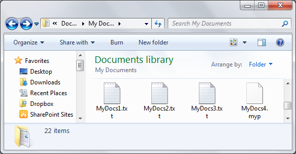
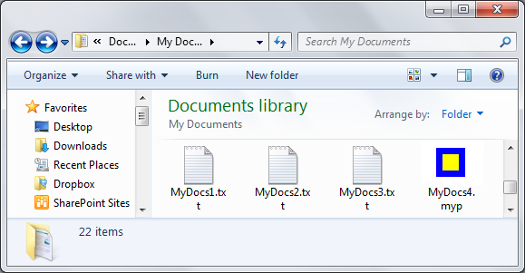

# How to Assign a Custom Icon to a File Type

When no custom default icon is assigned to a file type, the desktop and Windows Explorer display all files of that type with a generic default icon. For example, the following screen shot shows this default icon used with the MyDocs4.myp file.



While all the files displayed in this screen shot are simple text files, only MyDocs4.myp displays the Windows default icon. This is because the .txt extension is a registered file type that has a custom default icon.

The following screen shot shows a custom icon that has been assigned to the .myp file type.



> [!Note]  
> Icons can also be assigned on an application-specific basis.

 

## Instructions

### Step 1:

Create a subkey named **DefaultIcon** in one of the following two locations:

-   For a file-type assignment, **HKEY\_CLASSES\_ROOT**\\*.extension*
-   For an application assignment, **HKEY\_CLASSES\_ROOT**\\*ProgID*

### Step 2:

Assign the **DefaultIcon** subkey a default value of type **REG\_SZ** that specifies the fully qualified path for the file that contains the icon.

### Step 3:

Call the [**SHChangeNotify**](/windows/desktop/api/shlobj_core/nf-shlobj_core-shchangenotify) function to notify the Shell to update its icon cache.

## Remarks

The following example shows a detailed view of the registry entries that are required for a file-type icon assignment. The file name extension is associated with an application, but the icon assignment is to the file name extension itself so that the associated application does not dictate the default icon.

```
HKEY_CLASSES_ROOT
   .myp
      (Default) = MyProgram.1
      DefaultIcon
         (Default) = C:\MyDir\MyProgram.exe,2
```

The following example shows a detailed view of the registry entries that are required for an application icon assignment. The .myp file name extension is first associated with the MyProgram.1 application. The MyProgram.1 ProgID subkey is then assigned the custom default icon.

```
HKEY_CLASSES_ROOT
   .myp
      (Default) = MyProgram.1
   MyProgram.1
      DefaultIcon
         (Default) = C:\MyDir\MyProgram.exe,2
```

Any file that contains an icon is acceptable, including .ico, .exe, and .dll files. If there is more than one icon in the file, the path should be followed by a comma, and then the index of the icon.

## Related topics

<dl> <dt>

[File Types](fa-file-types.md)
</dt> </dl>

 

 


