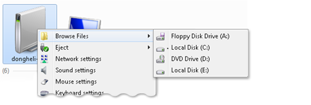
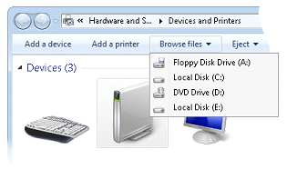

# How to Create Cascading Menus with the IExplorerCommand Interface

Another option for adding verbs to a cascading menu is through [**IExplorerCommand::EnumSubCommands**](/windows/desktop/api/shobjidl_core/nf-shobjidl_core-iexplorercommand-enumsubcommands). This method enables data sources that provide their command module commands through the [**IExplorerCommandProvider**](/windows/desktop/api/shobjidl_core/nn-shobjidl_core-iexplorercommandprovider) interface to use those commands as verbs on a shortcut menu. In Windows 7 and later, you can provide the same verb implementation using the [**IExplorerCommand**](/windows/desktop/api/shobjidl_core/nn-shobjidl_core-iexplorercommand) interface as you can with the [**IContextMenu**](/windows/win32/api/shobjidl_core/nn-shobjidl_core-icontextmenu) interface.

## Instructions

The following two screen shots illustrate the use of cascading menus in the **Devices** folder.

## Remarks

> [!Note]  
> Because [**IExplorerCommand**](/windows/desktop/api/shobjidl_core/nn-shobjidl_core-iexplorercommand) supports in-process activation only, it is recommended for use by Shell data sources that need to share the implementation between commands and shortcut menus.

 

## Related topics

<dl> <dt>

[**IExplorerCommand**](/windows/desktop/api/shobjidl_core/nn-shobjidl_core-iexplorercommand)
</dt> <dt>

[**IExplorerCommandProvider**](/windows/desktop/api/shobjidl_core/nn-shobjidl_core-iexplorercommandprovider)
</dt> <dt>

[**IContextMenu**](/windows/win32/api/shobjidl_core/nn-shobjidl_core-icontextmenu)
</dt> </dl>

 

 
