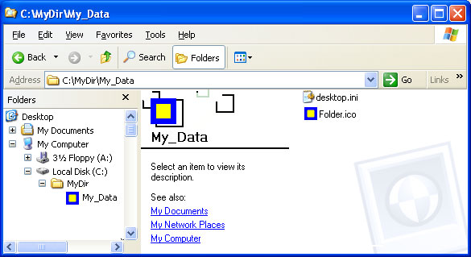
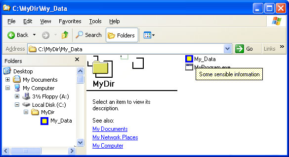
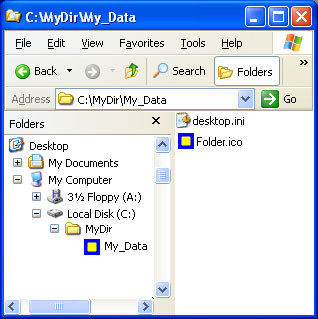

# How to Customize Folders with Desktop.ini

File system folders are commonly displayed with a standard icon and set of properties, which specify, for instance, whether the folder is shared. You can customize the appearance and behavior of an individual folder by creating a Desktop.ini file for that folder.

## Instructions

### Using Desktop.ini Files

Folders are normally displayed with the standard folder icon. A common use of the Desktop.ini file is to assign a custom icon or thumbnail image to a folder. You can also use Desktop.ini to create an *infotip* that displays information about the folder and controls some aspects of the folder's behavior, such as specifying localized names for the folder or items in the folder.

**Use the following procedure to customize a folder's style with Desktop.ini:**

1.  Use [**PathMakeSystemFolder**](/windows/desktop/api/Shlwapi/nf-shlwapi-pathmakesystemfoldera) to make the folder a system folder. This sets the read-only bit on the folder to indicate that the special behavior reserved for Desktop.ini should be enabled. You can also make a folder a system folder from the command line by using **attrib +s** *FolderName*.
2.  Create a Desktop.ini file for the folder. You should mark it as *hidden* and *system* to ensure that it is hidden from normal users.
3.  Make sure the Desktop.ini file that you create is in the Unicode format. This is necessary to store the localized strings that can be displayed to users.

### Creating a Desktop.ini File

The Desktop.ini file is a text file that allows you to specify how a file system folder is viewed. The \[.ShellClassInfo\] section, allows you to customize the folder's view by assigning values to several entries:

| Value             | Description                                                                                                                                                                                                                                                                                                                                                                    |
|-------------------|--------------------------------------------------------------------------------------------------------------------------------------------------------------------------------------------------------------------------------------------------------------------------------------------------------------------------------------------------------------------------------|
| **ConfirmFileOp** | Set this entry to 0 to avoid a "You Are Deleting a System Folder" warning when deleting or moving the folder.                                                                                                                                                                                                                                                                  |
| **NoSharing**     | Not supported under Windows Vista or later. Set this entry to 1 to prevent the folder from being shared.                                                                                                                                                                                                                                                                       |
| **IconFile**      | If you want to specify a custom icon for the folder, set this entry to the icon's file name. The .ico file name extension is preferred, but it is also possible to specify .bmp files, or .exe and .dll files that contain icons. If you use a relative path, the icon is available to people who view the folder over the network. You must also set the **IconIndex** entry. |
| **IconIndex**     | Set this entry to specify the index for a custom icon. If the file assigned to **IconFile** only contains a single icon, set **IconIndex** to 0.                                                                                                                                                                                                                               |
| **InfoTip**       | Set this entry to an informational text string. It is displayed as an infotip when the cursor hovers over the folder. If the user clicks the folder, the information text is displayed in the folder's information block, below the standard information.                                                                                                                      |


 

The following illustrations are of the Music folder with a custom Desktop.ini file. The folder now:

-   Has a custom icon.
-   Does not display a "You Are Deleting a System Folder" warning if the folder is moved or deleted.
-   Cannot be shared.
-   Displays informational text when the cursor hovers over the folder.

The folder options in the following illustrations are set to show hidden files so that Desktop.ini is visible. The folder looks like this:



When the cursor hovers over the folder, the infotip is displayed.



The custom icon replaces the folder icon everywhere the folder name appears.



The following desktop.ini file was used to customize the Music folder, as seen in the preceding illustrations.


```
[.ShellClassInfo]
ConfirmFileOp=0
NoSharing=1
IconFile=Folder.ico
IconIndex=0
InfoTip=Some sensible information.
```


 

 


