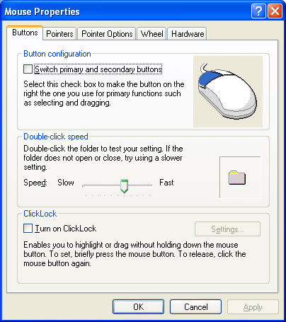

# How to Register and Implement a Property Sheet Handler for a Control Panel Application

Many Control Panel applications display a Properties property sheet to enable users to view and modify various device and system settings. Two of these applications—Mouse and Display—allow property sheet handlers to replace one or more of their pages with a custom page. The following screen shot shows the **Mouse Properties** property sheet.



Property sheet handlers for Control Panel applications are similar to those for file types, with two primary exceptions:

- They are called by a Control Panel application, not the Shell.
- They are registered differently.

## What you need to know

### Technologies

- Shell

### Prerequisites

- An understanding of the Control Panel
- An understanding of shortcut menus

## Instructions

### Step 1: Registering a Property Sheet Handler for a Control Panel Application

A Control Panel application property sheet handler must be registered under the Control Panel subkey. This key can be in either of two locations, depending on whether the handler is to be per-user or per-computer. For per-user registration, the Control Panel subkey is **HKEY\_CURRENT\_USER**\\**Control Panel**. The macro REGSTR\_PATH\_CONTROLPANEL as defined in Regstr.h can be used in code in place of "Control Panel". For per-computer registration, the location is:

```
HKEY_LOCAL_MACHINE
   Software
      Microsoft
         Windows
            Current Version
               Controls Folder
```

This path can be referred to in code as HKEY\_LOCAL\_MACHINE\\REGSTR\_PATH\_CONTROLSFOLDER, using the REGSTR\_PATH\_CONTROLSFOLDER macro that is defined in Regstr.h.

The Control Panel applications that allow property sheet handlers to replace pages have a subkey under the Control Panel's subkey, named for the application, such as Mouse and Display. The application's subkey must have a **shellex** subkey with a **PropertySheetHandlers** subkey. To register a property sheet handler, add its GUID to the **PropertySheetHandlers** subkey that is associated with the Control Panel application. To do so, create a subkey of the **PropertySheetHandlers** subkey, named for the property sheet handler, and set its default value to the string form of the handler's GUID.

The following example registers a property sheet handler for the Mouse Control Panel application on a per-computer basis. To register it on a per-user basis, replace **HKEY\_LOCAL\_MACHINE**\\**REGSTR\_PATH\_CONTROLSFOLDER** with **HKEY\_CURRENT\_USER**\\**REGSTR\_PATH\_CONTROLPANEL**.

```
HKEY_LOCAL_MACHINE
   REGSTR_PATH_CONTROLSFOLDER
      Mouse
         shellex
            PropertySheetHandlers
               MyPropHandler
                  (Default) = {MyPropHandler CLSID GUID}
```

### Step 2: Implementing a Property Sheet Handler for a Control Panel Application

The procedure for implementing a Control Panel property sheet handler is very similar to that discussed in [How to Register and Implement a Property Sheet Handler for a File Type](how-to-register-and-implement-a-property-sheet-handler-for-a-file-type.md). The primary difference is that now [**IShellPropSheetExt::ReplacePage**](/windows/desktop/api/shobjidl_core/nf-shobjidl_core-ishellpropsheetext-replacepage) needs a nontoken implementation instead of [**IShellPropSheetExt::AddPages**](/windows/desktop/api/shobjidl_core/nf-shobjidl_core-ishellpropsheetext-addpages).

When a Control Panel application is about to display its property sheet, it calls the property sheet handler's [**IShellPropSheetExt::ReplacePage**](/windows/desktop/api/shobjidl_core/nf-shobjidl_core-ishellpropsheetext-replacepage) method once for each page that can be replaced. The *uPageID* parameter is set to the page's ID. The IDs for the available pages are defined in Cplext.h. The currently available IDs are listed in the following table. 

| Page ID                      | Description         | Control Panel application |
|------------------------------|---------------------|---------------------------|
| CPLPAGE\_MOUSE\_BUTTONS      | The Buttons page    | Mouse                     |
| CPLPAGE\_MOUSE\_PTRMOTION    | The Motion page     | Mouse                     |
| CPLPAGE\_MOUSE\_WHEEL        | The Wheel page      | Mouse                     |
| CPLPAGE\_KEYBOARD\_SPEED     | The Speed page      | Keyboard                  |
| CPLPAGE\_DISPLAY\_BACKGROUND | The Background page | Display                   |


 

## Remarks

The procedure for creating and replacing a page is identical to that for adding a page. For more information, see [How to Register and Implement a Property Sheet Handler for a File Type](how-to-register-and-implement-a-property-sheet-handler-for-a-file-type.md).

 

 


