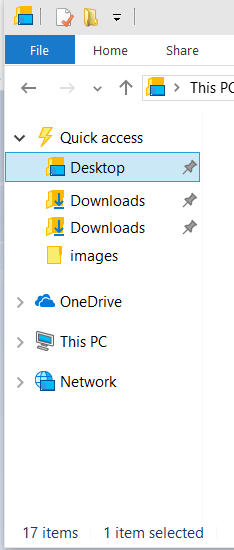

# Integrate a Cloud Storage Provider

When you have a cloud storage provider, there are a couple of steps you should take in order to provide a consistent and preferred experience for the user. These two things are registering as a sync root provider and integrating your application into the root level of the Navigation Pane.

> [!IMPORTANT]
> Integrating your cloud storage provider is only supported starting in Windows 10.

 

The first thing is to register as a sync root provider. This lets the Windows Shell know about your application and that your application will be responsible for synchronizing files under your sync root. This will also let other applications know that you are synchronizing these files so that they can respond appropriately. Other applications can then use [**StorageFile.Provider**](/uwp/api/Windows.Storage.StorageFile?view=winrt-19041) to get the [**DisplayName**](/uwp/api/Windows.Storage.StorageProvider?view=winrt-19041) and [**Id**](/uwp/api/Windows.Storage.StorageProvider?view=winrt-19041) of your application.

In order to register as a sync root provider, you will need to create multiple registry entries. Before providing the list of key-value pairs, here are some placeholders that you should replace with your own application data.

- *\[storage provider ID\]*: The name of your cloud storage provider. This name should be consistent regardless of the version of your application. An example of this is OneDrive.
- *\[Windows SID\]*: The unique Windows SID that identifies the user. If your app supports multiple installations for multiple users on a single machine, this piece is required.
- *\[Account ID\]*: The service provider identifier for this user's current account. Some providers require the ability to provide multiple synchronization roots for a user. One example of this is a work and a personal account. The *Account ID* enables you to have multiple accounts registered for one user. If your provider does support multiple synchronization roots per user, this piece is required.

These placeholders are combined together to form the sync root id. You must place a **!** character between each of the placeholders when forming the sync root id. Here are the key-value pairs that need to be created.

- **HKLM\\Software\\Microsoft\\Windows\\CurrentVersion\\Explorer\\SyncRootManager\\***\[storage provider ID\]***!***\[Windows SID\]***!***\[Account ID\]***\\DisplayNameResource** : Points to the resource where the Windows Shell or other applications can get a user-friendly name for your sync root.
- **HKLM\\Software\\Microsoft\\Windows\\CurrentVersion\\Explorer\\SyncRootManager\\***\[storage provider ID\]***!***\[Windows SID\]***!***\[Account ID\]***\\IconResource** : Points to the resource where the Windows Shell or other applications can get an icon for your sync root.
- **HKLM\\Software\\Microsoft\\Windows\\CurrentVersion\\Explorer\\SyncRootManager\\***\[storage provider ID\]***!***\[Windows SID\]***!***\[Account ID\]***\\UserSyncRoots\\***\[Windows SID\]* : The location on disk where the sync root is located.

Other than registering as a sync root provider, you also want users to have easy access to the data you provide. The File Explorer namespace is designed to provide a method for that easy access. Creating a namespace extension for your provider and incorporating it into the File Explorer window will allow users to interact with the root level of your services just like they are used to with other File Explorer items. This topic explains how to extend the File Explorer namespace so that your provider will appear at the root level in the Navigation Pane.

The Navigation Pane of the File Explorer window is the portion of the window displayed on the left side. In the image below, you can see the namespace structure for this user. The root level on the Navigation Pane includes the objects for **OneDrive**, **This PC**, and **Network**. Following these steps will add your extension to the same level.

In order to add your extension to the Navigation Pane, you will need to have the following before editing the registry:

- A file system folder that contains the data to display to the user.

- Name of your cloud service that will appear in the Navigation Pane. This could also be the name of the instance if your service supports multiple accounts.

- Identifiable icon for your application.

- A CLSID for your application. One way to generate a CLSID for your application is to use the Uuidgen.exe. See [CLSID Key](../com/clsid-key-hklm.md) for more information about CLSID.

The following steps modify the registry in order to get the necessary information into the File Explorer namespace. The specific steps do three things.

- Create keys in the registry for your CLSID that includes values for the name and icon for your extension as well as other information that defines its behavior.

- Configure your extension to be integrated into the Navigation Pane in the proper location and with the proper visibility.

- Configure your extension to have the expected behavior for an element in the navigation pane.

These instructions specifically use the **reg.exe** command, however you can use any registry editing tool of your choice. You can even integrate these steps into an installer that updates the registry programmatically.

## Instructions

### Step 1: Add your CLSID and name your extension

Add the name of your extension to the registry under HKEY\_CURRENT\_USER. You will also be adding the unique identifier for this extension. It is possible to add more than one extension per user, but in that case you will need a unique name and identifier for each extension. This name and identifier must be consistent throughout the rest of these steps. In this example, the name is *MyCloudStorageApp*.

> [!IMPORTANT]
> The identifier provided (0672A6D1-A6E0-40FE-AB16-F25BADC6D9E3) in these steps is just used as a sample. You will need to change this to your unique CLSID.

 

**reg add HKCU\\Software\\Classes\\CLSID\\{0672A6D1-A6E0-40FE-AB16-F25BADC6D9E3} /ve /t REG\_SZ /d "MyCloudStorageApp" /f**

### Step 2: Set the image for your icon

Provide the path to the icon that should be displayed in the Navigation Pane. In the example below, *1043* refers to the resource identifier for the icon in the indicated DLL.

> [!IMPORTANT]
> You need to update the image path. It should point to a generic path where your app installed an image.

 

**reg add HKCU\\Software\\Classes\\CLSID\\{0672A6D1-A6E0-40FE-AB16-F25BADC6D9E3}\\DefaultIcon /ve /t REG\_EXPAND\_SZ /d %%SystemRoot%%\\system32\\imageres.dll,-1043 /f**

### Step 3: Add your extension to the Navigation Pane and make it visible

Setting this value to 0x1 indicates that the extension should be pinned. This will make sure it is shown to users by default. The default configuration for a user is that only pinned items will be shown in the Navigation Pane. A user can change that setting by right-clicking in the Navigation Pane and selecting **Show all folders**. If you don't want to pin your extension, you can set this value to 0x0. That will not remove your extension, but merely prevent it from being displayed to the user by default.

**reg add HKCU\\Software\\Classes\\CLSID\\{0672A6D1-A6E0-40FE-AB16-F25BADC6D9E3} /v System.IsPinnedToNameSpaceTree /t REG\_DWORD /d 0x1 /f**

### Step 4: Set the location for your extension in the Navigation Pane

This is critical in order to make sure the Navigation Pane provides a consistent experience for the user.

**reg add HKCU\\Software\\Classes\\CLSID\\{0672A6D1-A6E0-40FE-AB16-F25BADC6D9E3} /v SortOrderIndex /t REG\_DWORD /d 0x42 /f**

### Step 5: Provide the dll that hosts your extension.

Use the shell32.dll to emulate default windows folders. Only change this if you have a specific reason to do so and are familiar with namespace extensions.

**reg add HKCU\\Software\\Classes\\CLSID\\{0672A6D1-A6E0-40FE-AB16-F25BADC6D9E3}\\InProcServer32 /ve /t REG\_EXPAND\_SZ /d %%systemroot%%\\system32\\shell32.dll /f**

### Step 6: Define the instance object

Indicate that your namespace extension should function like other file folder structures in File Explorer. For more information about shell instance objects, see [Creating Shell Extensions with Shell Instance Objects](/previous-versions/ms997573(v=msdn.10)).

**reg add HKCU\\Software\\Classes\\CLSID\\{0672A6D1-A6E0-40FE-AB16-F25BADC6D9E3}\\Instance /v CLSID /t REG\_SZ /d {0E5AAE11-A475-4c5b-AB00-C66DE400274E} /f**

### Step 7: Provide the file system attributes of the target folder

This is required to make sure that the File Explorer provides a consistent and expected experience for users. This command sets **FILE\_ATTRIBUTE\_DIRECTORY** and **FILE\_ATTRIBUTE\_READONLY**, both of which are [**File Attribute Constants**](../fileio/file-attribute-constants.md).

**reg add HKCU\\Software\\Classes\\CLSID\\{0672A6D1-A6E0-40FE-AB16-F25BADC6D9E3}\\Instance\\InitPropertyBag /v Attributes /t REG\_DWORD /d 0x11 /f**

### Step 8: Set the path for the sync root

Set the path for the sync root.

**reg add HKCU\\Software\\Classes\\CLSID\\{0672A6D1-A6E0-40FE-AB16-F25BADC6D9E3}\\Instance\\InitPropertyBag /v TargetFolderPath /t REG\_EXPAND\_SZ /d %%USERPROFILE%%\\MyCloudStorageApp /f**

### Step 9: Set appropriate shell flags

Set some flags necessary to pin your namespace extension to the File Explorer tree.

**reg add HKCU\\Software\\Classes\\CLSID\\{0672A6D1-A6E0-40FE-AB16-F25BADC6D9E3}\\ShellFolder /v FolderValueFlags /t REG\_DWORD /d 0x28 /f**

### Step 10: Set the appropriate flags to control your shell behavior

Set the appropriate [**SFGAO**](sfgao.md) flags. The relevant flags are SFGAO\_CANCOPY, SFGAO\_CANLINK, SFGAO\_STORAGE, SFGAO\_HASPROPSHEET, SFGAO\_STORAGEANCESTOR, SFGAO\_FILESYSANCESTOR, SFGAO\_FOLDER, SFGAO\_FILESYSTEM, and SFGAO\_HASSUBFOLDER.

**reg add HKCU\\Software\\Classes\\CLSID\\{0672A6D1-A6E0-40FE-AB16-F25BADC6D9E3}\\ShellFolder /v Attributes /t REG\_DWORD /d 0xF080004D /f**

### Step 11: Register your extension in the namespace root

Configure the namespace extension to be a child of the desktop folder.

**reg add HKCU\\Software\\Microsoft\\Windows\\CurrentVersion\\Explorer\\Desktop\\NameSpace\\{0672A6D1-A6E0-40FE-AB16-F25BADC6D9E3} /ve /t REG\_SZ /d MyCloudStorageApp /f**

### Step 12: Hide your extension from the Desktop

It is important that your extension only appears on the Navigation Pane of the File Explorer. A namespace extension does not function like a normal shortcut. Therefore, you should not use this method to create a Desktop shortcut.

**reg add HKCU\\Software\\Microsoft\\Windows\\CurrentVersion\\Explorer\\HideDesktopIcons\\NewStartPanel /v {0672A6D1-A6E0-40FE-AB16-F25BADC6D9E3} /t REG\_DWORD /d 0x1 /f**

 

 
