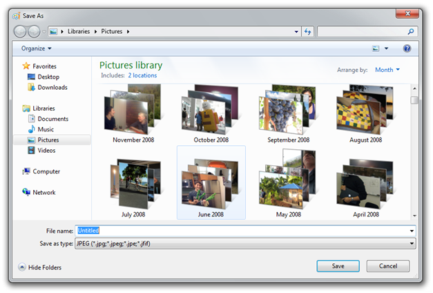

# Using Libraries in your Program

This topic describes some of the things to consider when using libraries in your program.

In this topic:

- [Library programming overview](#library-programming-overview)
- [Programming with Libraries](#programming-with-libraries)
    - [Moving from Known Folders to Libraries](#moving-from-known-folders-to-libraries)
    - [HomeGroup and shared libraries](#homegroup-and-shared-libraries)
- [Using a common file dialog box with libraries](#using-a-common-file-dialog-box-with-libraries)
- [Enabling library selection from the user interface](#enabling-library-selection-from-the-user-interface)
- [Accessing library content in a program](#accessing-library-content-in-a-program)
    - [Accessing library content with the IShellLibrary interface](#accessing-library-content-with-the-ishelllibrary-interface)
    - [Accessing library content with the Shell APIs](#accessing-library-content-with-the-shell-apis)
- [Saving user content in a library](#saving-user-content-in-a-library)
- [Supporting drag-and-drop operations in a library](#supporting-drag-and-drop-operations-in-a-library)
- [Keeping in sync with a library](#keeping-in-sync-with-a-library)
    - [Bulk Update](#bulk-update)
    - [Shell API Notification](#shell-api-notification)
    - [File-system API Notification](#file-system-api-notification)
- [Related topics](#related-topics)

## Library programming overview

Libraries enable users to organize their file-based content in a way that is meaningful to them and not limited by the organization of the file system. When your program supports libraries, it allows the user to find their content in a way that makes sense to them while presenting a user interface that is consistent with the Windows 7 user experience. Libraries also make it easier for your program to locate file-based content that is stored in different folders or on different machines.

The topics in this section describe how you can add library support to your program and take advantage of the new capabilities that libraries offer. Windows 7 provides some of this support by default. If your program does not modify the common file dialog boxes that it currently uses, it might require very little additional programming to support libraries.

This section describes some of the key features that libraries provide and how to support them in your program. With this information, you can decide which features will provide the best user experience from your program. If your program customizes the common file dialog boxes, the information in this section can help you determine how to use the new common file dialog boxes to use libraries and provide equivalent functionality in Windows 7.

## Programming with Libraries

The Windows Shell programming model describes how a program interacts with Windows Shell programming objects. While file-system objects, such as files and directories, are represented by Windows Shell objects, not all Windows Shell objects are represented by the file-system. Libraries, for example, are Windows Shell objects that do not have a file-system equivalent. Using Windows Shell objects in your program enables your program to access all Shell objects and not just file-system objects.

For the best results, your program would use the [**Shell Library API**](/windows/desktop/api/shobjidl_core/nn-shobjidl_core-ishelllibrary) to interact with libraries and access their contents. While libraries contain file-system items such as folders and files, libraries are not file-system items. As such, file-system APIs cannot be used to access library features or library contents.

If you have an existing program that currently uses many file-system APIs, your program can still take advantage of library features. The [**Shell Library API**](/windows/desktop/api/shobjidl_core/nn-shobjidl_core-ishelllibrary) can provide file-system references to the items that are found in a library and these file-system references, such as the file name and path, can be passed to the existing file-system APIs that are in your existing program.

### Moving from Known Folders to Libraries

Before Windows 7 it was common to use a known folder, such as the My Documents folder, as the default folder in file save or file open operations. In Windows 7, the corresponding library should be used so the user will have the same experience in your program as they would with other Windows 7 programs, such as the Windows Explorer.

If you are currently using the Windows Shell API in your program, adding library support is straightforward. For example, if you currently call the [**SHGetKnownFolderItem**](/windows/desktop/api/shlobj_core/nf-shlobj_core-shgetknownfolderitem) function to get the location of the My Documents folder, you can replace the [**KNOWNFOLDERID**](knownfolderid.md) value of the My Documents known folder with the **KNOWNFOLDERID** value of the corresponding library.

The following table shows the relationship between the [**KNOWNFOLDERID**](knownfolderid.md) values of known folders and the **KNOWNFOLDERID** value of the corresponding library in Windows 7. 

| Known Folder KNOWNFOLDERID values | Library KNOWNFOLDERID values |
|-----------------------------------|------------------------------|
| FOLDERID\_Documents               | FOLDERID\_DocumentsLibrary   |
| FOLDERID\_Pictures                | FOLDERID\_PicturesLibrary    |
| FOLDERID\_Music                   | FOLDERID\_MusicLibrary       |
| FOLDERID\_RecordedTV              | FOLDERID\_RecordedTVLibrary  |


 

### HomeGroup and shared libraries

Adding library support to your program will enable support for shared libraries in a HomeGroup. The HomeGroup is identified by its [**KNOWNFOLDERID**](knownfolderid.md) value of [**FOLDERID\_HomeGroup**](knownfolderid.md). Your program can find identify the user's private or shared default save location by setting the [**DEFAULTSAVEFOLDERTYPE**](/windows/desktop/api/shobjidl_core/ne-shobjidl_core-defaultsavefoldertype) value in the call to [**IShellLibrary::GetDefaultSaveFolder**](/windows/desktop/api/shobjidl_core/nf-shobjidl_core-ishelllibrary-getdefaultsavefolder) method.

## Using a common file dialog box with libraries

Using a common file dialog box with libraries The common file dialog box has been updated to support libraries in Windows 7. The following illustration shows how the common file dialog box appears to a user in Windows 7.



In Windows 7, if your program currently displays a common file dialog box and does not change the dialog box template or hook any of its events, it will display the new Windows 7 version of the dialog box automatically. Specifically, in the call to the common file dialog box function, the **lpfnHook**, **hInstance**, **lpTemplatename** members of the [**OPENFILENAME**](/windows/win32/api/commdlg/ns-commdlg-openfilenamea) structure must be **NULL** and the **OFN\_ENABLEHOOK** and **OFN\_ENABLETEMPLATE** flags must be clear.

In Windows 7, the [**IFileDialog**](/windows/win32/api/shobjidl_core/nn-shobjidl_core-ifiledialog)-related interfaces replace the common file dialog box functions that were used in earlier versions of Windows. The earlier common file dialog box functions are still supported in Windows 7 but they do not provide the complete Windows 7 user experience and they do not support libraries. Some of the new features supported by the **IFileDialog**-related interfaces include:

- The user can access the file properties supported by the Windows 7 Windows Explorer to search and select the files.
- The program can use interfaces and methods from the Shell namespace API to work with the items.
- The program can use a data-driven customization model instead of a resource-file-driven customization model to add new controls to the common file dialog boxes.

You should use the [**IFileDialog**](/windows/win32/api/shobjidl_core/nn-shobjidl_core-ifiledialog)-related interfaces when:

- you need to customize the common file dialog box for your program in Windows 7. This will allow your program to work with libraries and support customizing your dialog box.
- you want the user to be able to select multiple files from a common file dialog box. This will ensure you get the correct paths to the selected object because a library can have contents that are stored in different folders.

For more information on the [**IFileDialog**](/windows/win32/api/shobjidl_core/nn-shobjidl_core-ifiledialog)-related interfaces, see:

- [**IFileDialog**](/windows/win32/api/shobjidl_core/nn-shobjidl_core-ifiledialog)
- [**IFileOpenDialog**](/windows/win32/api/shobjidl_core/nn-shobjidl_core-ifileopendialog)
- [**IFileSaveDialog**](/windows/desktop/api/Shobjidl_core/nn-shobjidl_core-ifilesavedialog)
- [**IFileDialogCustomize**](/windows/desktop/api/shobjidl_core/nn-shobjidl_core-ifiledialogcustomize)
- [**IFileDialogEvents**](/windows/desktop/api/shobjidl_core/nn-shobjidl_core-ifiledialogevents)
- [**IFileDialogControlEvents**](/windows/desktop/api/Shobjidl/nn-shobjidl-ifiledialogcontrolevents)

## Enabling library selection from the user interface

If your program allows the user to select a folder, such as for import or export functions, in Windows 7, it should allow the user to select a library as well. The [**IFileOpenDialog**](/windows/win32/api/shobjidl_core/nn-shobjidl_core-ifileopendialog) interface and [**SHBrowseForFolder**](/windows/desktop/api/shlobj_core/nf-shlobj_core-shbrowseforfoldera) function allow the user to select a library when prompted to select a folder. The **IFileOpenDialog** interface is preferred over the **SHBrowseForFolder** function because **IFileOpenDialog** supports the Windows 7 user interface.

To allow users to select folders when using the [**IFileOpenDialog**](/windows/win32/api/shobjidl_core/nn-shobjidl_core-ifileopendialog) interface, call SetOptions with the FOS\_PICKFOLDERS flag set and make sure the FOS\_FORCEFILESYSTEM flag is clear.


```C++
FILEOPENDIALOGOPTIONS fileOptions;

hr = fileOpenDialogBox->GetOptions(&fileOptions);
fileOptions = fileOptions | FOS_PICKFOLDERS | ~FOS_FORCEFILESYSTEM;
hr = fileOpenDialogBox->SetOptions(fileOptions);
```


To allow users to select folders when calling the SHBrowseForFolder function, in the ulFlags member of the [**BROWSEINFO**](/windows/desktop/api/shlobj_core/ns-shlobj_core-browseinfoa) structure, set the BIF\_USENEWUI flag and clear the BIF\_RETURNONLYFSDIRS flag.


```C++
BROWSEINFO    browseInfo;
browseInfo.ulFlags = BIF_USENEWUI | ~BIF_RETURNONLYFSDIRS;
// Set other member values
pidl = SHBrowseForFolder(&browseInfo);
```


## Accessing library content in a program

To access the contents of a library, you must use the Windows Shell API. Functions of the file-system API cannot be used to access library contents because libraries are not file-system objects. If your program uses a custom file browser that is based on the file-system API, it will not be able to browse libraries or access library content.

This section describes how you can access library content so that you can select the best way to update your program to work with libraries.

### Accessing library content with the IShellLibrary interface

The easiest way for a program to access library content is to use the [**Shell Library API**](/windows/desktop/api/shobjidl_core/nn-shobjidl_core-ishelllibrary). If you are working on a program that uses the file-system API, the **Shell Library API** can return the file-system folders of a library, which minimizes the change to your existing program code.


```C++
IShellLibrary *picturesLibrary;

hr = SHLoadLibraryFromKnownFolder(FOLDERID_PicturesLibrary, 
                                  STGM_READ, 
                                  IID_PPV_ARGS(&picturesLibrary));

// picturesLibrary now points to the user's picture library
    
IShellItemArray *pictureFolders; 

hr = pslLibrary->GetFolders(LFF_FORCEFILESYSTEM, IID_PPV_ARGS(&pictureFolders));

// pictureFolders now contains an array of Shell items that
// represent the folders found in the user's pictures library
```


### Accessing library content with the Shell APIs

Because the library objects are part of the Shell programming model, they can be used with other Windows Shell APIs. For example you can use the [**IShellItem**](/windows/desktop/api/shobjidl_core/nn-shobjidl_core-ishellitem) and [**IShellFolder**](/windows/win32/api/shobjidl_core/nn-shobjidl_core-ishellfolder) interfaces in your program, along with related helper functions, to access the contents of a library in the same way as you would enumerate folders and folder contents to access content with the file system APIs.

The Windows Shell APIs support two enumeration modes to access the contents of a library:

- **Browse enumeration**

    Browse enumeration is the default enumeration mode and enumerates the contents of a library folder. Clear the SHCONTF\_NAVIGATION\_ENUM flag to use this mode.

- **Navigation enumeration**

    Navigation enumeration enumerates the library folders. Set the SHCONTF\_NAVIGATION\_ENUM flag to use this mode.

If your program uses a custom tree control to navigate the user's folders, enumerating the folders in the navigation enumeration mode will give you a list of a library's folders that is consistent with how the Windows Explorer enumerates folders in Windows 7.

For examples of how to uses these features in a program, see the ShellStorage sample in the Windows SDK.

## Saving user content in a library

Your program can save user content to a library as well as to a folder in the library. Likewise, the user can save to a specific folder in a library or they can just save to the library.

Every library has a folder that is designated as the default save location. The default save location is defined when the library is created; however the user can reassign the default save location to be any folder in the library. While the user does not need to configure a default save location, they have the option to change it. If the user deletes the folder that is currently set as the default save location, the library will automatically configure the next folder in the library to be the default save location.

There are several ways you can save user content to a library.

- **Shell API**

    If you are using the Shell programming model and save a Shell item, as represented by an [**IShellItem**](/windows/desktop/api/shobjidl_core/nn-shobjidl_core-ishellitem), IStorage, or IStream, to a library object, the Shell item will be automatically stored in the default save location of the library.

- **File-system API**

    If you have an existing program that uses many file-system API calls, you can get a path to the folder that is defined as the library's default save location. The folder path can then be passed to a file-system API.

For examples of how to uses these features in a program, see the ShellStorage sample in the Windows SDK.

## Supporting drag-and-drop operations in a library

If your program supports drag-and-drop actions, those should be updated to support the correct library interaction. If a file is dropped into a library, the dropped file should be saved in the default save location. If a folder is dropped into a library, the dropped folder should be added as a new folder to the library. If a file is dropped into an existing folder that is not the default save location, the file should be added to the selected folder.

For examples of how to add library support for your programs drag-and-drop functionality, see the ShellLibraryCommandLine sample in the Windows SDK.

## Keeping in sync with a library

This topic describes how a program can keep its view of a library's content up-to-date.

### Bulk Update

Because the user can modify the folders of a library interactively when your program is not running, your program should call [**SHResolveLibrary**](/windows/desktop/api/shobjidl_core/nf-shobjidl_core-shresolvelibrary) when it starts to discover and store any changes to the library. The Shell API provides the **SHResolveLibrary** function to enable a program to get the current contents of a library and the current locations of any folders the library might contain.

Note that [**SHResolveLibrary**](/windows/desktop/api/shobjidl_core/nf-shobjidl_core-shresolvelibrary) is a blocking function that could take a long time to return depending on what has changed in the library. As such, it should not be called from a UI thread.

After the program has been brought up-to-date, it can then register for change notifications to maintain a current view.

### Shell API Notification

The Windows Shell API provides the [**SHChangeNotifyRegister**](/windows/desktop/api/shlobj_core/nf-shlobj_core-shchangenotifyregister) function, which is the preferred way for non-service processes to be notified of a change in the library.

To detect changes to items within a library using the Windows Shell API, call [**SHChangeNotifyRegister**](/windows/desktop/api/shlobj_core/nf-shlobj_core-shchangenotifyregister) to register your program for notifications of changes to items in a library folder. This function can notify your program if there is a change in any library or just in a specific library. Notifications are sent immediately when a library is changed.

### File-system API Notification

File system notifications must be used in service processes.

To detect changes to items in a library using the file-system API, enumerate the folders in the library and call [**FindFirstChangeNotification**](/windows/win32/api/fileapi/nf-fileapi-findfirstchangenotificationa) for each folder to monitor. Your program will receive notification when a monitored folder changes. To find the specific file of files that changed in the folder, call [**ReadDirectoryChangesW**](/windows/win32/api/winbase/nf-winbase-readdirectorychangesw). To detect changes in the library description file, monitor the folder that contains it. The library description file can be found in the [**FOLDERID\_Libraries**](knownfolderid.md) folder. The library description file, however, should not be opened or modified.

## Related topics

<dl> <dt>

[About Libraries](library-leverage-to-manage-folders.md)
</dt> <dt>

[**IShellLibrary**](/windows/desktop/api/shobjidl_core/nn-shobjidl_core-ishelllibrary)
</dt> <dt>

[Shell Links](./links.md)
</dt> <dt>

[Known Folders](known-folders.md)
</dt> <dt>

[Library Description Schema](library-schema-entry.md)
</dt> <dt>

[**IID\_PPV\_ARGS**](/windows/win32/api/combaseapi/nf-combaseapi-iid_ppv_args)
</dt> </dl>

 

 
