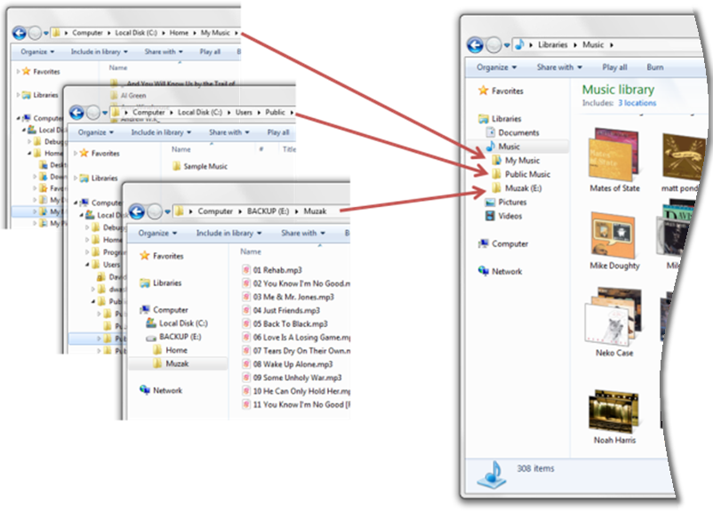
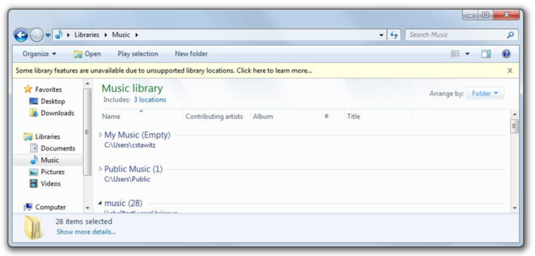

# About Libraries

This topic describes what libraries are and how they can benefit users and developers.

Libraries are user-defined collections of folders. A library keeps track of each folder's physical storage location, which relieves the user and the software of that task. Users can group related folders together in a library even if those folders are stored on different hard drives or different computers.

In a library, the folders and files appear to the user as a single collection and, using the Shell Library API, the library's contents can also appear to be in a single location to a program.

In a library, the contents, such as a user's documents, photos, videos, or music, can be sorted and displayed as the user wants and not simply as how the file system requires. For example, users can organize the contents of a library using the properties of the items in the library so that related items will sort together even if they are stored in different folders.

In this topic:

- [Library Benefits](#library-benefits)
    - [User Benefits](#user-benefits)
    - [Developer Benefits](#developer-benefits)
- [Managing Folders in Libraries](#managing-folders-in-libraries)
- [Related topics](#related-topics)

## Library Benefits

This section describes some of the benefits of libraries from the end-user's perspective and the program developer's perspective.

### User Benefits

Adding library support to your program provides the following benefits to the user:

-   **Libraries provide a consistent user interface in Windows 7**

    The common file dialog boxes support libraries and provide the same user experience as the Windows Explorer in Windows 7. Supporting libraries in your program will help provide a more seamless interaction for the user when using your program in Windows 7.

-   **Users decide where to store content**

    Libraries make it possible for users to control where their content is stored. At the same time, libraries provide reasonable defaults for users who do not want to manage that level of detail in their computer. Users decide how much, or how little, control they want to exercise over where and how their content is stored and the library works fine either way.

### Developer Benefits

You can use libraries in your program to provide a more flexible and convenient user interface without having to add a lot of complex program code. Some of the advantages of adding library support include:

-   **Libraries support library and file-system access**

    Using the [**Shell Library API**](/windows/desktop/api/shobjidl_core/nn-shobjidl_core-ishelllibrary), programs can provide library support for the user while reducing the complexity of their file and folder management code. If your program already uses the file-system API, you can preserve as much of that existing code as you want and still provide library support to the user by getting the necessary file-system information from the **Shell Library API**.

-   **Simpler change notification**

    Both the file-system and the Shell API can notify your program when the contents of a monitored folder or library change. Using the Shell API, however, you can monitor all the folders in the library with a single notification, even though the folder in the library may be stored on different drives or even different computers.

-   **Libraries use file properties**

    Programs can use the file properties to control which files are displayed during open and save operations that use the common file dialog boxes. Programs can also have access to file properties by using the [**IPropertyStore**](/windows/win32/api/propsys/nn-propsys-ipropertystore) interfaces. The common file dialog boxes can also be configured allow users to update the properties that are associated with their content.

-   **Programs can create dedicated libraries**

    A new library can be created when an existing user libraries does not meet the program's needs—for example, if a program creates a new type of user content. The new library can be configured with a unique icon that represents their content and makes the library easy to identify in the Windows Explorer.

## Managing Folders in Libraries

Users can organize their libraries by adding, moving, or removing folders in the library. Not all folders, however, support all the functionality that a library can provide. Many library features require quick access to the different properties of the folder and its contents that are only available through Windows Search. To provide full library functionality, a folder must be able to be indexed by Windows Search.

A library does not allow a user to add folders that do not provide full library functionality. The [**Shell Library API**](/windows/desktop/api/shobjidl_core/nn-shobjidl_core-ishelllibrary) can, however, add such folders. If a library contains a folder that does not support full library functionality, the library will operate in a safe mode and provide a limited functionality. The following table describes the folders that support full library functionality and those that do not.

| Folder types that support full library functionality                                                               | Folder types that do not support full library functionality                                  |
|--------------------------------------------------------------------------------------------------------------------|----------------------------------------------------------------------------------------------|
| Fixed and external NTFS and FAT32 hard drives.                                                                     | Removable drives such as USB flash drives or Secure Digital (SD) memory cards.               |
| File shares that are indexed by Windows Search such as departmental servers, Windows 7, or Windows Vista home PCs. | Removable media such as CD-ROM or DVD media.                                                 |
| File shares that are available offline such as a redirected **My Documents** folder or a Client-Side Cache.        | Network shares that are neither available offline nor remotely indexed such as NAS drives.   |
|                                                                                                                    | Other data sources such as Microsoft SharePoint, Microsoft Exchange, and Microsoft OneDrive. |

 

The following image shows the limited display of library contents while in safe mode.

## Related topics

<dl> <dt>

[About Libraries](library-leverage-to-manage-folders.md)
</dt> <dt>

[**IShellLibrary**](/windows/desktop/api/shobjidl_core/nn-shobjidl_core-ishelllibrary)
</dt> <dt>

[Shell Links](./links.md)
</dt> <dt>

[Known Folders](known-folders.md)
</dt> <dt>

[Library Description Schema](library-schema-entry.md)
</dt> </dl>

 

 
