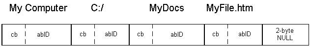

# Introduction to the Shell Namespace

The Shell *namespace* organizes the file system and other objects managed by the Shell into a single tree-structured hierarchy. Conceptually, it is a larger and more inclusive version of the file system.

-   [Introduction](#introduction)
-   [Identifying Namespace Objects](#identifying-namespace-objects)
    -   [Item IDs](#item-ids)
    -   [Item ID Lists](#item-id-lists)
    -   [PIDLs](#pidls)
    -   [Allocating PIDLs](#allocating-pidls)

## Introduction

One of the primary responsibilities of the Shell is managing and providing access to the wide variety of objects that make up the system. The most numerous and familiar of these objects are the folders and files that reside on computer disk drives. However, the Shell manages a number of nonfile system, or *virtual* objects, as well. Some examples include:

-   Network printers
-   Other networked computers
-   Control Panel applications
-   The Recycle Bin

Some virtual objects do not involve physical storage at all. The printer object, for instance, contains a collection of links to networked printers. Other virtual objects, such as the Recycle Bin, may contain data that is stored on a disk drive, but needs to be handled differently than normal files. For example, a virtual object can be used to represent data stored in a database. In terms of the namespace, the various items in the database could appear in the Windows Explorer as separate objects, even though they are all stored in a single disk file.

Virtual objects may even be located on remote computers. For instance, to facilitate roaming, a user's document files might be stored on a server. To give users access to their files from multiple desktop PCs, the My Documents folder on the desktop PC they are currently using will point to the server, not the hard disk of the desktop PC. Its path will include either a mapped network drive or a UNC path name.

Like the file system, the namespace includes two basic types of object: folders and files. Folder objects are the *nodes* of the tree; they are containers for file objects and other folders. File objects are the *leaves* of the tree; they are either normal disk files or virtual objects, such as printer links. Folders that are not part of the file system are sometimes referred to as *virtual folders*.

Like file system folders, the collection of virtual folders generally varies from system to system. There are three classes of virtual folders:

-   Standard virtual folders, such as the Recycle Bin, that are found on all systems.
-   Optional virtual folders that have standard names and functionality, but may not be present on all systems.
-   Non-standard folders that are installed by the user.

Unlike file system folders, users cannot create new virtual folders themselves. They can only install ones created by non-Microsoft developers. The number of virtual folders is thus normally much fewer than the number of file system folders. For a discussion of how to implement virtual folders see [Namespace Extensions](nse-works.md).

You can see a visual representation of how the namespace is structured in the Explorer Bar of the Windows Explorer. For example, the following screen shot of Windows Explorer shows a relatively simple namespace.


The ultimate root of the namespace hierarchy is the desktop. Immediately below the root are several virtual folders such as My Computer and the Recycle Bin.

The file systems of the various disk drives can be seen to be subsets of the larger namespace hierarchy. The roots of these file systems are subfolders of the My Computer folder. My Computer also includes the roots of any mapped network drives. Other nodes in the tree, such as My Documents, are virtual folders.

## Identifying Namespace Objects

Before you can use a namespace object, you must first have a way of identifying it. An object in the file system could have a name such as MyFile.htm. Because there might be other files with that name elsewhere in the system, uniquely identifying a file or folder requires a fully qualified path such as "C:\\MyDocs\\MyFile.htm". This path is basically an ordered list of all folders in a path from the file system root, C:\\, ending with the file.

In the context of the namespace, paths are still quite useful for identifying objects located in the file system part of the namespace. However, they cannot be used for virtual objects. Instead, the Shell provides an alternative means of identification that can be used with any namespace object.

### Item IDs

Within a folder, each object has an *item ID*, which is the functional equivalent of a file or folder name. The item ID is actually a [**SHITEMID**](/windows/desktop/api/Shtypes/ns-shtypes-shitemid) structure:


```
typedef struct _SHITEMID { 
    USHORT cb; 
    BYTE   abID[1]; 
} SHITEMID, * LPSHITEMID; 
```


The **abID** member is the object's identifier. The length of **abID** is not defined, and its value is determined by the folder that contains the object. Because there is no standard definition for how **abID** values are assigned by folders, they are only meaningful to the associated folder object. Applications should simply treat them as a token that identifies an object in a particular folder. Because the length of **abID** varies, the **cb** member holds the size of the [**SHITEMID**](/windows/desktop/api/Shtypes/ns-shtypes-shitemid) structure, in bytes.

Because item IDs aren't useful for display purposes, the folder that contains the object normally assigns it a display name. This is the name that is used by Windows Explorer when it displays the contents of a folder. For more information on how display names are handled, see [Getting Information From a Folder](folder-info.md).

### Item ID Lists

The item ID is rarely used by itself. Normally, it is part of an item ID list, which serves the same purpose as a file system path. However, instead of the character string used for paths, an item ID list is an [**ITEMIDLIST**](/windows/desktop/api/Shtypes/ns-shtypes-itemidlist) structure. This structure is an ordered sequence of one or more item IDs, terminated by a two-byte **NULL**. Each item ID in the item ID list corresponds to a namespace object. Their order defines a path in the namespace, much like a file system path.

The following illustration shows a schematic representation of the [**ITEMIDLIST**](/windows/desktop/api/Shtypes/ns-shtypes-itemidlist) structure that corresponds to C:\\MyDocs\\MyFile.htm. The display name of each item ID is shown above it. The varying widths of the **abID** members are arbitrary; they illustrate the fact that the size of this member can vary.



### PIDLs

For the Shell API, namespace objects are usually identified by a pointer to their [**ITEMIDLIST**](/windows/desktop/api/Shtypes/ns-shtypes-itemidlist) structure, or pointer to an item identifier list (PIDL). For convenience, the term PIDL will generally refer in this documentation to the structure itself rather than the pointer to it.

The PIDL shown in the preceding illustration is referred to as a *full*, or *absolute*, PIDL. A full PIDL starts from the desktop, and contains the item IDs of all intermediate folders in the path. It ends with the object's item ID followed by a terminating two-byte **NULL**. A full PIDL is similar to a fully qualified path and uniquely identifies the object in the Shell namespace.

Full PIDLs are used infrequently. Many functions and methods expect a *relative PIDL*. The root of a relative PIDL is a folder, not the desktop. As with relative paths, the series of item IDs that make up the structure define a path in the namespace between two objects. Although they do not uniquely identify the object, they are usually smaller than a full PIDL and sufficient for many purposes.

The most commonly used relative PIDLs, *single-level PIDLs*, are relative to the object's parent folder. They contain only the object's item ID and a terminating **NULL**. Multi-level PIDLs are also used for many purposes. They contain two or more item IDs and typically define a path from a parent folder to an object through a series of one or more subfolders. Note that a single-level PIDL can still be a fully qualified PIDL. In particular, desktop objects are children of the desktop, so their fully qualified PIDLs contain only one item ID.

As discussed in [Getting a Folder's ID](folder-id.md), the Shell API provides a number of ways to retrieve an object's PIDL. Once you have it, you commonly just use it to identify the object when you call other Shell API functions and methods. In this context, a PIDL's internal contents are opaque and irrelevant. For the purposes of this discussion, think of PIDLs as tokens that represent particular namespace objects, and focus on how to use them for common tasks.

### Allocating PIDLs

Although PIDLs have some similarity to paths, using them requires a somewhat different approach. The primary difference is in how to allocate and deallocate memory for them.

Like the string used for a path, memory must be allocated for a PIDL. If an application creates a PIDL, it must allocate sufficient memory for the [**ITEMIDLIST**](/windows/desktop/api/Shtypes/ns-shtypes-itemidlist) structure. For most of the cases discussed here, the Shell creates the PIDL and handles memory allocation. Regardless of what allocated the PIDL, the application is usually responsible for deallocating the PIDL when it is no longer needed.

Use the [**CoTaskMemAlloc**](/windows/win32/api/combaseapi/nf-combaseapi-cotaskmemalloc) function to allocate the PIDL, and the [**CoTaskMemFree**](/windows/win32/api/combaseapi/nf-combaseapi-cotaskmemfree) function to deallocate it.

 

 
