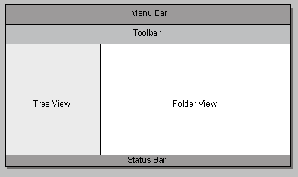

# Understanding Shell Namespace Extensions

Windows Explorer provides a graphical representation of the Shell namespace combined with tools that allow users to interact with Shell objects. With a namespace extension, you can take any body of data and have Windows Explorer present it to the user as a virtual folder. When a user browses into this folder, your data is presented as a tree-structured hierarchy of folders and files, much like the rest of the Shell namespace. Users and applications are able to interact with the contents of this virtual folder in much the same way as with any other namespace object. This document discusses how to create a namespace extension.

- [How a Namespace Extension Works](#how-a-namespace-extension-works)
- [The Default System Folder View Object (DefView)](#the-default-system-folder-view-object-defview)
- [How Windows Explorer Interacts with a Namespace Extension](#how-windows-explorer-interacts-with-a-namespace-extension)
    - [Tree View](#tree-view)
    - [Folder View](#folder-view)
    - [Menu Bar and Toolbars](#menu-bar-and-toolbars)
    - [Status Bar](#status-bar)

## How a Namespace Extension Works

Behind the scenes, every folder that Windows Explorer displays is represented by a Component Object Model (COM) object called a *folder object*. Each time the user interacts with a folder or its contents, the Shell communicates with the associated folder object through one of a number of standard interfaces. The folder object then does whatever is necessary to respond to the user's action, and the Shell updates the Windows Explorer display.

The majority of the files and folders that users interact with are part of the file system or a system virtual folder such as the Recycle Bin. Other documentation has discussed how you can customize the behavior of these standard folders to meet the requirements of your application by modifying the registry or by implementing [Shell extension handlers](handlers.md). However, extending the Shell in these ways is most useful when your information can be readily packaged in the form of normal file system files or folders.

There are a number of situations where storing data as a collection of file-system folders and files might be undesirable or even impossible. Some examples of this type of data include:

- A collection of items that is most effectively packaged in a single file, such as a database.
- A collection of items stored on a remote computer that does not have a standard Windows file system. An example of such data is the information stored on a personal digital assistant (PDA) or digital camera.
- A collection of items that does not represent stored data. An example of such data is the printer links contained by the standard Printers folder.

One way to present this kind of data to a user is to write an application to allow users to view and interact with the various items. However, if your data can be presented as a folder/file hierarchy, much of the functionality you will need to implement might be user interface services that are already provided by Windows Explorer. A much more efficient approach could be to write a namespace extension and let Windows Explorer become your GUI.

To implement a namespace extension, your information must be organized as a tree-structured namespace. Your *namespace root* is presented as a virtual folder in the Shell namespace. The root folder, and all its subfolders and data items, becomes part of the Shell namespace, and Windows Explorer becomes your user interface. You can thus present your information to the user in a familiar and readily accessible way with much less UI programming than would be required for a custom application.

A namespace extension consists of two basic components:

- A data manager
- An interface between the data manager and Windows Explorer

The first component on the list is entirely up to you. You can store and manage your data in whatever way is most effective. The second component is the code needed to package your data as folder objects and handle the interaction with Windows Explorer. Windows Explorer can then call these objects to allow users to view and interact with your data as if it were a collection of folders and files. Your namespace extension's folder objects must interact with Windows Explorer as if they were normal folders. Before attempting to implement a namespace extension, you must first understand how Windows Explorer handles a folder object.

## The Default System Folder View Object (DefView)

The Shell provides a default implementation of the folder view, colloquially known as DefView, so that you can avoid much of the work of implementing your own namespace extension. Because some view features cannot be achieved through custom views, it is often recommended that the default system folder view object is used in place of a custom view. For more information, see [**SHCreateShellFolderView**](/windows/desktop/api/shlobj_core/nf-shlobj_core-shcreateshellfolderview).

## How Windows Explorer Interacts with a Namespace Extension

Windows Explorer provides users with a GUI that allows them to do a variety of tasks, including:

- [Navigating](navigate.md) the namespace hierarchy and viewing the contents of folders.
- [Managing](manage.md) the contents of the namespace by moving, deleting, and copying objects.
- [Retrieving](folder-info.md) a variety of information about objects.
- [Launching](launch.md) applications.

The Windows Explorer GUI has five basic components. The following illustration names the components and shows where they are typically displayed within Windows Explorer.

When a user displays a folder that belongs to a namespace extension in Windows Explorer, the folder object has at least partial control over the contents of all five areas.

### Tree View

The tree view provides a high-level view of the namespace. This area hosts a [tree view control](../controls/tree-view-controls.md) that can display every namespace folder and the folder's position in the namespace hierarchy. A user can perform several operations with the tree view area, including:

- Displaying or hiding the next level in the namespace.
- Copying, moving, or deleting folders.
- Right-clicking a folder to display a shortcut menu.
- Selecting a folder and viewing its contents in the folder view.

The tree view communicates with folder objects primarily through their [**IShellFolder**](/windows/win32/api/shobjidl_core/nn-shobjidl_core-ishellfolder) interface. For example, when a user clicks the plus sign (+) next to the folder's icon, Windows Explorer expands the display to show the folder's subfolders. To obtain the information needed to update the tree view, the Shell makes several calls to the folder object's **IShellFolder** interface to:

- Request the folder's attributes.
- Enumerate the contents of the folder.
- Request display names for each subfolder.
- Request an icon to display next to each folder.

Windows Explorer then updates the tree view to show the selected folder's subfolders. If the subfolders have subfolders, a '+' character is displayed next to their folder icon. There are a number of more sophisticated tasks that a user can also perform with the tree view, including:

- Using the Clipboard to cut or copy a folder and paste it into another folder.
- Using drag-and-drop to cut or copy a folder and drop it on another folder.
- Using a search engine to search for items in a folder or its subfolders.
- Modifying the folder's properties.

For a more detailed discussion of how a namespace extension handles these user actions, see [Implementing the Basic Folder Object Interfaces](nse-implement.md).

### Folder View

When a user selects a folder, the contents of the folder are displayed in the folder view. To some extent, the normal functionality of the folder view overlaps with the tree view. Users can move or copy folders, change folder properties, view the contents of a subfolder, display a shortcut menu for a folder, and so on. However, there are some distinct differences between tree view and folder view:

- Folder view displays only the contents of a single folder, not part or all of the namespace hierarchy.
- Folder view displays file objects as well as folder objects.
- Folder view can display much more information about objects than tree view.
- Folder view allows namespace extensions to have almost complete control over what information is displayed and how. Only minor aspects of the tree view, such as folder icons, can be modified.

Unlike the tree view, Windows Explorer does not directly control the contents of the folder view. The folder view is an area that Windows Explorer provides to folder objects. Displaying and managing the contents of a folder in the folder view are the responsibility of the folder object. Although most folder views follow a fairly standard format, there are actually few limitations on what can be displayed or how. An extreme case is the Internet folder, which is a full-featured browser.

When a user selects a folder that belongs to your namespace extension, you create a window and pass its handle to Windows Explorer. This window becomes a child of the folder view window. Windows Explorer provides the dimensions of the folder view window but places no restrictions on the content of your child window. You can then use the child window to display the folder's folder view.

Namespace extensions use one of two approaches for creating a folder view:

- Use your child window to host a [list view](../controls/list-view-control-reference.md) control. This control allows you to display the contents of a folder in much the same way as the Windows Explorer [classic view](../lwef/web-view.md).
- Use your child window to host a [WebBrowser control](/previous-versions/windows/internet-explorer/ie-developer/platform-apis/aa752044(v=vs.85)) and use a Dynamic HTML (DHTML) document to display the contents of the folder.

Both approaches display a folder view that looks very much like that displayed for system folders. However, if you want to use a different display scheme, you are free to do so.

### Menu Bar and Toolbars

Like most Windows applications, Windows Explorer provides the user with a collection of tools. A complete selection of tools is available through the menu bar. The more commonly used tools are also represented by buttons or edit boxes on a toolbar. Unlike many Windows applications, the Windows Explorer menu bar is actually a [toolbar control](../controls/toolbar-control-reference.md) that has been customized to behave like a conventional menu. Both the menu bar and the toolbar are incorporated into a [rebar control](../controls/rebar-control-reference.md) to allow users to organize the individual controls to suit their needs.

By default, Windows Explorer supports a standard set of buttons and menu items, such as Copy and Properties. Your namespace extension can customize the menu bar and toolbars by deleting standard tools and adding custom tools. When your folder view object is initialized, Windows Explorer passes a pointer to its [**IShellBrowser**](/windows/win32/api/shobjidl_core/nn-shobjidl_core-ishellbrowser) interface. This interface supports several methods that you can call to customize the menu bar and toolbar. When the user selects one of your custom menu items or toolbar buttons, Windows Explorer forwards WM\_COMMAND messages for custom menu and toolbar items to your child window's window procedure.

### Status Bar

The Windows Explorer status bar displays information about the currently selected object. Your namespace extension can use the status bar to display status information, such as a text string. You can customize the status bar by calling [**IShellBrowser**](/windows/win32/api/shobjidl_core/nn-shobjidl_core-ishellbrowser).

 

 
