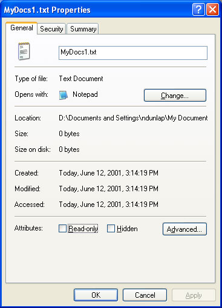
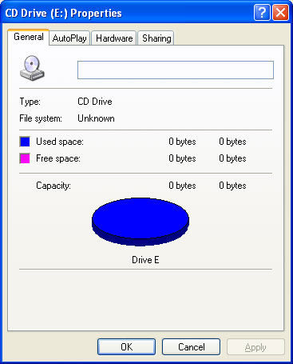

# Property Sheet Handlers

When a user right-clicks a Shell object, the shortcut menu that is displayed normally includes a **Properties** item. Selecting that item launches a property sheet that allows the user to view, and in some cases modify, the object's properties. You can customize this property sheet by implementing and registering a *property sheet handler*.

The general procedures for implementing and registering a Shell extension handler are discussed in [Creating Shell Extension Handlers](handlers.md). This document focuses on those aspects of implementation that are specific to property sheet handlers.

- [How Property Sheet Handlers Work](#how-property-sheet-handlers-work)
- [Registering and Implementing a Property Sheet Handler for a Mounted Drive](#registering-and-implementing-a-property-sheet-handler-for-a-mounted-drive)
- [Related topics](#related-topics)

## How Property Sheet Handlers Work

The following illustration shows the Properties property sheet for a Windows XP text file.

This illustration shows the default Properties property sheet that is displayed for any file. For many such property sheets, you can add one or more pages to the property sheet by implementing and registering a property sheet handler.

Property sheet handlers are most commonly registered for a [file type](fa-file-types.md). Each handler can add one custom page to the Properties property sheet for the class. These pages typically give users access to properties that are specific to the particular file type. A file type consisting of text documents could, for instance, display a page that listed the title and author, and an abstract of the document. A special case of this type of property sheet handler is used to add a page to the Properties property sheet for a mounted drive.

The other use for property sheet handlers is to replace pages in the property sheets displayed by Control Panel applications. A mouse manufacturer, for instance, can use a property sheet handler to replace the **Buttons** page on the Control Panel's **Mouse Properties** property sheet with a page that is customized for the characteristics of its mouse.

Like all Shell extension handlers, property sheet handlers are in-process Component Object Model (COM) objects implemented as DLLs. They must export two interfaces in addition to [**IUnknown**](/windows/win32/api/unknwn/nn-unknwn-iunknown): [**IShellExtInit**](/windows/win32/api/shobjidl_core/nn-shobjidl_core-ishellextinit) and [**IShellPropSheetExt**](/windows/desktop/api/shobjidl_core/nn-shobjidl_core-ishellpropsheetext).

The [**IShellExtInit**](/windows/win32/api/shobjidl_core/nn-shobjidl_core-ishellextinit) interface is used by the Shell to initialize the handler. When the Shell calls [**IShellExtInit::Initialize**](/windows/desktop/api/shobjidl_core/nf-shobjidl_core-ishellextinit-initialize), it passes in a data object with the object's name, and the pointer to an item identifier list (PIDL) of the folder that contains the file. The *hRegKey* parameter is not used with property sheet handlers. The **IShellExtInit::Initialize** method must extract the file name from the data object, and store the name and the folder's PIDL for later use. For further details, see the *Implementing IShellExtInit* section of [Creating Shell Extension Handlers](handlers.md).

The remainder of the operation takes place through the handler's [**IShellPropSheetExt**](/windows/desktop/api/shobjidl_core/nn-shobjidl_core-ishellpropsheetext) interface. If the property sheet is associated with a file type, the Shell calls [**IShellPropSheetExt::AddPages**](/windows/desktop/api/shobjidl_core/nf-shobjidl_core-ishellpropsheetext-addpages) to allow the handler to add a page to the property sheet. If the property sheet is associated with a Control Panel application, the Shell calls [**IShellPropSheetExt::ReplacePage**](/windows/desktop/api/shobjidl_core/nf-shobjidl_core-ishellpropsheetext-replacepage) to allow the handler to replace a page.

## Registering and Implementing a Property Sheet Handler for a Mounted Drive

Each mounted drive has a Properties sheet that can be displayed by the user. The following illustration shows a Properties property sheet for a CD-ROM drive.

There are a wide variety of devices that can be mounted as drives. Because the default property sheet, designed for disk drives, might not be sufficient for some devices, a property sheet handler can be implemented to add a page that is specific to the mounted device. The basic implementation of this type of property sheet handler is identical to that discussed in [How to Register and Implement a Property Sheet Handler for a File Type](how-to-register-and-implement-a-property-sheet-handler-for-a-file-type.md), with two exceptions.

- The data object passed to the handler's [**IShellExtInit::Initialize**](/windows/desktop/api/shobjidl_core/nf-shobjidl_core-ishellextinit-initialize) method may contain the drive path in the [CFSTR\_MOUNTEDVOLUME](clipboard.md) format instead of the [CF\_HDROP](clipboard.md) format. The CF\_HDROP format is used when the device is mounted to a drive letter. The CFSTR\_MOUNTEDVOLUME format is used with NTFS file systems when the remote device is mounted to a folder rather than to a drive letter.
- The handler's GUID is registered under the **HKEY\_CLASSES\_ROOT**\\**Drive**\\**shellex**\\**PropertySheetHandlers** key.

## Related topics

<dl> <dt>

[How to Register and Implement a Property Sheet Handler for a File Type](how-to-register-and-implement-a-property-sheet-handler-for-a-file-type.md)
</dt> <dt>

[How to Register and Implement a Property Sheet Handler for a Control Panel Application](how-to-register-and-implement-a-property-sheet-handler-for-a-control-panel-application.md)
</dt> </dl>

 

 
