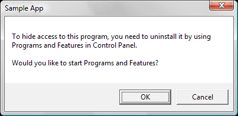
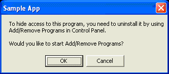

# Registering Programs with Client Types

This topic explains how to register a program in the Windows registry as one of the following client types: browser, email, media playback, instant messaging, or virtual machine for Java.

> [!Note]  
> This information applies to the following operating systems:
> 
> -   Windows 2000 Service Pack 3 (SP3)
> -   Windows 2000 Service Pack 4 (SP4)
> -   Windows XP Service Pack 1 (SP1)
> -   Windows XP Service Pack 2 (SP2)
> -   Windows XP Service Pack 3 (SP3)
> -   Windows Server 2003
> -   Windows Vista
> -   Windows Vista Service Pack 1 (SP1)
> -   Windows 8

 

This topic includes the following sections.

-   [Common Registration Elements for All Client Types](#common-registration-elements-for-all-client-types)
    -   [Selecting a Canonical Name](#selecting-a-canonical-name)
    -   [Registering a Program's Display Name](#registering-a-programs-display-name)
    -   [Registering a Program's Icon](#registering-a-programs-icon)
    -   [Registering an Open Verb](#registering-an-open-verb)
    -   [Registering Installation Information](#registering-installation-information)
-   [Registration Elements for Specific Client Types](#registration-elements-for-specific-client-types)
    -   [Start Menu Registration](#start-menu-registration)
    -   [Mail Client Registration](#mail-client-registration)
-   [Complete Sample Registrations](#complete-sample-registrations)
    -   [A Sample Browser](#a-sample-browser)
    -   [A Sample Mail Browser](#a-sample-mail-browser)
    -   [A Sample Media Player](#a-sample-media-player)
    -   [A Sample Instant Messenger Program](#a-sample-instant-messenger-program)
    -   [A Sample Virtual Machine for Java](#a-sample-virtual-machine-for-java)
-   [Related topics](#related-topics)

This topic extends existing documentation about registering a program as a particular client type. For links to that documentation, see the Related Topics section.

## Common Registration Elements for All Client Types

When registering a program as a client type, most of the registry entries are the same regardless of the client type. Some registry entries, however, are specific to the client type and these are noted in the [Registration Elements for Specific Client Types](#registration-elements-for-specific-client-types) section.

This section discusses the following topics:

-   [Selecting a Canonical Name](#selecting-a-canonical-name)
-   [Registering a Program's Display Name](#registering-a-programs-display-name)
-   [Registering a Program's Icon](#registering-a-programs-icon)
-   [Registering an Open Verb](#registering-an-open-verb)
-   [Registering Installation Information](#registering-installation-information)

> [!Note]  
> Subkey names given in italics throughout this topic are placeholders for user-defined subkey names or a set of possible values. Full examples with example names in place are provided in the [Complete Sample Registrations](#complete-sample-registrations) section.

 

All client type registration information is stored under the following subkey:

```
HKEY_LOCAL_MACHINE
   Software
      Clients
         ClientTypeName
```

*ClientTypeName* is one of the following subkey names:

-   StartMenuInternet (for browsers)
-   Mail (for email)
-   Media (for media playback)
-   IM (for instant messaging)
-   JavaVM (for virtual machine for Java)

Throughout this topic, you will note references to a fictional computer program named "Lit View" by Litware Inc., with an executable file named Litview.exe. This hypothetical program is used interchangeably as an instant messenger, a browser, or another type of client program as needed for illustrative purposes.

### Selecting a Canonical Name

The vendor must choose a *canonical name* for the program. The canonical name is never shown to the user, so it does not need to be localized. Its only purpose is to provide a unique string that can be used to identify the program. It is typically the same as the English name of the program, but this is merely a convention.

For client types other than browsers, the canonical name can be any string. Choose a unique name, one that is not likely to be used by another vendor.

For browser clients, the canonical name must be the name—including the extension—of the associated executable; for instance, "Litview.exe".

Here are some examples of canonical names.

-   Iexplore.exe (browser)
-   Windows Mail (email)
-   Windows Media Player (media)
-   Windows Messenger (instant messaging)

Register the canonical name by creating a subkey as shown here. The name of the subkey is the canonical name. All information relating to that program's registration will exist under this subkey.

```
HKEY_LOCAL_MACHINE
   Software
      Clients
         ClientTypeName
            CanonicalName
```

### Registering a Program's Display Name

The next step in registration is to specify the program's display name. It is given as a value under the canonical name key as shown here. Note again that *CanonicalName* and *ClientTypeName* are not the actual names of the keys, but only placeholders for the true names, such as *Lit View*.

> [!Note]  
> As of Windows 8, the name used to register for [Set Program Access and Computer Defaults (SPAD)](cpl-setprogramaccess.md) and for [Default Programs](default-programs.md) should match in order for SPAD changes to trigger Default Programs registrations.

 

```
HKEY_LOCAL_MACHINE
   Software
      Clients
         ClientTypeName
            CanonicalName
               LocalizedString = @FilePath,-StringID
```

The **LocalizedString** value is a REG\_SZ string and consists of an "at" sign (@), the full path to a .dll or .exe file, a comma, a minus sign, and a decimal integer. The decimal integer is the ID of a string resource—contained within the .dll or .exe file—whose value is to be displayed to the user as the name of this client. Note that the file path does not require quotation marks, even if it contains spaces.

Registering the display name string in this manner allows the same registration to be used for multiple languages. Each language installation provides a different resource file with the display name stored at the same resource ID.

The following example shows the registration for a fictional Lit View instant messaging program. Because it is an instant messaging program, the *CanonicalName* subkey (in this case *Lit View*) is stored under the **IM** subkey.

```
HKEY_LOCAL_MACHINE
   Software
      Clients
         IM
            Lit View
               (Default) = Lit View
               LocalizedString = @C:\Program Files\LitwareInc\ResourceDLL.dll,-123
```

Note the use of the (Default) entry as a secondary declaration of the client's display name. If the **LocalizedString** is not present, the (Default) value is used instead. This works with all client types (Internet browsers, email browsers, instant messengers, and media players). For backward compatibility with the [Internet Explorer Client Registry Layout](/previous-versions/windows/internet-explorer/ie-developer/platform-apis/aa753633(v=vs.85)), email programs should set the (Default) value of the *CanonicalName* subkey to the client's display name in the currently installed language.

### Registering a Program's Icon

> [!Note]  
> This section does not apply to Windows 2000.

 

By default, the upper section of the Windows XP and Windows Vista **Start** menu contains **Internet** and **E-mail** icons. These icons are not present in Windows 7 and later. For browser and email clients, when a program is assigned as the default for their client type, that program's registered icon is displayed for those **Start** menu entries.

Registering a program's icon is mandatory for browser and email clients. Registering an icon for the media playback, instant messaging, or virtual machine for Java client types is optional, and registered icons for those client types are not currently used by Windows and are not displayed in the upper section of the Windows XP or Windows Vista **Start** menus.

To register an icon for a client program, add a **DefaultIcon** subkey with a default value as shown here.

```
HKEY_LOCAL_MACHINE
   Software
      Clients
         ClientTypeName
            CanonicalName
               DefaultIcon
                  (Default) = FilePath,IconIndex
```

The **FilePath** value is the full path to the file that contains the icon. This path does not require quotation marks, even if it contains spaces.

The **IconIndex** value is interpreted as follows:

-   If **IconIndex** is a positive number, the number is used as the index of the *zero-based* array of icons stored in the file. For example, if **IconIndex** is 1, the second icon is loaded from the file.
-   If **IconIndex** is a negative number, the absolute value of **IconIndex** is used as the resource identifier (rather than the index) for the icon. For example, if **IconIndex** is -3, the icon whose resource identifier is 3 is loaded from the file.

The following example shows the registration of a hypothetical Lit View browser. The second icon stored in the Litview.exe file is used as the default.

```
HKEY_LOCAL_MACHINE
   Software
      Clients
         StartMenuInternet
            LITVIEW.EXE
               DefaultIcon
                  (Default) = C:\Program Files\LitwareInc\Litview.exe,1
```

### Registering an Open Verb

> [!Note]  
> This section does not apply to Windows 2000. The following step is necessary only for browser and email clients.

 

Assume that a user has selected your program as the default Internet or email program. That user clicks the **Internet** or **E-mail** icon in the Windows XP or Windows Vista **Start** menu to open the program. At that point, the command line registered as shown here is executed.

```
HKEY_LOCAL_MACHINE
   Software
      Clients
         ClientTypeName
            CanonicalName
               shell
                  open
                     command
                        (Default) = command line
```

The command line must specify a fully qualified absolute path to the file, followed by optional command-line options. If the entry type is REG\_EXPAND\_SZ, environment variables can be used in the path. Use quotation marks appropriately to ensure that spaces in the command line are not misinterpreted. The command line should execute the program with appropriate defaults. Browsers generally default to the user's home page. Email programs generally open the user's **Inbox**.

The following example shows the registration of an `open` verb for a hypothetical Lit View browser. It specifies no command-line options.

```
HKEY_LOCAL_MACHINE
   Software
      Clients
         StartMenuInternet
            LITVIEW.EXE
               shell
                  open
                     command
                        (Default) = "C:\Program Files\LitwareInc\Litview.exe"
```

Note that in this value, quotation marks are placed around the path because it contains embedded spaces. Omitting these quotation marks could cause the command line to be misinterpreted.

### Registering Installation Information

> [!Note]  
> This section does not apply to Windows Server 2003.

 

-   [The Reinstall Command](#the-reinstall-command)
-   [The Hide Icons Command](#the-hide-icons-command)
-   [The Show Icons Command](#the-show-icons-command)
-   [Group Program Configuration](#group-program-configuration)
-   [Browser Registration Example](#browser-registration-example)

The feature by which the user selects per-machine default programs is named and accessed as shown in the following table. (Windows Vista introduced a new feature, **Set your default programs**, by which a user can set per-user defaults.)


| Operating System | Title | Access Location | 
|------------------|-------|-----------------|
| Windows 7 | Set Program Access and Computer Defaults | <ul><li><strong>Start</strong> menu <strong>Default Programs</strong> option</li><li><strong>Default Programs</strong> Control Panel item</li></ul> | 
| Windows Vista | Set Program Access and Computer Defaults | <ul><li><strong>Start</strong> menu <strong>Default Programs</strong> option</li><li><strong>Default Programs</strong> Control Panel item</li></ul> | 
| Windows XP SP2 | Set Program Access and Defaults | <ul><li><strong>Start</strong> menu</li><li><strong>Add or Remove Programs</strong> Control Panel item</li></ul> | 
| Windows XP SP1 | Configure Programs | <ul><li><strong>Add or Remove Programs</strong> Control Panel item</li></ul> | 


 

For simplicity, this topic uses the Windows 7 title of the feature. All versions of the feature are popularly referred to as SPAD.

> [!Note]  
> If you are running Windows 2000 or Windows XP, you must have at least Windows 2000 SP3 or Windows XP SP1 installed to see the **Set Program Access and Defaults** page. In Windows Vista and later, access to the **Set Program Access and Computer Defaults** page requires Administrator privileges. For this reason, developers are encouraged to register for the [Set your default programs](default-programs.md) Control Panel item so that any user can manage application defaults.

 

The following registry tree shows the variety of information that must be registered in the program's **InstallInfo** key in order for the program to appear on the **Set Program Access and Computer Defaults** page as an option for its client type. Each of these values is discussed in detail in the following sections.

```
HKEY_LOCAL_MACHINE
   Software
      Clients
         ClientTypeName
            CanonicalName
               InstallInfo
                  HideIconsCommand = command line
                  ReinstallCommand = command line
                  ShowIconsCommand = command line
                  IconsVisible = 1
```

The command line must specify a fully qualified absolute path to the file, followed by optional command-line options. Use quotation marks appropriately to ensure that spaces in the command line are not misinterpreted.

### The Reinstall Command

The reinstall command line declared in the ReinstallCommand value is executed when the user uses the **Set Program Access and Computer Defaults** page to select your program as the default for its client type. In Windows Vista and later, access to this page requires an Administrator privilege level. In Windows 8, if you have registered your application using the same name for both **Set Program Access and Computer Defaults** and **Default Programs**, the defaults specified in **Default Programs** for that application will be applied for the current user as well as running the reinstall command.

The program launched by the reinstall command line must associate the application with the complete set of [file](fa-intro.md) and [protocol](/previous-versions//aa767743(v=vs.85)) types the application can handle. All applications must establish handler capability in the reinstall command. Applications can use the reinstall command to register capability as well as optionally establish default status. When an application chooses to implement both capability and default handler status in the reinstall command, it should also reinstate any visible links or shortcuts desired. The visible entry points most applications choose are listed in [The Hide Icons Command](#the-hide-icons-command).

> [!Note]  
> It is highly recommended that applications implement handling capability in the reinstall command.

 

Once the reinstall process is complete, the program launched by the reinstall command line should exit. It should not launch the corresponding program; it should merely register defaults. For example, the reinstall command for a browser should not open the user's home page.

> [!Note]  
> For browser and email clients in Windows XP and Windows Vista, applications that choose to establish both handling capability and default status in the reinstall command should register for the corresponding icon at the top of the Start menu. See [Start Menu Registration](#start-menu-registration) for additional information.

 

### The Hide Icons Command

The command line declared in the HideIconsCommand value is executed when the user clears the **Enable access to this program** box in the **Set Program Access and Computer Defaults** page. This command line must hide all of your program's access points that are visible in the user interface. The specific guidelines are to remove shortcuts and icons from the following locations:

-   Desktop icons
-   Start menu links, including the **Startup** group
-   Quick Launch bar links
-   Notification area
-   Shortcut menus
-   Folder task band

This command line must also prevent automatic invocations of the program, such as those specified in the **Run** registry key. Vendors are encouraged to implement these guidelines in the application's Hide Access callback.

You do not need to relinquish registration (application capability) of file types when icons are hidden. You also do not need to relinquish the application's default status for file and protocol types. Doing so can lead to a bad user experience when these types are encountered in the UI.

After successfully hiding icons, you must update the IconsVisible registry value to 0 as shown:

```
HKEY_LOCAL_MACHINE
   Software
      Clients
         ClientTypeName
            CanonicalName
               InstallInfo
                  IconsVisible = 0
```

The IconsVisible entry is of type **REG\_DWORD**.

### An Alternate Hide Icons Method in SPAD

For some legacy applications, a full implementation of Hide Access may not be practical. An alternative method that achieves the same effect is to uninstall the application. The section below shows example behavior and sample code to implement this alternative. In general, independent software vendors (ISVs) should avoid this alternative since it will:

-   Uninstall the application completely from the system.
-   Remove previously selected defaults.
-   Leave no UI option to reinstall the application.
-   Make the enable access feature no longer available, since an uninstallation removes the application completely from SPAD.

The recommended user experience is as follows:

-   When the user unchecks the **Enable access to this program** box in SPAD, the following UI is presented.

    

-   When the user selects **OK**, the **Programs and Features** Control Panel item launches to allow the user to uninstall the application.
-   Windows XP users should be presented with this dialog box.

    

-   When the Windows XP user selects **OK**, the **Add or Remove Programs** Control Panel item launches to allow the user to uninstall the application.

The following code provides a reusable implementation for the Hide Access feature as outlined above. It can be used on Windows XP, Windows Vista, and Windows 7.


```
#include <windows.h>
#include <shlwapi.h>
#include <strsafe.h>

PCWSTR c_pszMessage1 = L"To hide access to this program, you need to uninstall it by ";
PCWSTR c_pszMessage2 = L"using\n%s in Control Panel.\n\nWould you like to start %s?";
PCWSTR c_pszApplicationName  = L"Sample App";

int _tmain(int argc, WCHAR* argv[])
{
    OSVERSIONINFO version;
    version.dwOSVersionInfoSize = sizeof(version);

    if (GetVersionEx(&version))
    {
        PCWSTR pszCPLName = NULL;

        if (version.dwMajorVersion >= 6)
        {
            // Windows Vista and later
            pszCPLName = L"Programs and Features";
        }
        else if (version.dwMajorVersion == 5 &&
                 version.dwMinorVersion == 1)
        {
            // Windows XP
            pszCPLName = L"Add/Remove Programs";
        }

        if (pszCPLName != NULL)
        {
            WCHAR szMessage[256], szScratch[256];
            if (SUCCEEDED(StringCchPrintf(szScratch, 
                                          ARRAYSIZE(szScratch), 
                                          c_pszMessage2, 
                                          pszCPLName, 
                                          pszCPLName)))
            {
                if (SUCCEEDED(StringCchCopy(szMessage, 
                                            ARRAYSIZE(szMessage), 
                                            c_pszMessage1)))
                {
                    if (SUCCEEDED(StringCchCat(szMessage, 
                                               ARRAYSIZE(szMessage), 
                                               szScratch)))
                    {
                        if (IDOK == MessageBox(NULL, 
                                               szMessage, 
                                               c_pszApplicationName, 
                                               MB_OKCANCEL))
                        {
                            ShellExecute(NULL, 
                                         NULL, 
                                         L"appwiz.cpl", 
                                         NULL, 
                                         NULL, 
                                         SW_SHOWNORMAL);
                        }
                    }
                }
            }
        }
    }
    return 0;
}
```


### The Show Icons Command

The command line declared in the ShowIconsCommand entry is executed when the user checks the **Enable access to this program** box in the **Set Program Access and Computer Defaults** page. This command line may restore your program's access points, including those in the **Start** menu, on the desktop, and in the **Startup** group, as well as normal automatic invocations, such as those specified in the **Run** registry key. The visible access points of interest to most applications are listed in [The Hide Icons Command](#the-hide-icons-command). The application should not change per-user defaults; that change should be done by the user through **Default Programs**.

After successfully showing your icons, you must update the IconsVisible registry value to 1 as shown:

```
HKEY_LOCAL_MACHINE
   Software
      Clients
         ClientTypeName
            CanonicalName
               InstallInfo
                  IconsVisible = 1
```

Note that if you have used the HideIconsCommand entry to prompt an uninstall of the application, the ShowIconsCommand entry is of no use. It should be removed from the registry with the rest of the application's information during the uninstall process.

### Group Program Configuration

> [!Note]  
> This section does not apply to Windows 2000.

 

As part of system preparation, an OEM can establish a configuration that hides access points for the Microsoft browser, email, media playback, instant messaging, or virtual machine for Java client programs and specifies their own default programs. OEMs can enable users to reset their computers at any time to this default configuration by setting the following registry values.

```
HKEY_LOCAL_MACHINE
   Software
      Clients
         ClientTypeName
            CanonicalName
               InstallInfo
                  OEMShowIcons = 1
                  OEMDefault = 1
```

If these keys are set, users can restore the OEM configuration by selecting the **Computer Manufacturer** option on the **Set Program Access and Computer Defaults** page. If these keys are not set, the **Computer Manufacturer** option is not shown.

The **OEMShowIcons** entry, if present, sets the icon show state for the specified client that is applied if the user selects **Computer Manufacturer**. A value of 1 causes icons to be shown, and a value of 0 causes icons to not be shown. If **OEMShowIcons** is absent, selecting **Computer Manufacturer** has no effect on the icon show setting. **OEMShowIcons** is of type **REG\_DWORD**.

The **OEMDefault** entry, if present and set to 1, establishes the OEM preference for the default client of the indicated type. Only one client of a particular type can be marked as the OEM default. If more then one client's registration contains the **OEMDefault** entry, then all are ignored and the current client continues to be used as default client. If the **OEMDefault** entry is not present or is present and set to 0, then that particular client is not used as the default client if the user selects **Computer Manufacturer**. **OEMDefault** is of type **REG\_DWORD**.

In addition to the option to reset their computers to the default configuration established by the OEM, users have three other configuration options:

-   Set their computer to a Microsoft Windows configuration. In this case, the **Set Program Access and Computer Defaults** page enables access to all Microsoft and non-Microsoft software on the computer registered in the relevant product categories. Microsoft Windows programs are selected as the default option for each category.
-   Set their computer to a non-Microsoft configuration. This configuration hides access points (such as the **Start** menu) to Windows Internet Explorer, Windows Media Player, Windows Messenger, and Microsoft Outlook Express. It enables access to the non-Microsoft software on the computer in these categories. Furthermore, if a non-Microsoft program is available in a category, it is set as the default for that category. If more than one non-Microsoft program is available in a category, the user is asked to choose which non-Microsoft program should be used as the default.
-   Establish a custom configuration. Users make their own selections for enabling or removing access, mixing Microsoft and non-Microsoft programs as they see fit. Users establish default options on a category-by-category basis.

Users are free to change any of these options at any time.

### Browser Registration Example

The following example shows the full **InstallInfo** registration for a fictional Lit View browser. In this case the command line switches allow the Litview.exe file to perform whatever actions are necessary for each value.

```
HKEY_LOCAL_MACHINE
   Software
      Clients
         StartMenuInternet
            LITVIEW.EXE
               InstallInfo
                  ReinstallCommand = "C:\Program Files\LitwareInc\Litview.exe" /reinstall
                  HideIconsCommand = "C:\Program Files\LitwareInc\Litview.exe" /hideicons
                  ShowIconsCommand = "C:\Program Files\LitwareInc\Litview.exe" /showicons
                  IconsVisible = 1
```

Note that quotation marks are placed around the paths because they contain embedded spaces.

## Registration Elements for Specific Client Types

The following information also can be found in the resources listed in the Related Topics section at the end of this topic.

-   [Start Menu Registration](#start-menu-registration)
-   [Mail Client Registration](#mail-client-registration)

### Start Menu Registration

Under Windows XP, applications typically registered defaults on a machine-wide (**HKEY\_LOCAL\_MACHINE**) rather than a user (**HKEY\_CURRENT\_USER**) scope. With the Windows Vista introduction of the User Account Control (UAC), applications that claim the **Internet** and **E-mail** slots in the **Start** menu must implement the reinstall command within the correct execution context.

> [!Note]  
> The Start menu **E-mail** link has been removed as of Windows 7. However, the registration discussed in this section should still be performed because it assigns the default MAPI client.

 

A limited user on Windows XP, Windows Vista, or Windows 7 cannot access SPAD. For this reason, developers are encouraged to register for the **Set your default programs** Control Panel item so that any user can manage per-user application defaults.

Selections made in SPAD should only affect per-machine settings.

Set the registry value as follows.

```
HKEY_LOCAL_MACHINE
   Software
      Clients
         ClientTypeName
            (Default) = CanonicalName
```

> [!Note]
> 
> **The following information applies to Windows XP only.**
> 
> If the registration of the computer-level default under HKEY\_LOCAL\_MACHINE as shown above is successful, the application should delete the value assigned to the Default entry under the following subkey:
> 
> ```
> HKEY_CURRENT_USER
>    SOFTWARE
>       Clients
>          ClientTypeName
> ```
> 
> If the registration of the computer-level default under HKEY\_LOCAL\_MACHINE as shown above fails, usually because the user does not have write permission to the subkey, the application should set the following value:
> 
> ```
> HKEY_CURRENT_USER
>    SOFTWARE
>       Clients
>          ClientTypeName
>             (Default) = CanonicalName
> ```
> 
> This registers the canonical name only for the current user, not for all users.

 

After updating the registry keys, the program should broadcast the [**WM\_SETTINGCHANGE**](../winmsg/wm-settingchange.md) message with **wParam** = 0 and **lParam** pointing to the null-terminated string "Software\\Clients\\**ClientTypeName**" to notify the operating system that the default client has changed.

### Mail Client Registration

For a mail client, the program needs to have registered settings under the **HKEY\_CLASSES\_ROOT**\\**mailto** key in order to service URLs that use the `mailto` protocol. Set values and keys that mirror those settings under the following key.

```
HKEY_LOCAL_MACHINE
   Software
      Clients
         Mail
            CanonicalName
               Protocols
                  mailto
```

This registry hierarchy replaces the existing `mailto` registry hierarchy found at **HKEY\_CLASSES\_ROOT**\\**mailto**. The hierarchy remains the same, only the location has changed. The format of this hierarchy is documented on MSDN under [Asynchronous Pluggable Protocol Overviews and Tutorials](/previous-versions//aa767913(v=vs.85)). Typically, the `mailto` protocol is registered to a program rather than an asynchronous protocol, in which case the documentation on [Registering an Application to a URI Scheme](/previous-versions/windows/internet-explorer/ie-developer/platform-apis/aa767914(v=vs.85)) applies.

The following example shows the `mailto` section of the registration for a `mailto` handler registered to a program.

```
HKEY_LOCAL_MACHINE
   Software
      Clients
         Mail
            CanonicalName
               Protocols
                  mailto
                     (Default) = URL:MailTo Protocol
                     EditFlags = 02 00 00 00
                     URL Protocol
                     DefaultIcon
                        (Default) = %FilePath%,IconIndex
                     shell
                        open
                           command
                              (Default) = command line
```

The EditFlags registry value is documented in [File Types](fa-file-types.md) in the section titled "Defining File Type Attributes."

## Complete Sample Registrations

The following examples are provided to show the complete registration requirements for the various client types.

-   [A Sample Browser](#a-sample-browser)
-   [A Sample Mail Browser](#a-sample-mail-browser)
-   [A Sample Media Player](#a-sample-media-player)
-   [A Sample Instant Messenger Program](#a-sample-instant-messenger-program)
-   [A Sample Virtual Machine for Java](#a-sample-virtual-machine-for-java)

### A Sample Browser

```
HKEY_LOCAL_MACHINE
   Software
      Clients
         StartMenuInternet
            LITVIEW.EXE
               (Default) = Lit View
               LocalizedString = @C:\Program Files\LitwareInc\ResourceDLL.dll,-123
               DefaultIcon
                  (Default) = C:\Program Files\LitwareInc\LITVIEW.EXE,1
               InstallInfo
                  ReinstallCommand = "C:\Program Files\LitwareInc\LITVIEW.EXE" /reinstall
                  HideIconsCommand = "C:\Program Files\LitwareInc\LITVIEW.EXE" /hideicons
                  ShowIconsCommand = "C:\Program Files\LitwareInc\LITVIEW.EXE" /showicons
                  IconsVisible = 1
                  shell
                     open
                        command
                           (Default) = "C:\Program Files\LitwareInc\LITVIEW.EXE" /homepage
```

### A Sample Mail Browser

```
HKEY_LOCAL_MACHINE
   Software
      Clients
         Mail
            Lit View
               (Default) = Lit View
               DLLPath = @C:\Program Files\LItwareInc\LitwareMAPI.dll
               LocalizedString = @C:\Program Files\LitwareInc\ResourceDLL.dll,-123
               DefaultIcon
                  (Default) = C:\Program Files\LitwareInc\LITVIEW.EXE,1
               InstallInfo
                  ReinstallCommand = "C:\Program Files\LitwareInc\LITVIEW.EXE" /reinstall
                  HideIconsCommand = "C:\Program Files\LitwareInc\LITVIEW.EXE" /hideicons
                  ShowIconsCommand = "C:\Program Files\LitwareInc\LITVIEW.EXE" /showicons
                  IconsVisible = 1
               shell
                  open
                     command
                        (Default) = "C:\Program Files\LitwareInc\LITVIEW.EXE" /inbox
               protocols
                  mailto
                     (Default) = URL:MailTo Protocol
                     EditFlags = 02 00 00 00
                     URL Protocol
                     DefaultIcon
                        (Default) = C:\Program Files\LitwareInc\LITVIEW.EXE,1
                     shell
                        open
                           command
                              (Default) = "C:\Program Files\LitwareInc\LITVIEW.EXE" /mailto:%1
```

### A Sample Media Player

```
HKEY_LOCAL_MACHINE
   Software
      Clients
         Media
            Lit View
               (Default) = Lit View
               LocalizedString = @C:\Program Files\LitwareInc\ResourceDLL.dll,-123
               DefaultIcon
                  (Default) = C:\Program Files\LitwareInc\LITVIEW.EXE,1
               InstallInfo
                  ReinstallCommand = "C:\Program Files\LitwareInc\LITVIEW.EXE" /reinstall
                  HideIconsCommand = "C:\Program Files\LitwareInc\LITVIEW.EXE" /hideicons
                  ShowIconsCommand = "C:\Program Files\LitwareInc\LITVIEW.EXE" /showicons
                  IconsVisible = 1
```

### A Sample Instant Messenger Program

```
HKEY_LOCAL_MACHINE
   Software
      Clients
         IM
            Lit View
               (Default) = Lit View
               LocalizedString = @C:\Program Files\LitwareInc\ResourceDLL.dll,-123
               DefaultIcon
                  (Default) = C:\Program Files\LitwareInc\LITVIEW.EXE,1
               InstallInfo
                  ReinstallCommand = "C:\Program Files\LitwareInc\LITVIEW.EXE" /reinstall
                  HideIconsCommand = "C:\Program Files\LitwareInc\LITVIEW.EXE" /hideicons
                  ShowIconsCommand = "C:\Program Files\LitwareInc\LITVIEW.EXE" /showicons
                  IconsVisible = 1
```

### A Sample Virtual Machine for Java

```
HKEY_LOCAL_MACHINE
   Software
      Clients
         JavaVM
            Lit View
               (Default) = Lit View
               LocalizedString = @C:\Program Files\LitwareInc\ResourceDLL.dll,-123
               DefaultIcon
                  (Default) = C:\Program Files\LitwareInc\LITVIEW.EXE,1
               InstallInfo
                  ReinstallCommand = "C:\Program Files\LitwareInc\LITVIEW.EXE" /reinstall
                  HideIconsCommand = "C:\Program Files\LitwareInc\LITVIEW.EXE" /hideicons
                  ShowIconsCommand = "C:\Program Files\LitwareInc\LITVIEW.EXE" /showicons
                  IconsVisible = 1
```

*The example companies, organizations, products, domain names, email addresses, logos, people, places, and events depicted herein are fictitious. No association with any real company, organization, product, domain name, email address, logo, person, place, or event is intended or should be inferred.*

## Related topics

<dl> <dt>

[Default Programs](default-programs.md)
</dt> <dt>

[How to Register an Internet Browser or Email Client With the Windows Start Menu](start-menu-reg.md)
</dt> <dt>

[Internet Explorer Client Registry Layout (see the "Client Registry Key Definitions" section)](/previous-versions/windows/internet-explorer/ie-developer/platform-apis/aa753633(v=vs.85))
</dt> <dt>

[Asynchronous Pluggable Protocol Overviews and Tutorials](/previous-versions//aa767913(v=vs.85))
</dt> <dt>

[Registering an Application to a URI Scheme](/previous-versions/windows/internet-explorer/ie-developer/platform-apis/aa767914(v=vs.85))
</dt> </dl>

 

 
