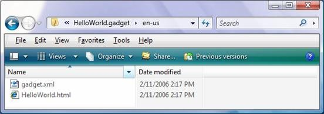

# Gadgets for Windows Sidebar Accessibility and Localization

\[ The Windows Gadget Platform/Sidebar is available for use in the following versions of Windows: Windows 7, Windows Vista, and Windows Server 2008. It may be altered or unavailable in subsequent versions. \]

This overview provides information on how to provide a more accessible and localizable gadget.

-   [Accessibility](#gadgets-for-windows-sidebar-accessibility-and-localization)
-   [Globalization and Localization](#globalization-and-localization)
-   [For Further Reference](#for-further-reference)

## Accessibility

The ability of a user to utilize a resource regardless of disability or impairment is commonly referred to as accessibility. When designing your gadget, alternative methods—software or hardware—may be required to use your gadget and should be considered in its design.

In addition to standard mouse interaction, the Windows Sidebar is keyboard-accessible through the use of the following keyboard shortcuts:

-   Windows logo key+SPACEBAR brings the Sidebar to the foreground and sets focus to the Add Gadgets icon.
-   Windows logo key+G brings the Sidebar to the foreground and sets focus to an installed gadget. Repeating this key combination causes focus to cycle sequentially through each installed gadget.
    > [!Note]  
    > This key combination does not expose the gadget settings.

     

-   F1 launches the Sidebar help topic.

After a gadget has focus, gadget settings, properties, and controls can be accessed by using the following keyboard input:

-   SHIFT+F10 opens the context menu which provides access to the gadget settings and other functionality.
-   Pressing TAB enters the gadget control hierarchy and sets focus to the first input or hyperlink control in the tab order. Pressing TAB again navigates between controls based on standard HTML tab order or as defined by the gadget developer.
-   Arrow keys move a gadget around the desktop if Move has been selected from the gadget context menu. Otherwise, the arrow keys may navigate to adjacent UI.

Because a gadget UI is built using standard HTML, a gadget developer can make their gadget more accessible by following some basic guidelines:

-   Use an onclick event on an anchor or button to perform actions.
    > [!Note]  
    > Keyboard input does not raise the onclick event for other objects. If an onclick event is required for an object besides an anchor or button, always wrap that object with an anchor tag that triggers the same event handler:

     

    ```
    <a href="javascript:void(0)" onclick="..."></a>
    ```

    

-   Never use hover effects to perform or trigger an action unless the functionality is also available when clicking a link or button.
-   Use scalable fonts and containers.
-   Never use color exclusively to convey information.
-   Use sufficient color contrast.
-   Use real text and available fonts instead of images of text.
-   Use unambiguous UI text.
-   Use HTML controls when possible; custom controls typically require more work to make them accessible.

## Globalization and Localization

Globalization refers to the process of designing and developing an application to function across cultures. Localization refers to the process of customizing or translating application resources for a specific culture.

A gadget can be displayed in any language specified by the user in Control Panel if a corresponding set of resource files have been provided by the gadget developer. The gadget platform will select the best set of files to display from the list of locales maintained by Windows.

If a gadget is to be deployed across all locales without the benefit of localization, all files must be saved in Unicode format:

1.  Open each HTML and JavaScript gadget file in Notepad and save it with UTF-8 encoding.
2.  Add the following to the `head` of each HTML file:
    ```hlsl
    <meta http-equiv="Content-Type" content="text/html; charset=UTF-8" />
    ```

    

To localize a gadget, the following steps must be taken:

> [!Note]  
> The use of [Multilingual User Interface (MUI)](http://go.microsoft.com/fwlink/p/?linkid=152908) folders to differentiate locales is only recommended if localized versions of a gadget are being provided.

 

1.  Identify each Windows locale the gadget is to support. For example, en-us.
2.  Create a MUI subfolder for each Windows locale identifier. The subfolder name must match the identifier exactly.
3.  Localize the appropriate gadget resource files.
4.  Place the localized gadget files inside the specific MUI subfolder.

    

To support right-to-left text scenarios, it is recommended that the Cascading Style Sheets (CSS) style.left and style.right properties not be used. The style.marginLeft and style.marginRight properties should be used instead.

> [!Note]  
> Some files do not have to be localized. For example, a gadget may use universal images to convey information to a user. In these situations, files can be placed in the main gadget folder. The gadget platform can find the correct file if it exists in the locale subfolder or in the root folder.

 

## For Further Reference

[Microsoft Accessibility](http://msdn.microsoft.com/library/bb545462.aspx)

[Globalization](http://go.microsoft.com/fwlink/p/?linkid=142591)

[Localization](http://go.microsoft.com/fwlink/p/?linkid=142590)

[Web Development](http://msdn.microsoft.com/beginner/bb308786.aspx)

 

 


