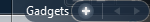
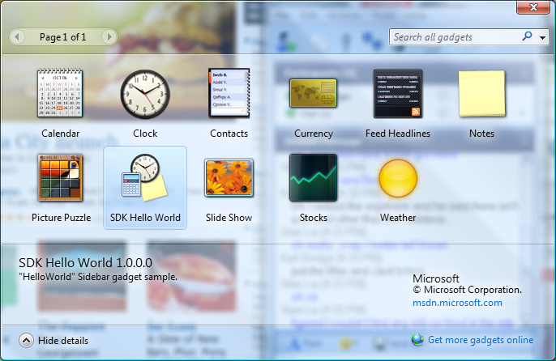
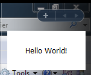

# Developing a Gadget for Windows Sidebar Part 1: The Basics

\[ The Windows Gadget Platform/Sidebar is available for use in the following versions of Windows: Windows 7, Windows Vista, and Windows Server 2008. It may be altered or unavailable in subsequent versions. \]

The first of three overviews that describe how to create a basic gadget for the Windows Sidebar. In this overview, we demonstrate a simple "Hello World" gadget and the steps required to install and display it in the Sidebar.

-   [Introduction](#introduction)
-   [The Files](#the-files)
-   [The Steps](#the-steps)
-   [The Example](#the-example)
-   [For Further Reference](#for-further-reference)

## Introduction

Gadgets are lightweight HTML and script-based applications that provide the abillity to derive and present information or functionality from a variety of sources, such as local applications and controls, or websites and services. Developers with experience authoring webpages will find the process of creating a gadget very familiar.

## The Files

A basic gadget consists of two files:

1.  Gadget.xml - The [manifest](-sidebar-gadget-manifest.md), an XML file that contains general configuration and presentation information for the gadget.
2.  *name*.html - An HTML file, where *name* is specified in the &lt;name&gt; tag of the associated gadget manifest, that provides the shell for the gadget UI and contains the core functionality for the gadget.

> \[!Important\]
>
> It is highly recommended that all gadget HTML and script files be saved with UTF-8 character encoding.
>
> The following steps can be taken to ensure the encoding of these files:
>
> 1.  Open the file in Notepad.
> 2.  On the **File** menu, click **Save as...**
> 3.  In the **Save as** dialog box, confirm that the value in the **Encoding** drop-down is **UTF-8**.
>
> If the value in the **Encoding** drop-down is not UTF-8:
>
> 1.  In the **Encoding** drop-down, select **UTF-8**.
> 2.  Click **Save** to overwrite the existing file.
>
> Repeat this process for all gadget HTML and script files.

 

A more robust gadget implementation may require other files not detailed here. For the purposes of this overview, however, the discussion is limited to these two core files.

## The Steps

In general, the steps for creating a gadget are:

1.  Create a development folder to contain the gadget files.

    It is generally good practice to give the development folder the same name as the gadget it hosts, with the added extension of .gadget. For example, if your gadget's name is "Test" then the development folder should be named "Test.gadget". This reduces naming confusion later when it comes time to install the gadget. However, the development folder can have any name you wish.

    Similarly, the development folder can be located anywhere. However, during development and testing it is typically more efficient to place the folder in one of the system folders associated with the Sidebar:

    -   %USERPROFILE%\\AppData\\Local\\Microsoft\\Windows Sidebar\\Gadgets (for user gadgets)
    -   %SYSTEM\_ROOT%\\Program Files\\Windows Sidebar\\Gadgets (for global gadgets)

    The following image shows a gadget development folder in the %USER\_DATA%\\Local\\Microsoft\\Windows Sidebar\\Gadgets folder.

    

    These practices ensure the gadget appears in the gadget picker with minimal subsequent file handling.

2.  Create the manifest file and save it to the development folder. For more information on the gadget manifest, see [Gadgets for Windows Sidebar Manifest](-sidebar-gadget-manifest.md).
    ```
    <?xml version="1.0" encoding="utf-8" ?>
    <gadget>
      <name>SDK Shell</name>
      <version>1.0.0.0</version>
      <hosts>
        <host name="sidebar">
          <base type="HTML" apiVersion="1.0.0" src="Shell.html" />
          <permissions>Full</permissions>
          <platform minPlatformVersion="1.0" />
        </host>
      </hosts>
    </gadget>
    ```

    

3.  Create the core .html file and save it to the development folder.
    ```
    <html>
        <head>
            <meta http-equiv="Content-Type" content="text/html; charset=Unicode" />
        </head>
        
        <body>
            <div id="gadgetContent">
            </div>
        </body>
    </html>
    ```

    

4.  Install the gadget, if necessary.

    Depending on where you created your development folder, you may need to copy the folder or its content to one of the two previously identified Sidebar system folders. Alternatively, you may want to package the gadget for general distribution and test the gadget installation process. For more information on installing and updating a gadget, see [Gadgets for Windows Sidebar Updating and Refreshing](-sidebar-overview-updating.md).

5.  Test the gadget and make revisions as necessary.

## The Example

The following is a step-by-step example for creating a simple "Hello World" gadget.

1.  To open the Sidebar, click the **Start** button, point to **All Programs**, then to **Accessories**, and then click **Windows Sidebar**. You can also click the **Start** button, click **Run...**, and then type "sidebar" in the **Open** text field and press ENTER.
2.  Locate and open your gadgets folder. Click the **Start** button, and then click **Run...**. In the **Open** text box, type:

    %USERPROFILE%\\AppData\\Local\\Microsoft\\Windows Sidebar\\Gadgets

3.  In your Gadgets folder, create a new folder named **HelloWorld.gadget**.
4.  Copy and paste the following code into Notepad or a similar editor that allows you to create an HTML file. Name the file **HelloWorld.html**, and save it in your HelloWorld.gadget folder.
    > \[!Important\]  
    > If font information is specified for the gadget UI in HTML or Cascading Style Sheets (CSS), the font size must be included and it must be an absolute measure in pixels.

     

    ```
    <html xmlns="http://www.w3.org/1999/xhtml">
        <head>
            <meta http-equiv="Content-Type" content="text/html; charset=Unicode" />
            <title>Hello World</title>
            <style type="text/css">
            body
            {
                margin: 0;
                width: 130px;
                height: 75px;
                font-family: verdana;
                font-weight: bold;
                font-size: 20px;
            }
            #gadgetContent
            {
                margin-top: 20px;
                width: 130px;
                vertical-align: middle;
                text-align: center;
                overflow: hidden;
            }
            </style>
            <script type="text/jscript" language="jscript">
                // Initialize the gadget.
                function init()
                {
                    var oBackground = document.getElementById("imgBackground");
                    oBackground.src = "url(images/background.png)";
                }
            </script>
        </head>
        
        <body onload="init()">
            <g:background id="imgBackground">
                <span id="gadgetContent">Hello World!</span>
            </g:background>
        </body>
    </html>
    ```

    

5.  Create a new folder called **images** under the **HelloWorld.gadget** folder.
6.  Create a new background image at least 130 pixels wide and 75 pixels high and save it to the **images** folder.
7.  Create the gadget manifest by copying and pasting the following code into a new file. Save this file with the file name **gadget.xml** and UTF-8 encoding.
    ```
    <?xml version="1.0" encoding="utf-8" ?>
    <gadget>
      <name>SDK Hello World</name>
      <version>1.0.0.0</version>
      <author name="Microsoft">
        <info url="msdn.microsoft.com" />
      </author>
      <copyright>&amp;#169; Microsoft Corporation.</copyright>
      <description>"HelloWorld" Sidebar gadget sample.</description>
      <hosts>
        <host name="sidebar">
          <base type="HTML" apiVersion="1.0.0" src="HelloWorld.html" />
          <permissions>Full</permissions>
          <platform minPlatformVersion="1.0" />
        </host>
      </hosts>
    </gadget>
    ```

    

8.  Click the "+" symbol at the top of the Sidebar to display the Gadget Gallery.

    

9.  In the Gadget Gallery, the "SDK Hello World" gadget should be visible.

    

10. To install the gadget in the Sidebar, double-click the icon for the "SDK Hello World" gadget or drag and drop it to the Sidebar.

    > [!Note]
    >
    > Unlike a standard Windows icon, a gadget icon is nothing more than a Web-based image file (.gif, .jpg, or .png). The image can be created using Microsoft Paint or similar image editing tool. If a custom icon isn't specified in the manifiest, Sidebar provides a generic icon for the gadget.
    >
    > When creating custom icons, it is recommended that they be 64 pixels wide by 64 pixels high. The gadget picker reserves a space of that size and resizes the icon accordingly.

     

    

## For Further Reference

[Developing a Gadget for Windows Sidebar Part 2: The G:BACKGROUND, G:IMAGE, G:TEXT Presentation Elements and GIMAGE Protocol](-sidebar-overview-gdo2.md)

[Developing a Gadget for Windows Sidebar Part 3: Settings and Flyouts](-sidebar-overview-gdo3.md)

For Windows Vista User Experience Guidelines, see [Windows Vista User Experience Guidelines for the Sidebar](http://msdn.microsoft.com/library/aa974179.aspx)

To read posts from the Sidebar team, including gadget authoring tips, links to gadget information, and news about the platform, see the [Gadget Corner blog](http://blogs.msdn.com/sidebar/default.aspx).

To participate in developer community discussions on writing gadgets for the Sidebar, see the [Sidebar Gadget Development forum](http://go.microsoft.com/fwlink/p/?linkid=142587).

 

 


