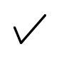
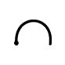
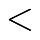
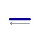
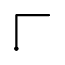
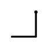
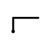

# Application Gestures and Semantic Behavior

The application gestures are delivered as part of the Windows Vista SDK. The Microsoft gesture recognizer is built to recognize these gestures. By default, no gestures are enabled. Applications must choose the gestures to enable. In addition to recognizing gestures, the Microsoft gesture recognizer also provides alternates along with confidence values as part of the recognition results. To use these gestures in your application, you must subscribe to them from within the application by using the [Tablet PC API Reference](tablet-pc-api-reference.md). The APIs enable you to choose a subset of these gestures and query for specific properties such as number of strokes, hot point, and other properties, as well as alternates and their confidence values.

For pen-aware applications that use these gestures, mouse messages are not sent. Instead, gesture events are sent to these applications informing them of these gestures. The applications then take actions that are similar to mouse-based actions in response to these gestures.

The following table lists application gestures supported by the Microsoft gesture recognizer. To ensure consistency of gestures used for common actions between applications, you should adhere to the following suggestions:

-   The Action is the suggested semantic behavior associated with the gesture.
-   For the gestures labeled as Fixed in the following table, Microsoft recommends that you not change the suggested semantic behavior. If an application does not have a need for the specified semantic behavior, Microsoft recommends that you not reuse the gesture for another action or semantic behavior.
-   For the gestures labeled as Application-specific and that have a suggested semantic behavior, Microsoft recommends you support the suggested semantic behavior if that functionality exists in your application. To maintain consistency across applications, do not choose a different semantic behavior for such a gesture if the functionality corresponding to the suggested semantic exists in your application. However, if your application does not have functionality that corresponds to the suggested semantic, you should feel free to associate relevant semantic behaviors to the gesture. This also applies to all gestures that are Application-specific and do not have a suggested semantic.
-   The hot point of a gesture is a distinguishing point in the geometry of the gesture. The hot point can be used to determine where the gesture was performed. The gestures APIs, specifically the [HotPoint](/previous-versions/ms582125(v=vs.100)) property of the [Gesture](/previous-versions/ms583661(v=vs.100)) object, make it possible to determine the hot point for a given gesture. However, not all gestures have a specific distinguishing hot point. For those that do not have a specific distinguishing hot point, the starting point is reported as the hot point.
    > [!Note]  
    > Some of the gestures do have a distinguishing hot point that just happens to be the starting point. These are distinguished in the table.

     

| Gesture                                                                                                                                                                     | Gesture name                | Suggested behavior                           | Fixed or application-specific   | Hot point                                             | Notes                                                                                                                                                                                                                                                            |
|-----------------------------------------------------------------------------------------------------------------------------------------------------------------------------|-----------------------------|----------------------------------------------|---------------------------------|-------------------------------------------------------|------------------------------------------------------------------------------------------------------------------------------------------------------------------------------------------------------------------------------------------------------------------|
|                                                                                         | Scratch-out       | Erase content                      | Fixed                 | Starting point                              | Make the strokes as horizontal as possible, and draw at least three strokes. If the height of the gesture increases, the number of back and forth strokes also needs to increase.                                                                      |
|                                                                                                  | Triangle          | Insert                             | Application-specific  | Starting point                              | Draw the triangle in a single stroke, without lifting the pen. Make sure that the top of the triangle points upward.                                                                                                                                   |
|                                                                                         | Square            | Action item                        | Application-specific  | Starting point                              | Draw the square starting at the upper left corner. Draw the square with a single stroke, without lifting the pen.                                                                                                                                      |
|                                                                                           | Star              | Action item                        | Application-specific  | Starting point                              | Draw the star with exactly five points. Do this in a single stroke without lifting the pen.                                                                                                                                                            |
|                                                                                          | Check             | Check-off                          | Application-specific  | Corner                                      | The upward stroke of the check must be two to four times as long as the smaller downward stroke.                                                                                                                                                       |
|                                                                                       | Curlicue          | Cut                                | Fixed                 | Starting point is distinguishing hot point  | Draw the curlicue at an angle, from lower left to upper right. Start the curlicue on the word that you intend to cut.                                                                                                                                  |
|                                                                                | Double-Curlicue   | Copy                               | Fixed                 | Starting point is distinguishing hot point  | Draw the double-curlicue at an angle, from the lower left to the upper right. Start the double-curlicue on the word that you intend to copy.                                                                                                           |
|                                                                                         | Circle            | Application-specific               | Application-specific  | Starting point                              | Draw the circle in a single stroke, without lifting the pen. Start drawing the circle from the topmost point.                                                                                                                                          |
|                                                                                  | Double-circle     | Paste                              | Fixed                 | Starting point                              | Draw the two circles overlapping each other. Do this with a single stroke, without lifting the pen.                                                                                                                                                    |
|                                                                 | Left-semicircle   | Undo                               | Fixed                 | Starting point is distinguishing hot point  | Make sure to draw the semicircle from the right to the left. The two ends of the arc should be on the same horizontal line.                                                                                                                            |
|                                                                 | Right-semicircle  | Redo                               | Fixed                 | Starting point is distinguishing hot point  | Make sure to draw the semicircle from the left to the right. The two ends of the arc should be on the same horizontal line.                                                                                                                            |
|                                                                                          | Caret             | Paste, insert                      | Application-specific  | Apex                                        | Draw both sides of the caret with equal length. Make sure the angle is sharp and that the point is not rounded to a curve.                                                                                                                             |
|                                                                                | Inverted-caret    | Insert                             | Application-specific  | Apex                                        | Draw both sides of the caret with equal length. Make sure the angle is sharp and that the point is not rounded to a curve.                                                                                                                             |
|                                                                          | Chevron-left      | Application-specific               | Application-specific  | Apex                                        | Draw both sides of the chevron with equal length. Make sure the angle is sharp and that the point is not rounded to a curve.                                                                                                                           |
|                                                                         | Chevron-right     | Application-specific               | Application-specific  | Apex                                        | Draw both sides of the chevron with equal length. Make sure the angle is sharp and that the point is not rounded to a curve.                                                                                                                           |
|                                                                                                   | Arrow-up          | Application-specific               | Application-specific  | Arrow head                                  | Do not draw the arrow in more than two strokes. Draw the arrow either in a single stroke or in two strokes, where one stroke is the line and the other is the arrow head. Single stroke arrows written with the head as a triangle are not supported.  |
|                                                                                                 | Arrow-down        | Application-specific               | Application-specific  | Arrow head                                  | Do not draw the arrow in more than two strokes. Draw the arrow either in a single stroke or in two strokes, where one stroke is the line and the other is the arrow head. Single stroke arrows written with the head as a triangle are not supported.  |
|                                                                                                      | Arrow-left        | Application-specific               | Application-specific  | Arrow head                                  | Do not draw the arrow in more than two strokes. Draw the arrow either in a single stroke or in two strokes, where one stroke is the line and the other is the arrow head. Single stroke arrows written with the head as a triangle are not supported.  |
|                                                                                                     | Arrow-right       | Application-specific               | Application-specific  | Arrow head                                  | Do not draw the arrow in more than two strokes. Draw the arrow either in a single stroke or in two strokes, where one stroke is the line and the other is the arrow head. Single stroke arrows written with the head as a triangle are not supported.  |
|                                                                                                 | Up                | Application-specific               | Application-specific  | Starting point                              | This gesture is a single, fast flick upward.  This gesture is used by [Flicks Gestures](flicks-gestures.md).                                                                                                                                |
|                                                                                                      | Down              | Application-specific               | Application-specific  | Starting point                              | This gesture is a single, fast flick downward.  This gesture is used by [Flicks Gestures](flicks-gestures.md).                                                                                                                              |
|                                                                                                   | Left              | Backspace                          | Fixed                 | Starting point                              | This gesture is a single, fast flick to the left.  This gesture is used by [Flicks Gestures](flicks-gestures.md).                                                                                                                           |
|                                                                                                  | Right             | Space                              | Fixed                 | Starting point                              | This gesture is a single, fast flick to the right.  This gesture is used by [Flicks Gestures](flicks-gestures.md).                                                                                                                          |
|                                                                                        | Up-left           | Application-specific               | Application-specific  | Point of direction change                   | Draw this gesture in a single stroke starting with the up stroke. Make sure that the two sides are equal in length and at a right angle.                                                                                                               |
|                                                                                     | Up-right          | Application-specific               | Application-specific  | Point of direction change                   | Draw this gesture in a single stroke starting with the up stroke. Make sure that the two sides are equal in length and at a right angle.                                                                                                               |
|                                                                                    | Down-left         | Application-specific               | Application-specific  | Point of direction change                   | Draw this gesture in a single stroke starting with the down stroke. Make sure that the two sides are equal in length and at a right angle.                                                                                                             |
|                                                                                   | Down-right        | Application-specific               | Application-specific  | Point of direction change                   | Draw this gesture in a single stroke starting with the down stroke. Make sure that the two sides are equal in length and at a right angle.                                                                                                             |
|                                                                                            | Left-up           | Application-specific               | Application-specific  | Point of direction change                   | Draw this gesture in a single stroke starting with the left stroke. Make sure that the two sides are equal in length and at a right angle.                                                                                                             |
|                                                                                          | Left-down         | Application-specific               | Application-specific  | Point of direction change                   | Draw this gesture in a single stroke starting with the left stroke. Make sure that the two sides are equal in length and at a right angle.                                                                                                             |
|                                                                                           | Right-up          | Input Method Editor (IME) convert  | Fixed                 | Point of direction change                   | Draw this gesture in a single stroke starting with the right stroke. Make sure that the two sides are equal in length and at a right angle.                                                                                                            |
|                                                                                         | Right-down        | Application-specific               | Application-specific  | Point of direction change                   | Draw this gesture in a single stroke starting with the right stroke. Make sure that the two sides are equal in length and at a right angle.                                                                                                            |
|                                                                                            | Up-down           | Undo                               | Fixed                 | Point of direction change                   | Draw this gesture in a single stroke starting with the up stroke. Draw the two strokes as close as possible.                                                                                                                                           |
|                                                                                            | Down-up           | Application-specific               | Application-specific  | Point of direction change                   | Draw this gesture in a single stroke starting with the down stroke. Draw the two strokes as close as possible.                                                                                                                                         |
|                                                                                         | Left-right        | Move cursor left                   | Fixed                 | Point of direction change                   | Draw this gesture in a single stroke starting with the left stroke. Draw the two strokes as close as possible.                                                                                                                                         |
|                                                                                         | Right-Left        | Move cursor right                  | Fixed                 | Point of direction change                   | Draw this gesture in a single stroke starting with the right stroke. Draw the two strokes as close as possible.                                                                                                                                        |
|                                   | Up-left-long      | Decrease indent                    | Fixed                 | Point of direction change                   | Draw this gesture in a single stroke starting with the up stroke. The left stroke is two to four times as long as the up stroke and the two strokes are at a right angle.                                                                              |
|                                 | Up-right-long     | Tab                                | Fixed                 | Point of direction change                   | Draw this gesture in a single stroke starting with the up stroke. The right stroke is two to four times as long as the up stroke and the two strokes are at a right angle.                                                                             |
|     | Down-left-long    | Enter                              | Fixed                 | Point of direction change                   | Draw this gesture in a single stroke starting with the down stroke. The left stroke is two to four times as long as the down stroke and the two strokes are at a right angle.                                                                          |
|  | Down-right-long   | Space                              | Fixed                 | Point of direction change                   | Draw this gesture in a single stroke starting with the down stroke. The right stroke is two to four times as long as the down stroke and the two strokes are at a right angle.                                                                         |
|                                                                             | Exclamation       | Application-specific               | Application-specific  | Center of the line                          | Draw the dot soon after drawing the line and place it close to the line.                                                                                                                                                                               |
|                                                                                                              | Tap               | Click                              | Fixed                 | Starting point is distinguishing hot point  | Tap swiftly.                                                                                                                                                                                                                                           |
|                                                                                                      | Double-tap        | Left-Double-click                  | Fixed                 | Starting point is distinguishing hot point  | Tap swiftly and with the taps as close to each other as possible.                                                                                                                                                                                      |

 

> [!Note]  
> Tap and double-tap are supported as application gestures in addition to being system gestures. This is to address scenarios where you may want to enable an application gesture that has a tap or double-tap as part of it. An example of such a gesture is the Exclamation gesture. In such a case, enable the tap application gesture and do not listen to the tap system gesture. This allows you to listen to a single component that can both identify and distinguish a tap from a tap within a gesture. The case of a tap within a gesture results in just the overall gesture being recognized.

 

## Related topics

<dl> <dt>

[**Gesture Event \[InkCollector Class\]**](inkcollector-gesture.md)
</dt> <dt>

[**Gesture Event \[InkEdit Control\]**](inkedit-gesture.md)
</dt> <dt>

[**Gesture Event \[InkOverlay Class\]**](inkoverlay-gesture.md)
</dt> <dt>

[**Gesture Event \[InkPicture Control\]**](inkpicture-gesture.md)
</dt> </dl>

 

