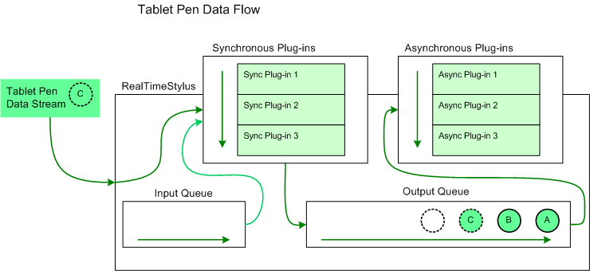

# Architecture of the StylusInput APIs

The StylusInput APIs allow you to interact with the tablet pen data stream. To interact with the data stream add a [**RealTimeStylus**](realtimestylus-class.md) object to your application, and add plug-ins to the **RealTimeStylus** object.

Two plug-ins are provided in the StylusInput APIs. The [**DynamicRenderer**](/previous-versions/windows/desktop/legacy/ms701168(v=vs.85)) object implements the [**IStylusSyncPlugin**](/windows/win32/api/rtscom/nn-rtscom-istylussyncplugin) interface. The **DynamicRenderer** object renders the ink in real time, as it is being drawn. The [**GestureRecognizer**](gesturerecognizer-class.md) object implements the **IStylusSyncPlugin** and [**IStylusAsyncPlugin**](/windows/win32/api/rtscom/nn-rtscom-istylusasyncplugin) interfaces. The **GestureRecognizer** object recognizes application gestures.

## Definitions

The following terms are used in the sections describing the StylusInput APIs:

Synchronous plug-in

A class that implements the [**IStylusSyncPlugin**](/windows/win32/api/rtscom/nn-rtscom-istylussyncplugin) interface. Synchronous plug-ins are generally called directly by the [**RealTimeStylus**](realtimestylus-class.md) object.

Asynchronous plug-in

A class that implements the [**IStylusAsyncPlugin**](/windows/win32/api/rtscom/nn-rtscom-istylusasyncplugin) interface. Asynchronous plug-ins are generally called on the application's user interface (UI) thread.

Synchronous plug-in collection

A [StylusSyncPluginCollection](/previous-versions/ms824788(v=msdn.10)) collection, which is an ordered collection of [IStylusSyncPlugin](/previous-versions/ms824751(v=msdn.10)) objects. A synchronous plug-in collection usually refers to the collection assigned to the [SyncPluginCollection](/previous-versions/ms824833(v=msdn.10)) property of a [RealTimeStylus](/previous-versions/ms824830(v=msdn.10)) object. Only synchronous plug-ins may be added to a synchronous plug-in collection.

Asynchronous plug-in collection

A [StylusAsyncPluginCollection](/previous-versions/ms824808(v=msdn.10)) collection, which is an ordered collection of [IStylusAsyncPlugin](/previous-versions/ms824768(v=msdn.10)) objects. An asynchronous plug-in collection usually refers to the collection assigned to the [AsyncPluginCollection](/previous-versions/ms824831(v=msdn.10)) property of a [RealTimeStylus](/previous-versions/ms824830(v=msdn.10)) object. Only asynchronous plug-ins may be added to an asynchronous plug-in collection.

## Synchronous and Asynchronous Plug-ins

The [**RealTimeStylus**](realtimestylus-class.md) object is designed to provide real-time access to the data stream from a tablet pen. Create or use synchronous plug-ins for tasks that require real-time access to the data stream and are computationally undemanding, such as for packet filtering. Create or use asynchronous plug-ins for tasks that do not require real-time access to the data stream, such as for creating and storing strokes in an [**InkDisp**](inkdisp-class.md) object.

Certain tasks may be computationally demanding yet require real-time access to the data stream, such as multistroke gesture recognition. To address these needs, the StylusInput APIs provide a cascaded [**RealTimeStylus**](realtimestylus-class.md) model that allows you to use two **RealTimeStylus** objects, each running on its own thread. For more information about the cascaded **RealTimeStylus** model, see [The Cascaded RealTimeStylus Model](the-cascaded-realtimestylus-model.md).

For more information about using and creating plug-ins, see [Working with the StylusInput APIs](working-with-the-stylusinput-apis.md).

## The Tablet Pen Data Stream

The [**RealTimeStylus**](realtimestylus-class.md) object has two internal queues that carry the tablet pen data, the input queue and the output queue. The pen data is converted into instances of the classes in the [Microsoft.StylusInput.PluginData](/previous-versions/ms823992(v=msdn.10)) namespace. The following list describes how the **RealTimeStylus** object handles the tablet pen data:

The [**RealTimeStylus**](realtimestylus-class.md) object checks for plug-in data objects first on its input queue and then from the tablet pen data stream.

The [**RealTimeStylus**](realtimestylus-class.md) object sends one plug-in data object to the objects in its synchronous plug-in collection. Each synchronous plug-in can add data to either the input or output queue.

After the plug-in data object has been sent to all members of the synchronous plug-in collection, the plug-in data object is placed on the [**RealTimeStylus**](realtimestylus-class.md) object's output queue.

The [**RealTimeStylus**](realtimestylus-class.md) object then checks for the next plug-in data object to process.

While the [**RealTimeStylus**](realtimestylus-class.md) object's output queue contains data, the **RealTimeStylus** object sends one plug-in data object from its output queue to the objects in its asynchronous plug-in collection. Each asynchronous plug-in can add data to either the input or output queue. However, because the asynchronous plug-ins run on the UI thread, the data is added to the queue in relation to the current pen data the **RealTimeStylus** object is processing, and not in relation to the data that the asynchronous plug-in is processing.

The following diagram illustrates the flow of tablet pen data through the [**RealTimeStylus**](realtimestylus-class.md) object and its plug-in collections.

In this diagram, the circles labeled "A" and "B" represent tablet pen data that has already been added to the [**RealTimeStylus**](realtimestylus-class.md) object's output queue and that has not yet been sent to the asynchronous plug-in collection. The circle labeled "C" represents the tablet pen data that the **RealTimeStylus** object is currently processing. It is sent to the synchronous plug-in collection and placed on the output queue. The empty circle represents the position in the output queue where future tablet pen data is added.

For more information about how specific data is added to the queue and processed, see [Plug-in Data and the RealTimeStylus Class](plug-in-data-and-the-realtimestylus-class.md).

## The StylusInput APIs

The StylusInput APIs reside primarily in the [Microsoft.StylusInput](/previous-versions/ms824750(v=msdn.10)) and [Microsoft.StylusInput.PluginData](/previous-versions/ms823992(v=msdn.10)) namespaces. However, the StylusInput APIs also reference some classes in the [Microsoft.Ink](/previous-versions/ms826516(v=msdn.10)) namespace, such as the [Tablet](/previous-versions/ms827783(v=msdn.10)) class, the [TabletPropertyDescriptionCollection](/previous-versions/ms827760(v=msdn.10)) collection, and the [ApplicationGesture](/previous-versions/ms827547(v=msdn.10)) and [SystemGesture](/previous-versions/ms827134(v=msdn.10)) enumerations.

## Related topics

<dl> <dt>

[**DynamicRenderer**](/previous-versions/windows/desktop/legacy/ms701168(v=vs.85))
</dt> <dt>

[**GestureRecognizer**](gesturerecognizer-class.md)
</dt> <dt>

[**RealTimeStylus**](realtimestylus-class.md)
</dt> <dt>

[**IStylusAsyncPlugin**](/windows/win32/api/rtscom/nn-rtscom-istylusasyncplugin)
</dt> <dt>

[**IStylusSyncPlugin**](/windows/win32/api/rtscom/nn-rtscom-istylussyncplugin)
</dt> <dt>

[Working with the StylusInput APIs](working-with-the-stylusinput-apis.md)
</dt> <dt>

[The Cascaded RealTimeStylus Model](the-cascaded-realtimestylus-model.md)
</dt> </dl>

 

 
