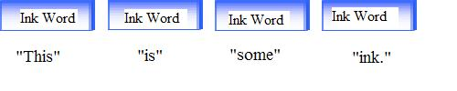
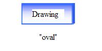
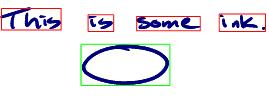

# Basic Recognition and Ink Analysis

This topic introduces the Ink Analysis APIs.

## Simple Recognition

The basic functionality exposed by the ink analysis API is access to the recognition results for a given piece of ink. This is straightforward and simple to do, as shown in the following example code.


```C++
// Instantiate a new InkAnalyzer object, passing in an Ink object and
// the synchronizing object.
InkAnalyzer ia = new InkAnalyzer(myInkOverlay.Ink, this);

// Associate the Strokes to be recognized with the InkAnalyzer.
ia.AddStrokes(myInkOverlay.Ink.Strokes);

// Synchronously recognize the Strokes.
ia.Analyze();

// Access the results and display.
string myResults = ia.GetRecognizedString();
MessageBox.Show(myResults);
```


The results of the recognition operation are simply a string value representing the recognized value of the handwritten ink. The ink analysis API exposes much more recognition functionality than just the recognized string, but that is the most common operation.

## Incremental Recognition

The recognition process takes time to complete, blocking access to the application by blocking the application's UI thread. It can therefore be costly and frustrating to the end-user to wait synchronously for results. Many Tablet PC applications require the recognition of more than a few lines of ink, and an incremental approach to recognizing strokes on a background thread is the optimal strategy. The advantage of an incremental approach instead of a bulk operation is that it allows the recognition of the strokes to happen over a period of time, spreading out the work on the background thread instead of synchronously on the foreground thread. To support incremental analysis, the [**InkAnalyzer**](inkanalyzer.md) object has a [**BackgroundAnalyze**](iinkanalyzer-backgroundanalyze.md) method, which handles the creation and management of a background thread for the application. The **InkAnalyzer** also automatically takes care of managing what needs to be recognized and what has already been recognized.

Thus, there are two mechanisms for attaining recognition results:

-   The [**Analyze**](iinkanalyzer-analyze.md) method (synchronous analysis), which works best for:

    -   Small amounts of ink.
    -   When results are required before proceeding to the next operation in the application, such as when displaying a correction user interface.

-   The [**BackgroundAnalyze**](iinkanalyzer-backgroundanalyze.md) method (asynchronous analysis), which works best for:

    -   Any amount of ink.
    -   When utilized with a timer pulsing approximately every 600 milliseconds.

> [!Note]  
> 600 milliseconds is the current recommendation, but this timing is subject to change pending further testing.

 

To use the [**BackgroundAnalyze**](iinkanalyzer-backgroundanalyze.md) operation, the [**InkCollector**](inkcollector-class.md) object (or similar objects or controls such as the [**RealTimeStylus**](realtimestylus-class.md) (RTS), [**InkOverlay**](inkoverlay-class.md), or [InkCanvas](/dotnet/api/system.windows.controls.inkcanvas?view=netcore-3.1) in Windows Presentation Foundation) manages the collection and rendering of the ink strokes. If the **InkCollector** is paired with the ink analysis APIs, applications can keep the recognition results updated by informing the [**InkAnalyzer**](inkanalyzer.md) about each new stroke added to the application. This allows for the **InkAnalyzer** to recognize the strokes incrementally and on a background thread.

To accomplish incremental background analysis, applications need to implement three steps (shown for managed code):

1. Add the stroke to the [**InkAnalyzer**](inkanalyzer.md) whenever the [**InkOverlay**](inkoverlay-class.md) object's [**Stroke**](inkoverlay-stroke.md) event is raised:


```C++
/// Event Handler from InkOverlay's Stroke event
/// This event is fired when a new stroke is drawn. 
/// In this case, it is necessary to update the ink analyzer's 
/// Strokes collection. The event is fired even when the eraser 
/// stroke is created.
/// The event handler must filter out the eraser strokes.
/// <param name="sender">The control that raised the event.</param>
/// <param name="e">The event arguments.</param>
private void myInkOverlay_Stroke(object sender, InkCollectorStrokeEventArgs e)
{
        // Add the new stroke to the InkAnalyzer's stroke collection
        theInkAnalyzer.AddStroke(e.Stroke);
        this.Refresh();
}
```


2. Invoke the [**BackgroundAnalyze**](iinkanalyzer-backgroundanalyze.md) operations at a set interval.


```C++
//Setup a timer tick handler
private System.Windows.Forms.Timer analysisTimer;
analysisTimer = new Timer();
analysisTimer.Tick += new System.EventHandler(this.analysisTimer_Tick);

// The timer is enabled and set to tick every 600 milliseconds.
analysisTimer.Enabled = true;
analysisTimer.Interval = 600;
// ...
//The background analysis operation is invoked with every tick
private void analysisTimer_Tick(object sender, System.EventArgs e)
{
    theInkAnalyzer.BackgroundAnalyze();
}
```


> [!Note]  
> Note Applications should not simply invoke the background analysis operation after every new stroke. This will fail (returning a value of **false**) if a background operation is already running. The reason for this behavior is to limit the number of background threads and reconciliation operations required.

 

3. Listen for the [ResultsUpdated](/previous-versions/ms567607(v=vs.100)) event (managed code) or [**Results**](-ianalysisevents-results.md) event (C++ code) to determine when the background process has finished:


```C++
// ...
theInkAnalyzer.Results += new ResultsEventHandler(ia_Results);
// ...

private void ia_Results(object sender, ResultsEventArgs e)
{
    String myResults = e.InkAnalyzer.GetRecognizedString();
    MessageBox.Show(myResults);
}
```


Now that the processing of the ink is being done on a background thread, the application has the ability to accept changes to the ink while the background operation is working. If we use a synchronous thread this is not possible. The work executes on the UI thread, blocking the ability to make changes. Changes include adding more ink to the document, deleting ink, or transforming the location or appearance of the existing ink. Changes that occur during the background operation may in fact invalidate the results. For example, deleting a stroke from a word changes the recognition value of that word. The [**InkAnalyzer**](inkanalyzer.md) API has a built-in reconciliation process that automatically determines what parts of the background operation become invalid as the result of the ink changing while analyzing.

The automatic reconciliation process is accomplished because of three factors:

1.  The [**DirtyRegion**](iinkanalyzer-getdirtyregion.md) property.

    -   Each time the application adds ([**AddStroke**](iinkanalyzer-addstroke.md) method) or removes ([**RemoveStroke**](iinkanalyzer-removestroke.md) method) a stroke to or from the [**InkAnalyzer**](inkanalyzer.md), the physical location of the stroke is captured and the next time an analysis operation is invoked, the **InkAnalyzer** ensures that stroke, or the area occupied by that stroke, is analyzed.
    -   Whenever the application modifies existing ink, changes the location, or changes other drawing attributes of the ink, the location of the change (the bounds of the ink) can be added to the [**DirtyRegion**](iinkanalyzer-getdirtyregion.md) property of the [**InkAnalyzer**](inkanalyzer.md). This ensures that the next time the application starts the analysis operation those areas are checked for correct results.
    -   Thus, the [**DirtyRegion**](iinkanalyzer-getdirtyregion.md) property keeps track, between analysis runs, of what areas of the document and-in turn-which strokes need to be checked for correct ink analysis and recognition results.

2.  Limited analysis.

    -   Each time the application invokes the analysis operation, the [**DirtyRegion**](iinkanalyzer-getdirtyregion.md) property identifies which strokes need to be analyzed. This allows the analysis operation to limit the operation to only the dirty regions and ignore all other regions, optimizing the amount of time spent re-analyzing ink.
    -   The [**InkAnalyzer**](inkanalyzer.md) does not completely ignore all other regions on the page, but instead may examine neighboring areas to determine if the changes made in the dirty region affect those neighboring regions. For example, the analyzer classifies "Is", in the following ink sample, as a single **InkWord** type of the [**ContextNode**](icontextnode.md) class:


Deleting the "s" results in a dirty region (marked with a red box).


After analysis, the analyzer changes the classification for the "I" to an **InkDrawing** type, even though it is outside of the dirty region, because without the supporting "s" stroke the ink analyzer has a 50/50 chance of the ink being classified as a drawing or a word.

-   Internally cached state.

    -   When an application invokes a background analysis operation the [**InkAnalyzer**](inkanalyzer.md) caches a snapshot of the pruned data. By taking a snapshot the **InkAnalyzer** can either work on analyzing the data independently of the data being used by the application, or use the snapshot as the comparison point to determine what changes were made by the application while background analyzing.
    -   Caching the state and comparing changes is better than keeping a list of all changes that occurred for one primary reason: data proxy. This is an advanced scenario described later in this document, but it involves the application updating the [**InkAnalyzer**](inkanalyzer.md) with only the current ink and non-ink data prior to the invoked analysis operation and prior to processing the results of an analysis operation.

## Simple Ink Analysis

The previous two scenarios (simple recognition and incremental recognition) outline how to access recognition values but do not mention how to access the ink analysis or classification results. The default configuration of the [**InkAnalyzer**](inkanalyzer.md), runs both ink analysis algorithms and recognition algorithms. This configuration yields the most accurate results, because the two technologies work together to increase accuracy. That is, the ink analysis engines help to separate the drawing from the writing and normalize angled writing into a horizontal plane, which is the optimum input plane for the recognition engines.

To access the ink analysis results, your application uses the [**Analyze**](iinkanalyzer-analyze.md) or [**BackgroundAnalyze**](iinkanalyzer-backgroundanalyze.md) methods exactly as described in the previous two recognition scenarios. Nothing changes because the ink analysis and recognition algorithms are already being run when those methods are called. However, accessing the results is more complicated than reading the value of a string. As an example, the following code sample shows the grouping and locations of all the **InkWord** segments and **InkDrawing** segments by rendering a rectangle around the group of strokes that make up the classification.

This example simply uses the form's **Paint** event to render colored rectangles around the words or drawings. The [**FindNodesOfType**](iinkanalyzer-findnodesoftype.md) method returns a collection of objects that exists only if the analysis operation has been executed and the results contain classifications with the specified [**ContextNode**](icontextnode.md) type. If no **ContextNode** of the desired type exists in the document, the steps to draw the rectangles are skipped.

Each object returned from the [**FindNodesOfType**](iinkanalyzer-findnodesoftype.md) method will have properties that relate to that kind of classification. For example the **InkWordNode** references all the strokes that make up a single word in the document and reference the recognized string for that word. The **InkDrawingNode** references all the strokes that make up the single drawing in the document and reference the shape name for that drawing.

The [**FindNodesOfType**](iinkanalyzer-findnodesoftype.md) method is very similar to the [**DivisionResult::ResultByType**](/windows/desktop/api/msinkaut15/nf-msinkaut15-iinkdivisionresult-resultbytype) method that returned collections of [**DivisionUnits**](/windows/desktop/api/msinkaut15/nn-msinkaut15-iinkdivisionunits) of either writing or drawing types.


```C++
private void Form1_Paint(object sender, PaintEventArgs e)
{
    //Setup the pen to draw
    using(Pen penBox = new Pen(Color.Red, 1))
    {
        // Find all the InkWord ContextNodes in the results
        ContextNodeCollection InkWordNodes = theInkAnalyzer.FindNodesOfType(ContextNodeType.InkWord);
        // For each InkWord node found, cast the ContextNode to a type specific
        // "InkWordNode" to easily access the rotated bounding box property.
        foreach (ContextNode InkWord in InkWordNodes)
        {
            //Draw the rotated bounding box.
            e.Graphics.DrawPolygon(penBox,
                    ((InkWordNode)InkWord).GetRotatedBoundingBox());
        }

        // Find all the InkDrawing ContextNodes in the results
        ContextNodeBaseCollection InkDrawingNodes = theInkAnalyzer.FindNodesOfType(ContextNodeType.InkDrawing);

        penBox.Color = Color.Green;

        // For each InkDrawing node found, access the node's location property to
        // draw a rectangle around the drawing.
        foreach (ContextNode InkDrawing in InkDrawingNodes)
        {
            e.Graphics.DrawRectangle(penBox, InkDrawing.Location.GetBounds());
        }
    }
}
```


To put the previous code example into perspective, consider the following ink sample:


If you call the [**FindNodesOfType**](iinkanalyzer-findnodesoftype.md) method and pass in the static field for **InkWord**, the analyzer returns a collection of four **InkWordNode** objects:



If you call the [**FindNodesOfType**](iinkanalyzer-findnodesoftype.md) method and pass in the static field for **InkDrawing**, the analyzer returns a collection of one **InkDrawingNode** object:



After the **Paint** event has fired, the sample code renders rectangles around each of the objects:



This example only touches on the [**FindNodesOfType**](iinkanalyzer-findnodesoftype.md) method, but because the ink analysis engines can detect a richer set of ink types, the method also correspond to all types of nodes detectable by the ink analysis engines (such as lines, paragraphs, and other structures).

## Using Ink Analysis with Point Erase

Your application needs to make adjustments in the way it updates strokes when performing point erase to ensure good performance. Firstly, at the application layer, replace the stylus point of the existing Stroke with the stylus point of the new stroke, then call [**ClearStrokeData**](iinkanalyzer-clearstrokedata.md) on that stroke and update the dirty region with the stroke's bounds. This will cause the [**InkAnalyzer**](inkanalyzer.md) to fetch the updated stroke data when the next round of background analysis starts. This technique is demonstrated in the following example.


```C++
using System;
using System.Diagnostics;
using System.Windows;
using System.Windows.Controls;
using System.Windows.Ink;
using System.Windows.Input;
using System.Windows.Media;

class PointEraseAnalysisSample : Application
{
  InkAnalyzer _analyzer;
  InkCanvas _canvas;
  bool _isPointErasing = false;
  bool _strokesManipulated = false;

  protected override void OnStartup(StartupEventArgs e)
  {
      base.OnStartup(e);
      Window win = new Window();

      _canvas = new InkCanvas();
      _canvas.Background = new LinearGradientBrush(Colors.Yellow, Colors.LightYellow, 60d);
      _canvas.EditingModeInverted = InkCanvasEditingMode.EraseByPoint;
      _canvas.Strokes.StrokesChanged += new StrokeCollectionChangedEventHandler(Strokes_StrokesChanged);
      _canvas.AddHandler(InkCanvas.MouseUpEvent, new MouseButtonEventHandler(_canvas_MouseUp), true);

      _analyzer = new InkAnalyzer(this.Dispatcher);
      _analyzer.ResultsUpdated += new ResultsUpdatedEventHandler(_analyzer_ResultsUpdated);

      win.Content = _canvas;
      win.Show();
  }

  void _analyzer_ResultsUpdated(object sender, ResultsUpdatedEventArgs e)
  {
      if (!_analyzer.DirtyRegion.IsEmpty)
      {
          _analyzer.BackgroundAnalyze();
          return;
      }

      Console.WriteLine(_analyzer.GetRecognizedString());
  }

  void _canvas_MouseUp(object sender, MouseButtonEventArgs e)
  {
      if (_isPointErasing)
      {
          _isPointErasing = false;
          _analyzer.BackgroundAnalyze();
      }
  }

  void Strokes_StrokesChanged(object sender, StrokeCollectionChangedEventArgs e)
  {
      if (_strokesManipulated)
      {
          // ignore StrokesChanged if we changed them ourselves
          _strokesManipulated = false;
          return;
      }

      if (_canvas.ActiveEditingMode == InkCanvasEditingMode.EraseByPoint &&
          e.Added.Count == 1 && e.Removed.Count == 1)
      {
          // set flag so we call BackgroundAnalyze in MouseUp
          _isPointErasing = true;

          // set flag so we ignore the next StrokesChanged
          _strokesManipulated = true;

          // replace the stylus points on the removed stroke with the added stroke
          e.Removed[0].StylusPoints = e.Added[0].StylusPoints;
          
          // force IA to update the stroke data for the removed stroke
          _analyzer.ClearStrokeData(e.Removed[0]);

          // replace the added stroke with the updated removed stroke back into InkCanvas
          _canvas.Strokes.Replace(e.Added[0], new StrokeCollection(new Stroke[] {e.Removed[0]})); 
          
          return;
      }

      if (e.Added.Count > 0)
      {
          _analyzer.AddStrokes(e.Added);
      }

      if (e.Removed.Count > 0)
      {
          _analyzer.RemoveStrokes(e.Removed);
      }

      _analyzer.BackgroundAnalyze();
  }

  [STAThread]
  static void Main(string[] args)
  {
      new PointEraseAnalysisSample().Run();
  }
}
```


## Related topics

<dl> <dt>

[Ink Analysis Overview](ink-analysis-overview.md)
</dt> <dt>

[Ink Analysis API Usage](ink-analysis-api-usage.md)
</dt> </dl>

 

 
