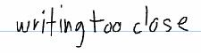
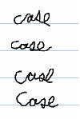
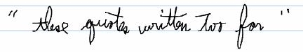

# Confidence Property \[About Recognition\]

To obtain a level of confidence for each recognition result, you can get either the [**Confidence**](/windows/desktop/api/msinkaut/nf-msinkaut-iinkrecognitionalternate-get_confidence) property of the [**RecognitionAlternate**](/windows/desktop/api/msinkaut/nn-msinkaut-iinkrecognitionalternate) object or the [**Confidence**](/windows/desktop/api/msinkaut/nf-msinkaut-iinkgesture-get_confidence) property of the [**Gesture**](/windows/desktop/api/msinkaut/nn-msinkaut-iinkgesture) object. The confidence level is a number that indicates the degree of confidence for each alternate recognition result that the recognizer returns for a corresponding recognition segment.

Confidence is returned as low, average, or high. The application uses these results to:

-   Indicate to the user that multiple possibilities exist.
-   Rank the alternates by confidence level.

## What Affects Confidence

Some of the things that make handwriting recognition difficult and affect confidence include:

-   Difficulty determining word segmentation

-   Case difficulties

-   Uncommon writing styles
-   Isolated punctuation

-   Accented characters in English recognizers

> [!Note]  
> Confidence evaluation is available only for United States English and all gesture recognizers in this release. Methods that provide the confidence property for any other recognizer will return **E\_NOTIMPL**.

 

 

 

