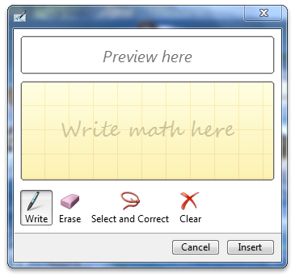

# Customizing the Math Input Control

It is possible to change the look and feel of the math input control so that it is better suited to your application. This topic explains the various ways that developers can customize the math input control.

The following customizations are possible:

-   [Changing the Displayed Buttons](#changing-the-displayed-buttons)
-   [Changing the Control Caption](#changing-the-control-caption)
-   [Changing the Control's Preview Area Size](#changing-the-controls-preview-area-size)

## Changing the Displayed Buttons

You can change the buttons that are displayed on the math input control so that the control has extended functionality or appears smaller on the screen. Enabling the extended button set will show the **Redo** and **Undo** buttons. The following code shows how to enable the extended button set.


```
  void CMath_Input_Control_testDlg::OnBnClickedToggleBtns()
  {
    static bool enabled = true;
    HRESULT hr = S_OK;

    hr = g_spMIC->Hide();    
    if(!enabled){
      if (SUCCEEDED(hr)){
        hr = g_spMIC->EnableExtendedButtons(VARIANT_TRUE);
        enabled = true;
      }
    }else{
      if (SUCCEEDED(hr)){
        hr = g_spMIC->EnableExtendedButtons(VARIANT_FALSE);
        enabled = false;
      }
    }
    if (SUCCEEDED(hr)){
      hr = g_spMIC->Show();
    }
  }
  
```


The following image shows the control with the extended set of buttons.


The following image shows the control without the extended set of buttons.



## Changing the Control Caption

You can change the control caption for the math input control in order to set the caption on the math input control's window. The following code shows how to set the caption.


```
  void CMath_Input_Control_testDlg::OnBnClickedSetCaption()
  {     
    g_spMIC->Hide();
    CComBSTR cap1(L"Some Caption Text");    
    g_spMIC->SetCaptionText((BSTR)cap1);
    g_spMIC->Show();
  }  
  
```


The following image shows the control after the caption has been set.


## Changing the Control's Preview Area Size

You can customize the math input control so that the control explicitly sets its preview-area size. This creates a larger area in which the math formulas are displayed. The following code shows how to set the preview area size.


```
  void CMath_Input_Control_testDlg::OnBnClickedSetPreviewAreaSize()
  {
    LONG height = 200;
    HRESULT hr = S_OK;
    hr = g_spMIC->SetPreviewHeight(height);
  }  
  
```


The following images show a control with differently sized preview areas.


 

 


