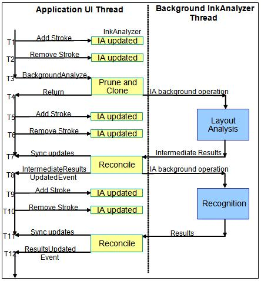

# Data Proxy Event Flow

This topic discusses the details of eventing when using the ink analysis data proxy features.

## Data Proxy Event Flow Overview

In the data proxy usage of the [**InkAnalyzer**](inkanalyzer.md), it is assumed that the application integrating the InkAnalyzer already has an existing document model to which they wish to proxy the results of analysis. It is also assumed that the application will have results from any previous analysis operation that they wish to build upon stored in their document model. There may also be non-ink context that may be added to the **InkAnalyzer** in the form of an **ImageNode** or **TextWordNode**[**ContextNode**](icontextnode.md) to be potentially annotated with ink.

The key to the data proxy system is for the application to flag the [**ContextNode**](icontextnode.md) as being "partially populated" by using [**PartiallyPopulated**](icontextnode-setpartiallypopulated.md). When this flag is true the [**InkAnalyzer**](inkanalyzer.md) assumes that three things about that **ContextNode**:

-   The location of the [**ContextNode**](icontextnode.md) is correct.
-   The type of [**ContextNode**](icontextnode.md) is correct.
-   All other information about that [**ContextNode**](icontextnode.md) is stored elsewhere.

Based on these three rules, if and when the [**InkAnalyzer**](inkanalyzer.md) needs additional information about a [**ContextNode**](icontextnode.md) it will raise the [**PopulateContextNode**](-ianalysisproxyevents-populatecontextnode.md) event and reference the **ContextNode** in question. This give the application an opportunity to set all known information on that **ContextNode** before the **InkAnalyzer** looks at it in more detail. After handling a **PopulateContextNode** event, the **ContextNode** in question must have a valid location property, the correct number of sub-nodes set if it is a container **ContextNode** or have the correct strokes set, by using [**SetStrokes**](icontextnode-setstrokes.md), if it is a ink leaf **ContextNode**. Failure to correctly set this location and subnode or stroke information will result in an **InvalidOperation** exception. The sub-nodes for a container **ContextNode** can themselves be set as partially populated in which case more **PopulateContextNode** events will be raised if the **InkAnalyzer** determines they will be needed for the current analysis operation.

The tables below describe when the [**PopulateContextNode**](-ianalysisproxyevents-populatecontextnode.md) event will be raised throughout the usage of the [**InkAnalyzer**](inkanalyzer.md).

After the [**InkAnalyzer**](inkanalyzer.md) has computed some restuls, it will look back to the application to update the results. The first event raised is the [**InkAnalyzerStateChanging**](-ianalysisproxyevents-inkanalyzerstatechanging.md) event. This event simply signifies to the application that **InkAnalyzer** object's tree state is about to change. This provides applications an opportunity to set the [**PartiallyPopulated**](icontextnode-setpartiallypopulated.md) flag to true on any [**ContextNodes**](icontextnodes.md) that have state stored elsewhere. The **InkAnalyzer** will then raise a series of [**PopulateContextNode**](-ianalysisproxyevents-populatecontextnode.md) events to determin the current state of the data. Once that is determiend a reconciliation operation is compelted to determine which background results can still be applied.

To apply results to the [**InkAnalyzer**](inkanalyzer.md) a series of tree modification events are raised. The tree modification events describe, step by step, all the changes needed to update the results. These events are intended to be handled in sucession without interuption or canceling. If the analysis operation is canceled (via the [**Abort**](iinkanalyzer-abort.md) method) during the processing of the tree modification events, the state of the **InkAnalyzer** will be invalid and the entire document may need to be re-analyzed.

The tables below describe when the tree modification events are raised throughout the usage of the InkAnalyzer. The tables refer to the timestamps shown following event flow diagram.

### Adding a Stroke

| Time Stamp | Event Type or Purpose | Event Raised | Comment                          |
|--------------------------|-------------------------------------------------------------------------|--------------------------------------------------------------------------------------------------|------------------------------------------------------------------------------------------------------------------------------------------------------------------------------------------------------------------------------------------------------------------------------------------------------------|
| T1, T5 and T9  | \[Inside the call to AddStroke()\]\[Tree exploration Event\]  | [**PopulateContextNode**](-ianalysisproxyevents-populatecontextnode.md) event raised  | There could be n number of [**PopulateContextNode**](-ianalysisproxyevents-populatecontextnode.md) events raised depending on how many **Unclassified**[**ContextNodes**](icontextnodes.md) exists with a [**PartiallyPopulated**](icontextnode-setpartiallypopulated.md) value set to true.  |
| T1, T5 and T9  | \[Tree modification Event\]                                   | [**ContextNodeCreated**](-ianalysisproxyevents-contextnodecreated.md) event raised    | There will only be one [**ContextNodeCreated**](-ianalysisproxyevents-contextnodecreated.md) event raised as a result of calling the [**AddStroke**](iinkanalyzer-addstroke.md) method. All strokes are added the same unclassified [**ContextNode**](icontextnode.md).                       |

 

### Deleting a Stroke

| Time Stamp | Event Type or Purpose | Event Raised | Comment                          |
|---------------------------|-----------------------------------------------------------------------------------------------------------------|--------------------------------------------------------------------------------------------------|----------------------------------------------------------------------------------------------------------------------------------------------------------------------------------------------------------------------------------------------------------------------------------------------------------------------|
| T2, T6 and T10  | \[Inside the call to [**RemoveStroke**](iinkanalyzer-removestroke.md)()\]\[Tree exploration Event\]  | [**PopulateContextNode**](-ianalysisproxyevents-populatecontextnode.md) Event Raised  | There could be a number of [**PopulateContextNode**](-ianalysisproxyevents-populatecontextnode.md) events raised depending on how many [**ContextNodes**](icontextnodes.md) related to the strokes being deleted have a [**PartiallyPopulated**](icontextnode-setpartiallypopulated.md) value of true.  |
| T2, T6 and T10  | \[Tree modification Event\]                                                                           | [**ContextNodeDeleting**](-ianalysisproxyevents-contextnodedeleting.md) Event Raised  | There could be any number of [**ContextNodeDeleting**](-ianalysisproxyevents-contextnodedeleting.md) events raised, depending on the ink content being deleted and the current Analysis structure.                                                                                                        |

 

### Calling the BackgroundAnalyze method

| Time Stamp | Event Type or Purpose | Event Raised | Comment                          |
|-----------------------|---------------------------------------------------------------------------------------------------------------------------|--------------------------------------------------------------------------------------------------|---------------------------------------------------------------------------------------------------------------------------------------------------------------------------------------------------------------------------------------------------------------------------------------------------------------------------------------------------------------------------------------------------------------------|
| T3          | \[Inside the call to [**BackgroundAnalyze**](iinkanalyzer-backgroundanalyze.md)()\]\[Tree exploration Event\]  | [**PopulateContextNode**](-ianalysisproxyevents-populatecontextnode.md) Event Raised  | There could be n number of [**PopulateContextNode**](-ianalysisproxyevents-populatecontextnode.md) events raised, depending on how many [**ContextNodes**](icontextnodes.md) throughout the tree have a [**PartiallyPopulated**](icontextnode-createpartiallypopulatedsubnode.md) value of true (One event per [**ContextNode**](icontextnode.md) that is needed in the current Analysis operation).  |

 

### After the Call to BackgroundAnalyze() returns

| Time Stamp | Event Type or Purpose | Event Raised | Comment                          |
|-----------------------|---------------------------------------------|----------------------------------|----------------------------------------------------------------------------------------------|
| T3 to T7    | \[Events raised from BG thread\]  | Activity Event Raised  | Several Activity events will be raised during this background period of analysis.  |

 

### When IntermediateResults are ready

| Time Stamp | Event Type or Purpose | Event Raised | Comment                          |
|-----------------------|----------------------------------------------------------------------------------------------------|--------------------------------------------------------------------------------------------------------------------|-------------------------------------------------------------------------------------------------------------------------------------------------------------------------------------------------------------------------------------------------------------------------------------------------------------------------------------------------------------------------------------------------------|
| T7 to T8    | \[Events raised from BG thread, signifying the start of the first reconcile operation\]  | [**InkAnalyzerStateChanging**](-ianalysisproxyevents-inkanalyzerstatechanging.md) Event Raised          | Only one [**InkAnalyzerStateChanging**](-ianalysisproxyevents-inkanalyzerstatechanging.md) event raised. This event is raised prior to inspecting the state of the [**InkAnalyzer**](inkanalyzer.md), giving the application an opportunity to set the [**PartiallyPopulated**](icontextnode-setpartiallypopulated.md) value on any nodes or perform any local document locking needed.  |
| T7 to T8    | \[Tree exploration Event\]                                                               | [**PopulateContextNode**](-ianalysisproxyevents-populatecontextnode.md) Event Raised                    | There could be n number of [**PopulateContextNode**](-ianalysisproxyevents-populatecontextnode.md) events raised, depending on ink content.                                                                                                                                                                                                                                                |
| T7 to T8    | \[Tree modification Event\]                                                              | [**ContextNodeCreated**](-ianalysisproxyevents-contextnodecreated.md) Event Raised                      | There could be n number of [**ContextNodeCreated**](-ianalysisproxyevents-contextnodecreated.md) events raised, depending on ink content.                                                                                                                                                                                                                                                  |
| T7 to T8    | \[Tree modification Event\]                                                              | [**ContextNodeDeleting**](-ianalysisproxyevents-contextnodedeleting.md) Event Raised                    | There could be n number of [**ContextNodeDeleting**](-ianalysisproxyevents-contextnodedeleting.md) events raised, depending on ink content.                                                                                                                                                                                                                                                |
| T7 to T8    | \[Tree modification Event\]                                                              | [**ContextNodeMovingToPosition**](-ianalysisproxyevents-contextnodemovingtoposition.md)                 | There could be n number of [**ContextNodeMovingToPosition**](-ianalysisproxyevents-contextnodemovingtoposition.md) events raised, depending on ink content.                                                                                                                                                                                                                                |
| T7 to T8    | \[Tree modification Event\]                                                              | [**ContextNodeReparenting**](-ianalysisproxyevents-contextnodereparenting.md)                           | There could be n number of [**ContextNodeReparenting**](-ianalysisproxyevents-contextnodereparenting.md) events raised, depending on ink content.                                                                                                                                                                                                                                          |
| T7 to T8    | \[Tree modification Event\]                                                              | [**StrokeReparented**](-ianalysisproxyevents-strokereparented.md)                                       | There could be n number of [**StrokeReparented**](-ianalysisproxyevents-strokereparented.md) events raised, depending on ink content.                                                                                                                                                                                                                                                      |
| T7 to T8    | \[Tree modification Event\]                                                              | [**ContextNodeLinkAdding**](-ianalysisproxyevents-contextnodelinkadding.md)                             | There could be n number of [**ContextNodeLinkAdding**](-ianalysisproxyevents-contextnodelinkadding.md) events raised, depending on ink content.                                                                                                                                                                                                                                            |
| T7 to T8    | \[Tree modification Event\]                                                              | [**ContextNodeLinkDeleting**](-ianalysisproxyevents-contextnodelinkdeleting.md)                         | There could be n number of [**ContextNodeLinkDeleting**](-ianalysisproxyevents-contextnodelinkdeleting.md) events raised, depending on ink content.                                                                                                                                                                                                                                        |
| T7 to T8    | \[Tree modification Event\]                                                              | [**ContextNodePropertiesUpdated**](-ianalysisproxyevents-contextnodepropertiesupdated.md) Event Raised  | There could be n number of [**ContextNodePropertiesUpdated**](-ianalysisproxyevents-contextnodepropertiesupdated.md) events raised, depending on ink content. **ContextNodePropertiesUpdated** are scheduled to be rasied after all other [**ContextNode**](icontextnode.md) modification events are raised during this [**Reconcile**](iinkanalyzer-reconcile.md) period.               |
| T7 to T8    | \[Event signifies the end of the first reconcile operation\]                             | [**IntermediateResults**](-ianalysisevents-intermediateresults.md) Event Raised                         | Only one [**IntermediateResults**](-ianalysisevents-intermediateresults.md) event will be raised per analysis operation.                                                                                                                                                                                                                                                                   |

 

### After IntermediateResults have been handled

| Time Stamp | Event Type or Purpose | Event Raised | Comment                          |
|-----------------------|---------------------------------------------|-----------------------------------------------------------------------|-----------------------------------------------------------------------------------------------------------------------------------|
| T8 to T11   | \[Events raised from BG thread\]  | [**Activity**](-ianalysisevents-activity.md) Event Raised  | Several [**Activity**](-ianalysisevents-activity.md) events will be raised during this background period of analysis.  |

 

### When final Results are ready

| Time Stamp | Event Type or Purpose | Event Raised | Comment                          |
|-----------------------|-----------------------------------------------------------------------------------------------------|--------------------------------------------------------------------------------------------------------------------|-------------------------------------------------------------------------------------------------------------------------------------------------------------------------------------------------------------------------------------------------------------------------------------------------------------------------------------------------------------------------------------------------------|
| T11 to T12  | \[Events raised from BG thread, signifying the start of the second reconcile operation\]  | [**InkAnalyzerStateChanging**](-ianalysisproxyevents-inkanalyzerstatechanging.md) Event Raised          | Only one [**InkAnalyzerStateChanging**](-ianalysisproxyevents-inkanalyzerstatechanging.md) event raised. This event is raised prior to inspecting the state of the [**InkAnalyzer**](inkanalyzer.md), giving the application an opportunity to set the [**PartiallyPopulated**](icontextnode-setpartiallypopulated.md) value on any nodes or perform any local document locking needed.  |
| T11 to T12  | \[Tree exploration Event\]                                                                | [**PopulateContextNode**](-ianalysisproxyevents-populatecontextnode.md) Event Raised                    | There could be any number of [**PopulateContextNode**](-ianalysisproxyevents-populatecontextnode.md) events raised, depending on ink content.                                                                                                                                                                                                                                              |
| T11 to T12  | \[Tree modification Event\]                                                               | [**ContextNodeCreated**](-ianalysisproxyevents-contextnodecreated.md) Event Raised                      | There could be any number of [**ContextNodeCreated**](-ianalysisproxyevents-contextnodecreated.md) events raised, depending on ink content.                                                                                                                                                                                                                                                |
| T11 to T12  | \[Tree modification Event\]                                                               | [**ContextNodeDeleting**](-ianalysisproxyevents-contextnodedeleting.md) Event Raised                    | There could be any number of [**ContextNodeDeleting**](-ianalysisproxyevents-contextnodedeleting.md) events raised, depending on ink content.                                                                                                                                                                                                                                              |
| T11 to T12  | \[Tree modification Event\]                                                               | [**ContextNodeMovingToPosition**](-ianalysisproxyevents-contextnodemovingtoposition.md)                 | There could be any number of [**ContextNodeMovingToPosition**](-ianalysisproxyevents-contextnodemovingtoposition.md) events raised, depending on ink content.                                                                                                                                                                                                                              |
| T11 to T12  | \[Tree modification Event\]                                                               | [**ContextNodeReparenting**](-ianalysisproxyevents-contextnodereparenting.md)                           | There could be any number of [**ContextNodeReparenting**](-ianalysisproxyevents-contextnodereparenting.md) events raised, depending on ink content.                                                                                                                                                                                                                                        |
| T11 to T12  | \[Tree modification Event\]                                                               | [**StrokeReparented**](-ianalysisproxyevents-strokereparented.md)                                       | There could be any number of [**StrokeReparented**](-ianalysisproxyevents-strokereparented.md) events raised, depending on ink content.                                                                                                                                                                                                                                                    |
| T11 to T12  | \[Tree modification Event\]                                                               | [**ContextNodeLinkAdding**](-ianalysisproxyevents-contextnodelinkadding.md)                             | There could be any number of [**ContextNodeLinkAdding**](-ianalysisproxyevents-contextnodelinkadding.md) events raised, depending on ink content.                                                                                                                                                                                                                                          |
| T11 to T12  | \[Tree modification Event\]                                                               | [**ContextNodeLinkDeleting**](-ianalysisproxyevents-contextnodelinkdeleting.md)                         | There could be any number of [**ContextNodeLinkDeleting**](-ianalysisproxyevents-contextnodelinkdeleting.md) events raised, depending on ink content.                                                                                                                                                                                                                                      |
| T11 to T12  | \[Tree modification Event\]                                                               | [**ContextNodePropertiesUpdated**](-ianalysisproxyevents-contextnodepropertiesupdated.md) Event Raised  | There could be any number of [**ContextNodePropertiesUpdated**](-ianalysisproxyevents-contextnodepropertiesupdated.md) events raised, depending on ink content. **ContextNodePropertiesUpdated** are scheduled to be rasied after all other [**ContextNode**](icontextnode.md) modification events are raised during this [**Reconcile**](iinkanalyzer-reconcile.md) period.             |
| T11 to T12  | \[Event signifies the end of the second reconcile operation\]                             | [**Results**](-ianalysisevents-results.md) Event Raised                                                 | Only one [**Results**](-ianalysisevents-results.md) event will be raised per analysis operation.                                                                                                                                                                                                                                                                                           |

 

 

 

