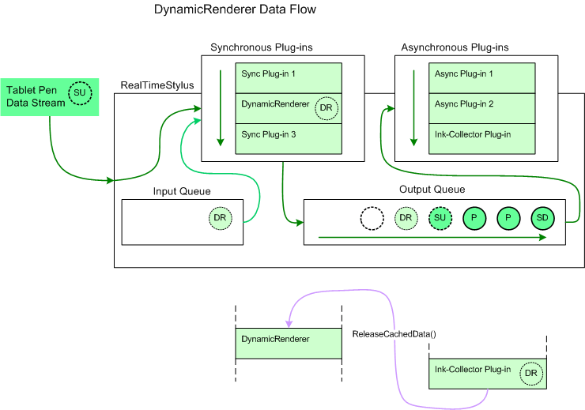

# Dynamic-Renderer Plug-ins

A dynamic-renderer plug-in is an object that displays the tablet pen data in real-time as it is being handled by the [**RealTimeStylus**](realtimestylus-class.md) object. Later, for events such as a form refresh, the dynamic-renderer plug-in or an ink-collector plug-in may redraw the ink.

## The DynamicRenderer Object

The [**RealTimeStylus**](realtimestylus-class.md) object implements the [**IStylusSyncPlugin**](/windows/win32/api/rtscom/nn-rtscom-istylussyncplugin) interface. The [**DynamicRenderer**](/previous-versions/windows/desktop/legacy/ms701168(v=vs.85)) object renders the ink in real-time, as it is being drawn. When the [**Refresh**](/windows/desktop/api/RTSCom/nf-rtscom-idynamicrenderer-refresh) method is called while the **DynamicRenderer** object is enabled, the **DynamicRenderer** object redraws the stroke currently being collected. The **DynamicRenderer** object's [**Enabled**](/windows/desktop/api/RTSCom/nf-rtscom-idynamicrenderer-get_enabled) property is initially set to **FALSE**.

> [!Note]  
> When calling the [**DynamicRenderer**](/previous-versions/ms826345(v=msdn.10)) object's [**Refresh**](/previous-versions/ms826370(v=msdn.10)) method from within a [Paint](/dotnet/api/system.windows.forms.control.paint?view=netcore-3.1) event handler in managed code, set the **DynamicRenderer** object's [**ClipRectangle**](/previous-versions/ms826346(v=msdn.10)) property to the [PaintEventArgs](/dotnet/api/system.windows.forms.painteventargs?view=netcore-3.1) object's [ClipRectangle](/dotnet/api/system.windows.forms.painteventargs.cliprectangle?view=netcore-3.1) property.

 

The [**DynamicRenderer**](/previous-versions/windows/desktop/legacy/ms701168(v=vs.85)) object can temporarily cache ink data. To use this feature in managed code, set the [EnableDataCache](/previous-versions/ms826349(v=msdn.10)) property to **TRUE**. When the [**DynamicRenderer**](/previous-versions/ms826345(v=msdn.10)) object receives a call to its [**IStylusSyncPlugin.StylusUp**](/previous-versions/ms826366(v=msdn.10)) method, it caches the stroke data and adds custom stylus data to the Input queue in response to the [**StylusUpData**](/previous-versions/ms824057(v=msdn.10)) object for the stroke. The [**CustomStylusData**](/previous-versions/ms824747(v=msdn.10)) object's [CustomDataId](/previous-versions/ms824749(v=msdn.10)) property is set to the [DynamicRendererCachedDataGuid](/previous-versions/ms824744(v=msdn.10)) value, and the **CustomStylusData** object's Data property contains a DynamicRendererCachedData object. Call the **DynamicRenderer** object's [ReleaseCachedData](/previous-versions/ms826371(v=msdn.10)) method once the stroke has been collected and can be statically rendered. When the [**Refresh**](/windows/desktop/api/RTSCom/nf-rtscom-idynamicrenderer-refresh) method is called while the **DynamicRenderer** object is enabled, the **DynamicRenderer** object redraws all strokes that are cached. When the [**DataCacheEnabled**](/windows/desktop/api/RTSCom/nf-rtscom-idynamicrenderer-get_datacacheenabled) property is set to **false**, the cached stroke data is deleted.

The following diagram illustrates how the [**DynamicRenderer**](/previous-versions/windows/desktop/legacy/ms701168(v=vs.85)) object adds data to the tablet pen data when the **DynamicRenderer** object's [**DataCacheEnabled**](/windows/desktop/api/RTSCom/nf-rtscom-idynamicrenderer-get_datacacheenabled) property is set.

In this diagram the circle lettered "SD" represents a [**StylusDown**](/windows/desktop/api/RTSCom/nf-rtscom-istylusplugin-stylusdown) object and the circles lettered "P" represent [**Packets**](/windows/desktop/api/RTSCom/nf-rtscom-istylusplugin-packets) objects that have already been added to the [**RealTimeStylus**](realtimestylus-class.md) object's output queue and that have not yet been sent to the asynchronous plug-in collection. The circle lettered "SU" represents a [**StylusUp**](/windows/desktop/api/RTSCom/nf-rtscom-istylusplugin-stylusup) object that the **RealTimeStylus** object is currently processing. It is sent to the synchronous plug-in collection and then placed on the output queue. The circles lettered "DR" represent custom stylus data that is added to the input queue by the [**DynamicRenderer**](/previous-versions/windows/desktop/legacy/ms701168(v=vs.85)) plug-in in response to the stylus up notification associated with "SU". The custom stylus data lettered "DR" is then passed to the synchronous plug-ins and then to the output queue before the next tablet pen data is processed. The empty circle represents the position in the output queue where future tablet pen data is added. Also represented on the diagram is the ink-collector plug-in calling the **DynamicRenderer** object's [**ReleaseCachedData**](/windows/desktop/api/RTSCom/nf-rtscom-idynamicrenderer-releasecacheddata) method to release the cached stroke data after the ink-collection plug-in has processed the stroke.

### Special Considerations

The following list describes other points to take into consideration when using the [**DynamicRenderer**](/previous-versions/windows/desktop/legacy/ms701168(v=vs.85)) object.

-   You should not attach a [**DynamicRenderer**](/previous-versions/windows/desktop/legacy/ms701168(v=vs.85)) object to more than one [**RealTimeStylus**](realtimestylus-class.md) object. Once two **RealTimeStylus** objects to which the **DynamicRenderer** object is attached are enabled, the following occurs.

    -   The [**DynamicRenderer**](/previous-versions/windows/desktop/legacy/ms701168(v=vs.85)) object throws an exception in response to the second call to its [**RealTimeStylusEnabled**](/windows/desktop/api/RTSCom/nf-rtscom-istylusplugin-realtimestylusenabled) method.
    -   The second [**RealTimeStylus**](realtimestylus-class.md) object that was enabled generates an [**Error**](/windows/desktop/api/RTSCom/nf-rtscom-istylusplugin-error) object and notifies the remaining plug-ins in its plug-in collections of the error.
    -   The [**DynamicRenderer**](/previous-versions/windows/desktop/legacy/ms701168(v=vs.85)) object stops rendering tablet pen data.

-   The [**RealTimeStylus**](realtimestylus-class.md) object throws an exception when its [**AddCustomStylusDataToQueue**](/windows/desktop/api/RTSCom/nf-rtscom-irealtimestylus-addcustomstylusdatatoqueue) method is called with the *guid* parameter set to the DynamicRendererCachedDataGuid globally unique identifier (GUID).
-   The [**DynamicRenderer**](/previous-versions/windows/desktop/legacy/ms701168(v=vs.85)) object is implemented as a Component Object Model (COM) wrapper, and you cannot call its [**IStylusSyncPlugin**](/windows/win32/api/rtscom/nn-rtscom-istylussyncplugin) interface methods directly. For more information about COM operation and the [**RealTimeStylus**](realtimestylus-class.md) object, see [Implementation Notes for the StylusInput APIs](implementation-notes-for-the-stylusinput-apis.md).

## Custom Rendering

You can create your own dynamic-renderer plug-in by creating a synchronous plug-in that subscribes to the [**StylusDown**](/windows/desktop/api/RTSCom/nf-rtscom-istylusplugin-stylusdown), [**Packets**](/windows/desktop/api/RTSCom/nf-rtscom-istylusplugin-packets), and [**StylusUp**](/windows/desktop/api/RTSCom/nf-rtscom-istylusplugin-stylusup) notifications. Your plug-in can then render the stroke as it is being drawn. This may be one way of implementing a selection tool that uses a free-form selection or selection box, for example.

 

 
