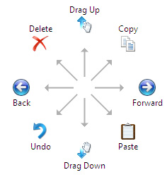

# Flicks Gestures

Windows Vista includes a set of eight basic *flick gestures*. Flicks are quick, linear pen movements associated with scrolling actions and commands.

## Flick Details

The flicks feature provides the user with a new way of interacting with the Tablet PC by allowing common actions to be performed by making quick gestures with the pen. Flicks coexist with, and do not disrupt, normal user actions such as left and right taps, scrolling, and inking.

A *flick* is a unidirectional pen gesture that requires the user to contact the digitizer in a quick flicking motion. A flick is characterized by high speed and a high degree of straightness. A flick is identified by its direction. Flicks can be made in eight directions corresponding to the cardinal and secondary compass directions.

An *action* or *flick action* is the action or shortcut performed in response to a flick. Flicks are mapped to actions. The following illustration shows a diagram of eight pen flicks that correspond to their flick actions.

As the user moves the pen over the digitizer of a Tablet PC, the hardware generates pen packets which are routed to the pen input subsystem of the Tablet PC platform. Normally, if the pen is being used as a substitute for the mouse, the pen input subsystem takes these pen packets and sends them, possibly with modifications, to User32, the Windows component responsible for processing mouse input. If the pen is being used on an inking surface, then ink is rendered instead of mouse packets being generated.

The flick detection routine is implemented in the pen input subsystem. Flick detection begins at pen-down and continues until either:

1) the sequence of packets received is determined not to be a flick or

2) pen-up occurs.

While flick detection is occurring, pen packets are held back and not sent to the system. This must be done because sending packets may interfere with the flick action that is performed. For example, sending packets during a flick that maps to a copy action would dismiss what was selected, meaning there would be nothing to copy by the time the action was sent.

As the packets flow into the pen input subsystem, the flick detection routine computes metrics on the length, velocity, time, and curvature of the motion being performed. With each packet that arrives, the detection routine updates each of these metrics. As soon as any of the metrics falls outside what would constitute a flick, flick detection ends and the packets are sent through.

## Where flicks are detected

Flick gestures are made possible by the fact that drags are typically performed rather slowly. The user must first target the start point of the drag, perform the drag and then target the end point. Normally this will take too long to qualify as a flick. However, on inking surfaces quick strokes that would qualify as flicks happen frequently; crossing a 't' is a common example. Thus, by default, flick detection is turned off over inking surfaces and turned on system-wide.

## Focus Issues

Once a flick has been detected, a sequence of events begins that ultimately leads to the system performing a certain action in response to the flick that occurred. First, the detection routine within the pen input subsystem determines what window the flick should be sent to. This is usually the window that has focus, but there are exceptions. For scrolling flicks, the flick is sent to the window over which the flick occurred. Note that this is not necessarily the window with focus. When a flick is sent to a window that does not have focus, the focus does not change to that window.

## Flick Actions

Once the target window is determined, that window may handle the flick itself depending on the default or programmed event behavior. Applications can respond to the action that is most appropriate based on the application and the direction and position of the flick. For example, in a mapping application, up and down flicks might zoom in or out instead of scrolling vertically, as would be expected from the default behavior.

To alert an application that a flick has occurred, a window message is sent to it. This window message contains both the start point of the flick and the direction of the flick. If the application handles this window message, no further action is taken by the pen input subsystem.

After a flick is detected, visual feedback representing the flick action is displayed on the screen. This feedback serves two purposes. First, it confirms for the user that the flick was successful. Second, it reminds the user what action was performed, helping the user connect the flick direction with its associated action.

The flick feedback consists of two parts; an icon representing the action and a label containing the name of the action. The label is displayed below the icon. The feedback is displayed immediately after the flick is detected. Although applications can customize their behavior in response to flicks by handling the flick window message, the application cannot disable or modify the flick feedback.

It is expected that most applications will not be flick-aware and thus will not handle the window message described above. If the message is not handled, the pen input subsystem will take further action. First, it looks up the action associated with the direction of the flick detected. Next, it will take steps (described in the table below) to cause the target window to perform this action. For many of the flick actions this involves sending an application command, but certain actions that are implemented do not.

## Processing Application Commands

Your application should respond to any of the application commands that could be potentially assigned to a flick gesture. If an application fails to respond to the [**WM\_TABLET\_FLICK Message**](wm-tablet-flick-message.md), Windows Vista follows up by sending the applicable [**WM\_APPCOMMAND**](/windows/desktop/inputdev/wm-appcommand) notification, followed then by a [**WM\_KEYDOWN**](/windows/desktop/inputdev/wm-keydown) notification.

Following is a list of application commands that can be assigned to flicks, with the backup keystroke message that might be sent.

| Command                                  | Backup keystroke  |
|------------------------------------------|-------------------|
| APPCOMMAND\_BROWSER\_BACKWARD  | None    |
| APPCOMMAND\_BROWSER\_FORWARD   | None    |
| APPCOMMAND\_COPY               | Ctrl+C  |
| APPCOMMAND\_PASTE              | Ctrl+V  |
| APPCOMMAND\_UNDO               | Ctrl+Z  |
| APPCOMMAND\_DELETE             | Del     |
| APPCOMMAND\_CUT                | Ctrl+X  |
| APPCOMMAND\_OPEN               | Ctrl+O  |
| APPCOMMAND\_PRINT              | Ctrl+P  |
| APPCOMMAND\_SAVE               | Ctrl+S  |
| APPCOMMAND\_REDO               | Ctrl+Y  |
| APPCOMMAND\_CLOSE              |                   |

 

Editing commands such as Copy, Paste, Cut, and Delete might be directed against a selection or against the object located at the base of the flick gesture. If there is no selection, you can use the data in the [**FLICK\_POINT Structure**](/windows/desktop/api/tabflicks/ns-tabflicks-flick_point) to determine what, if any, object might have been the target of the editing command.

## Related topics

<dl> <dt>

[Flicks API Reference](flicks-api-reference.md)
</dt> <dt>

[Responding to Flick Gestures](/previous-versions//dd356077(v=vs.85))
</dt> </dl>

 

