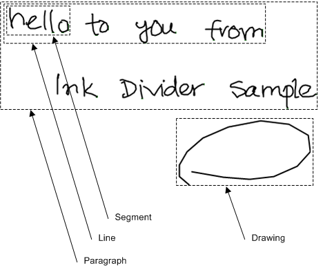

# Ink Analysis with the Divider Object

The [Divider](/previous-versions/ms583616(v=vs.100)) object provides layout analysis features that classify and group strokes into different structural elements.

## Divider Object

The [Divider](/previous-versions/ms583616(v=vs.100)) object analyzes strokes as you add or remove them. You can retrieve the current classification and grouping of the analyzed strokes in a [DivisionResult](/previous-versions/ms583620(v=vs.100)) object by calling the [Divide](/previous-versions/ms568936(v=vs.100)) method of the Divider object.

The strokes that the [Divider](/previous-versions/ms583616(v=vs.100)) object analyzes are kept in the [Strokes](/previous-versions/ms582090(v=vs.100)) property of the Divider object. Because a [Strokes](/previous-versions/ms552701(v=vs.100)) collection is a reference to ink data and is not the actual data itself, changes in the parent [Ink](/previous-versions/ms583670(v=vs.100)) object of the Strokes collection can invalidate the Strokes collection. For more information about ink data, see [Ink Data](ink-data.md).

The [Divider](/previous-versions/ms583616(v=vs.100)) object uses a recognizer context to improve its analysis of recognition segments and to generate recognition text for handwriting elements. If a recognizer context is not assigned to the [RecognizerContext](/previous-versions/ms582089(v=vs.100)) property of the Divider object or recognizers are not installed, then the layout analysis feature performs the recognition segment division, and no text is associated with the [DivisionResult](/previous-versions/ms583620(v=vs.100)) object. For more information about ink recognition, see [Ink Recognition](ink-recognition.md).

## DivisionResult Object

Each [DivisionResult](/previous-versions/ms583620(v=vs.100)) object records the layout analysis of the strokes contained by the [Divider](/previous-versions/ms583616(v=vs.100)) object at the time the [Divide](/previous-versions/ms568936(v=vs.100)) method is called. The DivisionResult object also stores a copy of the strokes that were used in the analysis.

The [DivisionResult](/previous-versions/ms583620(v=vs.100)) object groups the analysis results by structural element type. The [**ResultByType**](/windows/desktop/api/msinkaut15/nf-msinkaut15-iinkdivisionresult-resultbytype) method of the DivisionResult object returns in a [DivisionUnits](/previous-versions/ms583625(v=vs.100)) collection the collection of all structural elements of a given type. The [InkDivisionType](/previous-versions/ms552251(v=vs.100)) enumeration defines the element types that the layout analysis recognizes.

The following table describes the element types in the [InkDivisionType](/previous-versions/ms552251(v=vs.100)) enumeration.

| Name                 | Description                                                                      |
|----------------------|----------------------------------------------------------------------------------|
| Segment    | A recognition segment.                                                 |
| Line       | A line of handwriting that contains one or more recognition segments.  |
| Paragraph  | A block of strokes that contains one or more lines of handwriting.     |
| Drawing    | Ink that is not text.                                                  |

 

The following image shows an example of the different element types the [DivisionResult](/previous-versions/ms583620(v=vs.100)) object recognizes.

## DivisionUnits Collection and DivisionUnit Objects

Each [DivisionUnits](/previous-versions/ms583625(v=vs.100)) collection is a copy of the layout analysis result for a single type of structural element. The [DivisionUnit](/previous-versions/ms583624(v=vs.100)) object represents an individual element in the DivisionUnits collection. Each structural element has a reference to the strokes that make up the element. If recognizers are installed, handwriting elements have recognition text available. Line and recognition segment elements also include a rotation matrix that can rotate an element's strokes from vertical to horizontal.

The [Ink Divider Sample](ink-divider-sample.md) topic demonstrates how to use a [Divider](/previous-versions/ms583616(v=vs.100)) object with [Ink](/previous-versions/ms583670(v=vs.100)) objects to perform ink layout analysis.

For more information about using ink analysis, see [The Divider Object](the-divider-object.md).

 

