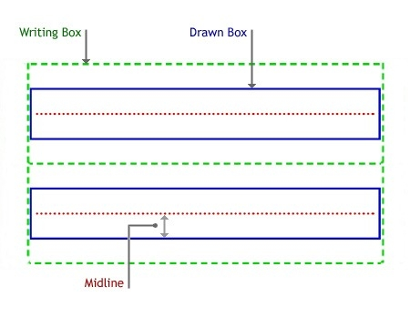
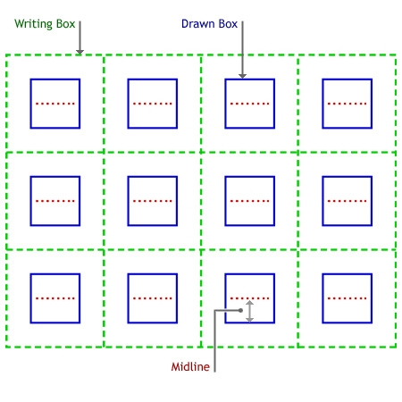

# Ink Recognition

Not all applications require the use of recognition, but because most applications were designed with text as their primary data type, the ability to convert ink into text is very valuable. You can use the recognition features of the Tablet PC platform API to query for information about the recognition engines that are available, such as what languages they recognize. You can then send a [**Strokes**](/previous-versions/windows/desktop/legacy/ms703293(v=vs.85)) collection from an [**Ink**](inkdisp-class.md) object to a recognition engine and have it return a [**RecognitionResult**](/windows/desktop/api/msinkaut/nn-msinkaut-iinkrecognitionresult) object.

## RecognizerContext Object

A [**RecognizerContext**](inkrecognizercontext-class.md) object is the instantiation of a given recognizer. The **RecognizerContext** object enables you to recognize a given collection of strokes synchronously or asynchronously. When recognizing asynchronously, the **RecognizerContext** object returns the [**RecognitionResult**](/windows/desktop/api/msinkaut/nn-msinkaut-iinkrecognitionresult) object in an event callback to the application.

## Recognizers and Recognizer Objects

A single Tablet PC may have one or more recognizers available. You can query the recognizer's collection to determine which recognizer to use. A recognizer provides specific information about its capabilities such as the language it can recognize and the manufacturer.

To determine whether at least one recognizer is installed, instantiate an [**InkRecognizerContext**](inkrecognizercontext-class.md) object as shown in the following C++ and C\# code examples. If a recognizer is not present, this call to [**CoCreateInstance**](/windows/desktop/api/combaseapi/nf-combaseapi-cocreateinstance) fails.


```C++
CComPtr<IInkRecognizerContext> g_pIInkRecoContext;
hr = CoCreateInstance(CLSID_InkRecognizerContext, 
      NULL, CLSCTX_INPROC_SERVER,
      IID_IInkRecognizerContext, 
(void **) &g_pIInkRecoContext);
if (FAILED(hr)) 
{
      ::MessageBox(NULL, TEXT("No recognizers installed.\nExiting."), 
      gc_szAppName, MB_ICONERROR);
      return -1;
}
```


```CSharp
try
{
  Recognizers recos = new Recognizers();//Check for recognizer.
  Recognizer defReco = recos.GetDefaultRecognizer();
  recoContext = defReco.CreateRecognizerContext();
}
catch
{
  MessageBox.Show("No recognizers installed.");
}
```


## RecognitionResult and RecognitionAlternate Objects

The results of the recognition are returned in a [**RecognitionResult**](/windows/desktop/api/msinkaut/nn-msinkaut-iinkrecognitionresult) object. The results contain a best result string in the [TopString](/previous-versions/ms829602(v=msdn.10)) property, as well as a collection of alternative results in a [**RecognitionAlternates**](/windows/desktop/api/msinkaut/nn-msinkaut-iinkrecognitionalternates) collection. The **RecognitionResult** object can be persisted with the original [**Strokes**](/previous-versions/windows/desktop/legacy/ms703293(v=vs.85)) collection from which it was generated.

## RecognizerGuide Structure

The recognizer guide can consist of rows and columns, and gives the recognizer a better context in which to perform recognition. For example, you can draw horizontal lines on a user's screen, almost like a ruled piece of paper, that show where handwriting should occur (this type of guide would consist only of rows, and no columns). If a user writes on the lines, instead of some arbitrary space, recognition accuracy improves.

The following illustration shows a [**RecognizerGuide**](inkrecognizerguide-class.md) structure with two lines for input.



The following illustration shows a [**RecognizerGuide**](inkrecognizerguide-class.md) structure with four columns and three rows.



For more information about using the [**RecognizerGuide**](inkrecognizerguide-class.md) structure, see the **RecognizerGuide** reference topic.

 

 
