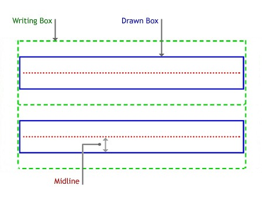
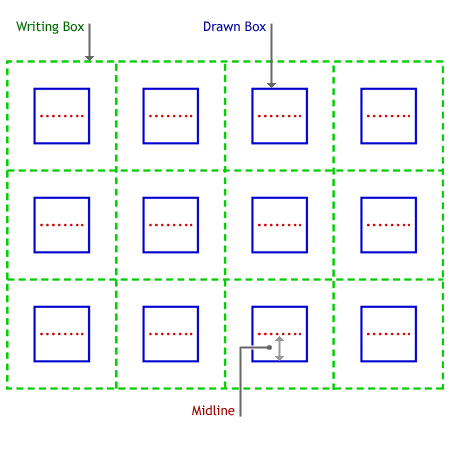

# InkRecognizerGuide class

Represents the area that the recognizer uses in which ink can be drawn. The area is known as the recognition guide.

**InkRecognizerGuide** has these types of members:

-   [Interfaces](#interfaces)
-   [Properties](#properties)

### Interfaces

The **InkRecognizerGuide** class defines these interfaces.

| Interface               | Description                                                                  |
|:------------------------|:-----------------------------------------------------------------------------|
| **IInkRecognizerGuide** | This object implements the **IInkRecognizerGuide** COM interface.  |

 

### Properties

The **InkRecognizerGuide** class has these properties.

| Property                                                       | Access type           | Description                                                                                                                    |
|:---------------------------------------------------------------|:----------------------|:-------------------------------------------------------------------------------------------------------------------------------|
| [**Columns**](/windows/desktop/api/msinkaut/nf-msinkaut-iinkrecognizerguide-get_columns)        | Read/write  | Gets or sets the number of columns in the guide box.                                                                 |
| [**DrawnBox**](/windows/desktop/api/msinkaut/nf-msinkaut-iinkrecognizerguide-get_drawnbox)      | Read/write  | Gets or sets the box that is physically drawn on the tablet's screen and in which writing takes place.               |
| [**GuideData**](/windows/desktop/api/msinkaut/nf-msinkaut-iinkrecognizerguide-get_guidedata)    | Read/write  | Gets or sets guide data for C++ developers.                                                                          |
| [**Midline**](/windows/desktop/api/msinkaut/nf-msinkaut-iinkrecognizerguide-get_midline)        | Read/write  | Gets or sets the midline height. The midline height is distance from the baseline to the midline, of the drawn box.  |
| [**Rows**](/windows/desktop/api/msinkaut/nf-msinkaut-iinkrecognizerguide-get_rows)              | Read/write  | Gets or sets the number of rows in the guide box.                                                                    |
| [**WritingBox**](/windows/desktop/api/msinkaut/nf-msinkaut-iinkrecognizerguide-get_writingbox)  | Read/write  | Gets or sets the invisible writing area of the guide box in which writing can actually take place.                   |

 

## Remarks

This object can be instantiated by calling the [**CoCreateInstance**](/windows/desktop/api/combaseapi/nf-combaseapi-cocreateinstance) method.

By default, there is no recognizer guide. A default guide has all property values set to 0. You must use the properties of this object to set the guide.

If the application has drawn guidelines on the screen on which the user is expected to write, the application should set the values of the properties of the recognizer guide to inform the recognizer. These properties are for the recognizer's use only. Setting them does not, by itself, draw visual clues on the display. The application or the control draws the visual clues.

The recognizer guide can consist of rows and columns, and these give the recognizer a better context in which to perform recognition. Letters such as "t" and "I" are more easily recognized when a guide is used to give context to the ink. For example, you can draw horizontal lines on a screen, that show where writing should occur (this type of guide would consist only of rows, and no columns). By writing on the lines, instead of some arbitrary space, recognition accuracy improves.

The guide specifies the boundaries of the ink in ink space coordinates.

The [**DrawnBox**](/windows/desktop/api/msinkaut/nf-msinkaut-iinkrecognizerguide-get_drawnbox) property can define a box which is the same size as or smaller than the box defined by the [**WritingBox**](/windows/desktop/api/msinkaut/nf-msinkaut-iinkrecognizerguide-get_writingbox) property.

The following figure shows the elements of a recognizer guide with two rows and no columns.

In addition to drawing lines on the screen that show users where to write, you can draw cells on the screen in which characters or words are written. This is called boxed input and is useful with some Asian languages. To determine if the recognizer is capable of boxed input, call the [**Capabilities**](/windows/desktop/api/msinkaut/nf-msinkaut-iinkrecognizer-get_capabilities) property of the [**IInkRecognizer**](/windows/desktop/api/msinkaut/nn-msinkaut-iinkrecognizer) object.

The following figure shows a recognizer guide with four columns.

## Requirements

| Requirement | Value |
|-------------------------------------|---------------------------------------------------------------------------------------------------------------------|
| Minimum supported client  | Windows XP Tablet PC Edition \[desktop apps only\]                                                        |
| Minimum supported server  | None supported                                                                                            |
| Header                    | <dl> <dt>Msinkaut.h (also requires Msinkaut\_i.c)</dt> </dl> |
| Library                   | <dl> <dt>InkObj.dll</dt> </dl>                               |

## See also

<dl> <dt>

[**IInkRecognizer Interface**](/windows/desktop/api/msinkaut/nn-msinkaut-iinkrecognizer)
</dt> <dt>

[**InkRecognizerContext Class**](inkrecognizercontext-class.md)
</dt> </dl>

 

