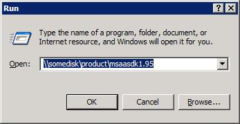

# Naming Controls in Dialog Boxes

When using Microsoft Windows dialog boxes, you must label all controls to facilitate speech functionality. The following **Run** dialog box shows a static text control label for a drop-down list box. Static text ends with a colon.

There are two types of controls:

-   Controls that have their captions as a property of that control, such as command buttons and check boxes. Accessibility aids have no trouble identifying these controls as long as the caption is properly defined.
-   Controls that do not have their own captions, such as edit controls, list boxes and list views, must be labeled by using separate static text controls. For more information about controls that do not have their own captions, see [Controls Without Caption Properties](controls-without-caption-properties.md).

Several techniques can be used to overcome situations in which controls do not have their own captions, but they are only effective for windows that are displayed by the Standard Dialog Manager (SDM). All other windows need to expose the names and relationship between controls by explicitly supporting Microsoft Active Accessibility. For more information about Active Accessibility, see the [Accessibility](/windows/desktop/accessibility) section of the MSDN Library.

 

 
