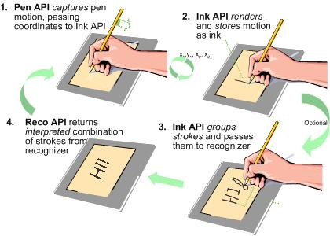

# Pen Input, Ink, and Recognition

One interesting new feature of Tablet PC is the pen input system. All Tablet PC computers have a digitizer beneath the screen that accepts pen input. This new input mechanism requires you to think about how to build applications specifically for Tablet PC. The Tablet PC platform application programming interface (API) helps you do this.

## Collection, Data Management, and Recognition

The Tablet PC platform can be divided into three distinct areas:

-   Ink collection (objects that are used to collect ink from the digitizer).
-   Ink data management (objects that are used to manage the collected ink).
-   Ink recognition (objects that are used to convert the collected ink into other types of data, such as text).

The following image shows, at a high level, how the Ink Collection API (Pen API), Ink Data Management API (Ink API), and Ink Recognition API (Recognition API) work together in the Tablet PC platform.

The Tablet PC platform API is available in Managed APIs as well as a COM library. The following topics describe the objects in the API and illustrate how applications use these objects:

-   [Ink Collection](ink-collection.md)
-   [Ink Data](ink-data.md)
-   [Ink Recognition](ink-recognition.md)
-   [Ink Analysis](ink-analysis.md)
-   [Handwriting Recognition in Windows Server 2008 R2](handwriting-recognition-in-windows-server-2008-r2.md)

 

 

