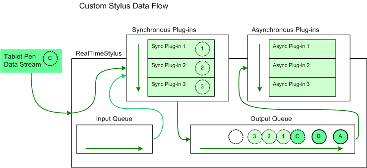
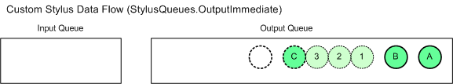
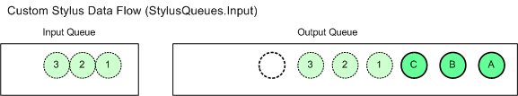
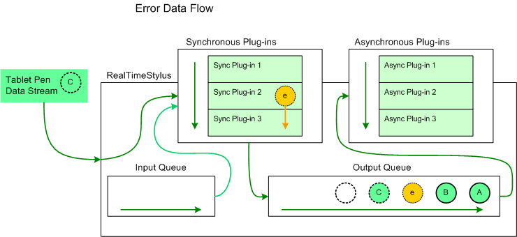
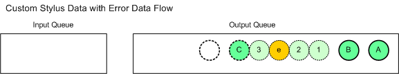

# Plug-in Data and the RealTimeStylus Class

Plug-ins for the [**RealTimeStylus**](realtimestylus-class.md) class must implement the [**IStylusSyncPlugin**](/windows/win32/api/rtscom/nn-rtscom-istylussyncplugin) or [**IStylusAsyncPlugin**](/windows/win32/api/rtscom/nn-rtscom-istylusasyncplugin) interface, or both. While you have to implement all of the plug-in interface methods, your plug-in only receives calls on methods flagged in the plug-ins [Microsoft.StylusInput.IStylusSyncPlugin.DataInterest](/previous-versions/ms574887(v=vs.100)) or [Microsoft.StylusInput.IStylusAsyncPlugin.DataInterest](/previous-versions/ms574886(v=vs.100)) property.

The methods defined on the interfaces use objects in the [Microsoft.StylusInput.PluginData](/previous-versions/ms823992(v=msdn.10)) namespace to pass the pen data to the plug-ins. The following table describes the data objects that are parameters in the notification methods and lists the [DataInterestMask](/previous-versions/ms824787(v=msdn.10)) value associated with the notification.

| Plug-in Data                                                                                          | DataInterestMask Value     | Description                                                                                                                                                                                                                                             |
|-------------------------------------------------------------------------------------------------------|----------------------------|---------------------------------------------------------------------------------------------------------------------------------------------------------------------------------------------------------------------------------------------------------|
| [CustomStylusData](/previous-versions/ms824747(v=msdn.10))                     | **CustomStylusDataAdded**  | Custom application data that a plug-in adds.                                                                                                                                                                                                  |
| [ErrorData](/previous-versions/ms824740(v=msdn.10))                                   | **Error**                  | Error information that the [**RealTimeStylus**](realtimestylus-class.md) object adds in response to an unhandled exception in one of its plug-ins.                                                                                           |
| [InAirPacketsData](/previous-versions/ms824592(v=msdn.10))                     | **InAirPackets**           | Packet information for stylus motion while the stylus is in-air above the digitizer.                                                                                                                                                          |
| [PacketsData](/previous-versions/ms824590(v=msdn.10))                               | **Packets**                | Packet information for stylus motion while the stylus is touching the digitizer.                                                                                                                                                              |
| [RealTimeStylusDisabledData](/previous-versions/ms824576(v=msdn.10)) | **RealTimeStylusDisabled** | Information the [**RealTimeStylus**](realtimestylus-class.md) object adds when it is being disabled.                                                                                                                                         |
| [RealTimeStylusEnabledData](/previous-versions/ms824229(v=msdn.10))   | **RealTimeStylusEnabled**  | Information the [**RealTimeStylus**](realtimestylus-class.md) object adds when it is being enabled.                                                                                                                                          |
| [StylusButtonDownData](/previous-versions/ms824181(v=msdn.10))             | **StylusButtonDown**       | Information about the particular stylus button that is being pressed.                                                                                                                                                                         |
| [StylusButtonUpData](/previous-versions/ms824172(v=msdn.10))                 | **StylusButtonUp**         | Information about the particular stylus button that is being released.                                                                                                                                                                        |
| [StylusDownData](/previous-versions/ms585582(v=vs.100))                                   | **StylusDown**             | Packet information for a stylus as the stylus is brought in contact with the digitizer.                                                                                                                                                       |
| [StylusInRangeData](/previous-versions/ms824090(v=msdn.10))                   | **StylusInRange**          | Information about the particular stylus that is entering the input area of the [**RealTimeStylus**](realtimestylus-class.md) object or entering the detection range of the digitizer above the input area of the **RealTimeStylus** object.  |
| [StylusOutOfRangeData](/previous-versions/ms824072(v=msdn.10))             | **StylusOutOfRange**       | Information about the particular stylus that is leaving the input area of the [**RealTimeStylus**](realtimestylus-class.md) object or leaving the detection range of the digitizer above the input area of the **RealTimeStylus** object.    |
| [StylusUpData](/previous-versions/ms824057(v=msdn.10))                             | **StylusUp**               | Packet information for a stylus as the stylus is lifted from the digitizer.                                                                                                                                                                   |
| [SystemGestureData](/previous-versions/ms824019(v=msdn.10))                   | **SystemGesture**          | Information the [**RealTimeStylus**](realtimestylus-class.md) object adds when it detects a system gesture.                                                                                                                                  |
| [TabletAddedData](/previous-versions/ms824010(v=msdn.10))                       | **TabletAdded**            | Information about the [Tablet](/previous-versions/ms827783(v=msdn.10)) object that is being added.                                                                                                                                                 |
| [TabletRemovedData](/previous-versions/ms823997(v=msdn.10))                   | **TabletRemoved**          | Information about the [Tablet](/previous-versions/ms827783(v=msdn.10)) object that is being removed.                                                                                                                                               |

 

For information about how the [**RealTimeStylus**](realtimestylus-class.md) object handles the tablet pen data stream, see [Working with the RealTimeStylus Class](working-with-the-realtimestylus-class.md).

## Data Interest

The [**RealTimeStylus**](realtimestylus-class.md) object checks the [Microsoft.StylusInput.IStylusSyncPlugin.DataInterest](/previous-versions/ms574887(v=vs.100)) or [Microsoft.StylusInput.IStylusAsyncPlugin.DataInterest](/previous-versions/ms574886(v=vs.100)) property of a plug-in when the plug-in is added to the **RealTimeStylus** object's synchronous or asynchronous plug-in collection. Therefore, you should use the DataInterest property to subscribe to all of the notifications this instance of your plug-in uses, however infrequently, but not to any of the notifications this instance of your plug-in never uses. For notifications that your plug-in only uses occasionally check the state of your plug-in in the notification method first and return if the notification is not used by your plug-in in its current state.

A plug-in only receives calls on methods flagged in the plug-in's [Microsoft.StylusInput.IStylusSyncPlugin.DataInterest](/previous-versions/ms574887(v=vs.100)) or [Microsoft.StylusInput.IStylusAsyncPlugin.DataInterest](/previous-versions/ms574886(v=vs.100)) property. For more information about the possible values of a plug-in's **DataInterest** property, see the [DataInterestMask](/previous-versions/ms824787(v=msdn.10)) enumeration.

## Timing

Data is queued in the [**RealTimeStylus**](realtimestylus-class.md) object before it is passed to the plug-ins in the asynchronous plug-in collection. The following list describes some situations that you may need to account for when designing an asynchronous plug-in.

-   When the [**RealTimeStylus**](realtimestylus-class.md) object is disabled, the asynchronous plug-in may receive other queued notifications before its [RealTimeStylusDisabled](/previous-versions/ms824774(v=msdn.10)) method is called. In this situation, calls from the plug-in to some of the **RealTimeStylus** object's methods and properties throw an exception. Information relevant to your plug-in should be cached when the **RealTimeStylus** object is enabled.
-   The [**RealTimeStylus**](realtimestylus-class.md) object's [ClearStylusQueues](/previous-versions/ms825781(v=msdn.10)) method may remove information from the output queue. Therefore, asynchronous plug-ins cannot rely on receiving all relevant notifications.
-   When a [Tablet](/previous-versions/ms827783(v=msdn.10)) object that is available to the [**RealTimeStylus**](realtimestylus-class.md) object is removed, the asynchronous plug-in may receive queued stylus notification for the tablet before its [TabletRemoved](/previous-versions/bb361092(v=vs.100)) method is called. In this situation, calling the **RealTimeStylus** object's [GetTabletPropertyDescriptionCollection](/previous-versions/ms825935(v=msdn.10)) method does not work. Information relevant to your plug-in should be cached when the **RealTimeStylus** object is enabled or when a new tablet is added.

Depending on your application, you can improve performance when disabling a [**RealTimeStylus**](realtimestylus-class.md) object. When the **RealTimeStylus** object's [Enabled](/previous-versions/ms824832(v=msdn.10)) property is set to **FALSE**, data on the input and output queues are processed until the queues are empty. You can call the **RealTimeStylus** object's [ClearStylusQueues](/previous-versions/ms825781(v=msdn.10)) method to clear the queues before disabling the **RealTimeStylus** object.

## Enabled and Disabled Data

When the [**RealTimeStylus**](realtimestylus-class.md) object is enabled, each plug-in receives a call to its [Microsoft.StylusInput.IStylusSyncPlugin.RealTimeStylusEnabled](/previous-versions/ms824758(v=msdn.10)) or [Microsoft.StylusInput.IStylusAsyncPlugin.RealTimeStylusEnabled](/previous-versions/ms824775(v=msdn.10)) method. The **RealTimeStylusEnabledData** object passed in the notification contains a collection of the context identifiers for the available tablets at the time the **RealTimeStylus** object is enabled.

> [!Note]  
> Because the plug-in data for the [**RealTimeStylus**](realtimestylus-class.md) object's asynchronous plug-in collection is queued, asynchronous plug-ins may receive data prior to receiving a call to its [RealTimeStylusDisabled](/previous-versions/ms824774(v=msdn.10)) method but after the **RealTimeStylus** object is disabled. Note that some of the **RealTimeStylus** object's methods and properties throw an exception if the **RealTimeStylus** object is disabled.

 

The [**RealTimeStylus**](realtimestylus-class.md) object calls the [Microsoft.StylusInput.IStylusSyncPlugin.RealTimeStylusEnabled](/previous-versions/ms824758(v=msdn.10)) and [Microsoft.StylusInput.IStylusSyncPlugin.RealTimeStylusDisabled](/previous-versions/ms824757(v=msdn.10)) methods on the thread from which the **RealTimeStylus** object is enabled or from which the synchronous plug-in is added.

Generally, add or remove plug-ins while the [**RealTimeStylus**](realtimestylus-class.md) object is disabled. For more information about adding and removing plug-ins to the **RealTimeStylus** object, see [Plug-ins and the RealTimeStylus Class](plug-ins-and-the-realtimestylus-class.md).

## Tablet Data

When a tablet that the [**RealTimeStylus**](realtimestylus-class.md) object can use is added to or removed from the Tablet PC while the **RealTimeStylus** object is enabled, the **RealTimeStylus** object notifies its plug-ins that a [Tablet](/previous-versions/ms827783(v=msdn.10)) object has been added or removed. Each **RealTimeStylus** object maintains a list of unique identifiers for the Tablet objects it can interact with. The **RealTimeStylus** object has two methods for translating between the unique identifier and the Tablet object, the [GetTabletContextIdFromTablet](/previous-versions/ms825922(v=msdn.10)) and [GetTabletFromTabletContextId](/previous-versions/ms825929(v=msdn.10)) methods.

> [!Note]  
> Information about a tablet is no longer available from the [**RealTimeStylus**](realtimestylus-class.md) object after the tablet is removed from the Tablet PC.

 

## Tablet Pen Data

The [**RealTimeStylus**](realtimestylus-class.md) object passes information about the tablet pen to its plug-ins in a number of the notification methods. Information about the tablet pen is represented by a [Stylus](/previous-versions/ms824824(v=msdn.10)) object. This object is a snapshot of the state of the tablet pen at the time the data was gathered. Because plug-ins receive the tablet pen data as part of the tablet pen data stream, the plug-ins should use the information in the Stylus object instead of checking for the current state of a particular tablet pen through the [Cursor](/previous-versions/ms839521(v=msdn.10)) class.

Each [Stylus](/previous-versions/ms824824(v=msdn.10)) object contains the tablet context identifier for the tablet that generated the data.

## System Gesture Data

The [**RealTimeStylus**](realtimestylus-class.md) object receives data about system gestures as they are recognized by the Tablet PC. The following table describes the order in which the [SystemGestureData](/previous-versions/ms824019(v=msdn.10)) objects occur in the tablet pen data stream in relation to other tablet pen data.

<table>
<colgroup>
<col style="width: 33%" />
<col style="width: 33%" />
<col style="width: 33%" />
</colgroup>
<thead>
<tr class="header">
<th><a href="/previous-versions/ms827134(v=msdn.10)">SystemGesture</a></th>
<th>Objects that precede the <a href="/previous-versions/ms824019(v=msdn.10)">SystemGestureData</a> object</th>
<th>Objects that come after the <a href="/previous-versions/ms824019(v=msdn.10)">SystemGestureData</a> object</th>
</tr>
</thead>
<tbody>
<tr class="odd">
<td><strong>Tap</strong></td>
<td>The <a href="/previous-versions/ms824107(v=msdn.10)">StylusDownData</a> object. </td>
<td>The [StylusUpData](/previous-versions/ms824057(v=msdn.10)) object. </td>
</tr>
<tr class="even">
<td><strong>DoubleTap</strong></td>
<td>The <a href="/previous-versions/ms824107(v=msdn.10)">StylusDownData</a> object, the <a href="/previous-versions/ms824019(v=msdn.10)">SystemGestureData</a> object for the <strong>Tap</strong> system gesture and the [StylusUpData](/previous-versions/ms824057(v=msdn.10)) objects. </td>
<td>The second <a href="/previous-versions/ms824107(v=msdn.10)">StylusDownData</a> object. </td>
</tr>
<tr class="odd">
<td><strong>RightTap</strong></td>
<td>The <a href="/previous-versions/ms824107(v=msdn.10)">StylusDownData</a> object and the <a href="/previous-versions/ms824019(v=msdn.10)">SystemGestureData</a> object for the <strong>HoldEnter</strong> member of the <a href="/previous-versions/ms827134(v=msdn.10)">SystemGesure</a> enumeration. </td>
<td>The [StylusUpData](/previous-versions/ms824057(v=msdn.10)) object. </td>
</tr>
<tr class="even">
<td><strong>Drag</strong></td>
<td>The <a href="/previous-versions/ms824107(v=msdn.10)">StylusDownData</a> object. </td>
<td>The [StylusUpData](/previous-versions/ms824057(v=msdn.10)) object. </td>
</tr>
<tr class="odd">
<td><strong>RightDrag</strong></td>
<td>The <a href="/previous-versions/ms824107(v=msdn.10)">StylusDownData</a> object. </td>
<td>The [StylusUpData](/previous-versions/ms824057(v=msdn.10)) object. </td>
</tr>
<tr class="even">
<td><strong>HoldEnter</strong></td>
<td>The <a href="/previous-versions/ms824107(v=msdn.10)">StylusDownData</a> object. </td>
<td>The [StylusUpData](/previous-versions/ms824057(v=msdn.10)) object. 
<blockquote>
[!Note] 
This system gesture isn't recognized if the user begins a <strong>Drag</strong> or <strong>RightDrag</strong> system gesture.
</blockquote>
 </td>
</tr>
<tr class="odd">
<td><strong>HoldLeave</strong></td>
<td>Not implemented. </td>
<td>Not implemented. </td>
</tr>
<tr class="even">
<td><strong>HoverEnter</strong></td>
<td>Several <a href="/previous-versions/ms824592(v=msdn.10)">InAirPacketsData</a> objects of low average velocity. </td>
<td><blockquote>
[!Note] 
There may be noticeable delay before receiving the <strong>HoverEnter</strong> system gesture. The <a href="realtimestylus-class.md"><strong>RealTimeStylus</strong></a> object only receives this data if the <strong>RealTimeStylus</strong> object is attached to the window or control that is directly under the pen at the time of the system gesture.
</blockquote>
 </td>
</tr>
<tr class="odd">
<td><strong>HoverLeave</strong></td>
<td>The <a href="/previous-versions/ms824019(v=msdn.10)">SystemGestureData</a> object for the <strong>HoverEnter</strong> system gesture and several <a href="/previous-versions/ms824592(v=msdn.10)">InAirPacketsData</a> objects of sufficient average velocity. </td>
<td><blockquote>
[!Note] 
There may be noticeable delay before receiving the <strong>HoverLeave</strong> system gesture. The <a href="realtimestylus-class.md"><strong>RealTimeStylus</strong></a> object only receives this data if the <strong>RealTimeStylus</strong> object is attached to the window or control that is directly under the pen at the time of the system gesture.
</blockquote>
 </td>
</tr>
</tbody>
</table>

 

## Custom Stylus Data

Custom stylus data can be added to the [**RealTimeStylus**](realtimestylus-class.md) object by calling the [AddCustomStylusDataToQueue](/previous-versions/ms825761(v=msdn.10)) method. Custom stylus data can be added to the **RealTimeStylus** object's queues in one of three places.

-   When the *queue* parameter is set to **Output**, the custom data is added to the [**RealTimeStylus**](realtimestylus-class.md) object's output queue after the data currently being processed by the synchronous plug-in collection.
-   When the *queue* parameter is set to **OutputImmediate**, the custom data is added to the [**RealTimeStylus**](realtimestylus-class.md) object's output queue before the data currently being processed by the synchronous plug-in collection.
-   When the *queue* parameter is set to **Input**, the custom data is added to the [**RealTimeStylus**](realtimestylus-class.md) object's input queue and is sent to the synchronous plug-in collection before new data from the tablet pen's data stream.

In each of the previous cases, data added by subsequent plug-ins in the synchronous plug-in collection is added after data added by preceding plug-ins.

> [!Note]  
> If the call to the [AddCustomStylusDataToQueue](/previous-versions/ms825761(v=msdn.10)) method is made from a synchronous plug-in in response to a call to one of its [**IStylusSyncPlugin**](/windows/win32/api/rtscom/nn-rtscom-istylussyncplugin) methods, then the custom stylus data is added to the tablet pen data stream in a predictable manner; otherwise, it is added to the queue in relation to the current pen data the [**RealTimeStylus**](realtimestylus-class.md) object is processing, and not in relation to the data that the asynchronous plug-in is processing. The AddCustomStylusDataToQueue method throws an exception if the **RealTimeStylus** object is disabled.

 

Custom stylus data is added to the queue as a [CustomStylusData](/previous-versions/ms824747(v=msdn.10)) object and plug-ins receive this data through their [Microsoft.StylusInput.IStylusSyncPlugin.CustomStylusDataAdded](/previous-versions/ms824753(v=msdn.10)) or [Microsoft.StylusInput.IStylusAsyncPlugin.CustomStylusDataAdded](/previous-versions/ms824770(v=msdn.10)) method.

The [**DynamicRenderer**](/previous-versions/windows/desktop/legacy/ms701168(v=vs.85)) and the [**GestureRecognizer**](gesturerecognizer-class.md) objects may add custom stylus data to the queue. For more information about the **DynamicRenderer** and the **GestureRecognizer** objects see [Dynamic-Renderer Plug-ins](dynamic-renderer-plug-ins.md) and [Recognizer Plug-ins](recognizer-plug-ins.md).

The [**RealTimeStylus**](realtimestylus-class.md) object calls the [Microsoft.StylusInput.IStylusSyncPlugin.CustomStylusDataAdded](/previous-versions/ms824753(v=msdn.10)) method on the thread from which it receives the call to its [AddCustomStylusDataToQueue](/previous-versions/ms825761(v=msdn.10)) method.

The following diagram illustrates the addition of custom stylus data to the output queue with the *queue* parameter set to **Output**.

In this diagram, the circles lettered "A" and "B" represent tablet pen data that has already been added to the [**RealTimeStylus**](realtimestylus-class.md) object's output queue and that has not yet been sent to the asynchronous plug-in collection. The circle lettered "C" represents the tablet pen data that the **RealTimeStylus** object is currently processing. It is sent to the synchronous plug-in collection and placed on the output queue. The circles numbered "1", "2", and "3" represent custom stylus data that has been added to the output queue by the first, second, and third synchronous plug-ins respectively in response to the tablet pen data represented by "C". The plug-ins have added the custom stylus data with the *queue* parameter set to **StylusQueues**. The empty circle represents the position in the output queue where future tablet pen data is added.

The following diagram illustrates the addition of custom stylus data to the output queue with the *queue* parameter set to **OutputImmediate**.

In this diagram, the circles lettered "A" and "B" represent tablet pen data that has already been added to the [**RealTimeStylus**](realtimestylus-class.md) object's output queue and that has not yet been sent to the asynchronous plug-in collection. The circle lettered "C" represents the tablet pen data that the **RealTimeStylus** object is currently processing. It is sent to the synchronous plug-in collection and placed on the output queue. The circles numbered "1", "2", and "3" represent custom stylus data that has been added to the output queue by the first, second, and third synchronous plug-ins respectively in response to the tablet pen data represented by "C". The plug-ins have added the custom stylus data with the *queue* parameter set to **OutputImmediate**. The empty circle represents the position in the output queue where future tablet pen data is added.

The following diagram illustrates the addition of custom stylus data to the input queue.

In this diagram, the circles lettered "A" and "B" represent tablet pen data that has already been added to the [**RealTimeStylus**](realtimestylus-class.md) object's output queue and that has not yet been sent to the asynchronous plug-in collection. The circle lettered "C" represents the tablet pen data that the **RealTimeStylus** object is currently processing. It is sent to the synchronous plug-in collection and placed on the output queue. The circles numbered "1", "2", and "3" represent custom stylus data that has been added to the input queue by the first, second, and third synchronous plug-ins respectively in response to the tablet pen data represented by "C". The plug-ins have added the custom stylus data with the *queue* parameter set to **Input**. The custom stylus data numbered "1" is then passed to the synchronous plug-ins and then to the output queue before the custom stylus data numbered "2" and "3", both of which are processed before the next tablet pen data is processed. The empty circle represents the position in the output queue where future tablet pen data is added.

## Error Data

When a plug-in throws an exception, the normal flow of data is interrupted. The [**RealTimeStylus**](realtimestylus-class.md) object generates an [ErrorData](/previous-versions/ms824740(v=msdn.10)) object and calls:

-   The [Microsoft.StylusInput.IStylusSyncPlugin.Error](/previous-versions/ms824754(v=msdn.10)) or [Microsoft.StylusInput.IStylusAsyncPlugin.Error](/previous-versions/ms824771(v=msdn.10)) method of the plug-in that threw the exception.
-   The [Microsoft.StylusInput.IStylusSyncPlugin.Error](/previous-versions/ms824754(v=msdn.10)) or [Microsoft.StylusInput.IStylusAsyncPlugin.Error](/previous-versions/ms824771(v=msdn.10)) method of the remaining plug-ins in that collection.

If the plug-in that threw the exception is a synchronous plug-in, the [ErrorData](/previous-versions/ms824740(v=msdn.10)) object is added to the output queue. Then the [**RealTimeStylus**](realtimestylus-class.md) object resumes normal processing of the original data.

The following diagram illustrates the addition of error data to the tablet pen data.

In this diagram, the circles lettered "A" and "B" represent tablet pen data that has already been added to the [**RealTimeStylus**](realtimestylus-class.md) object's output queue and that has not yet been sent to the asynchronous plug-in collection. The circle lettered "C" represents the tablet pen data that the **RealTimeStylus** object is currently processing. The circle lettered "e" represents a [ErrorData](/previous-versions/ms824740(v=msdn.10)) object generated by the **RealTimeStylus** object when the second synchronous plug-in, Synchronous Plug-in 2, throws an exception while it is processing "C". The **RealTimeStylus** object then pauses its processing of "C" and passes "e" to the plug-in that generated the exception and all subsequent plug-ins. The **RealTimeStylus** object then puts "e" on the output queue and resumes its processing of "C", which is passed to the remaining plug-ins in the synchronous plug-in collection and placed on the output queue after "e". The empty circle represents the position in the output queue where future tablet pen data is added.

If a plug-in throws an exception from its Error method, the [**RealTimeStylus**](realtimestylus-class.md) object catches the exception but does not generate a new [ErrorData](/previous-versions/ms824740(v=msdn.10)) object. This is to prevent recursion.

The error data is added to the output queue after any custom stylus data that is added at the **OutputImmediate** position prior to the exception that created the error data and before any custom stylus data that is added at the **OutputImmediate** position by subsequent plug-ins in the synchronous plug-in collection.

The following diagram illustrates how the error data is added to the output queue in relation to custom data that is added to the **OutputImmediate** queue.

In this diagram, the circles lettered "A" and "B" represent tablet pen data that has already been added to the [**RealTimeStylus**](realtimestylus-class.md) object's output queue and that has not yet been sent to the asynchronous plug-in collection. The circle lettered "C" represents the tablet pen data that the **RealTimeStylus** object is currently processing. The circles numbered "1", "2", and "3" are added by the first, second, and third synchronous plug-ins respectively to the **OutputImmediate** queue in response to the data represented by the circle lettered "C". The circle lettered "e" represents error data generated in response to an exception thrown by the second plug-in after the second plug-in added custom data to the output queue at the **OutputImmediate** position.

If any synchronous plug-in adds custom stylus data to the input queue in response to the error data, the data is added immediately before the error data. If any of the synchronous plug-ins adds custom stylus data to the output queue at the **Output** position in response to the error data, the data is added immediately after the error data.

The [**RealTimeStylus**](realtimestylus-class.md) object calls the [Microsoft.StylusInput.IStylusSyncPlugin.Error](/previous-versions/ms824754(v=msdn.10)) method on the thread from which the exception is thrown.

## Related topics

<dl> <dt>

[Microsoft.Ink.Tablet](/previous-versions/ms827783(v=msdn.10))
</dt> <dt>

[Microsoft.StylusInput.PluginData](/previous-versions/ms823992(v=msdn.10))
</dt> <dt>

[Microsoft.StylusInput.DataInterestMask](/previous-versions/ms575174(v=vs.100))
</dt> <dt>

[Microsoft.StylusInput.RealTimeStylus](/previous-versions/ms824830(v=msdn.10))
</dt> <dt>

[Working with the RealTimeStylus Class](working-with-the-realtimestylus-class.md)
</dt> </dl>

 

 
