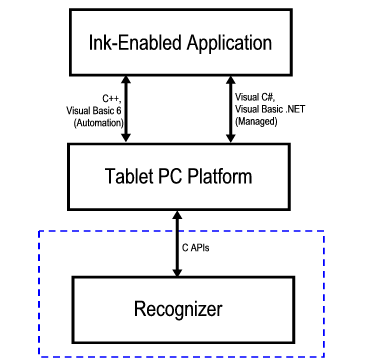

# Recognition API Architecture

An ink-enabled application communicates with the recognition system through the Tablet PC Platform APIs. Applications use the [**IInkRecognizer**](/windows/win32/msinkaut/nn-msinkaut-iinkrecognizer?branch=master) object to accomplish this. The Tablet PC Platform interacts with your recognizer by using the C-style interfaces that are documented in this section. In the following illustration, the area inside the dashed line shows what is documented in this section.

A custom recognizer must include Recapis.h (installed by default in C:\\Program Files\\Microsoft Tablet PC Platform SDK\\Include). Except where noted, your dynamic-link library (DLL) must export all of the API functions, even if you choose to have some of them return E\_NOTIMPL.

Under no circumstances will your recognizer be called directly by an ink-enabled application. Instead, applications will call either the Automation APIs or the Managed APIs to get results from your recognizer.

 

 

