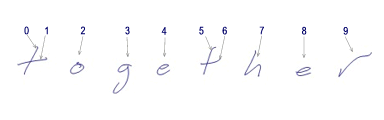
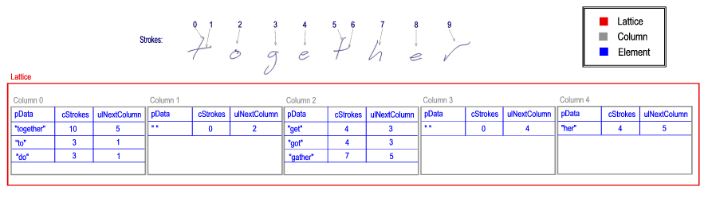

# Recognizer Lattice Structure

Recognizers created for use with Windows Vista and Windows XP Tablet PC Edition use a set of structures, each of which is called a lattice, to pass recognition results back to Tablet PC platform libraries. The Tablet PC platform then copies the information in these structures into the [**IInkRecognitionResult**](/windows/desktop/api/msinkaut/nn-msinkaut-iinkrecognitionresult) object, the [**IInkRecognitionAlternates**](/windows/desktop/api/msinkaut/nn-msinkaut-iinkrecognitionalternates) collection, and the [**IInkRecognitionAlternate**](/windows/desktop/api/msinkaut/nn-msinkaut-iinkrecognitionalternate) object.

A pointer to the lattice should be returned by the recognizer when the platform calls the [**GetLatticePtr**](/windows/desktop/api/recapis/nf-recapis-getlatticeptr) function on the [HRECOCONTEXT](hrecocontext-handle.md) handle.

This section describes the lattice structure in detail. For an overview of recognizers and related concepts, see [About Handwriting Recognition](about-handwriting-recognition.md).

## The Need for a Lattice

A recognizer may find several ways to break a set of ink strokes into recognition segments. What the recognizer uses as a recognition segment depends upon the type of recognizer. English language recognizers typically use words as the recognition segment. Other recognizers might use characters, shapes, or gestures as the recognition segment. The flexibility of the lattice structures allows for logical management of the large number of recognition results that can be combined in complex relationships.

Internally, recognizers use a lattice to hold basic recognition units for a given piece of ink. The lattice also holds the score, or confidence level, of the combined result. In addition, the lattice stores the mapping of segments to the original ink strokes.

The lattice structures are defined in the RecTypes.h header file. The lattice structures include the following structures:

-   [**RECO\_LATTICE**](/windows/win32/api/rectypes/ns-rectypes-reco_lattice)
-   [**RECO\_LATTICE\_COLUMN**](/windows/win32/api/rectypes/ns-rectypes-reco_lattice_column)
-   [**RECO\_LATTICE\_ELEMENT**](/windows/win32/api/rectypes/ns-rectypes-reco_lattice_element)
-   [**RECO\_LATTICE\_PROPERTIES**](/windows/win32/api/rectypes/ns-rectypes-reco_lattice_properties)
-   [**RECO\_LATTICE\_PROPERTY**](/windows/win32/api/rectypes/ns-rectypes-reco_lattice_property)

## Lattice Components

The following examples use the strokes for the word "together" as shown in the following image. In the examples, the segments are evaluated as one or more words. The numbers represent the individual strokes in the segment being evaluated. Note that each of the "t" characters contains two strokes.

A lattice is composed of one or more columns, one for each segment. Each column in turn contains one or more elements. An element holds a discrete recognition alternate. For more information about columns, see the [**RECO\_LATTICE\_COLUMN**](/windows/win32/api/rectypes/ns-rectypes-reco_lattice_column) structure. For more information about elements, see the [**RECO\_LATTICE\_ELEMENT**](/windows/win32/api/rectypes/ns-rectypes-reco_lattice_element) structure.

The recognizer might return a single segment when evaluating the ink sample shown in the previous example. In this case the lattice contains a single column with a single element.

A more complex example presents itself when the recognizer evaluates the ink sample and comes up with multiple segments and multiple alternates for each segment.

The number of recognition alternates may be staggering, even for a small ink sample. For example, "t o g e t h e r" can yield the following results:

-   "to get her" (plus alternates for each word)
-   "to gather" (plus alternates for each word)
-   "to got her" (plus alternates for each word)
-   "together" (plus alternates for the word)

In this case, a recognizer might create the following lattice structure.

> [!Note]  
> Each column shares the same stroke order because they all refer to the same [InkStrokes](/previous-versions/windows/desktop/legacy/ms703293(v=vs.85)) collection.

 

 

 
