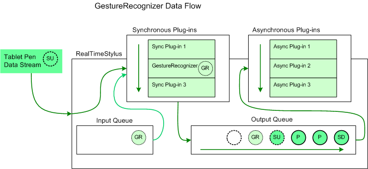

# Recognizer Plug-ins

A recognizer plug-in is an object that monitors the movement of the tablet pen for gesture, handwriting, or other objects.

## System Gestures

The [**RealTimeStylus**](realtimestylus-class.md) object recognizes system gestures. The **RealTimeStylus** object adds a [SystemGestureData](/previous-versions/ms824019(v=msdn.10)) object to the [StylusQueues](/previous-versions/ms824786(v=msdn.10)) queue in response to the data that finishes the gesture, such as a [StylusUpData](/previous-versions/ms824057(v=msdn.10)) object for the [SystemGesture](/previous-versions/bb345349(v=vs.100)). For more information, see [Plug-in Data and the RealTimeStylus Class](plug-in-data-and-the-realtimestylus-class.md).

## The GestureRecognizer Object

The [**GestureRecognizer**](gesturerecognizer-class.md) object implements the [**IStylusSyncPlugin**](/windows/win32/api/rtscom/nn-rtscom-istylussyncplugin) and [**IStylusAsyncPlugin**](/windows/win32/api/rtscom/nn-rtscom-istylusasyncplugin) interfaces. The **GestureRecognizer** object recognizes application gestures. Internally, the **GestureRecognizer** object uses the Microsoft gesture recognizer to perform gesture recognition.

When the [**GestureRecognizer**](gesturerecognizer-class.md) object recognizes a gesture, it adds custom stylus data to the [StylusQueues](/previous-versions/ms824786(v=msdn.10)) queue in response to the [StylusUpData](/previous-versions/ms824057(v=msdn.10)) object for the stroke. The [CustomStylusData](/previous-versions/ms575208(v=vs.100)) object's [CustomDataId](/previous-versions/ms824748(v=msdn.10)) property is set to the [GestureRecognitionDataGuid](/previous-versions/ms826344(v=msdn.10)) value, and the CustomStylusData object's [Data](/previous-versions/ms824749(v=msdn.10)) property contains a [GestureRecognitionData](/previous-versions/ms824594(v=msdn.10)) object.

The following diagram illustrates how the [**GestureRecognizer**](gesturerecognizer-class.md) object adds data to the tablet pen data.

In this diagram the circle lettered "SD" represents a [StylusDownData](/previous-versions/ms824107(v=msdn.10)) object and the circles lettered "P" represent [PacketsData](/previous-versions/ms824590(v=msdn.10)) objects that have already been added to the [**RealTimeStylus**](realtimestylus-class.md) object's output queue and that have not yet been sent to the asynchronous plug-in collection. The circle lettered "SU" represents a [StylusUpData](/previous-versions/ms824057(v=msdn.10)) object that the **RealTimeStylus** object is currently processing. It is sent to the synchronous plug-in collection and then placed on the output queue. The circles lettered "GR" represent custom stylus data that is added to the input queue by the [**GestureRecognizer**](gesturerecognizer-class.md) plug-in in response to the stylus up notification associated with "SU". The custom stylus data lettered "GR" is then passed to the synchronous plug-ins and then to the output queue before the next tablet pen data is processed. The empty circle represents the position in the output queue where future tablet pen data is added.

By default, the [**GestureRecognizer**](gesturerecognizer-class.md) object recognizes only single-stroke gestures; however, the **GestureRecognizer** object can be set to recognize multistroke gestures. For multistroke gestures, the [CustomStylusData](/previous-versions/ms575208(v=vs.100)) object is added to the [StylusQueues](/previous-versions/ms824786(v=msdn.10)) queue in response to the [StylusUpData](/previous-versions/ms824057(v=msdn.10)) object for the final stroke of the gesture. When recognizing multistroke gestures, you may receive notifications for overlapping sets of strokes. For example, the first and second strokes together may be recognized as one gesture and the second stroke by itself may be recognized as a gesture. For more information about multistroke gesture recognition, see the **GestureRecognizer** class and the [MaxStrokeCount](/previous-versions/ms826053(v=msdn.10)) property.

If you are using the [**GestureRecognizer**](gesturerecognizer-class.md) object for multistroke gesture recognition, you may achieve optimal performance by using a cascaded [**RealTimeStylus**](realtimestylus-class.md) model and attaching the **GestureRecognizer** object to the secondary **RealTimeStylus** object. For more information about the cascading **RealTimeStylus** model, see [The Cascaded RealTimeStylus Model](the-cascaded-realtimestylus-model.md).

### Special Considerations

The following list describes other points to take into consideration when using the [**GestureRecognizer**](gesturerecognizer-class.md) object.

-   You should not attach a [**GestureRecognizer**](gesturerecognizer-class.md) object to more than one [**RealTimeStylus**](realtimestylus-class.md) object. Once two **RealTimeStylus** objects to which the **GestureRecognizer** object is attached are enabled, the following occurs.
    -   The [**GestureRecognizer**](gesturerecognizer-class.md) object throws an exception in response to the second call to its RealTimeStylusEnabled method.
    -   The second [**RealTimeStylus**](realtimestylus-class.md) object that was enabled generates a [ErrorData](/previous-versions/ms824740(v=msdn.10)) object and notifies the remaining plug-ins in its plug-in collections of the error.
    -   The [**GestureRecognizer**](gesturerecognizer-class.md) object stops recognizing gestures.
-   The [**RealTimeStylus**](realtimestylus-class.md) object throws an exception when its [AddCustomStylusDataToQueue](/previous-versions/ms825761(v=msdn.10)) method is called with the *guid* parameter set to the [Microsoft.StylusInput.GestureRecognizer.GestureRecognitionDataGuid](/previous-versions/ms826344(v=msdn.10)) globally unique identifier (GUID).
-   The [**GestureRecognizer**](gesturerecognizer-class.md) object is implemented as a Component Object Model (COM) wrapper, and you cannot call its [**IStylusSyncPlugin**](/windows/win32/api/rtscom/nn-rtscom-istylussyncplugin) or [**IStylusAsyncPlugin**](/windows/win32/api/rtscom/nn-rtscom-istylusasyncplugin) interface methods directly. For more information about COM implementation and the [**RealTimeStylus**](realtimestylus-class.md) object, see [Implementation Notes for the StylusInput APIs](implementation-notes-for-the-stylusinput-apis.md).

## Custom Gesture Recognition

You can create a custom recognizer plug-in that recognizes handwriting, gestures, or other objects by:

-   Passing the stroke information to an existing [Recognizer](/previous-versions/ms829434(v=msdn.10)) object and using the [AddCustomStylusDataToQueue](/previous-versions/ms825761(v=msdn.10)) method to add the results to the tablet pen data stream.
-   Performing the recognition within your plug-in and using the [AddCustomStylusDataToQueue](/previous-versions/ms825761(v=msdn.10)) method to add the results to the tablet pen data stream.

## Related topics

<dl> <dt>

[Application Gestures](application-gestures.md)
</dt> <dt>

[System Gestures](system-gestures.md)
</dt> <dt>

[Timeline of Mouse Messages and System Events](timeline-of-mouse-messages-and-system-events.md)
</dt> </dl>

 

 
