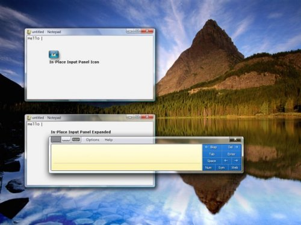
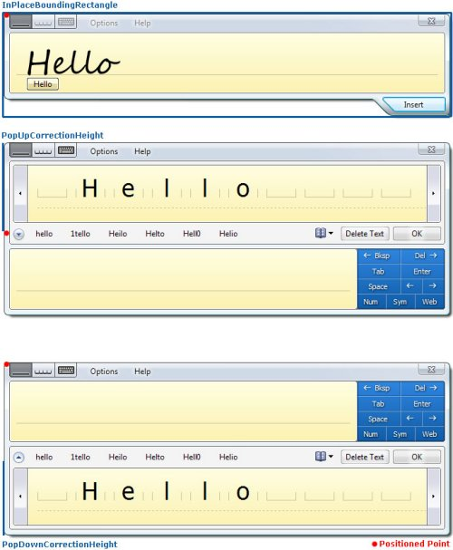
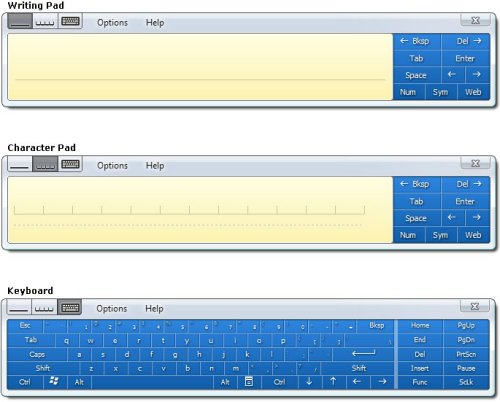
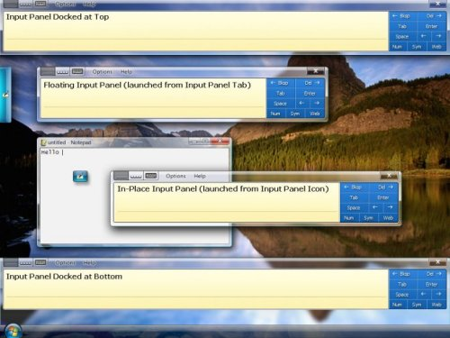
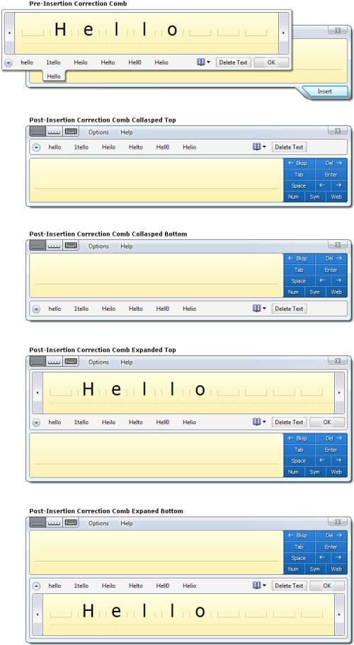

# TextInputPanel for Users of PenInputPanel

The release of Windows Vista includes a new programmability object for the Tablet PC Input Panel that provides a new range of possibility for how an application can use and interact with Input Panel. For the first time application developers can position the In-Place Input Panel Icon to line up with a text box or place it in the corner of a customer inking surface to offer access to an alternative input mode. Developers have the same control over positioning once the Input Panel Icon is expanded into the In-Place Input Panel. This makes it possible to assure the In-Place Input Panel never overlaps with key user interface elements in an application's layout or even to reflow an application's user interface to make space for the In-Place Input Panel and then place it in the reserved space. The new programmability model includes support for more than just positioning though, developers can also customize the input area, correction mode, and many other properties of Input Panel to tailor make the text entry experience in an application. Lastly, for the first time it is possible for an application to receive the user ink, in addition to the recognized text, associated with text insertions from Input Panel. This enables new application scenarios including ink in change tracking logs and allowing users to edit or view ink in the application. These new programmability features are the direct result of feedback Microsoft has received about the Input Panel developer story and represent the first step toward tighter integration of applications and Input Panel.

In order to provide this enriched Input Panel programmability model the existing mechanism for programmatically interacting with Input Panel, the [**PenInputPanel**](peninputpanel-class.md) object, is being deprecated and replaced by the new [**TextInputPanel**](/windows/desktop/api/peninputpanel/nn-peninputpanel-itextinputpanel) object. In addition to providing new programmability features, the **TextInputPanel** object also provides close to all of the programmatic capabilities of the **PenInputPanel** object. The **TextInputPanel** object is included in both Windows Vista and the Windows Vista Software Developer Kit. The **TextInputPanel** object is only compatible with the Windows Vista Input Panel and cannot be used with the Windows XP Service Pack 2 or older Input Panel. Application that were previously written to use the **PenInputPanel** object will continue to work with the Windows Vista Input Panel, however, when writing new Tablet applications developers are strongly encouraged to use the new **TextInputPanel** object instead of the deprecated **PenInputPanel** object.

Each of the programmability options of the [**TextInputPanel**](/windows/desktop/api/peninputpanel/nn-peninputpanel-itextinputpanel) object can be applied on a per text field basis. This is accomplished by attaching an instance of the **TextInputPanel** object using the [**AttachedEditWindow**](/windows/desktop/api/peninputpanel/nf-peninputpanel-itextinputpanel-get_attachededitwindow) property. The property should be set to the window handle for the text field.

> [!Note]  
> : Several of the properties and methods describe below apply when Input Panel is in the in-place interaction mode and not when Input Panel is in the floating or docked interaction mode. The in-place interaction mode is the Input Panel behavior where placing focus in an editable field causes the Input Panel Icon to appear next to the field, and tapping on the Input Panel Icon causes Input Panel to expand. The methods and properties that only apply when Input Panel is in the in-place interaction mode all contain 'InPlace' in the method or property name.

 

## Control of Input Panel Icon and Input Panel Visibility

The first aspect of Input Panel which application developers have more control over in Windows Vista is its visibility. Using the [**TextInputPanel**](/windows/desktop/api/peninputpanel/nn-peninputpanel-itextinputpanel) object it is possible to control the visibility of the In-Place Input Panel in three ways. With a combination of properties and methods an application can determine if the In-Place Input Panel shows, when the In-Place Input Panel shows, and whether it appears first as the Input Panel Icon or immediately shows expanded. By combining these techniques for controlling visibility with the techniques for controlling positioning discussed in the next section it is possible for application developers to create custom launch points and custom work flows using the In-Place Input Panel in an application.

> [!Note]  
> The properties and methods discussed in this section only apply when Input Panel is in the In-Place interaction mode.

 

First and most basically, it is possible to prevent the In-Place Input Panel and the Input Panel Icon from ever appearing by setting the [**InPlaceVisibleOnFocus**](/windows/desktop/api/peninputpanel/nf-peninputpanel-itextinputpanel-get_inplacevisibleonfocus) property to **false**. Setting it to **true** reverts it to the system default of appearing when possible, provided it has not been disabled by the user or Group Policy. This option is useful for applications that include custom text entry solutions as an alternative to Input Panel.

Second, by setting the [**DefaultInPlaceState**](/windows/desktop/api/peninputpanel/nf-peninputpanel-itextinputpanel-get_defaultinplacestate) property a developer can specify which in-place state, as specified by the [**InPlaceState**](/windows/win32/api/peninputpanel/ne-peninputpanel-inplacestate) enumeration, the In-Place Input Panel appears in when focus is placed in a text field. The system default is for the In-Place Input Panel to appear in the hover state unless Input Panel is already visible in the expanded state, in which case Input Panel remains expanded. Setting the **DefaultInPlaceState** property to **InPlaceState\_Expanded** causes the In-Place Input Panel to always appear expanded, rather than the Input Panel Icon appearing first and then requiring the user to tap the Input Panel Icon before Input Panel expands. The other two options are **InPlaceState\_Auto**, which is the system default behavior and **InPlaceState\_HoverTarget** which always causes the Input Panel Icon to appear. The ability to specify that the In-Place Input Panel always appear expanded is new with the [**TextInputPanel**](/windows/desktop/api/peninputpanel/nn-peninputpanel-itextinputpanel) object and not possible using the [**PenInputPanel**](peninputpanel-class.md) object. The following illustration shows the In-Place Input Panel icon and expanded states of the panel.

In addition to being able to control the in-place state, it is also possible for a developer to determine the in-place state at a given moment by getting the [**CurrentInPlaceState**](/windows/desktop/api/peninputpanel/nf-peninputpanel-itextinputpanel-get_currentinplacestate) property. The **CurrentInPlaceState** is equal to [**DefaultInPlaceState**](/windows/desktop/api/peninputpanel/nf-peninputpanel-itextinputpanel-get_defaultinplacestate) when Input Panel is not visible, except when the **DefaultInPlaceState** is **InPlaceState\_Auto** in which case the **CurrentInPlaceState** becomes **InPlaceState\_HoverTarget**. The [**InPlaceVisibilityChanging**](/windows/desktop/api/peninputpanel/nf-peninputpanel-itextinputpaneleventsink-inplacevisibilitychanging) / [**InPlaceVisibilityChanged**](/windows/desktop/api/peninputpanel/nf-peninputpanel-itextinputpaneleventsink-inplacevisibilitychanged) events can be used to keep track on the In-Place Input Panel's visibility state.

Lastly, a developer can force the In-Place Input Panel to hide or show using the [**SetInPlaceVisibility**](/windows/desktop/api/peninputpanel/nf-peninputpanel-itextinputpanel-setinplacevisibility) method. If the developer has previously set the [**DefaultInPlaceState**](/windows/desktop/api/peninputpanel/nf-peninputpanel-itextinputpanel-get_defaultinplacestate) property, Input Panel appears in the specified state when forced to show. An application is only permitted to hide or show the In-Place Input Panel when focus is currently in the window the [**TextInputPanel**](/windows/desktop/api/peninputpanel/nn-peninputpanel-itextinputpanel) object is attached to and when the user does not have Input Panel open in another interaction mode, such as docked or floating. The ability to force the In-Place Input Panel to hide or show is also new with the **TextInputPanel** object and not possible using the [**PenInputPanel**](peninputpanel-class.md) object.

These options give application developers fine grain control over when the In-Place Input Panel appears and in what state. By customizing the default in-place state and controlling the in-place visibility independently of focus changes an application developer can create a custom work flow when Input Panel responds to either application settings or user input into an application.

## Absolute Positioning of Input Panel Icon and Input Panel

Possibly the most compelling new feature found in the [**TextInputPanel**](/windows/desktop/api/peninputpanel/nn-peninputpanel-itextinputpanel) object is absolute positioning of the In-Place Input Panel. With this new capability an application developer can ensure that the In-Place Input Panel does not overlap with one or more key visual elements in an application layout. Using the [**PenInputPanel**](peninputpanel-class.md) object it was possible to position the In-Place Input Panel relative to a text field based on an offset, however, Input Panel would still adjust itself to keep on the screen. For the first time in Vista an application can position the In-Place Input Panel at an absolute position using screen coordinates. Additionally, the responsibility of keeping Input Panel on the screen is left to the application developer therefore removing the chance that Input Panel will automatically, and seemingly randomly, reposition itself.

> [!Note]  
> The properties and methods discussed in this section only apply when Input Panel is in the In-Place interaction mode.

 

The two primary methods necessary for absolutely positioning the In-Place Input Panel are [**SetInPlacePosition**](/windows/desktop/api/peninputpanel/nf-peninputpanel-itextinputpanel-setinplaceposition) and [**SetInPlaceHoverTargetPosition**](/windows/desktop/api/peninputpanel/nf-peninputpanel-itextinputpanel-setinplacehovertargetposition). The first is used to specify the location of the In-Place Input Panel and the second is used to specify the location of the Input Panel Icon for the In-Place Input Panel. If an application chooses to only set the Input Panel Icon location and not the location of the In-Place Input Panel, then the In-Place Input Panel appears in the default location determined by the system. Similarly if an application repositions the In-Place Input Panel but not the Input Panel Icon, the Input Panel Icon appears in the default location. Location is specified in screen coordinates. The actual point being positioned is the upper left corner of the Input Panel Icon or Input Panel with no Correction Comb expanded. When the Correction Comb is expanded, the point being positioned does not change. (See Figure 2 below)There are no restricts on where the In-Place Input Panel and the In-Place Input Panel Icon can be places and it is the responsibility of the applications calling these methods to keep them on the screen. Both methods are synchronous, meaning positioning occurs before the method returns. In the case where Input Panel is already open in the floating or docked interaction mode, an attempt to position the In-Place Input Panel or the In-Place Input Panel Icon fails. Additionally the methods fail if the window attached to the [**TextInputPanel**](/windows/desktop/api/peninputpanel/nn-peninputpanel-itextinputpanel) object does not currently have focus.

A call to [**SetInPlacePosition**](/windows/desktop/api/peninputpanel/nf-peninputpanel-itextinputpanel-setinplaceposition) or [**SetInPlaceHoverTargetPosition**](/windows/desktop/api/peninputpanel/nf-peninputpanel-itextinputpanel-setinplacehovertargetposition) does not automatically cause the In-Place Input Panel or Input Panel Icon to show, it simply sets the position for the next time they are shown. Calling [**SetInPlaceVisibility**](/windows/desktop/api/peninputpanel/nf-peninputpanel-itextinputpanel-setinplacevisibility) can be used to force them to show immediately.

When positioning the In-Place Input Panel calculating whether it will go off the screen can be a little tricky. To make this process easier, there are several properties of the [**TextInputPanel**](/windows/desktop/api/peninputpanel/nn-peninputpanel-itextinputpanel) object that can be used to simplify this process. Together these properties and event can be used to determine the exact size of the In-Place Input Panel in all of its states:

-   [**InPlaceBoundingRectangle**](/windows/desktop/api/peninputpanel/nf-peninputpanel-itextinputpanel-get_inplaceboundingrectangle)– This property provides the bounding rectangle for the In-Place Input Panel when the largest input area for the current input language is showing. If the Writing Pad or Character Pad are determined to the largest input area, then the height of the Insert button is included. It does not include the height of the Correction Comb. When the In-Place Input Panel auto grows, [**InPlaceSizeChanging**](/windows/desktop/api/peninputpanel/nf-peninputpanel-itextinputpaneleventsink-inplacesizechanging) / [**InPlaceSizeChanged**](/windows/desktop/api/peninputpanel/nf-peninputpanel-itextinputpaneleventsink-inplacesizechanged) event pair is fired and the value of this property is updated to include the additional writing area or writing line.
-   [**PopUpCorrectionHeight**](/windows/desktop/api/peninputpanel/nf-peninputpanel-itextinputpanel-get_popupcorrectionheight)– This property specifies the height of the Post-Insertion Correction Comb when it is positioned above Input Panel. To get the full height of the In-Place Input Panel with the Post-Insertion Correction Comb popped-up, add the height of the [**InPlaceBoundingRectangle**](/windows/desktop/api/peninputpanel/nf-peninputpanel-itextinputpanel-get_inplaceboundingrectangle) to the **PopUpCorrectionHeight**.

As a simpler alternative to setting the absolute position of the In-Place Input Panel and Input Panel Icon, an application can just specify whether the In-Place Input Panel defaults to appearing above or below a text entry field. In this way it is possible to avoid overlapping elements in the application layout in a more loosely controlled manner. To do this the application sets the [**PreferredInPlaceDirection**](/windows/desktop/api/peninputpanel/nf-peninputpanel-itextinputpanel-get_preferredinplacedirection) to **InPlaceDirection\_Bottom** or **InPlaceDirection\_Top**. The property is a preference because the In-Place Input Panel overrides the preference set by the application when necessary to keep Input Panel on the screen. The system default is to position the In-Place Input Panel below a text field when possible and otherwise to position it above. Setting the **PreferredInPlaceDirection** to **InPlaceDirection\_Auto** restores the system default.

Together the properties, methods and events of the [**TextInputPanel**](/windows/desktop/api/peninputpanel/nn-peninputpanel-itextinputpanel) object give developers the necessary control over the In-Place Input Panel to be able to cleverly position the In-Place Input Panel and Input Panel Icon in an application layout so they do not disrupt the layout flow and in some case may appear integrated. This new level of control is a big win for Tablet application design.

## Access to the Three Input Panel Areas: Writing Pad, Character Pad and Keyboard

Input Panel has three input areas, the Writing Pad, Character Pad, and Keyboard. Using the [**TextInputPanel**](/windows/desktop/api/peninputpanel/nn-peninputpanel-itextinputpanel) object an application can specify the default input area that is shown to the user when Input Panel opens. The main reason for an application to do so is to pair the input area with the input type of specific field. For example, the Writing Pad is probably best suited for filling out a comments field, but the Keyboard may be more convenient for entering a product serial number that contains both numbers and letters. In order to specify the default input area an applications sets the [**DefaultInputArea**](/windows/desktop/api/peninputpanel/nf-peninputpanel-itextinputpanel-get_defaultinputarea) property to one of the three input areas as defined by the [**PanelInputArea**](/windows/win32/api/peninputpanel/ne-peninputpanel-panelinputarea) enumeration. The following illustration shows the three input areas.

The system default input area is the Writing Pad for English, French, German, Spanish, Italian, Portuguese, Dutch and all other Latin input languages. For the East Asian input languages, including Japanese, Chinese, and Korean, the default input area is the Character Pad. However, when the user changes input area it overrides the default input area for the current input language and is stored as the new default for that input language. The Keyboard is the default input area for password fields, regardless of the input language unless password security has been disabled by the user or group policy. In all cases setting the default input panel area programmatically overrides the system default, unless the current field is a password field or the handwriting recognizer for the current input language does no support the programmatically selected input area. Setting the [**DefaultInputArea**](/windows/desktop/api/peninputpanel/nf-peninputpanel-itextinputpanel-get_defaultinputarea) property to **InPlaceDirection\_Auto** restores the system default settings.

Regardless of whether the default input panel area has been set programmatically, or not, the user has the option to change the current input panel area once Input Panel is open. After the user has changed the current input area, the user selection persists until Input Panel closes or the user changes the selection again. After Input Panel closes and reopens, the programmatically set default input area re-shows.

Since the current input panel area may be different that the default input panel area, an application can query the [**CurrentInputArea**](/windows/desktop/api/peninputpanel/nf-peninputpanel-itextinputpanel-get_currentinputarea) property to determine which input area is currently visible. If Input Panel is not currently visible, the current input area is equal to the default input area. The **CurrentInputArea** property is never equal to **PanelInputArea\_Auto**. If the [**DefaultInputArea**](/windows/desktop/api/peninputpanel/nf-peninputpanel-itextinputpanel-get_defaultinputarea) is equal to **PanelInputArea\_Auto**, then the **CurrentInputArea** is equal to the last input area shown or the system default for the current input language if Input Panel has never been shown.

The primary difference between the input area support found in the [**PenInputPanel**](peninputpanel-class.md) object and that of the [**TextInputPanel**](/windows/desktop/api/peninputpanel/nn-peninputpanel-itextinputpanel) object is the fact that the application now has the option to set the default input area to the Character Pad, in addition to the Writing Pad and Keyboard.

Using the above properties an application can control the Input Panel input area shown in different fields and optimize the user's text input experience. Additionally, the application can maintain awareness of the current input area and make conditional decisions according to which input area is best suited to the current user task.

## Detailed Information about Input Panel's Interaction Mode

In additional to being able to detect Input Panel's current input area, it is also possible to detect the current interaction mode: In-Place, Docked or Floating. It may be important for the application to know the current interaction mode either to understand how the user is interacting with the application or because some methods and properties of the [**TextInputPanel**](/windows/desktop/api/peninputpanel/nn-peninputpanel-itextinputpanel) object only apply to the In-Place interaction mode. For example in application the reflows existing user interface elements and then positions the In-Place Input Panel over a blank area in its user interfaces should check to make sure the current interaction mode is in-place before making adjustments.

The [**CurrentInteractionMode**](/windows/desktop/api/peninputpanel/nf-peninputpanel-itextinputpanel-get_currentinteractionmode) property, of the [**TextInputPanel**](/windows/desktop/api/peninputpanel/nn-peninputpanel-itextinputpanel) object, stores the current interaction mode as chosen by the user. The possible modes are defined by the [**InteractionMode**](/windows/win32/api/peninputpanel/ne-peninputpanel-interactionmode) enumeration as:

**InteractionMode\_InPlace**– In the In-Place interaction mode Input Panel appears next to the text entry field that currently has focus. By default, the In-Place Input Panel Icon appears when an insertion point is placed in a text entry field. Tapping on the Input Panel Icon causes Input Panel to expand. The In-Place Input Panel is only visible when an insertion point is in an editable field.

InteractionMode\_Floating – The Floating interaction mode is similar to the InPlace interaction mode, except it is not tied to an insertion point. The Floating Input Panel is opened by tapping on the Input Panel tab which appears by default on the left edge of the screen. Both the Floating Input Panel and Input Panel tab can be dragged and repositioned by the user. In the floating mode positioning and control of Input Panel is left entirely to the user.

InteractionMode\_DockedTop – In the Docked-Top interaction mode Input Panel appears at the top of the screen and the active desktop is resized so Input Panel does not overlap with any other windows or UI elements. In the docked mode Input Panel cannot be dragged or moved around.

InteractionMode\_DockedBottom – The Docked-Bottom interaction mode is the same as the Docked-Top mode except Input Panel appears at the bottom of the screen.

When Input Panel is not visible, the current interaction mode is In-Place.

Publishing the current interaction model is another way the [**TextInputPanel**](/windows/desktop/api/peninputpanel/nn-peninputpanel-itextinputpanel) object provides more information about the state of Input Panel than has been available in any previous version.

## Detailed Information about Input Panel's Correction Mode

The final aspect of Input Panel that the [**TextInputPanel**](/windows/desktop/api/peninputpanel/nn-peninputpanel-itextinputpanel) object gives you detailed information about and control of is the correction mode. Knowing the correction mode helps applications determine the current size of Input Panel. Controlling how the Post-Insertion Correction expands in an application is one way to customize the correction experience in an application.

There are two basic modes the Correction Comb can appear in: Pre-Insertion and the Post-Insertion. The Pre-Insertion Correction Comb is used to correct text before inserting it into an application. It is activated by tapping on the pending text that appear below the baseline in the Writing Pad as the user inks. The Post-Insertion Correction Comb is used to correct text after it has been inserted into an application. It is activated by placing the insertion point in or selecting text that was previously inserted. Beyond the two basic modes, there are several variations on how the Post-Insertion Correction Comb can appear. First it can appear either above or below Input Panel and second it can appear collapsed or expanded. In the collapsed state the Post-Insertion Correction Comb only shows a list of alternates. In the expanded state it includes both the alternates and an area to rewrite the word.

The [**CurrentCorrectionMode**](/windows/desktop/api/peninputpanel/nf-peninputpanel-itextinputpanel-get_currentcorrectionmode) property allows an application to determine the current configuration of the Correction Comb. The possible values of this property as defined by the [**CorrectionMode**](/windows/win32/api/peninputpanel/ne-peninputpanel-correctionmode) enumerations are: **NotVisible**, **PreInsertion**, **PostInsertionCollapsed**, and **PostInsertionExpanded**. When no Input Panel or Correction Comb is visible, the **CurrentCorrectionMode** is **NotVisible**.

By default the system shows the Post-Insertion Correction Comb expanded when the selects correctable text and shows it collapsed when the insertion point is placed in correctable text. An application can specify where the Post-Insertion Correction Comb should always show expanded by setting the [**ExpandPostInsertionCorrection**](/windows/desktop/api/peninputpanel/nf-peninputpanel-itextinputpanel-get_expandpostinsertioncorrection) property to **true**. The system default is **false**. When the **ExpandPostInsertionCorrection** property is used in conjunction with the [**IHandWrittenTextInsertion**](/windows/desktop/api/peninputpanel/nn-peninputpanel-ihandwrittentextinsertion) interface an application developer can cheaply add correction support to applications that would not get it automatically.

Tracking and controlling the correction state of the Input Panel is one of the many new features of the [**TextInputPanel**](/windows/desktop/api/peninputpanel/nn-peninputpanel-itextinputpanel) object that make tighter Input Panel and application integration possible.

## Event Notification Before and After the Event Occurs

Another aspect of Input Panel programmability that is greatly improved in the [**TextInputPanel**](/windows/desktop/api/peninputpanel/nn-peninputpanel-itextinputpanel) object is the event model. Now instead of only raising events signaling a change in Input Panel's state after the change has occurred there are separate events sent before and after the change occurs. Events signaling the start of an event contain present tense verbs such as 'Changing' or 'Inserting', while events signaling the conclusion of an event contain past tense verbs such as 'Changed' or 'Inserted'.

This event model makes it possible for an application to react to a change before or as it occurs. Input Panel is blocked from proceeding with a change or resuming after change until the event handlers for all events have completed. These events are synchronous and in this way an application can delay a change until it has finished reacting. However, the time where an event handler is executing Input Panel becomes inaccessible to the user and may appear hung, therefore it is important that event handler perform well. However, it is not possible for an application to prevent or cancel an event. All event parameters are read-only. Below is a description of the [**TextInputPanel**](/windows/desktop/api/peninputpanel/nn-peninputpanel-itextinputpanel) object's six event pairs:

-   [**InPlaceStateChanging**](/windows/desktop/api/peninputpanel/nf-peninputpanel-itextinputpaneleventsink-inplacestatechanging) / [**InPlaceStateChanged**](/windows/desktop/api/peninputpanel/nf-peninputpanel-itextinputpaneleventsink-inplacestatechanged)– Notification that the in-place state is about to or has just switched from hover to expanded or vice versa. Parameters are the new and old in-place state. Coincidences with a change in the value of the [**CurrentInPlaceState**](/windows/desktop/api/peninputpanel/nf-peninputpanel-itextinputpanel-get_currentinplacestate) property.
-   [**InPlaceSizeChanging**](/windows/desktop/api/peninputpanel/nf-peninputpanel-itextinputpaneleventsink-inplacesizechanging) / [**InPlaceSizeChanged**](/windows/desktop/api/peninputpanel/nf-peninputpanel-itextinputpaneleventsink-inplacesizechanged)– Indicated when the In-Place Input Panel size is about to change or has changed due to a user resize, auto growth, or an input area change. Parameters are the new and old bounding rectangle. Coincidences with a change in the value of the [**InPlaceBoundingRectangle**](/windows/desktop/api/peninputpanel/nf-peninputpanel-itextinputpanel-get_inplaceboundingrectangle) property.
-   [**InputAreaChanging**](/windows/desktop/api/peninputpanel/nf-peninputpanel-itextinputpaneleventsink-inputareachanging) / [**InputAreaChanged**](/windows/desktop/api/peninputpanel/nf-peninputpanel-itextinputpaneleventsink-inputareachanged)– Reports when the Input Panel input area is about to change or has changed from to the other of the three possible input areas: Writing Pad, Character Pad or Keyboard. Parameters are the new and old input area. Coincides with a change in the value of the [**CurrentInputArea**](/windows/desktop/api/peninputpanel/nf-peninputpanel-itextinputpanel-get_currentinputarea) property
-   [**CorrectionModeChanging**](/windows/desktop/api/peninputpanel/nf-peninputpanel-itextinputpaneleventsink-correctionmodechanging) / [**CorrectionModeChanged**](/windows/desktop/api/peninputpanel/nf-peninputpanel-itextinputpaneleventsink-correctionmodechanged)– Notification that the correction mode is about to change or has changed. Possible correction modes are: not visible, Pre-Insertion, Post-Insertion collapsed, and Post-Insertion expanded. Parameters are the new and old correction mode. Coincides with a change in the value of the [**CurrentCorrectionMode**](/windows/desktop/api/peninputpanel/nf-peninputpanel-itextinputpanel-get_currentcorrectionmode) property.
-   [**InPlaceVisibilityChanging**](/windows/desktop/api/peninputpanel/nf-peninputpanel-itextinputpaneleventsink-inplacevisibilitychanging) / [**InPlaceVisibilityChanged**](/windows/desktop/api/peninputpanel/nf-peninputpanel-itextinputpaneleventsink-inplacevisibilitychanged)– Indicates when the In-Place Input Panel visibility is about to change or has changed. Parameters are the new and old visibility. A new visibility of **false** means the In-Place Input Panel is not open, but does not preclude Input Panel being visible in the Floating or Docked interaction mode.
-   [**TextInserting**](/windows/desktop/api/peninputpanel/nf-peninputpanel-itextinputpaneleventsink-textinserting) / [**TextInserted**](/windows/desktop/api/peninputpanel/nf-peninputpanel-itextinputpaneleventsink-textinserted)– Indicates when text is about to be inserted or has been inserted from Input Panel. Parameter is an array of [**InkDisp**](inkdisp-class.md) objects, each containing a line of the ink and text that make up the insertion. More on this event in the next section.

These events provide applications with essential information about changes in Input Panel and allow them to react accordingly. Again the change in the Input Panel event model represents a step toward better interaction between applications and Input Panel.

## Support for Collecting the Ink and Text Entered in Input Panel

Last but certainly not least, one very powerful new feature of the [**TextInputPanel**](/windows/desktop/api/peninputpanel/nn-peninputpanel-itextinputpanel) object is the ability to get the ink object for text entered via Input Panel out of Input Panel at the time the text is inserted into an application. This has been an often requested feature for the purpose of change tracking and record keeping. It also allows applications to make use of the ink in their UI either as a static element or with a custom inking surface.

In order to receive the [**InkDisp**](inkdisp-class.md) object for text entered via Input Panel, an application must register to receive the [**TextInserting**](/windows/desktop/api/peninputpanel/nf-peninputpanel-itextinputpaneleventsink-textinserting) or [**TextInserted**](/windows/desktop/api/peninputpanel/nf-peninputpanel-itextinputpaneleventsink-textinserted) events generated by the [**TextInputPanel**](/windows/desktop/api/peninputpanel/nn-peninputpanel-itextinputpanel) object. The **TextInserting** event is fired immediately before text is inserted from Input Panel into an application and the text does not insert until all event handlers complete. The **TextInserted** event fires immediately after test is inserted. The only parameter for both the **TextInserting** and **TextInserted** event is an array of **InkDisp** objects which includes one **InkDisp** object for each line of text inserted from Input Panel. Note: Input Panel is inactive while the event handlers are running and may appear hung to the user, therefore it is important to make these event handlers light weight and make sure they execute quickly. Additionally, an application should not create a handler for this event unless it has a specific use for the information since there is a performance cost associated with doing so. Input Panel only marshals the ink data if there is an application requesting the data, otherwise, Input Panel can skip this costly operation. The parameters of both the **TextInserting** and **TextInserted** events are read-only, meaning it is not possible for applications to change inserted text before it is inserted into the application.

The possibilities for what applications can do with this new functionality are broad and it could not be simpler to use. Allow recognized text and ink entered via Input Panel to be collected by applications is just another way Input Panel's developer story is improved in Windows Vista.

## Conclusion

Overall, the programmability story for the Tablet PC Input Panel is greatly improved with the introduction of the [**TextInputPanel**](/windows/desktop/api/peninputpanel/nn-peninputpanel-itextinputpanel) object in Windows Vista. By using the **TextInputPanel** object, application developers have greater control and more information about the state Input Panel in previous release. As a result application developers building new Tablet PC applications or updating existing applications are strongly encouraged to use the **TextInputPanel** object instead of the now deprecated [**PenInputPanel**](peninputpanel-class.md) object. Additionally, support for new features such as absolute positioning of Input Panel and the Input Panel icon, and the ability for application to receive both recognizer text and ink entered via Input Panel enable new application functionality and scenarios. The inclusion of these features and several others are in direct response to developer feedback and mark the first steps toward full integration of Input Panel with Tablet PC applications. Ultimately, expanding the Tablet PC application functionality is a big win for both application developers and the Tablet PC platform.

 

 

