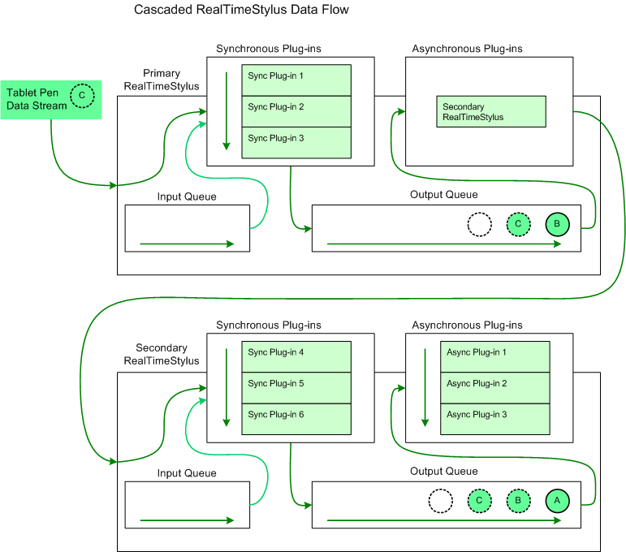

# The Cascaded RealTimeStylus Model

The cascaded [**RealTimeStylus**](realtimestylus-class.md) model enables you to use two **RealTimeStylus** objects, each running on a different thread. With this model, you attach a secondary **RealTimeStylus** object to a primary **RealTimeStylus** object. The secondary **RealTimeStylus** object is attached as the only asynchronous plug-in in the primary **RealTimeStylus** object's asynchronous plug-in collection.

The cascaded [**RealTimeStylus**](realtimestylus-class.md) model may be useful in the following scenarios.

-   You can add certain tasks that may be computationally demanding yet still require real-time access to the tablet pen's data stream, such as multistroke gesture recognition, to the secondary [**RealTimeStylus**](realtimestylus-class.md) object's synchronous plug-in collection.
-   You can spread the computational load of your synchronous plug-ins over two threads, reducing delays in ink collection on some Tablet PCs.

The following diagram illustrates the flow of tablet pen data through two cascaded [**RealTimeStylus**](realtimestylus-class.md) objects and their plug-in collections.

In this diagram the circle lettered "A" represents tablet pen data that has already been processed by both the primary and secondary [**RealTimeStylus**](realtimestylus-class.md) objects and has been placed on the secondary **RealTimeStylus** object's output queue. The circle lettered "B" represents tablet pen data that has already been processed by the primary **RealTimeStylus** object and added to the primary **RealTimeStylus** object's output queue and has not yet been sent to the secondary **RealTimeStylus** object. The circle lettered "C" represents the tablet pen data that the primary **RealTimeStylus** object is currently processing. It is sent to the synchronous plug-in collection and placed on the output queue. The empty circle represents the position in the output queue where future tablet pen data is added.

## Constraints

If you use the default [**RealTimeStylus**](realtimestylus-class.md) constructor, you create a **RealTimeStylus** object that can only accept input from another **RealTimeStylus** object.

The following list describes the constraints associated with using the cascaded [**RealTimeStylus**](realtimestylus-class.md) model.

-   Only two [**RealTimeStylus**](realtimestylus-class.md) objects may be used, a primary **RealTimeStylus** object and a secondary **RealTimeStylus** object.
-   The primary [**RealTimeStylus**](realtimestylus-class.md) object must be created with a constructor that uses the **attachedControl** or *handle* parameter. The secondary **RealTimeStylus** object must be created with the no-argument constructor.
-   The secondary [**RealTimeStylus**](realtimestylus-class.md) object must be the only asynchronous plug-in in the primary **RealTimeStylus** object's asynchronous plug-in collection.
-   A secondary [**RealTimeStylus**](realtimestylus-class.md) object can only be attached to one primary **RealTimeStylus** object at a time. If it is added to a second primary **RealTimeStylus** object, the [Add](/previous-versions/ms824814(v=msdn.10)) method throws an exception, and the secondary **RealTimeStylus** object is not attached to the second primary **RealTimeStylus** object.
-   The behavior of some of the secondary [**RealTimeStylus**](realtimestylus-class.md) object's members is modified. The following table describes the modified behavior of these members.

    

    
| Member | Behavior | 
|--------|----------|
| <a href="/previous-versions/ms825905(v=msdn.10)">GetDesiredPacketDescription</a> | This method returns the information from the primary <a href="realtimestylus-class.md"><strong>RealTimeStylus</strong></a> object.  If the secondary <a href="realtimestylus-class.md"><strong>RealTimeStylus</strong></a> is not attached to a primary <strong>RealTimeStylus</strong> object, this method returns the default value.  | 
| <a href="/previous-versions/ms826041(v=msdn.10)">SetDesiredPacketDescription</a> | This method raises an <a href="/dotnet/api/system.invalidoperationexception">InvalidOperationException</a> exception.  | 
| <a href="/previous-versions/ms825913(v=msdn.10)">GetStyluses</a> | This method returns the information from the primary <a href="realtimestylus-class.md"><strong>RealTimeStylus</strong></a> object.  If the secondary <a href="realtimestylus-class.md"><strong>RealTimeStylus</strong></a> is not attached to a primary <strong>RealTimeStylus</strong> object, this method returns an empty array.  | 
| <a href="/previous-versions/ms824832(v=msdn.10)">Enabled</a> | Getting this property returns the information from the primary <a href="realtimestylus-class.md"><strong>RealTimeStylus</strong></a> object.  If the secondary <a href="realtimestylus-class.md"><strong>RealTimeStylus</strong></a> is not attached to a primary <strong>RealTimeStylus</strong> object, getting this property returns the default value. <blockquote>    [!Note]     Setting this property raises an <a href="/dotnet/api/system.invalidoperationexception">InvalidOperationException</a> exception.    </blockquote>  | 
| <a href="/previous-versions/ms824834(v=msdn.10)">WindowInputRectangle</a> | Getting this property returns the information from the primary <a href="realtimestylus-class.md"><strong>RealTimeStylus</strong></a> object.  If the secondary <a href="realtimestylus-class.md"><strong>RealTimeStylus</strong></a> is not attached to a primary <strong>RealTimeStylus</strong> object, getting this property returns the default value. <blockquote>    [!Note]     Setting this property raises an <a href="/dotnet/api/system.invalidoperationexception">InvalidOperationException</a> exception.    </blockquote>  | 

    

     

-   The parent [**RealTimeStylus**](realtimestylus-class.md) object is expected to stop functioning when the child **RealTimeStylus** is Disposed.

 

 
