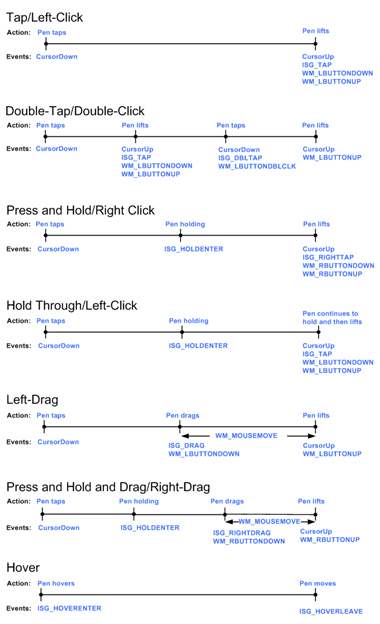

# Timeline of Mouse Messages and System Events

When a given action is performed, the system events (prefixed with ISG\_) are sent and received almost instantaneously by the application. The mouse messages (prefixed with WM\_) are sent when the action is performed and are received by the application after the time it takes for the event to be processed by the Microsoft Windows messaging service. In addition, **CursorDown** and **CursorUp** are pen events that are received from the pen hardware. They are sent when the tablet pen touches the screen and when it is lifted from the screen, respectively.

Pen events and mouse messages are not synchronized. There is no guarantee that corresponding mouse messages and pen events will occur in a particular order. The following chart shows the expected, but not always predictable, sequence of system and mouse events that are sent. Notice in the chart that the mouse events are delayed when system gesture events are detected.

## Important Implementation Considerations

Consider the following when developing for mouse messages and system events:

-   Both pen events and mouse messages are sent to an application, regardless of whether the pen or the mouse is used.
-   If your application listens for both pen and mouse messages it is difficult to predict the relationship of the messages and hence the eventual behavior. Pen events and mouse messages are not synchronized. There is no guarantee that corresponding mouse messages and pen events (such as WM\_LBUTTONDOWN and **ISG\_TAP**, or WM\_LBUTTONDBLCLK and **ISG\_DBLTAP**) will occur in a particular order. The relationship between these messages is complex.
-   It is recommended not to mix-and-match mouse and pen events in the same application feature. For example an application feature that responds to **CursorDown** and **MouseUp** may not behave as expected now or with future versions of the Tablet PC SDK.
-   For the hold through event sequence, if the user drags the tablet pen before the sequence is complete, the events that are sent correspond to left-drag. For example, when the drag starts, **ISG\_DRAG** and WM\_LBUTTONDOWN are sent. When the pen is eventually lifted, **CursorUp** and WM\_LBUTTONUP are sent. The system gesture event may not fire immediately because it must determine what kind of event is occurring.
-   A double-tap with a tablet pen is often less accurate than a double-click with a mouse. This comes from the inherent nature of performing a double-tap with a tablet pen. Because the user must lift the tablet pen to perform a double-tap, the time between taps is often greater than the corresponding time between clicks of a double-click. In addition, it is likely that the two taps of the tablet pen occur at screen coordinates that are further apart than those for the two clicks of the mouse. To accommodate this, Windows XP Tablet PC Edition has settings for the temporal and spatial distance between the two taps of a double-tap that are separate from the mouse settings for a double-click. These settings can be adjusted in Tablet and Pen Settings in Control Panel.

Because of these considerations, applications should listen to only one set of messages rather than both. If you are building a pen-enabled application, listen only to the system and pen messages. These messages are predictable and work well with the tablet pen. If you are building an application that is not pen-enabled, listen only for the mouse messages.

 

 

