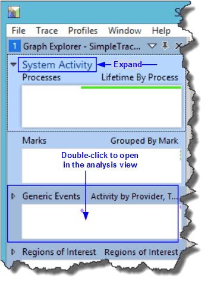
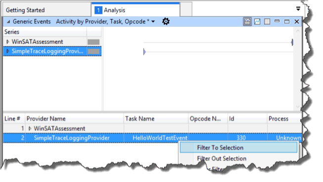
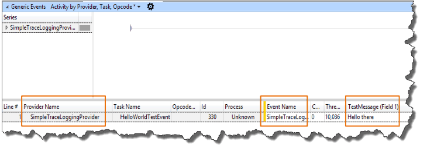

# Record and View TraceLogging Events

You can use many tools to collect and decode TraceLogging ETW events.

- To control the trace session, use tools like WPR, tracelog, or traceview.
- To decode events from a session, use tools like WPA, tracefmt, or traceview.

This example shows how to record TraceLogging events with the Windows
Performance Recorder (WPR) and view them with the Windows Performance Analyzer
(WPA).

## Prerequisites

- Windows 10
- The Windows 10 version of Windows Performance Recorder (WPR), and the
  Windows 10 version of Windows Performance Analyzer (WPA) which is part of the
  Windows® Assessment and Deployment Kit (Windows ADK).

> [!IMPORTANT]
> Traces captured with TraceLogging must be captured with the
> Windows 10 version of Windows Performance Recorder and viewed with the
> Windows 10 version of Windows Performance Analyzer. If you are unable to
> capture or decode your events, verify that you are using the Windows 10
> version of the tools.

### 1. Capture trace data with WPR

To capture a trace on Windows Phone, see Capture TraceLogging events on Windows
Phone below.

Create a Windows Performance Recorder profile (.wprp) so that you can use WPR to
capture your Tracelogging events.

#### Create a .WPRP file

1. Use the following WPRP example with the native code example in the
   [TraceLogging C/C++ Quick Start](tracelogging-native-quick-start.md) or the
   managed example in the
   [TraceLogging Managed Quick Start](tracelogging-managed-quick-start.md). If
   you are logging events from your own provider, replace the `TODO` sections
   with the appropriate values for your provider.

   > [!IMPORTANT]
   > If you are using the TraceLogging C/C++ quick start, specify
   > the provider GUID in the `Name` attribute of the `<EventProvider>` element.
   > For example:
   > `<EventProvider Id="EventProvider_SimpleTraceLoggingProvider" Name="0205c616-cf97-5c11-9756-56a2cee02ca7" />`.
   > If you are using the managed TraceLogging quick start, specify the provider
   > name prefaced by `*` in the `Name` attribute of the `<EventProvider />`
   > element. For example,
   > `<EventProvider Name="*SimpleTraceLoggingProvider" />`.

   Sample WPRP file:

   ```xml
   <?xml version="1.0" encoding="utf-8"?>
   <!-- TODO:
   1. Find and replace "SimpleTraceLoggingProvider" with the name of your provider.
   2. See TODO below to update GUID for your event provider
   -->
   <WindowsPerformanceRecorder Version="1.0" Author="Microsoft Corporation" Copyright="Microsoft Corporation" Company="Microsoft Corporation">
     <Profiles>
       <EventCollector Id="EventCollector_SimpleTraceLoggingProvider" Name="SimpleTraceLoggingProvider">
         <BufferSize Value="64" />
         <Buffers Value="4" />
       </EventCollector>

       <!-- TODO:
       1. Update Name attribute in EventProvider xml element with your provider GUID, eg: Name="0205c616-cf97-5c11-9756-56a2cee02ca7". Or
          if you specify an EventSource C# provider or call TraceLoggingRegister(...) without a GUID, use star (*) before your provider
          name, eg: Name="*MyEventSourceProvider" which will enable your provider appropriately.
       2. This sample lists one EventProvider xml element and references it in a Profile with EventProviderId xml element.
          For your component wprp, enable the required number of providers and fix the Profile xml element appropriately
       -->
       <EventProvider Id="EventProvider_SimpleTraceLoggingProvider" Name="*SimpleTraceLoggingProvider" />

       <Profile Id="SimpleTraceLoggingProvider.Verbose.File" Name="SimpleTraceLoggingProvider" Description="SimpleTraceLoggingProvider" LoggingMode="File" DetailLevel="Verbose">
         <Collectors>
           <EventCollectorId Value="EventCollector_SimpleTraceLoggingProvider">
             <EventProviders>
               <!-- TODO:
               1. Fix your EventProviderId with Value same as the Id attribute on EventProvider xml element above
               -->
               <EventProviderId Value="EventProvider_SimpleTraceLoggingProvider" />
             </EventProviders>
           </EventCollectorId>
         </Collectors>
       </Profile>

       <Profile Id="SimpleTraceLoggingProvider.Light.File" Name="SimpleTraceLoggingProvider" Description="SimpleTraceLoggingProvider" Base="SimpleTraceLoggingProvider.Verbose.File" LoggingMode="File" DetailLevel="Light" />
       <Profile Id="SimpleTraceLoggingProvider.Verbose.Memory" Name="SimpleTraceLoggingProvider" Description="SimpleTraceLoggingProvider" Base="SimpleTraceLoggingProvider.Verbose.File" LoggingMode="Memory" DetailLevel="Verbose" />
       <Profile Id="SimpleTraceLoggingProvider.Light.Memory" Name="SimpleTraceLoggingProvider" Description="SimpleTraceLoggingProvider" Base="SimpleTraceLoggingProvider.Verbose.File" LoggingMode="Memory" DetailLevel="Light" />

     </Profiles>
   </WindowsPerformanceRecorder>
   ```

2. Save the file with a .WPRP file name extension.

3. Start the capture using WPR from an elevated (run as Administrator) Command
   Prompt window.

   **\<_path to wpr_\>\\wpr.exe -start GeneralProfile -start
   TraceLoggingProvider.wprp**

   > [!TIP]
   > For general profiling purposes, you can also add **-start
   > GeneralProfile** to the wpr.exe command line to capture system events along
   > with the events from your provider. If you only want to gather your events,
   > omit **-start GeneralProfile**.

4. Run the application that contains your events.

5. Stop the trace capture.

   **\<_path to wpr_\>\\wpr.exe -stop TraceCaptureFile.etl description**

   > [!TIP]
   > If you added **-start GeneralProfile** to gather system events, add
   > **-stop GeneralProfile** to the **wpr.exe** command line above.

### 2. Capture TraceLogging events on Windows Phone

1. Start tracelog to capture events from your provider.

   **cmdd tracelog -start test -f c:\\test.etl -guid \#providerguid**

2. Run your test scenario to log events.

3. Stop trace capture.

   **cmdd tracelog -stop test**

4. Merge the system trace results with your trace results.

   **cmdd xperf -merge c:\\test.etl c:\\testmerged.etl**

5. Retrieve the merged log file.

   **getd c:\\testmerged.etl**

### 3. View TraceLogging data using Windows Performance Analyzer

WPA is currently the only viewer you can use to view TraceLogging trace (.etl)
files.

1. Start WPA.

   **\<path to wpr\>\\wpa.exe traceLoggingResults.etl**

2. Load the trace (.etl) file that you specified in the wpa.exe command above,
   e.g. traceLoggingResults.etl.

3. View your provider events. In the WPA Graph Explorer, expand **System
   Activity**.

4. Double-click in the **Generic Events** pane to view the events in the
   **Analysis** pane.

   

5. In the Analysis pane, locate the events from your provider to verify that
   TraceLogging is working.

   In the **Provider Name** column of the **Generic Events** table, find and
   select the row with your provider name.

   If you have multiple providers to sort through, click the column header to
   sort by column name which may make it easier to find your provider.

   When you find your provider, right click on the name and select **Filter to
   Selection**.

   

   The event for the SimpleTraceLoggingProvider and its value will appear in the
   bottom pane of the Analysis window. Expand the provider name to see the
   events.

   

   For more information about using WPA, see
   [Windows Performance Analyzer](/windows-hardware/test/wpt/windows-performance-analyzer).

## Summary and next steps

The process for recording and viewing ETW events using WPR and WPA apply equally
well to TraceLogging events.

See [C/C++ Tracelogging Examples](tracelogging-c-cpp-tracelogging-examples.md)
for additional TraceLogging examples.
