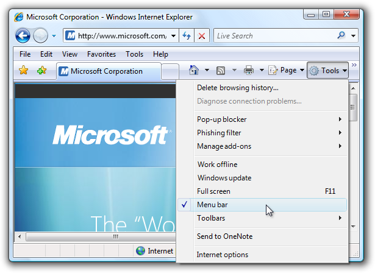

# Menus (Design basics)

> [!NOTE]
> This design guide was created for Windows 7 and has not been updated for newer versions of Windows. Much of the guidance still applies in principle, but the presentation and examples do not reflect our [current design guidance](/windows/uwp/design/).

Menus are hierarchical lists of commands or options available to users in the current context.

Drop-down menus are menus displayed on demand on mouse click or hover. They are normally hidden from view and therefore are an efficient means of conserving screen space. A submenu or cascading menu is a secondary menu displayed on demand from within a menu. They are indicated by an arrow at the end of the submenu label. A menu item is an individual command or option within a menu.

Menus are often displayed from a menu bar, which is a list of labeled menu categories typically located near the top of a window. By contrast, a context menu drops down when users right-click on an object or window region that supports a context menu.

A typical menu bar displaying a drop-down menu and submenu.

> [!Note]  
> Guidelines related to [command buttons](ctrl-command-buttons.md), [Toolbars](cmd-toolbars.md), and [keyboard](inter-keyboard.md) are presented in separate articles.

 

## Usage patterns

Menus have several usage patterns:

|                                                                                                                                                 |                                                                                                                                                                                                                                                                                                                                                                                                                                                                                                                                                                                                                                         |
|-------------------------------------------------------------------------------------------------------------------------------------------------|-----------------------------------------------------------------------------------------------------------------------------------------------------------------------------------------------------------------------------------------------------------------------------------------------------------------------------------------------------------------------------------------------------------------------------------------------------------------------------------------------------------------------------------------------------------------------------------------------------------------------------------------|
| **Menu bars**  a menu bar displays commands and options in drop-down menus.                                                 | menu bars are very common and easy to find, as well as an efficient use of space.     A menu bar from Windows Mail.                                                                                                                                                                                                                                                                                                                                                                                                           |
| **Toolbar menus**  a menu bar implemented as a toolbar.                                                                     | toolbar menus are toolbars consisting primarily of commands in [menu buttons](ctrl-command-buttons.md) and split buttons, with only a few direct commands, if any.     A toolbar menu in Windows Photo Gallery.  For guidelines on this pattern, see [Toolbars](cmd-toolbars.md).                                                                                                                                                                                                              |
| **Tab menus**  buttons within tabs that display a small set of commands and options related to a tab in a drop-down menu.   | tabs with menus look like ordinary tabs except their bottom portion has a button with drop-down arrow. clicking the button displays a drop-down menu instead of selecting the tab.     Tab menus are used in Windows Media Player.                                                                                                                                                                                                                                                                                            |
| **Menu buttons**  command buttons that display a small set of related commands in a drop-down menu.                         | [menu buttons](ctrl-command-buttons.md) look like ordinary command buttons except they have a drop-down arrow within them. clicking the button displays a drop-down menu instead of performing a command.  [split buttons](ctrl-command-buttons.md) are similar to menu buttons except that they are variations of a command, and clicking the left portion of the button performs the action on the label directly.    A menu button with a small set of related commands.  |
| **Context menus**  drop-down menus that display a small set of commands and options related to the current context.         | context menus drop-down when users right-click on an object or window region that supports a context menu.     a context menu from windows explorer.  if context menus are the best menu choice but you need a solution suitable for all users, you can use a menu drop-down arrow button.     A context menu made visible with a menu drop-down button.                                                    |
| **Task pane menus**  a small set of commands related to the selected object or program mode.                                | unlike context menus, they are displayed automatically within a window pane, instead of on demand.     A task pane menu from the Windows Photo Gallery viewer.                                                                                                                                                                                                                                                                                                                                                          |

 

## Is this the right user interface?

To decide, consider these questions:

### Menu bars

Do the following conditions apply:

-   Is the window a primary window?
-   Are there many menu items?
-   Are there many menu categories?
-   Do the majority of the menu items apply to the entire program and primary window?
-   Does the menu need to work for all users?

If so, consider using a menu bar.

### Toolbar menus

Do the following conditions apply:

-   Is the window a primary window?
-   Does the window have a toolbar?
-   Are there only a few menu categories?
-   Does the menu need to work for all users?

If so, consider using a toolbar menu instead of or in addition to a menu bar.

### Tab menus

Do the following conditions apply:

-   Is the window a primary window?
-   Does the window have tabs, where each tab is used for a dedicated set of tasks (as opposed to using tabs to show different views)?
-   Is there one menu category that applies to each tab?
-   Are there many commands and options, but only a small set for each tab?

If so, consider using a tab menu instead of a menu bar.

### Context menu

Do the following conditions apply:

-   Is there a small set of contextual commands and options that apply to the selected object or window region?
-   Are these menu items redundant?
-   Are the target users familiar with context menus?

If so, consider providing context menus for the objects and window regions that need them.

For browser-based programs, task pane menus are a more common solution for contextual commands. Currently, users expect context menus in browser-based programs to be generic and unhelpful.

### Task pane menu

Do the following conditions apply:

-   Is the window a primary window?
-   Is there a small set of contextual commands and options that apply to the selected object or program mode?
-   Are there a few menu categories?
-   Does the menu need to work for all users?

If so, consider using a task pane menu instead of a context menu.

## Design concepts

Effective menus that promote a good user experience:

-   Use a command presentation that matches your program type, window types, command usage, and target users.
-   Are well organized, using standard menu organization when appropriate.
-   Use menu bars, toolbars, and context menus effectively.
-   Use icons effectively.
-   Use access keys and shortcut keys effectively.

**If you do only one thing...**

Choose a command presentation that matches your program type, window types, command usage, and target users.

## Guidelines

### General

-   **All menu patterns except menu bars need a drop-down arrow to indicate the presence of a pull-down menu.** The presence of menus goes without saying in a menu bar, but not in the other patterns.
-   **Don't change menu item names dynamically.** Doing so is confusing and unexpected. For example, don't change a Portrait mode option to Landscape mode upon selection. For modes, use [bullets and checkmarks](#bullets-and-checkmarks) instead.
    -   **Exception:** You can change menu item names that are based on object names dynamically. For example, lists of recently used files or window names can be dynamic.

### Menu bars

-   **Consider eliminating menu bars with three or fewer menu categories.** If there are only a few commands, prefer lighter alternatives such as toolbar menus, or more direct alternatives such as command buttons and links.
-   **Don't have more than 10 menu categories.** Too many menu categories is overwhelming and makes the menu bar difficult to use.
-   **Consider hiding the menu bar** if the toolbar or direct commands provide almost all of the commands needed by most users. Allow users to show or hide with a Menu bar check mark option in a toolbar menu.

In this example, Windows Internet Explorer provides a menu bar option.

For more information, see [hiding menu bars](#hiding-menu-bars).

### Hiding menu bars

Generally, toolbars work great together with menu bars because having both allows each to focus on their strengths without compromise.

-   Hide the menu bar by default if your toolbar design makes having a menu bar redundant.
-   Hide the menu bar instead of removing it completely, because menu bars are more accessible for keyboard users.
-   To restore the menu bar, provide a Menu bar checkmark option in the View (for primary toolbars) or Tools (for secondary toolbars) menu category. For more information, see [Standard menu and split buttons](cmd-toolbars.md).

### Menu categories

-   **Choose single word names for menu categories.** Using multiple words makes the separation between categories confusing.
-   **For programs that create or view documents, use the standard menu categories** such as File, Edit, View, Tools, and Help. Doing so makes common menu items predictable and easier to find.
-   **For other types of programs, consider organizing your commands and options into more useful, natural categories** based on your program's purpose and the way users think about their tasks and goals. Don't feel obligated to use the standard menu organization if it isn't suitable for your program.
-   **If you choose to use non-standard menu categories, you must choose good category names.** For more information, see the [Labels](#labels) section.
-   **Prefer task-oriented menu categories over generic categories.** Task-oriented categories make menu items easier to find.

In this example, Windows Media Player uses task-oriented menu categories.

-   **Avoid menu categories with only one or two menu items.** If sensible, consolidate with other menu categories, perhaps using a submenu.
-   **Consider putting the same menu item in multiple categories only if:**
    -   The menu item logically belongs in multiple menu categories.
    -   You have data showing that users have trouble finding the item in a single menu category.
    -   You have only one or two hard-to-find menu items in multiple categories.
-   **Don't put different menu items that use the same name in multiple categories.** For example, don't have different Options menu items in multiple categories.
    -   **Exception:** The tab menu pattern may have different Options and Help menu items in each tab menu.

In this example, Windows Media Player has Options and Help menu items in each tab menu.

### Menu item organization and order

-   **Organize the menu items into groups of seven or fewer strongly related items.** For this, submenus count as a single menu item in the parent menu.
-   **Don't put more than 25 items within a single level of a menu** (not counting submenus).
-   **Put separators between the groups within a menu.** A separator is a single line that spans the width of the menu.
-   **Within a menu, put the groups in their logical order.** If there is no logical order, place the most commonly used groups first.
-   **Within a group, put the items in their logical order.** If there is no logical order, place the most commonly used items first. Put numeric items (such as zoom percentages) in numeric order.

### Submenus

-   **Avoid using submenus unnecessarily.** Submenus require more physical effort to use and generally make the menu items more difficult to locate.
-   **Don't put frequently used menu items in a submenu.** Doing so would make using these commands inefficient. However, you can put frequently used commands in a submenu if they are normally accessed more directly, such as with a toolbar.
-   **Consider using a submenu if:**
    -   Doing so simplifies the parent menu because it has many items (20 or more), or the submenu is part of a group of more than seven items.
    -   The items in the submenu are used less frequently than those in the parent menu.
    -   The submenu would have three or more items.
    -   There are three or more commands that begin with the same word. In this case, use that word as the submenu label.

In this example, the New submenu replaces separate commands for New mail message, New news message, New folder, and New contact.

-   **Use at most three levels of menus.** That is, you can have a primary menu and at most two levels of submenus. Two levels of submenus should be rare.

### Presentation

-   **Disable menu items that don't apply to the current context,** instead of removing them. Doing so makes menu bar contents stable and easier to find. **Exceptions:**
    -   For contextual menu categories, **remove rather than disable context menu items that don't apply to the current context.** A menu category is contextual when it is displayed only for specific modes, such as when a certain object type is selected. For details, see the [remove vs. disable](#context-menus) guidelines for context menus.
    -   If determining when a menu item should be disabled causes noticeable performance problems, leave the menu item active and if necessary have its selection result in an error message.

### Tab menus

-   **Each tab menu may have context specific Options and Help menu items.** This is in contrast to all other menu patterns. Each tab is used for a dedicated set of tasks, so any redundancy across tab menus isn't confusing.

### Context menus

-   **Use context menus only for contextual commands and options.** The menu items should apply only to the selected (or clicked upon) object or window region, not the entire program.
-   **Don't make commands only available through context menus.** Like shortcut keys, context menus are alternative means of performing commands and choosing options. For example, a Properties command is also available through the menu bar or the Alt+Enter access key.
-   **Provide context menus for all objects and window regions** that benefit from a small set of contextual commands and options. Many users right-click regularly and expect to find context menus anywhere.
-   **Consider using a menu drop-down arrow button for context menus targeted at all users.** Normally context menus are suitable for commands and options targeted at advanced users. However, you can use a menu drop-down button in cases where context menus are the best menu choice and you need to target all users.

In this example, a menu drop-down button is used to make a context menu visible.

**Menu item organization and order**

-   **Organize the menu items into groups of seven or fewer strongly related items.**
-   **Avoid using submenus** to keep context menus simple, direct, and efficient.
-   **Don't put more than 15 items within a context menu.**
-   **Put separators between the groups within a menu.** A separator is a single line that spans the width of the menu.
-   **Present menu items using the following order:**

<dl> Primary (most frequently used) commands<dl> Open  
Run  
Play  
Print  
<separator>  
</dl> </dd> <dd>Secondary commands supported by the object<dl> <separator>  
</dl> </dd> Transfer commands<dl> Cut  
Copy  
Paste  
<separator>  
</dl> </dd> <dd>Object settings<dl> <separator>  
</dl> </dd> Object commands<dl> Delete  
Rename  
<separator>  
Properties  
</dl> </dd> </dl>

**Presentation**

-   **Display the default command using bold.** When practical, also make it the first menu item. The default command is invoked when users double-click or select an object and press Enter.
-   **Remove rather than disable context menu items that don't apply to the current context.** Doing so makes context menus contextual and efficient.
    -   **Exception:** Disable menu items that don't apply if there is a reasonable expectation for them to be available:
        -   Always have the relevant standard context menu commands, such as Cut, Copy, Paste, Delete, and Rename.
        -   Always have the commands that complete related sets. For example, if there is a Back, there should also be a Forward. If there's a Cut, always have a Copy and Paste.

### Bullets and checkmarks

-   **Menu items that are options may use bullets and checkmarks.** Commands may not.
-   **Use a bullet to choose one option from a small set of mutually exclusive choices.** There should always be at least two bullets in a group. For more information, see [Radio buttons](ctrl-radio-buttons.md).
-   **Use a checkmark to toggle an independent setting on or off.** If the selected and cleared states aren't clear and unambiguous opposites, use a set of bullets instead. For more information, see [Check boxes](ctrl-check-boxes.md).
-   **For a mixed checkmark state, display a menu item without a checkmark.** The mixed state is used for multiple selection to indicate that the option is set for some, but not all, objects, so each individual object has either the selected or cleared state. The mixed state is not used as a third state for an individual item.
-   **Put separators between the related sets of checkmarks or bullets.** A separator is a single line that spans the width of the menu.

### Icons

-   **Consider providing menu item icons for:**
    -   The most commonly used menu items.
    -   Menu items whose icon is standard and well known.
    -   Menu items whose icon well illustrates what the command does.
-   **If you use icons, don't feel obligated to provide them for all menu items.** Cryptic icons aren't helpful, create visual clutter, and prevent users from focusing on the important menu items.

In this example, the Organize menu has icons only for the most commonly used menu items.

-   **Make sure menu icons conform to the Aero-style icon guidelines.**

For more information and examples, see [Icons](vis-icons.md).

### Access keys

-   **Assign access keys to all menu items.** No exceptions.
-   **Whenever possible, assign access keys for commonly used commands according to the Standard Access Key Assignments.** While consistent access key assignments aren't always possible, they are certainly preferred - especially for frequently used commands.
-   **For dynamic menu items (such as recently used files), assign access keys numerically.**

In this example, the Paint program in Windows assigns numeric access keys to recently used files.

-   **Assign unique access keys within a menu level.** You can reuse access keys across different menu levels.
-   **Make access keys easy to find:**
    -   For the most frequently used menu items, choose characters at the beginning of the first or second word of the label, preferably the first character.
    -   For less frequently used menu items, choose letters that are a distinctive consonant or a vowel in the label.
-   **Prefer characters with wide widths,** such as w, m, and capital letters.
-   **Prefer a distinctive consonant or a vowel,** such as "x" in "Exit."
-   **Avoid using characters that make the underline difficult to see,** such as (from most problematic to least problematic):
    -   Letters that are only one pixel wide, such as i and l.
    -   Letters with descenders, such as g, j, p, q, and y.
    -   Letters next to a letter with a descender.

For more guidelines and examples, see [Keyboard](inter-keyboard.md).

### Shortcut keys

-   **Assign shortcut keys to the most frequently used menu items.** Infrequently used menu items don't need shortcut keys because users can use access keys instead.
-   **Don't make a shortcut key the only way to perform a task.** Users should also be able to use the mouse or the keyboard with Tab, arrow, and access keys.
-   **For well-known shortcut keys, use the standard assignments.**
-   **Don't assign different meanings to well-known shortcut keys.** Because they are memorized, inconsistent meanings for well-known shortcuts are frustrating and error prone. See Windows Keyboard Shortcut Keys for the well-know shortcut keys used by Windows programs.
-   **Don't try to assign system-wide program shortcut keys.** Your program's shortcut keys will have effect only when your program has input focus.
-   **Document all shortcut keys.** Doing so helps users learn the shortcut key assignments.
    -   **Exception:** Don't display shortcut key assignments within context menus. Context menus don't display the shortcut key assignments because they are optimized for efficiency.
-   **For non-standard key assignments:**
    -   **Choose shortcut keys that don't have standard assignments.** Never reassign standard shortcut keys.
    -   **Use non-standard key assignments consistently throughout your program.** Don't assign different meanings in different windows.
    -   **If possible, choose mnemonic key assignments,** especially for frequently used commands.
    -   **Use function keys for commands that have a small-scale effect,** such as commands that apply to the selected object. For example, F2 renames the selected item.
    -   **Use Ctrl key combinations for commands that have a large-scale effect,** such as commands that apply to an entire document. For example, Ctrl+S saves the current document.
    -   **Use Shift key combinations for commands that extend or complement the actions of the standard shortcut key.** For example, the Alt+Tab shortcut key cycles through open primary windows, whereas Alt+Shift+Tab cycles in the reverse order. Similarly, F1 displays Help, whereas Shift+F1 display context-sensitive Help.
    -   **Don't use the following characters for shortcut keys:** @ $ {} \[\] \\ ~ \| ^ ' < >. These characters require different key combinations across languages or are locale specific.
    -   **Don't use Ctrl+Alt combinations,** because Windows interprets this combination in some language versions as an AltGR key, which generates alphanumeric characters.
-   **If your program assigns many shortcut keys, provide the ability to customize the assignments.** Doing so allows users to reassign conflicting shortcut keys and migrate from other products. Most programs don't assign enough shortcut keys to need this feature.

For more guidelines and standard shortcut key assignments, see [Keyboard](inter-keyboard.md).

### Standard menus

-   **Use the standard menu organization for programs that create or view documents.** The standard menu organization makes common menu items predictable and easier to find.
-   **For other types of programs, use the standard menu organization only when it makes sense to.** Consider organizing your commands and options into more useful, natural categories based on your program's purpose and the way users think about their tasks and goals.

**Standard menu bars**

The standard menu bar structure is as follows. This list shows the menu category and item labels, their order with separators, their access and shortcut keys, and their ellipses.

<dl> File<dl> New Ctrl+N  
Open... Ctrl+O  
Close  
<separator>  
Save Ctrl+S  
Save as...  
<separator>  
Send to  
<separator>  
Print... Ctrl+P  
Print preview  
Page setup  
<separator>  
1 <filename>  
2 <filename>  
3 <filename>  
...  
<separator>  
Exit Alt+F4 (shortcut usually not given)  
</dl> </dd> Edit<dl> Undo Ctrl+Z  
Redo Ctrl+Y  
<separator>  
Cut Ctrl+X  
Copy Ctrl+C  
Paste Ctrl+V  
<separator>  
Select all Ctrl+A  
<separator>  
Delete Del (shortcut usually not given)  
<separator>  
Find... Ctrl+F  
Find next F3 (command usually not given)  
Replace... Ctrl+H  
Go to... Ctrl+G  
</dl> </dd> View<dl> Toolbars  
Status bar  
<separator>  
</dl> </dd> Zoom<dl> Zoom in Ctrl++  
Zoom out Ctrl+-  
<separator>  
Full screen F11  
Refresh F5  
</dl> </dd> <dd>Tools<dl> ...  
<separator>  
Options  
</dl> </dd> Help<dl> <program name> help F1  
<separator>  
About <program name>  
</dl> </dd> </dl>

**Standard toolbar menu buttons**

The standard toolbar menu buttons are as follows. This list shows the menu category and item labels, their order with separators, their shortcut keys, and their ellipses.

<dl> Tools<dl> Full screenF11(Reassign access key if Find is also used.)  
Toolbars(Note that the Menu bar command goes here.)  
<separator>  
Print...  
Find...  
<separator>  
Zoom  
Text size  
<separator>  
Options  
</dl> </dd> Organize<dl> New folderCtrl+N  
<separator>  
CutCtrl+X  
CopyCtrl+C  
PasteCtrl+V  
<separator>  
Select allCtrl+A  
<separator>  
DeleteDel(shortcut usually not given)  
Rename  
<separator>  
Options  
</dl> </dd> Page<dl> New windowCtrl+N  
<separator>  
Zoom  
Text size  
</dl> </dd> </dl>

**Standard context menus**

The standard context menu contents are as follows. This list shows the menu item labels, their order with separators, their access keys, and their ellipses. Context menus don't show shortcut keys.

<dl> Open  
Run  
Play  
Edit  
Print...  
<separator>  
Cut  
Copy  
Paste  
<separator>  
Delete  
Rename  
<separator>  
Lock the <object name>(checkmark)  
Properties  
</dl>

### Using ellipses

While menu commands are used for immediate actions, more information might be needed to perform the action. **Indicate a command that needs additional information (including a confirmation) by adding an ellipsis at the end of the label.**

In this example, the Print... command displays a Print dialog box to gather more information.

**Proper use of ellipses is important to indicate that users can make further choices before performing the action, or even cancel the action entirely.** The visual cue offered by an ellipsis allows users to explore your software without fear.

**This doesn't mean you should use an ellipsis whenever an action displays another window** only when additional information is required to perform the action. For example, the commands About, Advanced, Help, Options, Properties, and Settings must display another window when clicked, but don't require additional information from the user. Therefore they don't need ellipses.

**In case of ambiguity (for example, the command label lacks a verb), decide based on the most likely user action.** If simply viewing the window is a common action, don't use an ellipsis.

**Correct:**

More colors...

Version information

In the first example, users are most likely going to choose a color, so using an ellipses is correct. In the second example, users are most likely going to view the version information, making ellipses unnecessary.

> [!Note]  
> When determining if a menu command needs an ellipsis, don't use the need to [elevate privileges](winenv-uac.md) as a factor.

 

Elevation isn't information needed to perform a command (rather, it's for permission) and the need to elevate is indicated with the security shield.

## Labels

-   **Use sentence-style capitalization.**
    -   **Exception:** For legacy applications, you may use title-style capitalization if necessary to avoid mixing capitalization styles.

### Menu category names

-   **Use menu category names that are single word verbs or nouns.** A multiple-word label might be confused for two one-word labels.
-   **Prefer verb-based menu names.** However, omit the verb if it is Create, Show, View, or Manage. For example, the following menu categories don't have verbs:
    -   Table
    -   Tools
    -   Window
-   For non-standard category names, **use a single, specific word that clearly and accurately describes the menu contents.** While the names don't have to be so general that they describe everything in the menu, they should be predictable enough so that users aren't surprised by what they find in the menu.

### Menu item names

-   **Use menu item names that start with a verb, noun, or noun phrase.**
-   **Prefer verb-based menu names.** However, omit the verb if:
    -   **The verb is Create, Show, View, or Manage.** For example, the following commands don't have verbs:
        -   About
        -   Advanced
        -   Full screen
        -   New
        -   Options
        -   Properties
    -   **The verb is the same as the menu category name to avoid repetition.** For example, in the Insert menu category, use Text, Table, and Picture instead of Insert text, Insert table, and Insert picture.
-   **Use specific verbs.** Avoid generic, unhelpful verbs, such as Change and Manage.
-   **Use singular nouns for commands that apply to a single object**, otherwise use plural nouns.
-   **Use modifiers as necessary to distinguish between similar commands.** Examples: Insert row above, Insert row below.
-   **For pairs of complementary commands, choose clearly complementary names.** Examples: Add, Remove; Show, Hide; Insert, Delete.
-   **Choose menu item names based on user goals and tasks, not on technology.**

**Correct:**

**Incorrect:**

In the incorrect example, the menu item is based on its technology.

-   Use the following menu item names for the stated purpose:
    -   **Options** To display program options.
    -   **Customize** To display the program options specifically related to mechanical UI configuration.
    -   **Personalize** To display a summary of commonly used [personalization](glossary.md) settings.
    -   **Preferences** Don't use. Use Options instead.
    -   **Properties** To display an object's property window.
    -   **Settings** Don't use as a menu label. Use Options instead.

### Submenu names

-   **Menu items that display submenus never have an ellipsis on their label.** The submenu arrow indicates that another selection is required.

**Incorrect:**

In this example, the New menu item incorrectly has an ellipsis.

## Documentation

When referring to menus:

-   In commands that show or hide menus, refer to menu bars. Don't refer to them as classic menus.
-   Refer to menus by their labels. Use the exact label text, including its capitalization, but don't include the access key underscore or ellipsis.
-   To refer to menu categories, use "On the <category name> menu." If the location of a menu item is clear from the context, you don't need to mention the menu category.
-   To describe user interaction of menu items, use click, without the word menu or command. Don't use choose, select, or pick. Don't refer to a menu item as a menu item except in technical documentation.
-   To describe removing a check mark from a menu option, use click to remove the check mark. Don't use clear.
-   Refer to context menus as context menus, not shortcut menus.
-   Don't use cascading, pull-down, drop-down, or pop-up to describe menus, except in programming documentation.
-   Refer to unavailable menu items as unavailable, not as dimmed, disabled, or grayed. Use disabled in programming documentation.
-   When possible, format the labels using bold text. Otherwise, put the labels in quotation marks only if required to prevent confusion.

Examples:

-   On the **File** menu, click **Print** to print the document.
-   On the **View** menu, point to **Toolbars**, and then click **Formatting**.

 

