# Windows 7 Ribbons

> [!NOTE]
> This design guide was created for Windows 7 and has not been updated for newer versions of Windows. Much of the guidance still applies in principle, but the presentation and examples do not reflect our [current design guidance](/windows/uwp/design/).

Ribbons are the modern way to help users find, understand, and use commands efficiently and directly with a minimum number of clicks, with less need to resort to trial-and-error, and without having to refer to Help.

A ribbon is a command bar that organizes a program's features into a series of tabs at the top of a window. Using a ribbon increases discoverability of features and functions, enables quicker learning of the program as a whole, and makes users feel more in control of their experience with the program. A ribbon can replace both the traditional menu bar and toolbars.

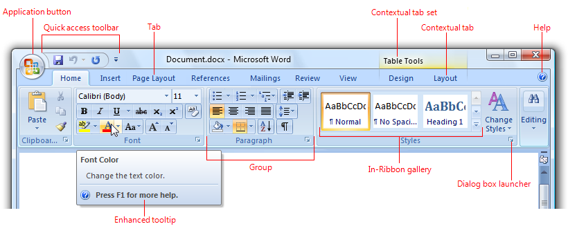

A typical ribbon.

Ribbon tabs are composed of groups, which are a labeled set of closely related commands. In addition to tabs and groups, ribbons consist of:

- An Application button, which presents a menu of commands that involve doing something to or with a document or workspace, such as file-related commands.
- A Quick Access Toolbar, which is a small, customizable toolbar that displays frequently used commands.
- Core tabs are the tabs that are always displayed.
- Contextual tabs, which are displayed only when a particular object type is selected. Tabs that are always displayed are called core tabs.
- A tab set is a collection of contextual tabs for a single object type. Because objects can have multiple types (for example, a header in a table that has a picture is three types), there can be multiple contextual tab sets displayed at a time.
- Modal tabs, which are core tabs displayed with a particular temporary mode, such as print preview.
- Galleries, which are lists of commands or options presented graphically. A results-based gallery illustrates the effect of the commands or options instead of the commands themselves. An in-ribbon gallery is displayed within a ribbon, as opposed to a pop-up window.
- Enhanced tooltips, which concisely explain their associated commands and give the shortcut keys. They may also include graphics and references to Help. Enhanced tooltips reduce the need for command-related Help.
- Dialog box launchers, which are buttons at the bottom of some groups that open dialog boxes containing features related to the group.

Ribbons were originally introduced with Microsoft Office 2007. To learn why Office needs to use ribbons and the many problems using a ribbon solves, see [The Story of the Ribbon](/archive/blogs/jensenh/the-story-of-the-ribbon).

> [!Note]  
> Guidelines related to [menus](cmd-menus.md), [toolbars](cmd-toolbars.md), [command buttons](ctrl-command-buttons.md), and [icons](vis-icons.md) are presented in separate articles.

## Is this the right user interface?

To decide to use a ribbon, consider these questions:

### Program type

- **What type of program are you designing?** The program type is a good indicator of the appropriateness of a ribbon. Ribbons work well for document creation and authoring programs, as well as document viewers and browsers. Ribbons might work for other types of programs, but other forms of command presentation may be more appropriate. Generally, lightweight programs should have a lightweight command presentation.

### Discoverability and learning issues

- **Do users have trouble finding commands? Are users requesting features that are already in the program?** If so, using a ribbon will make commands easier to find by having self-explanatory labels and grouping of related commands. Using a ribbon also scales better than menu bars and toolbars for future growth.
- **Do users have trouble understanding the program's commands? Do they often resort to "trial and error" to select the right command or determine how commands work?** If so, using a ribbon with results-oriented commands based on galleries and live previews makes commands easier to understand.

### Command characteristics

- **Are the commands presented in several locations? If your program already exists, are commands presented in menu bars, toolbars, task panes, and within the work area itself?** If so, using a ribbon will unify the commands into a single location, making them easier to find.
- **Do the commands apply to the entire window or only to specific panes?** Ribbons work best for commands that apply to the entire window or to specific objects. In-place commands work better for individual window panes.
- **Can most of the commands be presented directly? That is, can users interact with them using a single click? If commonly used commands are accessed from menus and dialog boxes, can they be refactored to be direct?** While some commands can be presented using menus and dialog boxes, presenting most commands this way undermines the efficiency of a ribbon, possibly making a menu bar a better choice.

### Command scale

- **Is there a small number of commands? Can the most frequently used commands be presented easily on a single, simple toolbar?** Using a ribbon is worthwhile if adding core and contextual tabs results in a simple Home tab that can be used alone to perform the most common tasks. If not, the benefit of using a ribbon might not justify its extra weight for a small number of commands.
- **Is there a large number of commands? Would using a ribbon require more than seven core tabs? Would users constantly have to change tabs to perform common tasks?** If so, using toolbars (which don't require changing tabs) and [palette windows](cmd-toolbars.md) (which may require changing tabs, but there can be several open at a time) might be a more efficient choice.
- **Do users tend to use a small number of commands most of the time?** If so, they can use a ribbon efficiently by putting such commands on the Home tab. Constantly changing tabs would make a ribbon too inefficient.
- **Does the program benefit from making the content area of the program as large as possible?** If so, using a menu bar and a single toolbar is more space efficient than a ribbon. However, if your program requires three or more rows of toolbars or uses task panes, using a ribbon is more space efficient.
- **Do users tend to work in a specific area within a large window in the program for long periods of time?** If so, they would benefit from the close proximity of mini-toolbars, palette windows, and direct commands. Making the round trip from the work area to the ribbon would be too inefficient.
- **For efficiency and flexibility, do users need to make significant changes to the command presentation contents, location, or size?** If so, customizable and extensible toolbars and palette windows are a better choice. Note that some types of toolbars can be undocked to become palette windows, and palette windows can be moved, resized, and customized.

Finally, consider this ultimate question: **Is the improvement in discoverability, ease of learning, efficiency, and productivity worth the cost of the extra space and the need for tabs to organize commands?** If so, using a ribbon is an excellent choice. If you're not sure, consider usability testing a ribbon-based design and comparing it to the best alternative.

Ribbons are a new and engaging form of command presentation, and a great way to modernize a program. But as compelling as they are, they aren't the right choice for every program.

**Incorrect:**

Please don't do this!

## Seven most important things

1. Choose a command solution that is suitable for your program type. Using a ribbon should make a program feel simpler, more efficient, and easier to use never the opposite. If using a ribbon isn't appropriate, consider using rich commands instead.  
2. Don't underestimate the challenge of creating an effective ribbon. Don't expect it to be a simple port of your existing menu bars and toolbars. And don't take for granted that using a ribbon automatically makes your program better. Being willing to commit the time and effort required for a command redesign is an important factor in deciding to use a ribbon.  
3. Make the commands discoverable. Choose a tab design that has a clear, obvious, unique mapping between your commands and the descriptively labeled tabs where they reside. Users should be able to determine quickly and confidently which tab has the command they are looking for, and rarely choose the wrong tab.  
4. Make the commands self-explanatory. Users should understand the effect of a command from its label, icon, tooltip, and preview. They shouldn't have to experiment or read a Help topic to see how a command works.  
5. Make using the commands efficient:
    - Users should spend most of their time on the Home tab.
    - Users should rarely have to change tabs during common tasks.
    - When the window is maximized and users are on the correct tab, the most frequently used commands have the most visual emphasis and users can invoke them with a single click. Users can perform all other commands on the tab with at most four clicks.
    - Users shouldn't have to open dialog boxes to give commands and change attributes in common tasks.
6. Help users choose commands and options confidently and minimize the need for trial-and-error. Use results-oriented commands whenever appropriate, often in the form of galleries and live previews.  
7. Make sure the ribbon scales well from the largest window sizes to the smallest.  

## Design concepts

### Adapting a ribbon in an existing program

While you might simply refactor a traditional menu bar and toolbar design of an existing program to a ribbon format, doing so misses most of the value of using a ribbon. Ribbons have the most value when used to present immediate, results-oriented commands, often in the form of galleries and live previews. Results-oriented commands make commands easier to understand and users much more efficient and productive. Instead of refactoring your existing commands, it's better to redesign completely how commands are performed in your program.

Don't underestimate the challenge of creating an effective ribbon. And don't take for granted that using a ribbon automatically makes your program better. Creating an effective ribbon takes a lot of time and effort. Being willing to commit the time and effort required for such a command redesign is an important factor in deciding to use a ribbon.

### The nature of ribbons

Compared to traditional menu bars and toolbars, ribbons have the following characteristics:

- **A single user interface (UI) for all commands.** Menu bars are comprehensive and easy to learn, and toolbars are efficient and direct, but why not use a bit more screen space to create a single commands UI that accomplishes all of these? With only one UI, ribbons don't require users to figure out which UI has the command they are looking for.
- **Visible and self-explanatory.** Menu bar commands are self-explanatory through their labels, but are hidden from view most of the time. To save screen space, toolbar buttons are primarily represented by icons instead of labels (although some toolbar buttons use both), and depend on tooltips when the icon isn't self-explanatory. However, users generally know the icons only for the most commonly used commands.
- By presenting most commands with labeled icons, ribbon commands are both visible and self-explanatory, and use tooltips only to provide supplemental information. There's little need to go elsewhere (such as Help) to understand a command.
- **Labeled grouping.** While menu categories are labeled, groups within a drop-down menu are not and are indicated only with an unlabeled separator. Groups within toolbars are also indicated with unlabeled separators.
- By organizing commands in labeled groups, ribbons make it easier to find commands and determine their purpose.
- **Modal but not hierarchical.** Menu bars scale by creating a hierarchy of commands. Menus with many items can use one or more levels of submenus to provide more commands.
- Ribbon commands require more space than toolbar commands, so they use tabs to scale. This use of tabs makes ribbons modal, requiring users to change modes occasionally to find commands. However, within a tab most commands are either direct or use a single split button or menu button, not a hierarchy.
- **Direct and immediate.** A command is direct if invoked with a single click (that is, without navigating through menus) and immediate if it takes effect immediately (that is, without dialog boxes to gather additional input). Menu bar commands are always indirect and often not immediate. Like toolbars, most ribbon commands are designed to be direct and immediate, with the most frequently used commands invoked with a single click, and without requiring a dialog to gather additional input.
- **Spacious.** Menu bars and toolbars are primarily designed to be space efficient. To provide their benefits, ribbons may consume more vertical space, being roughly the equivalent of a menu bar plus three rows of toolbars. Being that few programs have three or more rows of toolbars, ribbons usually consume more space than traditional UIs for commands.
- **Has an Application button and Quick Access Toolbar.** A ribbon is always presented with an Application button and Quick Access Toolbar. Doing so allows users to access file-related and frequently used commands without changing tabs, and promotes consistency across programs.
- **Minimal customization.** While menu bars have a fixed presentation, many toolbars are quite customizable, allowing users to set locations, sizes, and contents. A ribbon itself is not customizable, but the Quick Access Toolbar provides limited customization.
- **Improved keyboard accessibility.** Menu bars have excellent keyboard accessibility because pressing the Alt key directly gives the menu bar input focus. However, there is no such mechanism for toolbars because they share keyboard navigation with the window's content. Consequently, users must navigate to the toolbar using the Tab key (which is given the last tab stop), and then navigate to a specific command using the arrow keys.

By contrast, ribbons provide enhanced keyboard accessibility through [keytips](glossary.md), usually with a three-step process:

- Press Alt to enter keytip mode.
- Press a character to choose a tab, the Application button, or a command in the Quick Access Toolbar.
- Within a tab, press a one or two letters to choose a command.

    This approach is highly visual. It is also more flexible, allowing it to scale better and to have more mnemonic access key assignments.

    Don't confuse access keys with shortcut keys. While both access keys and shortcut keys provide keyboard access to UI, they have different purposes and guidelines. For more information, see [Keyboard](inter-keyboard.md).

### The nature of rich commands

Rich commands refer to the presentation and interaction of commands used by ribbons, without necessarily using a ribbon container. Rich commands have these characteristics:

- **Labeling.** All commands are given self-explanatory labels, with exceptions only when the icons are extremely well known and space is at a premium.

    **Correct:**

    

    These commands are extremely well known so they don't need labels.

    **Incorrect:**

    

    These unintelligible icons require labels for rich commands.

- **Sizing.** Instead of uniform sizing, commands are sized relative to their frequency of use and importance. In addition to making the most frequently used commands easier to find and click, it also makes them more [touchable](https://msdn.microsoft.com/library/windows/desktop/cc872774.aspx).

    

    In this example, the most frequently used button is larger than the others.

- **Dynamic sizing.** Rich command controls resize themselves to take full advantage of the available space, as opposed to using a fixed size and either truncating or using overflow when the size is too small.

    

    In this example, the command buttons resize to work well in the available space.

- **Split buttons.** Split buttons are a good way to consolidate a set of variations of a command when needed, while maintaining directness for the most frequently used command.

    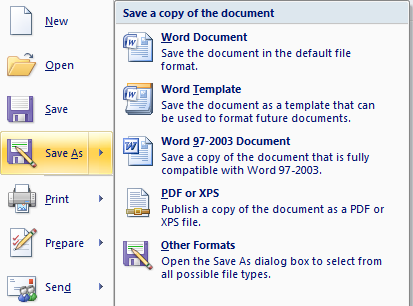

    In this example, the Save As command uses a split button, where the main button performs the most common variation and the menu portion reveals a menu with variations of the command.

- **Rich drop-down menus and galleries.** Drop-down menus, drop-down lists, and galleries take the space they need to communicate and differentiate the effect of the choices, often using graphics and text descriptions. Categories are used to organize large sets of options.

    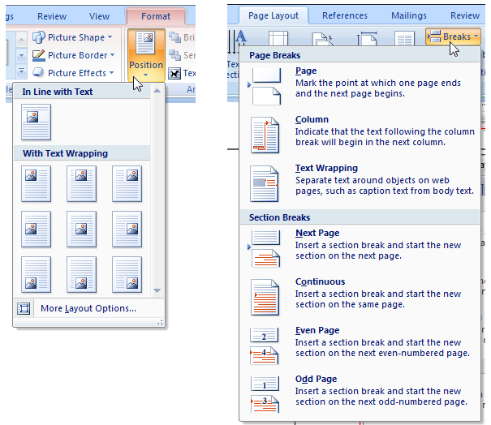

    In these examples, clicking a menu button displays a list of choices that show their effect.

- **Live previews.** Whenever the user hovers over a formatting option, the program shows what the results would look like with that formatting using the actual content.

    

    Live previews show the results of applying a formatting option on hover.

- **Enhanced tooltips.** These concisely explain their associated commands and give the shortcut keys. They may also include graphics and references to Help (although they largely eliminate the need for command-related Help).

    

    Enhanced tooltips concisely explain their associated commands.

While ribbons might not be suitable for all programs, all programs can potentially benefit from rich commands.

### Ribbons always have an Application button and Quick Access Toolbar

The Application button and Quick Access Toolbar provide commands that are useful in any context, thus reducing the need to change tabs. While these three components are logically independent, a ribbon must always have an Application button and Quick Access Toolbar. Given that commands can go in either the ribbon or the Application button, you might be wondering where to place commands. The choice is not arbitrary.

The Application button is used to present a menu of commands that involve doing something to or with a file, such as commands that traditionally go in the File menu to create, open, and save files, print, and send and publish documents.

By contrast, the ribbon itself is for commands that affect the content of the window. Examples include commands used to read, modify, or use the content, or change the view.

If you use a ribbon, you must also use an Application button even if your program doesn't involve documents or files. In such cases, use the Application menu to present commands for printing, program options, and exiting the program. While arguably the Application button isn't necessary for such programs, using it provides consistency across programs. Users don't have to hunt for save and undo commands or program options because they are always in the same place.

The Quick Access Toolbar is required even if the ribbon only uses one tab. Again, while arguably such programs don't need a Quick Access Toolbar (because all the commands are already present on the single tab), having a customizable Quick Access Toolbar provides consistency across programs. For example, if users are in the habit of clicking the Print command, they should be able to do so in any program that uses a ribbon.

### Organization and discoverability

By providing tabs and groups, ribbons allow you to organize your commands to aid discoverability. The challenge is that if the organization is done poorly, it can greatly harm discoverability instead. There should be a clear, obvious, and unique mapping between your commands and the descriptively labeled tabs and groups where they reside.

Users will form a mental model of the ribbon after using it for a while. If that mental model doesn't make sense to users, is inefficient, or is incorrect, it will lead to confusion and frustration. **Your most important goal in designing a ribbon is to facilitate finding commands quickly and confidently. If you do not accomplish this, your ribbon design will fail.** Achieving this goal requires careful design, user testing, and iteration. Don't assume that it will be easy.

Here are some common pitfalls to avoid:

- **Avoid generic tab and group names.** A good tab or group name must accurately describe its specific contents, preferably using task- and goal-based language. Avoid generic tab and group names, as well as technology-based names. For example, almost any command in a document creating and authoring program could belong in tabs labeled Edit, Format, Tools, Options, Advanced, and More. Rely on specific, descriptive labels, not memorization.
- **Avoid overly specific tab and group names.** While we want tab and group names to be specific, they shouldn't be so specific that users are surprised by their content. Users often look for things using the process of elimination, so prevent them from overlooking your tabs or groups because the name is misleading.
- **Avoid multiple paths to the same command especially if the path is unexpected or the command requires many clicks to invoke.** It may seem like a convenience to find a command through multiple paths. But keep in mind that when users find what they are looking for, they stop looking. It is all too easy for users to assume that the first path they find is the only path which is a serious problem if that path is inefficient or unexpected. Furthermore, having duplicate commands makes it harder for users to find other commands they are scanning for.

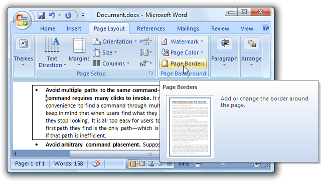

In this example, you can change paragraph borders through the Page Borders command, even though there is a more direct path on the Home tab. If users looking for paragraph borders were to stumble across this unexpected path, they might easily assume that it's the only path.

- **Avoid arbitrary command placement.** Suppose that you think you have a good tab and group design, but discover that several commands just don't fit in. Chances are, your tab and group design isn't as good as you think it is, and you need to continue to refine it. Don't solve this problem by putting those commands where they don't belong. If you do, users likely will have to inspect every tab to find them then promptly forget where they are.
- **Avoid marketing-based placement.** Suppose that you have a new version of your program and your marketing team really wants to promote its new features. It might be tempting to put them on the Home tab, but doing so is a costly mistake if it harms overall discoverability. Consider future versions of your product and how much frustration a constantly changing organization will cause.

### Tabs

The best first step is to review the [standard ribbon tabs](#standard-ribbon-tabs). If your program's commands map naturally into the standard tabs, base your tab organization on these standards. On the other hand, if you program's commands don't map naturally, don't try to force it. Determine a more natural structure, and be sure to perform a lot of user testing to make sure that you've got it right.

For non-standard tabs, consider these issues:

- **Each tab name should describe its content.** Choose meaningful names that are specific, but not too specific. Users should never be surprised by their content.
- **Each tab name should reflect its purpose.** Consider the goal or task associated with the commands.
- **Each tab name should be clearly distinct from all the other tab names.**

The Home tab is an exception to these considerations. While you don't have to have a Home tab, most programs should. The Home tab is the first tab, and contains the most frequently used commands. If you have frequently used commands that don't fit into the other tabs, the Home tab is the right place for them.

If you can't determine a meaningful, descriptive tab name, it is probably because the tab isn't well designed. If your ribbon organization just isn't working, reconsider your tab design.

### Groups

Dividing commands into groups structures the commands into related sets. The group label explains the common purpose of its commands.

There are a variety of factors to consider when determining groups and their presentation:

- **Standard grouping.** While there are significant differences in commands across programs, there are [standard groups](#standard-ribbon-groups) that are common across many programs. Having these commands appear with the same names and similar locations greatly improves discoverability.

| Correct                                                                                      | Incorrect                                                                         |
|----------------------------------------------------------------------------------------------|-----------------------------------------------------------------------------------|
|  Editing commands group includes all editing commands, but does not include the Zoom command.         |  The Zoom command is not an editing command, but is in the editing group. |

- **Granularity.** Some structure is good, but too much structure makes commands harder to find. If the group names are generic, you might not have enough granularity. If there are groups with only one or two commands each, you probably have too much (although having an in-ribbon gallery without any other commands within a group is acceptable).

| Correct                                                                                                 | Incorrect                                                                                                  |
|-------------------------------------------------------------------------------------------------|---------------------------------------------------------------------------------------------------|
|   Editing commands group includes all editing commands|  Editing commands group has been split into sections that are too granular. Avoid groups with only one or two commands.|

- **Names.** Good group names explain the purpose of their commands. If your group names don't, reconsider the name or the grouping. If you can't determine a meaningful, descriptive name, it is probably because the group isn't well designed.

| Correct                                                                                                 | Incorrect                                                                                                  |
|-------------------------------------------------------------------------------------------------|---------------------------------------------------------------------------------------------------|
| 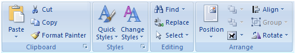   Use group names that are specific enough to describe the commands contained in the group. |    This group name is too vague to be helpful. A better approach would be to reorganize these commands into more specific groups. |

- **Order.** People read in a left-to-right order (in Western cultures), so you might think that groups on the far left are the most noticeable. However, the highlighted tab name and the window content tend to act as [focal points](vis-layout.md), so groups in the center of the tab usually receive more attention than the left-most group. Place the most commonly used groups in the most prominent locations, and make sure there is a logical flow for the groups across the tab.

In this example, the Font and Paragraph groups are more noticeable than the Clipboard group, because they are what the eye sees first when moving up from the document.

In this example, the Tracking group receives the most attention, in part because the highlighted Review tab acts as a focal point.

- **Uniformity.** It can be hard to recognize commands when the command presentation all looks the same. Using icons with different shapes and colors, groups with varying formats, and commands with different sizes makes it easier for users to recognize command groups. Commands should have uniform sizing only when the ribbon is scaled down to its smaller sizes.

| Correct | Incorrect |
|------------------------------------------------------------------------------------------------|-------------------------------------------------------------------------------------------|
|  Use a variety of icon sizes to improve recognizability|  These commands look too similar to each other because they are all the same size. |

### Previews

You can use various types of previews to show what will result from a command. By using helpful previews, you can improve the efficiency of your program and reduce the need for the trial-and-error learning approach. Live previews also invite experimentation and encourage creativity.

Here are some of the different types of previews that you can use:

- **Realistic static icons and graphics.** Static images that give a realistic indication of a command's effect. These can be used in galleries, drop-down menus, and enhanced tooltips.

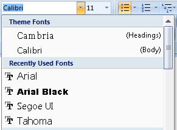

In this example, the Font drop-down list shows each font name using the font itself.

In this example, realistic thumbnails are used to show the different watermarks.

- **Dynamic icons and graphics.** Icons and graphics that are modified to reflect the current state. Such icons are especially useful for galleries, as well as split buttons that change their default effect to be the same as the last action.

In this example, Microsoft Word changes the Styles gallery to reflect the current styles.

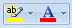

In this example, Word changes the Text highlight color and Font color commands to indicate their current effect.

- **Live previews.** When users hover over a formatting option, live preview shows what the results would look like with that formatting. Live previews help users make selections more efficiently and confidently based on the user's actual context.

In this example, the Page Color command performs a live preview by showing the effect of the color options on hover.

Live previews are a powerful feature that can really improve your users' productivity, but even simple static previews can be a big help.

### Scaling the ribbon

Scaling a toolbar is simple: if a window is too narrow to display a toolbar, the toolbar displays what fits and makes everything else accessible through an overflow button. A goal of rich commands is to take full advantage of the available space, so scaling a ribbon requires more design work. There is no default ribbon size, so you should not design a ribbon with a particular width in mind. You have to design layouts with a wide range of widths and realize that any one of them could be the one most of your users will see. Scaling is a fundamental part of ribbon design, not the last step. When designing a tab, specify the different layouts for each group (up to three) as well as the combinations that can be used together. The ribbon will show the largest valid combination that fits the current window size.

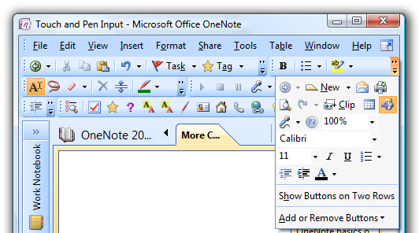
Toolbars scale using an overflow button.

There is no default ribbon size. The smallest size is a single pop-up group icon.

## Guidelines

### General

- **Don't combine ribbons with menu bars and toolbars within a window.** Ribbons must be used in place of menu bars and toolbars. However, a ribbon may be combined with palette windows and navigation elements, such as Back and Forward buttons and an Address bar.
- **Always combine a ribbon with an Application button and Quick Access Toolbar.**
- **Select the left-most tab (usually Home) when a program is started.** Don't make the last selected tab persist across program instances.
- **Show the ribbon in its normal state (not minimized) when a program is started for the first time.** Users often leave default settings unchanged, so minimizing the ribbon at program start will likely cause all commands to be less efficient. Also, showing the ribbon initially minimized can be disorienting.
- **Make the ribbon state persist across program instances.** For example, if a user minimizes the ribbon, it should be shown minimized the next time the program is run. But again, don't make the last selected tab persist in this way.

### Using tabs

Generally, having fewer tabs is better, so remove tabs that don't help achieve these goals.

- **Whenever practical, use standard tabs.** Using standard tabs greatly improves discoverability, especially across programs. See the [standard ribbon tabs](#standard-ribbon-tabs) later in this article.
- **Label the first tab Home, if appropriate.** The Home tab should contain the most frequently used commands. If you have frequently used commands that don't fit into the other tabs, the Home tab is the right place for them.
- Add a new tab if:
  - **Its commands are strongly related to specific tasks, and can be accurately described by the tab label.** Adding the tab should help make its commands easy to find, not harder.
  - **Its commands are mostly unrelated to tasks on other tabs.** Adding the tab shouldn't require more tab switching during commonly performed tasks.
  - **The tab has enough commands to justify having an extra place to look.** Don't have tabs with only a few commands. **Exception:** Consider adding a tab with a few commands if they are strongly related to a specific task and adding the tab greatly simplifies an overly complex Home tab.
- **For the remaining tabs, place the most frequently used tabs first, while maintaining a logical order across the tabs.**
- **Optimize the tab design so that users find commands quickly and confidently.** All other considerations are secondary.
- **Don't provide a Help tab.** Instead, provide assistance using program-wide Help and enhanced tooltips.
- **Use a maximum of seven core tabs.** If there are more than seven, it becomes difficult to determine which tab has a command. While seven core tabs is acceptable for applications with many commands, most programs should aim for four or fewer tabs.

### Contextual tabs

- **Use a contextual tab to display a collection of commands that are relevant only when users select a particular object type.** If there are only a few, frequently used commands, it may be more convenient and more stable to use a regular tab, and simply disable commands when they don't apply.
- 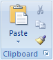 It's better to disable common commands like Cut and Copy than to use a contextual tab.
- **Include only the commands that are specific to a particular object type.** Don't put commands only on a contextual tab if users might need them without first selecting an object.
- **Include the commands frequently used when working with a particular object type.** Put frequently used general contextual commands on context menus and mini-toolbars to avoid tab switching during commonly performed tasks. Alternatively, consider putting general commands redundantly on a contextual tab if doing so avoids frequent tab switching. But don't overdo this - don't try to include every command that a user might need while working with the object.
-  In this example, the Borders command is included on the Design tab to avoid frequent tab switching during commonly performed tasks.\
- **Choose a contextual tab color that is different from the currently displayed contextual tabs.** The same tab set can appear at a later time using a different color in order to achieve this, but try to use consistent color assignments across invocations whenever possible.
- **Selecting a contextual tab automatically** aids discoverability, improves the perception of stability, and reduces the need to switch tabs. Select a contextual tab automatically when:
  - **The user inserts an object.** In this case, select the first contextual tab in the set.
  - **The user double-clicks an object.** In this case, select the first contextual tab in the set.
  - **The user selected a contextual tab, clicked off the object, then immediately clicked an object of the same type.** In this case, return to the previously selected contextual tab.
- **When removing a contextual tab that is the active tab, make the Home tab or first tab the active tab.** Doing so appears the most stable.

### Modal tabs

- **Use a modal tab to display a collection of commands that apply with a particular temporary mode, and none of the core tabs apply.** If some of the core tabs apply, use a contextual tab instead, and disable the commands that don't apply. Because modal tabs are very limiting, they should be used only when there isn't a better alternative.
-  Print preview is a commonly used modal tab.
- **To close a modal tab, put the Close &lt;mode&gt; command as the last command on the tab.** Use the Close icon to make the command easy to find. Give the mode in the command to prevent confusion about what is being closed.
-  In this example, explicitly labeling the Close command with the mode removes any doubt about what is being closed.
- **To close a modal tab, also redefine the Close button on the window's title bar to close the mode instead of the program.** User testing has shown that many users expect this behavior.

### Standard ribbon tabs

Whenever practical, map your program's commands to these standard tabs, given in their standard order of appearance.

#### Regular tabs

- **Home.** Contains the most frequently used commands. If used, it is always the first tab.
- **Insert.** Contains commands to insert content and objects into a document. If used, it is always the second tab.
- **Page layout.** Contains commands that affect the page layout, including themes, page setup, page backgrounds, indenting, spacing, and positioning. (Note that the indenting and spacing groups can be on the Home tab instead, if there is enough room there.) If used, it is always the third tab.
- **Review.** Contains commands to add comments, track changes, and compare versions.
- **View.** Contains commands that affect the document view, including view mode, show/hide options, zooming, window management, and macros the commands traditionally found in the Windows menu category. If used, it is the last regular tab unless the Developer tab is showing.
- **Developer.** Contains commands used only by developers. If used, it is hidden by default and the last regular tab when displayed.

Most programs don't need the Review and Developer tabs.

#### Standard Contextual tabs

- **Format.** Contains commands related to changing the format of the selected object type. Usually applies to part of an object.
- **Design.** Contains commands, often in galleries, to apply styles to the selected object type. Usually applies to the entire object.
- **Layout.** Contains commands to change the structure of a complicated object, such as a table or chart.

If you have contextual commands related to format, design, and layout, but not enough for multiple tabs, just provide a Format tab.

### Standard groups

- **Whenever practical, use standard groups.** Having common commands appear with the same names and similar locations greatly improves discoverability. See the [standard ribbon groups](#standard-ribbon-groups) later in this article.
- **Add a new group** if:
  - **Its commands are strongly related and can be accurately described by the group label.** Adding the group should help make its commands easy to find, not harder.
  - **Its commands have a weaker relationship to the commands in other groups.** While all the commands on a tab should be strongly related, some command relationships are stronger than others.
  - **The group has enough commands to justify having an extra place to look.** Aim for 3-5 commands for most groups. Avoid having groups with only 1-2 commands, although having an in-ribbon gallery without any other commands within a group is acceptable. Having many groups with a single command suggests too much structure or lack of command cohesion.
- **Don't over-organize** by adding groups where they aren't needed.
- **Consider splitting a group** if:
  -  The group has many commands of different sizes and needs organization.
  -  The group has commands that greatly benefit from having extra labels.
- **Place the most commonly used groups in the most prominent locations, and make sure there is a logical order for the groups across the tab.**
- **Optimize the group design so that users find commands quickly and confidently.** All other considerations are secondary.
- **Don't scale groups containing a single button to a pop-up group icon.** When scaling down, leave them as a single button.
- **Use a maximum of seven groups.** If there are more than seven groups, it becomes more difficult to determine which group has a command.

### Standard ribbon groups

Whenever practical, map your program's commands to these standard groups, which are given within their associated tabs in their standard order of appearance.

#### Main tab

- Clipboard
- Font
- Paragraph
- Editing

#### Insert tab

- Tables
- Illustrations

#### Page layout tab

- Themes
- Page setup
- Arrange

#### Review tab

- Proofing
- Comments

#### View tab

- Document views
- Show/hide
- Zoom
- Window

### Commands

-  **Take advantage of the discoverability and scalability of ribbons by exposing all the commonly used commands.** When appropriate, move frequently used commands from dialog boxes to the ribbon, especially those that are known to be hard to find. Ideally, users should be able to perform common tasks without using any dialog boxes.

- **Don't use the scalability of ribbons to justify adding unnecessary complexity.** Continue to exercise restraint don't add commands to a ribbon just because you can. Keep the overall command experience simple. The following are ways to simplify the presentation:
  -  **Use context menus and mini-toolbars for in-place, contextual commands.**
  - **Move (or keep) rarely used commands in dialog boxes.** Use dialog box launchers to access these commands. You can still use dialog boxes with ribbons! Just try to reduce the need for using them during common tasks.
  - **Eliminate redundant, seldom used features.**

#### Presentation

- **Present each command on only one tab. Avoid multiple paths to the same command especially if the command requires many clicks to invoke.** It may seem like a convenience to find a command through multiple paths. But keep in mind that when users find what they are looking for, they stop looking. It is all too easy for users to assume that the first path they find is the only path which is a serious problem if that path is inefficient. **Exception:** Contextual tabs may duplicate a few commands from the Home and Insert tabs if doing so prevents changing tabs for common contextual tasks.
- **Within a group, put the commands in their logical order, while giving preference to the most frequently used commands.** Overall, the commands should have a logical flow to make them easy to find, while still having the most frequently used commands appear first. Generally, commands with 32x32 pixel icons appear before commands with 16x16 pixel icons to aid scanning across groups.
- **Avoid placing destructive commands next to frequently used commands.** A command is considered destructive if its effect is widespread and either it cannot be easily undone or the effect isn't immediately noticeable.
- **Use separators to indicate strongly related commands, such as a set of mutually exclusive options.**
-   **Consider using toolbar-style groups for sets of strongly related, well-known commands that don't need labels.** Doing so allows you to present many commands in a compact space without affecting discoverability and ease of learning. To be so well known, such commands are frequently used, instantly recognized, and therefore tend to be on the Home tab.

- **Use 32x32 pixel icons for the most frequently used and important labeled commands.** When scaling a group down, make these commands the last to convert to 16x16 pixel icons.
- **Avoid arbitrary command placement.** Think carefully about your tab and group design to ensure that users aren't wasting time inspecting every tab to find the command they want.
- **Avoid marketing-based placement.** Marketing objectives around the promotion of new features tend to change over time. Consider future versions of your product and how much frustration a constantly changing organization will cause.

#### Interaction

- **Disable commands that don't apply to the current context, or that would directly result in an error.** If helpful, use the [enhanced tooltip](glossary.md) to explain why the command is disabled. Don't hide such commands because doing so can cause the ribbon layout to change, making the ribbon presentation unstable.
- **Don't update command labels dynamically.** Again, doing so might cause the tab layout to change, resulting in an unstable appearance. Instead, design commands so that they work with constant labels.

    | Correct                                                                                       | Incorrect                                                                 |
    |-------------------------------------------------------------------------------------------|-------------------------------------------------------------------------------|
    | 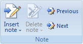  Disable commands when they are unavailable |  Do not hide commands, even when they are not available |

- **Prefer direct controls.** A command is direct if invoked with a single click (that is, without navigating through menus). However, with the exception of in-ribbon galleries, direct controls don't support Live preview, so the need for Live preview is also a factor.
- **Use Live preview** to indicate the effect of the options  when a command is among a related set of formatting options, and Live preview is important and practical, especially if users are likely to choose the wrong option otherwise.
  - If the command is used frequently, use an in-ribbon gallery for directness.
  - If the command is used infrequently, use a drop-down gallery.
- **Expose direct commands** using the following controls in the following order of preference
  - **Command buttons, check boxes, radio buttons, and in-place galleries.** These are always direct.
  - **Split buttons.** Direct for the most common command, but indirect for the command variations.
  - **Menu buttons.** These are indirect, but present many commands that are easy to find.
  - **Text boxes (with spin controls).** Text input generally requires more effort than the other control types.
- 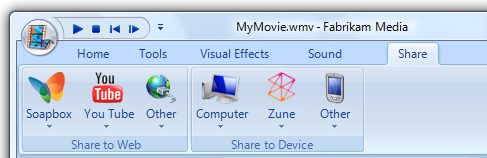 If your ribbon consists mostly of menu buttons when displayed at full size, you might as well use a menu bar.
- **Prefer immediate commands.** 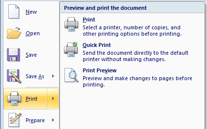 A command is immediate if it takes effect immediately (that is, without dialog boxes to gather additional input). If a command might require input, consider using a split button, with the immediate command in the button portion, and the commands that require input in the submenu.

### Galleries

**Use a [gallery](glossary.md)** if:

- **There is a well-defined, related set of choices from which users typically choose.** There may be an unbounded number of variations, but the likely selections should be well contained. If the choices aren't strongly related, consider using separate galleries.
- **The choices are best expressed visually, such as formatting features.** Using thumbnails makes it easier to browse, understand, and make choices. While the choices can be labeled, the selection is made visually and text labels shouldn't be required to understand the choices.
- **The choices show the result that is achieved immediately with a single click.** There shouldn't be any follow-up dialog box to further clarify the user's intention, or a set of steps to achieve the indicated result. If users might want to adjust the choice, let them do so afterwards.

**Use an in-ribbon gallery** if:

- **The choices are used frequently.** The choices need the space and are worth the space potentially being taken from other commands.
- **For typical usage, there is no need to group or filter the presented choices.**
- **The choices can be displayed effectively within the height of a ribbon (which is 48 pixels).**

#### Thumbnails in galleries

**Choose the smallest standard gallery thumbnail size** that does the job well.

- For in-ribbon galleries, use thumbnails of 16x16, 48x48, or 64x48 pixels.
- For drop-down galleries, use thumbnails of 16x16, 32x32, 48x48, 64x48, 72x96, 96x72, 96x96, or 128x128 pixels.
- All gallery items should have the same thumbnail size.

For in-ribbon galleries:

- **Display a minimum of three choices; more if there is room.** If there isn't sufficient space to display at least three choices in the typical window size, use a drop-down gallery instead.
- **Expand in-ribbon galleries to take advantage of available space.** Use the additional space to show more items and make them easier to choose with a single click.

For drop-down galleries:

- **Display the gallery from either a combo box, drop-down list, split button, or menu button.**
- **If the user clicks the main window to dismiss the drop-down gallery, just dismiss the gallery without selecting or modifying the contents of the main window.**
- **If a gallery has many choices and some choices are rarely used, simplify the default gallery by focusing on the commonly used choices.** For the remaining commands, provide an appropriate command at the bottom of the gallery drop-down.
  - If the command shows a list of more variations, name it "More `singular feature name` options..."
  - If the command presents a dialog box that allows users to create their own custom options, name it "Custom `feature name`..."
- **Organize the choices into groups, if doing so makes browsing more efficient.**
-  **If a gallery has many items, consider adding a filter to help users find choices more efficiently.** To avoid confusion, initially display the gallery unfiltered. However, most galleries shouldn't require a filter because they shouldn't have so many choices, and using groups should be sufficient.

### Command previews

- **Use previews to show the effect of a command without users having to perform it first.** By using helpful previews, you can improve the efficiency and ease of learning of your program, and reduce the need for trial-and-error. For the different types of command previews, see [Previews](#previews) in the Design Concepts section of this article.
- **For live previews, make sure that the preview can be applied and the current state restored within 500 milliseconds.** Doing so requires the ability to apply formatting changes quickly and in a way that is interruptible. Users must be able to evaluate different options rapidly for live previews to have their full benefit.
- **Avoid using text in previews.** Otherwise, the preview images will have to be localized.

### Icons

-  **Provide icons for all ribbon controls except drop-down lists, check boxes, and radio buttons.** Most commands will require both 32x32 and 16x16 pixel icons (only 16x16 pixel icons are used by the Quick Access Toolbar). Galleries typically use 16x16, 48x48, or 64x48 pixel icons.
- **Provide unique icons.** Don't use the same icon for different commands.
- **Make sure ribbon icons are clearly visible against the ribbon background color.** Always evaluate ribbon icons in context and in high-contrast mode.
- **Choose icon designs that clearly communicate their effect,** especially for the most frequently used commands. Well-designed ribbons have self-explanatory icons to help users find and understand commands efficiently.
- **Choose icons that are recognizable and distinguishable,** especially for the most frequently used commands. Make sure the icons have distinctive shapes and colors. Doing so helps users find the commands quickly, even if they don't remember the icon symbol.

    | Correct                                                                                                 | Incorrect                                                                               |
    |--------------------------------------------------------------------------------------------------|------------------------------------------------------------------------------------------------|
    |  Use shape and color to make icons that are easy to distinguish. |   Icons that are the same color are hard to distinguish|

-  **Consider creating pop-up group icons by placing the 16x16 pixel icon of the most prominent command in the group inside a 32x32 pixel visual container.** You don't have to create different icons for pop-up groups.
-  **If useful, change the icon to reflect the current state.** Doing so is especially useful for split buttons whose default effect can change.
- **Make sure ribbon icons conform to the Aero-style icon guidelines.** However, ribbon icons are shown straight on instead of being shown in perspective.

| Correct                                                                                                 | Incorrect                                                                               |
    |--------------------------------------------------------------------------------------------------|------------------------------------------------------------------------------------------------|
    |   Use two-dimensional icons.|  Do not use three-dimensional icons. |
 
### Enhanced tooltips

- **All ribbon commands should have enhanced tooltips** to give the command name, shortcut key, description, and optional supplemental information. Avoid tooltips that simply restate the label.

    **Incorrect:**

    

    In this example, the tooltip simply restates the command label.

- **When practical, completely describe the command using a concise description.** Link to Help only if further explanation is really necessary.

    **Incorrect:**

    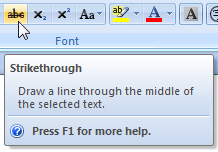

    In this example, the command doesn't need Help.

- **When helpful, illustrate the effect of the command using a preview.**

    

    In this example, the tooltip image illustrates the effect of the command.

For labeling guidelines, see [Enhanced tooltip labels](#enhanced-tooltips).

### Access keys and keytips

Keytips are the mechanism used to display access keys for commands displayed directly on a ribbon.

Access keys for drop-down menu commands are indicated with an underlined character. They differ from menu access keys in the following ways:

- Two character access keys can be used. For example, FP can be used to access the Format painter command.
- The access key assignments are shown using tips instead of underlines, so the character width and descenders aren't a factor in making assignments.

- **Assign access keys to all ribbon tabs and commands.** The only possible exception is for commands coming from legacy add-ins.
- **For the Application button and Quick Access Toolbar:**
  - Assign F to the Application button. This assignment is used because of the Application button's similarity to the traditional File menu.
  -  For the Quick Access Toolbar and recently used file lists, assign access keys numerically.
-  **For tabs:**
  - Assign H to Home.
  - Starting with the most frequently used tabs, assign the first letter of the label.
  - For any tabs that cannot be assigned to the first letter, choose a distinctive consonant or a vowel in the label.
  - For programs that used to support menu bars, strive to maintain access key compatibility to the best extent practical. Avoid assigning different meanings to access keys from legacy menu categories. For example, if the legacy menu bar version of a program had an Edit menu, strive to use an E access key to the equivalent tab. If there is no equivalent tab, don't assign an E access key to any tab to prevent confusion.
- 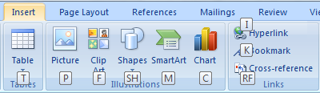 **For ribbon commands, menus, and submenus:**
  - Assign unique access key combinations within a tab. You can reuse access key combinations within different tabs.
  - Whenever possible, assign the standard access keys for commonly used commands. See the [standard access key table](inter-keyboard.md).
  - For other commands:
    - For the most frequently used commands, choose letters at the beginning of the first or second word of the label, preferably the first letter.
    - For less frequently used commands, choose letters that are a distinctive consonant or a vowel in the label, such as "x" in "Exit."
    - For the least frequently used commands and dialog box launchers, use two letters as necessary.
    - For menus and submenus, use a single letter to reduce the number of keystrokes required for the complete command.
    - Don't use access keys starting with J, Y, or Z because they are used for contextual tabs, unassigned keytips, and popup groups.
-  **For pop-up groups:**
  - Use a two-letter access key that starts with Z.
  - Starting with the most frequently used groups, assign the second access key letter to the first letter of the label.
  - For any remaining groups, choose a distinctive consonant or a vowel in the label.

For shortcut key guidelines, see [Keyboard](inter-keyboard.md).

### Application buttons

- **Use an Application button to present a menu of commands that involve doing something to or with a file.** Examples include commands that traditionally go in the File menu to create, open, and save files, print, and send and publish documents.
- **Always provide an Application button when using a ribbon.** If the program doesn't use files, use the Application button to access the program options and the Exit command. Application buttons always display a command menu they are never just decorative.
- **Use the following standard Application menu commands when appropriate:**
  - New  
  - Open  
  - Save  
  - Save as...
  - Print...
  - Quick print  
  - Print preview  
  - Close  
  - Options  
  - Exit  
  
- **Reserve commands that belong in the Application menu only for that menu.** Don't place them redundantly in any of the tabs.
- For each menu item, provide:
  - **A label with the command name.**
  - **A 32x32 pixel icon.**
  - **A brief description.** Make sure the description can be displayed using at most two lines of text.
-  **Use tooltips to document the shortcut keys.** Unlike normal menus, Application menus don't document the shortcut keys using labels.

### Quick Access Toolbars

- **Use the Quick Access Toolbar to provide access to frequently used commands.** The commands can be from the Application button or the ribbon.
- **Always provide a Quick Access Toolbar when using a ribbon.** Do so even if the ribbon has a single tab; this provides consistency across programs.
- **Prepopulate the Quick Access Toolbar with the frequently used commands in the Application menu.** Provide Save and Undo if your program supports them, and Open and Print if supported and frequently used.
- **For the Customize Quick Access Toolbar menu, provide up to 12 of the most frequently used immediate commands.** Immediate commands don't require additional input before they take effect, and are therefore well-suited for the Quick Access Toolbar. While these can be any immediate commands, prefer those commands that aren't on the Home tab, because users are more likely to choose those.
- **For the Customize Quick Access Toolbar menu, if there is a pair of related commands, provide both, regardless of frequency.** Common pairs are Open/Close, Back/Forward, and Undo/Redo.
- **For the Customize Quick Access Toolbar dialog, provide a way to add any command.** Provide a Popular commands filter that displays the most frequently used commands, and select this filter by default.

### Dialog box launchers

- 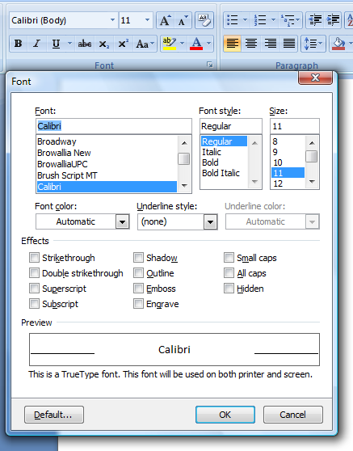 **Provide a group with a dialog box launcher if there is a related dialog box with infrequently used commands and settings.** The dialog box should contain all the commands in the group, plus others not a completely different set of commands or the same commands as the group.
- **Don't use a dialog box launcher to perform commands directly.** A dialog box launcher must display a dialog box.
- **Don't use a dialog box launcher to access frequently used commands and settings.** Compared to commands directly on the ribbon, the dialog box commands and settings are relatively undiscoverable.
- **Match the name of the dialog box with the name of the group.** It doesn't have to be an exact match, but the names should be similar enough so that users aren't surprised by the results.

    **Incorrect:**

    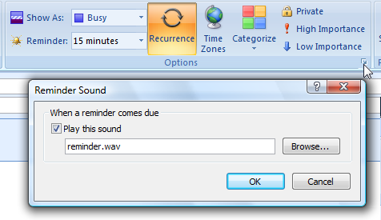

    While a reminder sound is a reminder option, using the dialog box launcher to set the reminder sound is unexpected.

- **Display only the commands and settings that relate to the group.** If the dialog box displays other things, users may conclude that this path to these other commands and settings is the only path.

    **Incorrect:**

    

    In this example, the Font dialog box displays Character Spacing settings, which are unrelated to the associated tab.

## Labels

### Tab labels

- **Label all tabs.**
- Whenever practical, **use the standard ribbon tabs**.
- **Prefer concise, single word labels.** While multi-word labels are acceptable, they take more space and are harder to localize.
- **Choose meaningful tab names that clearly and accurately describe their content.** The names should be specific, but not overly specific. Tab names should be predictable enough so that users aren't surprised by their content. Note that the Home tab is generically named because it is used for the most frequently used commands.
- **Do not** use group names such as "Basic" and "Advanced." They require users to determine if the command they are looking for is basic or advanced.
- **Choose tab names that reflect their purpose.** Consider the goals or tasks associated with the tab.
- **Choose tab names that are clearly distinct from all the other tab names.**
- **Use either nouns or verbs for tabs.** Tab names don't require parallel phrasing, so choose the best label regardless of whether it's a noun or verb.
- **Don't use gerunds** (names that end in "-ing"). Use the verb from which the gerund is derived instead. (e.g. use "Draw" instead of "Drawing".)
- **Avoid tab names with the same initial letters, especially adjacent tabs.** When the ribbon is scaled down, these tab names will have the same truncated text.
- **Prefer singular names.** However, you can use a pural name if the singular name is awkward.
- **Use title-style capitalization.**
- **Don't use ending punctuation.**

### Contextual tab and tab set labels

- **End contextual tab set labels with "Tools".** Doing so helps identify the purpose of contextual tabs.
- Use title-style capitalization.
- Don't use ending punctuation.

### Group labels

- **Label all groups** unless the group has a single command and the group and command labels would be the same.

- **Use the standard ribbon groupsWhenever practical.**
- **Prefer concise, single word labels.** While multi-word labels are acceptable, they take more space and are harder to localize.
- **Choose meaningful group names that clearly and accurately describe their content.** The names should be specific, not generic.
- **Choose group names that reflect their purpose.** Consider the goals or tasks associated with the commands in the group.
- **Avoid using gerunds** (names that end in "-ing"). You can use gerunds, however, if using the verb from which the gerund is derived would be confusing. For example, use "Editing" and "Proofing" instead of "Edit" and "Proof."
- **Don't use group names that are the same as tab names.** Using the tab name that the group is on provides no information, and using the name of a different tab is confusing.
- **Prefer singular names.** However, you can use a pural name if the singular name is awkward. 
- **Use sentence-style capitalization.**
- **Don't use ending punctuation.**

### Command labels

- **Label all commands.** Having explicit text labels helps users find and understand commands. **Exception:** A command can be unlabeled if its icon is extremely well known and space is at a premium. Most likely, unlabeled commands will be on the Home tab. In this case, assign its Name property to an appropriate text label. This enables assistive technology products such as screen readers to provide users with alternative information about the graphic.
- **For command buttons, use a concise, self-explanatory label.** Use a single word if possible; four words maximum.
- **For drop-down lists, if the list always has a value, use the current value as the label.**
-  If an [editable drop-down list](/windows/desktop/uxguide/ctrl-drop) doesn't have a value, use a [prompt](glossary.md).
- **Drop-down lists that aren't self-explanatory or are infrequently used need an explicit label.** Put a colon at the end of the label.
- ![screen shot of automatically after: \[seconds\] ](images/cmd-ribbons-image69.png)<br.>**For text boxes, use an explicit label.** Put a colon at the end of the label.
- **Use sentence-style capitalization.** Doing so is more appropriate for the Windows [tone](text-style-tone.md).
- **Start the label with an imperative verb.** unless it's the same as the tab or group name or a common verb like Show, Create, Insert, or Format.
- **Don't use ending punctuation.**
- **To conserve space, don't put ellipses on ribbon command labels.** However, ellipses are used by commands in the Application button and drop-down menus.

### Enhanced tooltip labels

- **Use the title to give the command name and its shortcut key, if applicable.**
- **For the title, don't use ending punctuation.**
- **Start the description with a verb.** Use the description to help users determine whether a specific feature is the one they are looking for. The description should be phrased to complete the sentence "This is the right feature to use if you want to...".
- **Keep the description short.** Get right to the point. Lengthy text discourages reading.
-    **For split buttons, use a different tooltip to explain the split button menu.**
- **Use an optional supplemental description to explain how to use the control.** This text can include information about the state of the control (including why it is disabled) if the control itself doesn't indicate state. Keep this text short, and use a Help topic for more detailed explanations.
- **For the description and supplemental description, use complete sentences with ending punctuation.**
- Use sentence-style capitalization.

### Application button labels

- [screen shot of quick print option selected ](images/cmd-ribbons-image72.png) **Use "Quick" to indicate an immediate version of a command.**

- **Use an ellipsis to indicate that a command requires more information.**
- **Use sentence-style capitalization.**

## Documentation

When referring to ribbons:

- Refer to the ribbon and its components as ribbon, tabs, groups, and controls. These terms are not capitalized.
- Refer to the round button as the Application button, and the menu it contains as the Application menu.
- Refer to the toolbar as the Quick Access Toolbar.
- Refer to tabs by their labels and the word tab. Use the exact label text, including its capitalization.
- Refer to commands by their labels. Refer to unlabeled commands by their tooltip names. Use the exact label text, including its capitalization, but don't include the ellipsis. Don't include the word button or command.
- To describe user interaction, use click for tabs and controls. Use enter for editable drop-down lists. Don't use choose, select, or pick.
- Refer to unavailable items as unavailable, not as dimmed, disabled, or grayed. In programming documentation, use disabled.
- When possible, format the labels using bold text. Otherwise, put the labels in quotation marks only if required to prevent confusion.

Examples:

- On the **Home** tab, click **Paste special**.
- On the **Home** tab, in the **Font** box, enter "Segoe UI".
- On the **Review** tab, click **Show markup**, and then click **Reviewers**.
- On the **Format** tab, in **Picture tools**, click **Compress pictures**.
