# Toolbars

> [!NOTE]
> This design guide was created for Windows 7 and has not been updated for newer versions of Windows. Much of the guidance still applies in principle, but the presentation and examples do not reflect our [current design guidance](/windows/uwp/design/).

Toolbars are a way to group commands for efficient access.

Some typical toolbars.

**Use toolbars in addition to or in place of menu bars.** Toolbars can be more efficient than menu bars because they are direct (always displayed instead of being displayed on mouse click), immediate (instead of requiring additional input) and contain the most frequently used commands (instead of a comprehensive list). In contrast to menu bars, toolbars don't have to be comprehensive or self-explanatory just quick, convenient, and efficient.

Some toolbars are customizable, allowing users to add or remove toolbars, change their size and location, and even change their contents. Some types of toolbars can be undocked, resulting in a palette window. For more information about toolbar varieties, see [Usage patterns](#usage-patterns) in this article.

> [!Note]  
> Guidelines related to [menus](cmd-menus.md), [command buttons](ctrl-command-buttons.md), and [icons](vis-icons.md) are presented in separate articles.

 

## Is this the right user interface?

To decide, consider these questions:

-   **Is the window a primary window?** Toolbars work well for primary windows, but are usually overwhelming for secondary windows. For secondary windows, use [command buttons](ctrl-command-buttons.md), [menu buttons](ctrl-command-buttons.md), and [links](ctrl-command-links.md) instead.
-   **Are there a small number of frequently used commands?** Toolbars can't handle as many commands as menu bars, so they work best as a way to efficiently access a small number of frequently used commands.
-   **Are most of the commands immediate?** That is, are they mostly commands that don't require additional input? To be efficient, toolbars need to have a direct and immediate feel. If not, menu bars are better suited for commands that require additional input.
-   **Can most of the commands be presented directly?** That is, users interact with them using a single click? While some commands can be presented using menu buttons, presenting most commands this way undermines the efficiency of the toolbar, making a menu bar a better choice.
-   **Are the commands well represented by icons?** Toolbar buttons are usually represented by icons instead of text labels (although some toolbar buttons use both), whereas menu commands are represented by their text. If the command icons aren't high quality and aren't self-explanatory, a menu bar may be a better choice.

If your program has a toolbar without a menu bar, and most of the commands are accessible indirectly through menu buttons and [split buttons](ctrl-command-buttons.md), this toolbar is essentially a menu bar. Apply the [toolbar menus](cmd-menus.md) pattern in the Menus guidelines instead.

## Design concepts

A good menu bar is a comprehensive catalog of all the available top-level commands, whereas a good toolbar gives quick, convenient access to frequently used commands. A toolbar doesn't attempt to train users just make them productive. Once users learn how to access a command on a toolbar, they rarely continue to access the command from the menu bar. For these reasons, a program's menu bar and its toolbar don't need to correspond directly.

### Toolbars vs. menu bars

Traditionally, toolbars are different from menu bars in the following ways:

-   **Frequency.** Toolbars present only the most frequently used commands, whereas menu bars catalog all the available top-level commands within a program.
-   **Immediacy.** Clicking a toolbar command takes effect immediately, whereas a menu command might require additional input. For example, a Print command in a menu bar first displays the Print dialog, whereas a Print toolbar button immediately prints a single copy of a document to the default printer.

    

    In this example, clicking the Print toolbar button immediately prints a single copy of a document to the default printer.

-   **Directness.** Toolbar commands are invoked with a single click, whereas menu bar commands require navigating through the menu.
-   **Number and density.** The screen space required by a toolbar is proportional to the number of its commands and that space is always used, even if the commands are not. Consequently, toolbars must use their space efficiently. By contrast, menu bar commands are normally hidden from view and their hierarchical structure allows for any number of commands.
-   **Size and presentation.** To pack many commands in a small space, toolbars usually use icon-based commands (with tooltip-based labels), whereas menu bars use text-based commands (with optional icons). While toolbar buttons can have standard text labels, these do use significantly more space.

    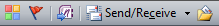

    Labeled toolbar buttons take at least three times as much space as unlabeled ones.

-   **Self-explanatory.** Well-designed toolbars need icons that are mostly self-explanatory because users can't find commands efficiently just using tooltips. However, toolbars still work well if a few less frequently used commands aren't self-explanatory.

    

    In this example, the most frequently used icons are self-explanatory.

-   **Recognizable and distinguishable.** For frequently used commands, users remember toolbar button attributes like location, shape, and color. With well-designed toolbars, users can find the commands quickly even if they don't remember the exact icon symbol. By contrast, users remember frequently used menu bar command locations, but rely on the command labels for making selections.

    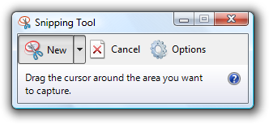

    For toolbar commands, distinctive location, shape, and color help make icons recognizable and distinguishable.

    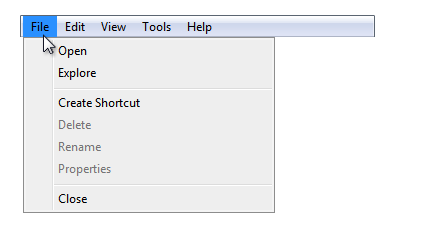

    For menu bar commands, users ultimately depend upon their labels.

### Efficiency

Given their characteristics, toolbars must be designed primarily for efficiency. An inefficient toolbar just doesn't make any sense.

**If you do only one thing...**

Make sure your toolbars are designed primarily for efficiency. Focus toolbars on commands that are frequently used, immediate, direct, and quickly recognizable.

### Hiding menu bars

Generally, toolbars work great together with menu bars: good toolbars provide efficiency and good menu bars provide comprehensiveness. **Having both menu bars and toolbars allows each to focus on its strengths without compromise.**

Surprisingly, this model breaks down with simple programs. For programs with only a few commands, having both a menu bar and a toolbar doesn't make sense because the menu bar ends up being a redundant, inefficient version of the toolbar.

To eliminate this redundancy, many simple programs in Windows Vista focus on providing commands solely through the toolbar, and hiding the menu bar by default. Such programs include Windows Explorer, Windows Internet Explorer, Windows Media Player, and Windows Photo Gallery.

This is no small change. Removing the menu bar fundamentally changes the nature of toolbars because such toolbars need to be comprehensive and change in the following ways:

-   **Frequency.** Removing the menu bar means that all commands not available directly from a window or its context menus must be accessible from the toolbar, regardless of their frequency of use.
-   **Immediacy.** Removing the menu bar makes the toolbar the only visible access point for commands, requiring the toolbar to have the fully functional versions. For example, if there is no menu bar, a Print command on a toolbar must display the Print dialog box instead of printing immediately. (Although using a split button is an excellent compromise in this case. See [Standard menu and split buttons](#standard-menu-and-split-buttons) for the standard Print split button.)

    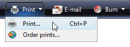

    In this example, the Print toolbar button in Windows Photo Gallery has a Print command that displays the Print dialog box.

-   **Directness.** To save space and prevent clutter, less frequently used commands may be moved to menu buttons, making them less direct.

Toolbars used to supplement a menu bar are designed differently than toolbars designed for use with a removed or hidden menu bar. And because you can't assume that users will display a hidden menu bar to perform a single command, hiding a menu bar should be treated the same as removing it completely when making design decisions. (If you hide the menu bar by default, don't assume that users will think of displaying the menu bar to find a command or even figure out how to display it.)

Designing a toolbar to work without a menu bar often involves some compromises. But for efficiency, don't compromise too much. If hiding the menu bar results in an inefficient toolbar, don't hide the menu bar!

### Keyboard accessibility

From the keyboard, accessing toolbars is quite different from accessing menu bars. Menu bars receive input focus when users press the Alt key and they lose input focus with the Esc key. Once a menu bar has input focus, it is navigated independently of the remainder of the window, handling all arrow keys, Home, End, and Tab keys. By contrast, toolbars receive input focus when users press the Tab key through the entire contents of the window. Because toolbars are last in tab order, they might take some significant effort to activate on a busy page (unless users know to use Shift+Tab to move backwards).

Accessibility presents a dilemma here: while toolbars are easier for mouse users, they are less accessible for keyboard users. This isn't a problem if there is both a menu bar and a toolbar, but it is if the menu bar is removed or hidden.

For accessibility reasons, then, prefer to retain the menu bar rather than remove it completely in favor of a toolbar. If you must choose between removing the menu bar and simply hiding it, prefer to hide it.

## Usage patterns

Toolbars have several usage patterns:

|     Usage                                                                                                                 |     Example                                                                                                                                                                                                                                                                                                                                          |
|----------------------------------------------------------------------------------------------------------------------|----------------------------------------------------------------------------------------------------------------------------------------------------------------------------------------------------------------------------------------------------------------------------------------------------------------------------------------------------|
| **Primary toolbars**  a toolbar designed to work without a menu bar, either hidden or removed.   | primary toolbars must balance the need for efficiency with comprehensiveness, so they work best for simple programs.   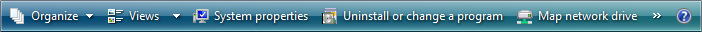  A primary toolbar from Windows Explorer.                                                                         |
| **Supplemental toolbars**  a toolbar designed to work with a menu bar.                           | supplemental toolbars can focus on efficiency without compromise.     A supplemental toolbar from Windows Movie Maker.                                                                                                                   |
| **Toolbar menus**  a menu bar implemented as a toolbar.                                          | toolbar menus are toolbars consisting primarily of commands in [menu buttons](ctrl-command-buttons.md) and split buttons, with only a few direct commands, if any.   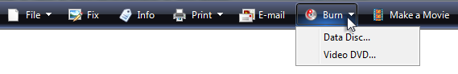  A toolbar menu in Windows Photo Gallery.  |
| **Customizable toolbars**  a toolbar that can be customized by users.                            | customizable toolbars allow users to add or remove toolbars, change their size and location, and even change their contents.     A customizable toolbar from Microsoft Visual Studio.                                              |
| **Palette windows**  a modeless dialog box that presents an array of commands.                   | palette windows are undocked toolbars.   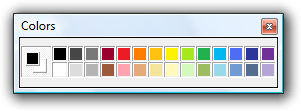    Palette windows from Windows Paint.                                                                              |

 

Toolbars have these styles:

|   Style                                                                                                                                     | Example                                                                                                                                                                                                                                                                                                                                                                                                                                                                                                 |
|----------------------------------------------------------------------------------------------------------------------------------------|-------------------------------------------------------------------------------------------------------------------------------------------------------------------------------------------------------------------------------------------------------------------------------------------------------------------------------------------------------------------------------------------------------------------------------------------------------------------------------------------------|
| **Unlabeled icons**  one or more rows of small unlabeled icon buttons.                                             | use this style if there are too many buttons to label or the program is frequently used. with this style, programs with complex functionality can have multiple rows, and therefore, this is the only style that needs to be customizable. with this style, some command buttons can be labeled if they are frequently used.   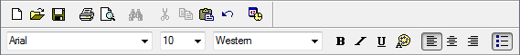  An unlabeled icons toolbar from WordPad.  |
| **Large unlabeled icons**  a single row of large unlabeled icon buttons.                                           | use this style for simple utilities that have easily recognizable icons and are usually run in small windows.   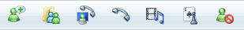  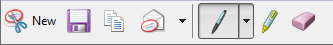  Large unlabeled icons toolbars from Windows Live Messenger and the Windows Snipping Tool.                                                                        |
| **Labeled icons**  a single row of small labeled icons.                                                            | use this style if there are few commands or the program isn't frequently used. this style always has a single row.     A labeled icons toolbar from Windows Explorer.                                                                                                                                                                                                                |
| **Partial toolbars**  a partial row of small icons used to save space when a full toolbar isn't necessary.         | use this style for windows with navigation buttons, a search box, or tabs to eliminate unnecessary weight at the top of the window.     Partial toolbars can be combined with navigation buttons, a search box, or tabs.                                                                                                                                                   |
| **Large partial toolbars**  a partial row of large icons used to save space when a full toolbar isn't necessary.   | use this style for simple utilities that have navigation buttons or a search box to eliminate unnecessary weight at the top of the window.     A large partial toolbar from Windows Defender.                                                                                                                                                                                          |

 

Finally, toolbar controls have several usage patterns:

|     Usage                                                                                                                 |     Example                                                                                                                                                                                                                                                                                                                                          |
|----------------------------------------------------------------------------------------------------------------------------------------------------------------------------------------------------------|----------------------------------------------------------------------------------------------------------------------------------------------------------------------------------------------------------------------------------------------------------------------------------------------------------------------------------------------------------------------------------------------------------------------------------------------------------------------------------------------------------------------------------------------------------------------------------------------------------------------------------------------------------------------------------------------------------------------------------------------------------------------------------------------------------------------------------------------------------------------------------------------------------------------------------------------------------------------------------------------------------------------------------------------------------------------------------------------------------------------|
| **Command icon buttons**  clicking a command button initiates an immediate action.                                                                                                   | 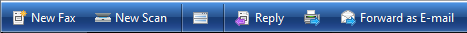  Examples of icon command buttons from Windows Fax and Scan.                                                                                                                                                                                                                                                                                                                                                                                                                                                                                                                                                                                                                                                                                                                                                                                                                                                                                                                                                         |
| **Mode icon buttons**  clicking a mode button enters the selected mode.                                                                                                              | 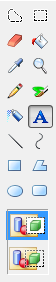  Examples of mode buttons from Windows Paint.                                                                                                                                                                                                                                                                                                                                                                                                                                                                                                                                                                                                                                                                                                                                                                                                                                                                                                                                                                             |
| **Property icon buttons**  a property button's state reflects the state of the currently selected objects, if any. clicking the button applies the change to the selected objects.   |   Examples of property buttons from Microsoft Word.                                                                                                                                                                                                                                                                                                                                                                                                                                                                                                                                                                                                                                                                                                                                                                                                                                                                                                                                                        |
| **Labeled icon buttons**  a command button or property button labeled with an icon and a text label.                                                                                 | these buttons are used for frequently used toolbar buttons whose icon isn't sufficiently self-explanatory. they are also used in toolbars that have so few buttons that each button can have a text label.   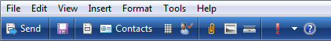  A toolbar with its most frequently used buttons labeled.                                                                                                                                                                                                                                                                                                                                                                                                                                                                                                                                                                                                                                                                                                                             |
| **Menu buttons**  a command button used to present a small set of related commands.                                                                                                  | a single downward-pointing triangle indicates that clicking the button shows a menu.   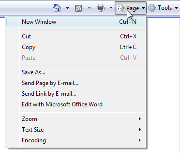  A menu button with a small set of related commands.                                                                                                                                                                                                                                                                                                                                                                                                                                                                                                                                                                                                                                                                                                                                                                                                                                                     |
| **Split buttons**  a command button used to consolidate variations of a command, especially when one of the commands is used most of the time.                                       | 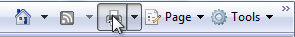  a split button in its normal state.  like a menu button, a single downward-pointing triangle indicates that clicking the rightmost portion of the button shows a menu.   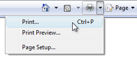  a dropped down split button.  in this example, a split button is used to consolidate all the print-related commands. the immediate print command is used most of the time, so users normally don't need to see the other commands.   unlike a menu button, clicking the left portion of the button performs the action on the label directly. split buttons are effective in situations where the next command is likely to be the same as the last command. in this case, the label is changed to the last command, as with a color picker:  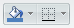  In this example, the label is changed to the last command.  |
| **Drop-down lists**  a drop-down list (editable or read-only) used to view or change a property.                                                                                     |   In this example, drop-down lists are used to view and set font attributes.  A drop-down list in a toolbar reflects the state of the currently selected object, if any. Changing the list changes the selected object's state.                                                                                                                                                                                                                                                                                                                                                                                                                                                                                                                                                                                                                                                                                                                                                                             |

 

## Guidelines

### Presentation

-   **Choose a suitable toolbar style based on the number of commands and their usage.** See the previous toolbar style table for guidance on how to choose. Avoid using a toolbar configuration that takes too much space from the program work area.
-   **Place toolbars just above the content area,** below the menu bar and address bar, if present.
-   **If space is at a premium, save space by:**

    -   Omitting the labels of well-known icons and less frequently used commands.
    -   Using only a partial toolbar instead of the entire window width.
    -   Consolidating related commands with a menu button or split button.
    -   Using an [overflow chevron](glossary.md) to reveal less frequently used commands.
    -   Displaying commands only when they apply to the current context.

    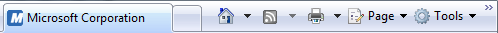

    The Windows Internet Explorer toolbar saves space by omitting labels of well-known icons, using a partial toolbar, and using an overflow chevron for less frequently used commands.

-   **For the unlabeled icons toolbar pattern, use a default configuration with no more than two rows of toolbars.** If more than two rows might be useful, make the toolbars customizable. Starting with more than two rows can overwhelm users and take too much space from the program work area.

    **Incorrect:**

    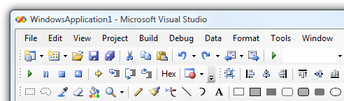

    A default configuration with more than two rows of toolbars results in too much visual clutter.

-   **Disable individual toolbar buttons that don't apply to the current context,** instead of removing them. Doing so makes toolbar contents stable and easier to find.
-   **Disable individual toolbar buttons if clicking on them would directly result in an error.** Doing so is necessary to maintain a direct feel.
-   **For the unlabeled icons toolbar pattern, remove entire toolbars if they don't apply to the current context.** Display them only in the applicable modes.

    

    In this example, the Debug toolbar is shown only when the program is being run.

-   **Display toolbar buttons left aligned.** The Help icon, if present, is right aligned.

    

    All toolbar buttons are left aligned except for Help.

    **Exception:** Windows 7-style toolbars left align program specific commands, but right align standard, well-known commands such as Options, View, and Help.

-   **Don't change toolbar button labels dynamically.** Doing so is confusing and unexpected. However, you can change the icon to reflect the current state.

    

    In this example, the icon is changed to indicate the default command.

### Controls and commands

-   **Prefer the most frequently used commands.**
    -   **For primary toolbars, provide comprehensive commands.** Primary toolbars don't have to be as comprehensive as menu bars, but they have to provide all the commands that aren't readily discoverable elsewhere. Primary toolbars don't need to have commands for:
        -   Commands that are directly on the UI itself.
        -   Commands typically accessed through context menus.
        -   Standard, well-known commands like Cut, Copy, and Paste.
    -   **For supplemental toolbars, provide commands that are used the most frequently.** Menu bar commands are a superset of the toolbar commands, so you don't have to provide everything. Focus on quick, convenient command access and skip the rest.
-   **Prefer direct controls.** Use toolbar buttons in the following order of preference:
    -   **Icon button.** Direct and takes minimal space.
    -   **Labeled icon button.** Direct, but takes more space.
    -   **Split button.** Direct for the most common command, but handles command variations.
    -   **Menu button.** Indirect, but presents many commands.
-   **Prefer immediate commands.** For commands that can either be immediate or have additional input for flexibility:
    -   For primary toolbars, use the flexible versions of commands, (such as Print...).
    -   For supplemental toolbars, use the immediate versions in the toolbar (such as Print) and use flexible versions in the menu bar (such as Print...).
-   **Provide labels for frequently used commands,** especially if their icons aren't well-known icons.

    **Acceptable:**

    

    **Better:**

    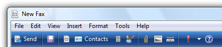

    The Windows Fax and Scan toolbar has few commands, so the better version labels the most important ones.

-   Don't put commands in toolbar menus that are also directly on the toolbar.

    **Incorrect:**

    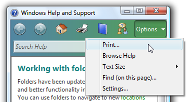

    In this example, Print is directly on the toolbar, so it doesn't need to be in the menu.

### Organization and order

-   **Organize the commands within a toolbar into related groups.**
-   **Place the most frequently used groups first. Within a group, put the commands in their logical order.** Overall, the commands should have a logical flow to make them easy to find, while still having the most frequently used commands appear first. Doing so is most efficient, especially if there is overflow.
-   **Use group dividers only if the commands across groups are weakly coupled.** Doing so makes the groupings obvious and the commands easier to find.

    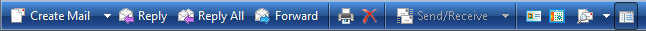

    

    Examples of grouped toolbars from Windows Mail.

-   **Avoid placing destructive commands next to frequently used commands.** Use either order or grouping to get separation. Also, consider not placing destructive commands in the toolbar, but only in the menu bar or context menus instead.

    **Acceptable:**

    

    **Better:**

    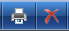

    In the better example, the Delete command is physically separated from Print.

-   **Use the overflow chevron to indicate that not all commands can be displayed.** But use overflow only if there isn't sufficient room to display all the commands.

    **Incorrect:**

    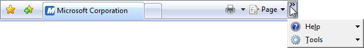

    The overflow chevron indicates that not all commands are displayed, but more of them could be with a better layout.

-   **Make sure that the most frequently used commands are directly accessible from the toolbar (that is, not in overflow) in small window sizes.** If necessary, reorder the commands, move less frequently used commands to menu buttons or split buttons, or even remove them completely from the toolbar. If this remains a problem, reconsider your choice of toolbar style.

### Hiding menu bars

Generally, toolbars work great together with menu bars because having both allows each to focus on their strengths without compromise.

-   Hide the menu bar by default if your toolbar design makes having a menu bar redundant.
-   Hide the menu bar instead of removing it completely, because menu bars are more accessible for keyboard users.
-   To restore the menu bar, provide a Menu bar checkmark option in the View (for primary toolbars) or Tools (for secondary toolbars) menu category. For more information, see [Standard menu and split buttons](#standard-menu-and-split-buttons).
-   Display the menu bar when users press the Alt key, and set input focus on the first menu category.

### Interaction

-   On hover, display the button [affordance](glossary.md) to indicate that the icon is clickable. After the tooltip timeout, display the tooltip or infotip.

    

    This example shows the various display states.

-   On left single-click:
    -   For command buttons, interact with the control as normal.
    -   For mode buttons, display the control to reflect the currently selected mode. If the mode affects the behavior of mouse interaction, also change the pointer.

        

        In this example, the pointer is changed to show the mouse interaction mode.

    -   For property buttons and drop-down lists, display the control to reflect the state of the currently selected objects, if any. On interaction, update the control's state and apply the change to the selected objects. If nothing is selected, do nothing.

-   On left double-click, perform the same action as a left single-click.
    -   **Exception:** On rare occasions, a toolbar command can be used more efficiently modally. In such cases, use double-click to toggle the mode.

        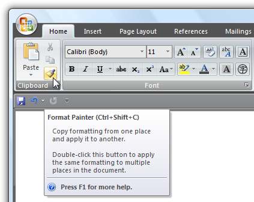

        In this example, double-clicking the Format painter command enters a mode where all subsequent clicks apply the format. Users can leave the mode by left single-clicking.

-   On right-click:
    -   For customizable toolbars, display the context menu for customizing the toolbar. Display the menu on right-click on mouse down, not mouse up.
    -   For other toolbars, do nothing.

### Icons

-   **Provide icons for all toolbar controls except drop-down lists.**

    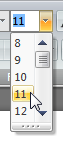

    Drop-down lists don't need icons, but all other toolbar controls do.

    **Exception:** Windows 7-style toolbars use icons only for commands whose icons are well known; otherwise they use text labels without icons. Doing so improves the clarity of the labels, but requires more space.

-   **Make sure toolbar icons are clearly visible against the toolbar background color.** Always evaluate toolbar icons in context and in high-contrast mode.
-   **Choose icon designs that clearly communicate their purpose, especially for the most frequently used commands.** Well-designed toolbars need icons that are self-explanatory because users can't find commands efficiently using their tooltips. However, toolbars still work well if icons for a few less frequently used commands aren't self-explanatory.
-   **Choose icons that are recognizable and distinguishable, especially for the most frequently used commands.** Make sure the icons have distinctive shapes and colors. Doing so helps users find the commands quickly even if they don't remember the icon symbol.
-   **Make sure toolbar icons conform to the Aero-style icon guidelines.**

For more information and examples, see [Icons](vis-icons.md).

### Standard menu and split buttons

If you are using menu buttons and split buttons in a toolbar, try to use the following standard menu structures and their relevant commands whenever possible. Unlike menu bars, toolbar commands don't take access keys.

**Primary toolbars**

These commands mirror the commands found in standard menu bars, so they should be used only for primary toolbars. This list shows the button labels (and type) with their order and separators, shortcut keys, and ellipses. **Note that the command for displaying and hiding the menu bar is in the View menu.**

<dl> File <dl> NewCtrl+N  
Open...Ctrl+O  
Close  
&lt;separator&gt;  
SaveCtrl+S  
Save as...  
&lt;separator&gt;  
Send to  
&lt;separator&gt;  
Print...Ctrl+P  
Print preview  
Page setup  
&lt;separator&gt;  
ExitAlt+F4(shortcut usually not given)  
</dl> </dd> Edit(menu button) <dl> UndoCtrl+Z  
RedoCtrl+Y  
&lt;separator&gt;  
CutCtrl+X  
CopyCtrl+C  
PasteCtrl+V  
&lt;separator&gt;  
Select allCtrl+A  
&lt;separator&gt;  
DeleteDel(shortcut usually not given)  
Rename...  
&lt;separator&gt;  
Find...Ctrl+F  
Find nextF3(command usually not given)  
Replace...Ctrl+H  
Go to...Ctrl+G  
</dl> </dd> <dd>Print(split button) <dl> Print...Ctrl+P  
Print preview  
&lt;separator&gt;  
Page setup  
</dl> </dd> View(menu button) <dl> Menu bar(check if visible)  
Details pane(check if visible)  
Preview pane(check if visible)  
Status bar(check if visible)  
&lt;separator&gt;  
Zoom  
Zoom inCtrl++  
Zoom outCtrl+-  
&lt;separator&gt;  
Text size(selected setting has bullet) <dl> Largest  
Larger  
Medium  
Smaller  
Smallest  
</dl> </dd> &lt;separator&gt;  
Full screenF11  
RefreshF5  
</dl> </dd> Tools(menu button) <dl> ...  
&lt;separator&gt;  
Options  
</dl>> </dd> Help(split button, use the Help icon) <dl> <program name> helpF1  
&lt;separator&gt;  
About <program name>  
</dl> </dd> </dl>

**Supplemental toolbars**

These commands supplement standard menu bars. This list shows the button labels (and type) with their order and separators, shortcut keys, and ellipses. **Note that the command for displaying and hiding the menu bar is in the Tools menu.**

The supplemental toolbar category names differ from the standard menu category names because they need to be more encompassing. For example, the Organize category is used instead of Edit because it contains commands that aren't related to editing. **To maintain consistency between menu bars and toolbars, use the standard menu category names if doing so wouldn't be misleading.**

**Incorrect:**

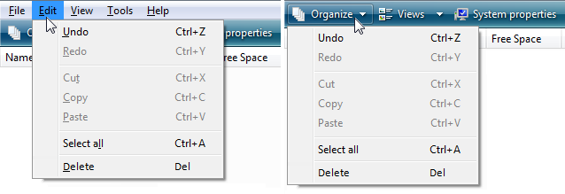

In this example, the toolbar should use Edit instead of Organize for consistency because it has the standard Edit menu commands.

### Palette windows

-   **Palette windows use shorter title bars to minimize their screen space.** Put a Close button on the title bar.
-   **Set the title bar text to the command that displayed the palette window.**
-   **Use sentence-style capitalization without ending punctuation.**
-   **Provide a context menu for window management commands.** Display this context menu when users right-click on the title bar.

    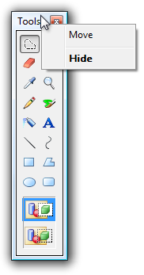

    In this example, users can right-click on the title bar to display the context menu.

-   **When possible and useful, make palette windows resizable.** Indicate that the window is resizable, using resize pointers when over the window frame.
-   **When a palette window is redisplayed, display it using the same state as last accessed.** When closing, save the window size and location. When redisplaying, restore the saved window size and location. Also, consider making these attributes persistent across program instances on a per user basis.

### Customization

-   **Provide customization for toolbars consisting of two or more rows.** Only the unlabeled icons style needs customization. Simple toolbars with few commands don't need customization.
-   **Provide a good default configuration.** Users shouldn't have to customize their toolbars for common scenarios. Don't depend upon users customizing their way out of a bad initial configuration. Assume that most users won't customize their toolbars.
-   **Provide a context menu with the following commands:**
    -   A check box list to display the available toolbars
    -   Lock/Unlock toolbars
    -   Customize...
-   **Lock customizable toolbars by default**, to prevent accidental changes.
-   **For the Customize command, display an options dialog box** that provides the ability to choose which toolbars are displayed and the commands on each toolbar.

    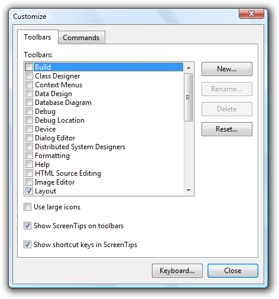

    In this example, Visual Studio provides an options dialog box to customize its toolbars.

-   Provide a Reset command to return to the original toolbar configuration in the Customize options dialog box.
-   **Provide the ability to customize the toolbars using drag-and-drop in the following ways:**

    -   Set toolbar order and positions.
    -   Set toolbar lengths, displaying any toolbars that are too small to display their contents with an overflow chevron.
    -   If supported, undock toolbars to become palette windows and vice versa.

    When the Customize options dialog box is displayed:

    -   Set the toolbar contents.
    -   Set the order of the toolbar contents.

    Doing so allows users to make changes more directly and efficiently.

-   **Save all toolbar customizations,** on a per-user basis.

### Using ellipses

While toolbar commands are used for immediate actions, sometimes more information is needed to perform the action. Use an ellipsis to indicate that a command requires more information before it can take effect. Put the ellipsis at the end of the tooltip and label, if there is one.

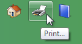

In this example, the Print... command displays a Print dialog box to gather more information.

If a command cannot take effect immediately, however, no ellipsis is required. So, for example, sharing settings doesn't have an ellipsis even though it needs additional information, because the command can't possibly take effect immediately.

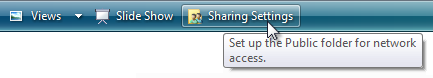

The Sharing Settings command doesn't have an ellipsis because it can't take effect immediately.

Because toolbars are constantly displayed, and space is at a premium, **ellipses should be used infrequently**.

> [!Note]  
> For menus displayed by a toolbar, apply the [menu ellipses guidelines](cmd-menus.md).

 

## Recommended sizing and spacing

Recommended sizing and spacing for standard toolbars.

## Labels

### General

-   **Use sentence-style capitalization.**
    -   **Exception:** For legacy applications, you may use title-style capitalization if necessary to avoid mixing capitalization styles.

### Unlabeled icon buttons

-   **Use a tooltip to label the command.** For the tooltip text, use what the label would be if the button were labeled, but include the shortcut key if there is one.

    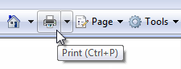

    An example of an icon button tooltip.

### Labeled icon buttons

-   **Use a concise label.** Use a single word if possible, four words maximum.
-   **Place the label to the right of the icon.**
-   **Use an infotip to describe the command.** Because the buttons are labeled, using a tooltip instead of an infotip would be redundant.

    

    An example of a labeled icon button infotip.

### Drop-down lists

-   **If the list always has a value, use the current value as the label.**

    

    In this example, the currently selected font name acts as the label.

-   If an editable drop-down list doesn't have a value, use a [prompt](glossary.md).

    

    In this example, a prompt is used for the drop-down list's label.

### Menu buttons and split buttons

-   **Prefer verb-based menu button names.** However, omit the verb if it is Create, Show, View, or Manage. For example, **Tools** and **Page** menu buttons don't have verbs.
-   **Use a single, specific word that clearly and accurately describes the menu contents.** While the names don't have to be so general that they describe everything in the menu, they should be predictable enough so that users aren't surprised by what they find in the menu.
-   **While not required, provide infotip descriptions if they are helpful.**

### Menu items

-   **Use menu item names that start with a verb, noun, or noun phrase.**
-   **Prefer verb-based menu names.** However, omit the verb if it is Create, Show, View, or Manage. For example, the following commands don't use verbs:
    -   About
    -   Advanced
    -   Full screen
    -   New
    -   Options
    -   Properties
-   **Use specific verbs.** Avoid generic, unhelpful verbs, such as Change and Manage.
-   **Use singular nouns for commands that apply to a single object,** otherwise use plural nouns.
-   **For pairs of complementary commands, choose clearly complementary names.** Examples: Add, Remove; Show, Hide; Insert, Delete.
-   **Choose menu item names based on user goals and tasks, not on technology.**
-   Use the following menu item names for the stated purpose:
    -   **Options:** To display program options.
    -   **Customize:** To display the program options specifically related to mechanical UI configuration.
    -   **Personalize:** To display a summary of commonly used [personalization](glossary.md) settings.
    -   **Preferences:** Don't use. Use Options instead.
    -   **Properties:** To display an object's property window.
    -   **Settings:** Don't use as a menu label. Use Options instead.
-   **Menu items that display submenus never have an ellipsis on their label.** The submenu arrow indicates that another selection is required.

## Documentation

When referring to toolbars:

-   If there is only one toolbar, refer to it as the toolbar.
-   If there are multiple toolbars, refer to them by name, followed by the word toolbar. Refer to the main toolbar that is on by default and contains buttons for basic tasks, such as opening and printing a file, as the standard toolbar.
-   Toolbar is a single, uncapitalized word. (By contrast, menu bar is two words.)
-   Refer to toolbar buttons by their tooltip labels. Use the exact label text, including its capitalization, but don't include any ellipsis.
-   Refer to toolbar menu buttons by their labels and the word menu. Use the exact label text, including its capitalization.
-   Refer to toolbar controls generally as toolbar buttons.
-   To describe user interaction, use click for toolbar buttons and read-only drop-down lists, and enter for editable drop-down lists. Don't use choose, select, or pick.
-   Don't use cascading, pull-down, drop-down, or pop-up to describe menu buttons, except in programming documentation.
-   Refer to unavailable items as unavailable, not as dimmed, disabled, or grayed. Use disabled in programming documentation.
-   When possible, format the labels using bold text. Otherwise, put the labels in quotation marks only if required to prevent confusion.

Examples:

-   On the **Page** menu on the toolbar, click **Send page by e-mail**.
-   In the **Fonts** box on the toolbar, enter "Segoe UI."
-   On the **Formatting** toolbar, point to **Show**, and then click **Comments**.

 

