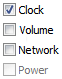
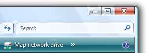

# Controls (Design basics)

> [!NOTE]
> This design guide was created for Windows 7 and has not been updated for newer versions of Windows. Much of the guidance still applies in principle, but the presentation and examples do not reflect our [current design guidance](/windows/uwp/design/).

Controls are UI elements that your users interact with on your app's main window area. See visual examples of controls in Windows-based, desktop apps and get links to guidelines for each control.

|          Examples                                                                                                                                                                                                                                                                                                                                                                           |
|-------------------------------------------------------------------------------------------------------------------------------------------------------------------------------------------------------------------------------------------------------------------------------------------------------------------------------------------------------------------------------------|
|   [Balloons](ctrl-balloons.md) inform users of a non-critical problem or special condition in a control.                                                                                                                                                                                                                  |
|   [Check boxes](ctrl-check-boxes.md) allow users to make a decision between two or more clearly differing choices.                                                                                                                                                                                                      |
|   [Command buttons](ctrl-command-buttons.md) allow users to perform an immediate action.                                                                                                                                                                                                                          |
|   [Command links](ctrl-command-links.md) allow users to make a choice among a set of mutually exclusive, related choices.                                                                                                                                                                                           |
|   [Drop-down lists and combo boxes](/windows/desktop/uxguide/ctrl-drop) allow users to make a choice among a list of mutually exclusive values.                                                                                                                                                                            |
|   [Group boxes](ctrl-group-boxes.md) allow users to see relationships among a set of related controls.                                                                                                                                                                                                                 |
|   [Links](ctrl-links.md) allow users to navigate to another page, window, or Help topic; display a definition; initiate a command; or choose an option.                                                                                                                                                                     |
|   [List boxes](ctrl-list-boxes.md) allow users to select from a set of values presented in a list that is always visible. With a single-selection list box, users select one item from a list of mutually exclusive values. With a multiple-selection list box, users select zero or more items from a list of values.  |
|   [List views](ctrl-list-views.md) allow users to view and interact with a collection of data objects, using either single selection or multiple selection.                                                                                                                                                            |
|   [Notifications](mess-notif.md) inform users of events that are unrelated to the current user activity.                                                                                                                                                                                                           |
|   [Progress bars](progress-bars.md) allow users to follow the progress of a lengthy operation.                                                                                                                                                                                                                     |
|   [Progressive disclosure controls](ctrl-progressive-disclosure-controls.md) allow users to show or hide additional information including data, options, or commands.                                                                                                                                    |
|   [Radio buttons](ctrl-radio-buttons.md) allow users to make a choice among a set of mutually exclusive, related choices.                                                                                                                                                                                          |
|   [Search boxes](ctrl-search-boxes.md) provide users a way to locate specific objects or text quickly.                                                                                                                                                                                                               |
|   [Sliders](ctrl-sliders.md) allow users to choose from a continuous range of values.                                                                                                                                                                                                                                    |
|   [Spin controls](ctrl-spin-controls.md) allow users to change incrementally the value within its associated numeric text box.                                                                                                                                                                                             |
|   [Status bars](ctrl-status-bars.md) display information about the state of the current window, background tasks, or other contextual information.                                                                                                                                                                   |
|   [Tabs](ctrl-tabs.md) present users with related information on separate labeled pages.                                                                                                                                                                                                                                    |
|   [Text boxes](ctrl-text-boxes.md) allow users to display, enter, or edit a text or numeric value.                                                                                                                                                                                                                     |
|   [Tooltips](ctrl-tooltips-and-infotips.md) label an unlabeled control.                                                                                                                                                                                                                                                 |
|   [Infotips](ctrl-tooltips-and-infotips.md) describe an object to which the user is pointing.                                                                                                                                                                                                                           |
|   [Tree views](ctrl-tree-views.md) allow users to view and interact with a hierarchically arranged collection of objects, using either single selection or multiple selection.                                                                                                                                         |

 

