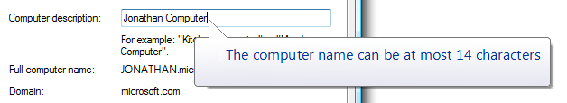

# Balloons

> [!NOTE]
> This design guide was created for Windows 7 and has not been updated for newer versions of Windows. Much of the guidance still applies in principle, but the presentation and examples do not reflect our [current design guidance](/windows/uwp/design/).

A balloon is a small pop-up window that informs users of a non-critical problem or special condition in a control.

A typical balloon.

Balloons have an icon, a title, and body text, all of which are optional. Unlike tooltips and infotips, balloons also have a tail that identifies their source. Usually the source is a control if so, it is referred to as the [owner control](glossary.md).

While balloons inform users of non-critical problems, they don't prevent problems although the owner control might. Any unhandled problems must be handled by the owner user interface (UI) when users attempt to commit to the action.

Balloons are usually used with text boxes, or controls that use text boxes for changing values, such as combo boxes, list views, and tree views. Other kinds of controls are sufficiently well constrained, and don't need the additional feedback balloons afford. Furthermore, if there is a problem with other types of controls, it often involves inconsistency between multiple controls a situation for which balloons aren't suitable. Only text-entry controls are both unconstrained and a common source of [single-point errors](glossary.md).

A notification is a specific type of balloon displayed by a [notification area](winenv-notification.md) icon.

**Note:** Guidelines related to [notifications](mess-notif.md), [tooltips and infotips](ctrl-tooltips-and-infotips.md), and [error messages](mess-error.md) are presented in separate articles.

**Is this the right control?**

To decide, consider these questions:

-   **Does the information describe a problem or special condition?** If not, use another control. Don't use balloons to display supplemental information for a control; consider using [static text](glossary.md),[infotips](glossary.md), [progressive disclosure](glossary.md), or prompts instead.
-   **Can the problem or special condition be detected immediately** either on input or when the owner control loses input focus? If not, use an error message displayed in a [task dialog](glossary.md) or [message box](glossary.md).
-   **For problems, is the problem critical?** If so, use an error message displayed in a task dialog or message box. Such error messages require interaction (which is suitable for critical errors), whereas balloons don't.
-   **For special conditions, is the condition valid yet likely to be unintended?** If so, balloons are appropriate. For conditions not valid, it is better to prevent them in the first place. For likely intended conditions, there is no need to do anything.
-   **Can the problem or special condition be expressed concisely?** If not, use another control. Balloons can't have detailed explanations or provide supplemental information.
-   **Does the information describe the control currently being hovered over?** If so, use a tip instead, unless users may need to interact with the message.
-   **Is the information related to the user's current activity?** If not, consider using a [notification](mess-notif.md) or [dialog box](win-dialog-box.md) instead. Users are likely to overlook balloons outside the current activity, and, by default, balloons time out after 10 seconds.
-   **Does the information come from a single, specific source?** If a problem or condition has multiple sources or no specific source, use an [in-place message](glossary.md) or a dialog box instead.

**Incorrect:** 

In this example, the problem could be with the user name or the password, but reporting the problem with a balloon visually suggests that only the password is the problem. Consequently, the feedback from entering an incorrect user name is misleading.

Balloons are an alternative to infotips, dialog boxes, and in-place messages. In contrast to tooltips and infotips:

-   Balloons can be displayed independently of the current pointer location, so they have a tail that indicates their source.
-   Balloons have a title, body text, and an icon.
-   Balloons can be interactive, whereas it is impossible to click on a tip.

In contrast to modal dialog boxes:

-   Balloons don't steal input focus or require interaction.
-   Balloons identify a single, specific source. Modal dialogs can have multiple sources, or no specific source at all.

In contrast to in-place messages:

-   Balloons are more noticeable.
-   Balloons don't require available screen space or the dynamic layout that is required to display in-place messages.
-   Balloons remove themselves automatically after a timeout.

**Usage patterns**

Balloons have these usage patterns:

|   Usage                                                                                                                                                            |    Example                                                                                                                                                                                                                                                                                                                                                                                                                                                                                                                                                                                                                                                                                       |
|-----------------------------------------------------------------------------------------------------------------------------------------------------------------------|-------------------------------------------------------------------------------------------------------------------------------------------------------------------------------------------------------------------------------------------------------------------------------------------------------------------------------------------------------------------------------------------------------------------------------------------------------------------------------------------------------------------------------------------------------------------------------------------------------------------------------------------------------------------------------------------|
| **Input problem** A non-critical user input problem coming from a single owner control, usually a text box.                                                 | using balloons for error messages doesn't steal input focus, yet is still very noticeable if the owner control has input focus. to correct the problem, the user may have to change or reenter the input; but if the owner control ignores incorrect input, the user may not have to make any changes at all. because the problem isn't critical, no [error icon](vis-std-icons.md) is necessary.     A balloon used to report a non-critical user input problem.                                                                                                   |
| **Special condition** The owner control is in a state that affects input. This state is likely unintended and the user may not realize input is affected.   | use balloons to prevent frustration by alerting users of special conditions as soon as they happen (for example, exceeding maximum input size or setting caps lock on by mistake). it is important to give such feedback without stealing input focus or forcing interaction because these conditions might be intentional. these balloons are especially important for password and pin boxes, where users are otherwise working with minimal feedback. these balloons have a [warning icon](vis-std-icons.md).     A balloon used to report a special condition.  |

 

**Guidelines**

**When to display**

-   **Display the balloon as soon as the problem or special condition is detected, even if repeatedly, without any noticeable delay.**
    -   For problems involving individual characters or the maximum input size, display the balloon immediately on input.
    -   For problems involving the input value (including requiring a non-blank value), display the balloon when the owner control loses input focus. Otherwise, displaying balloons while users are entering potentially valid input can be distracting and annoying.
-   **Display only one balloon at a time.** Displaying multiple balloons can be overwhelming. If a single event results in multiple problems, either present all the problems at once or report only the most important problem.

**Incorrect:** 

In this example, two problems are incorrectly presented at the same time.

**How long to display**

-   **Remove a balloon when:**
    -   The problem is resolved or special condition is removed.
    -   The user enters valid data (for input problems).
    -   The balloon times out. By default balloons remove themselves after 10 seconds, although users can change this by modifying the SPI\_MESSAGEDURATION system parameter.
-   **Remove the timeout if users can't continue until the problem is resolved.Developers:** In Win32, you can set the display time with the TTM\_SETDELAYTIME message.

**How to display**

-   **Display balloons below their owner control.** Doing so allows users to view the context, including the owner control and its label. Microsoft Windows automatically adjusts balloon positions so that they are completely on screen. The default behavior is to display a balloon above its owner control, as done with notifications.

**Correct:** 

**Incorrect:** 

In the incorrect example, the balloon is awkwardly displayed above its owner control.

**Password and PIN text boxes**

-   **Use a balloon to indicate that Caps Lock is on**, using the text in the following example:

In this example, a balloon indicates that Caps Lock is on in a PIN text box.

-   **Use a balloon to indicate when users attempt to exceed the maximum input size.** Reaching the maximum input size is much less obvious in password and PIN text boxes than ordinary text boxes.

In this example, a balloon indicates that the user is attempting to exceed the maximum input size.

-   **Use a balloon to indicate when users input incorrect characters.** However, it is better not to have such restrictions because they reduce the security of the password or PIN. To prevent information disclosure, the balloon should mention only documented facts about valid passwords or PINs.

In this example, a balloon indicates that the PIN requires numbers.

**Other text boxes**

-   **Consider using a balloon to indicate when users attempt to exceed the maximum input size for critical, short text boxes aimed at novice users.** Examples include user names and account names. Text boxes beep when users attempt to exceed the maximum input, but novice users might not understand the meaning of the beep.

In this example, a balloon indicates that the user attempted to exceed the maximum input size.

**Interaction**

-   **When users click a balloon, just dismiss the balloon without displaying any other UI or having any other side effect.** Unlike notifications, balloons shouldn't have close buttons.

**Icons**

-   Choose the icon based on the usage pattern:

    |  Pattern |  Icon                                                                                                                                                       |
    ------------------------------|---------------------------------------------------------------------------------------------------------------------------------------------------------|
    | Input problem | No icon. Not using an [error icon](vis-std-icons.md) here is consistent with the [Windows tone](text-style-tone.md) guidelines. |
    | Special condition | The standard 16x16 pixel [warning icon](vis-std-icons.md).                                                                                  |

**Accessibility**

When used properly, balloons enhance accessibility. For balloons to be accessible:

-   Only display balloons that relate to the user's current activity.
-   Keep the balloon text concise. Doing so makes the balloon text easier to read for users with low vision, and minimizes the interruption when read by screen readers.
-   Redisplay the balloon whenever the problem or condition recurs.

**Text**

**Title text**

-   **Use title text that briefly summarizes the input problem or special condition in clear, plain, concise, specific language.** Users should be able to understand the purpose of the balloon quickly and with minimal effort.
-   **Use text fragments or complete sentences without ending punctuation.**
-   **Use sentence-style capitalization.** For more info, see the [glossary](./glossary.md).
-   **Use no more than 48 characters (in English) to accommodate localization.** The title has a maximum length of 63 characters and must be able to expand by at least 30 percent to accommodate localization.

**Body text**

-   **Use the first sentence of the body text to state the problem or condition in a way that is clearly relevant to the user.** Don't repeat the information in the title. Omit this if there is nothing more to add.
-   **Use the second sentence to state what the user can do to resolve the problem or revert the state.** In accordance with the [Style and Tone](./text-style-tone.md) guidelines, there's no need to use the word Please in this statement. Put two line breaks between the first and second sentences.

This example shows the standard balloon text layout.

-   **Explain how to resolve the problem or revert the state even if that explanation is obvious,** but omit redundancy between the problem statement and its resolution. **Exceptions:**
    -   Omit the resolution if it can't be expressed concisely or without significant redundancy.
    -   Omit the resolution if there is nothing for the user to do, such as when incorrect characters are ignored.
-   **Use complete sentences with ending punctuation.**
-   **Use sentence-style capitalization.**
-   **Use no more than 200 characters (in English) to accommodate localization.** The body text has a maximum length of 255 characters and must be able to expand by at least 30 percent to accommodate localization.

**Documentation**

When referring to balloons:

-   Use the exact title text, including its capitalization.
-   Refer to the component as a balloon, not as a notification or an alert.
-   When possible, format the title text using bold text. Otherwise, put the title in quotation marks only if required to prevent confusion.

