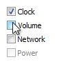
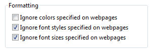
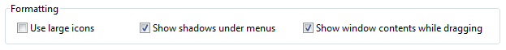
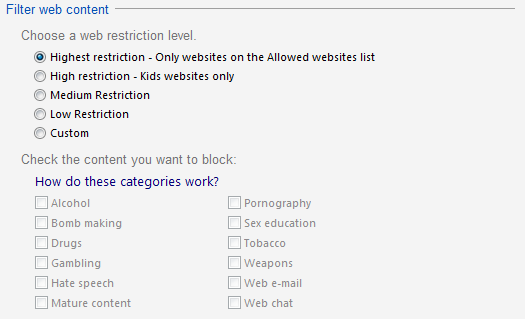
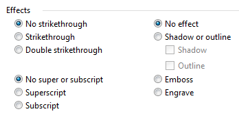
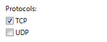

# Check Boxes

> [!NOTE]
> This design guide was created for Windows 7 and has not been updated for newer versions of Windows. Much of the guidance still applies in principle, but the presentation and examples do not reflect our [current design guidance](/windows/uwp/design/).

With a check box, users make a decision between two clearly opposite choices. The check box label indicates the selected state, whereas the meaning of the cleared state must be the unambiguous opposite of the selected state. Consequently, **check boxes should be used only to toggle an option on or off or to select or deselect an item.**

A typical group of check boxes.

> [!Note]  
> Guidelines related to [layout](vis-layout.md) are presented in a separate article.

 

## Is this the right control?

To decide, consider these questions:

-   **Is the check box used to toggle an option on or off or to select or deselect an item?** If not, use another control.
-   **Are the selected and cleared states clear and unambiguous opposites?** If not, use [radio buttons](ctrl-radio-buttons.md) or a [drop-down list](/windows/desktop/uxguide/ctrl-drop) so that you can label the states independently.
-   **When used in a group, does the group comprise independent choices, from which users may choose zero or more?** If not, consider controls for dependent choices, such as radio buttons and [check box tree views](ctrl-tree-views.md).
-   **When used in a group, does the group comprise dependent choices, from which users must choose one or more?** If so, use a group of check boxes and handle the error when none of the options are selected.
-   **Is the number of options in a group 10 or fewer?** Since the screen space used is proportional to the number of options, keep the number of check boxes to 10 or fewer. For more than 10 options, use a [check box list](ctrl-list-boxes.md).
-   **Would a radio button be a better choice?** Where check boxes are suitable only for turning an option on or off, radio buttons can be used for completely different options. If both solutions are possible:
    -   Use radio buttons if the meaning of the cleared check box isn't completely obvious.

        **Incorrect:**

        

        In this example, the opposite choice from Landscape isn't clear, so the check box isn't a good choice.

        **Correct:**

        

        In this example, the choices are not opposites so radio buttons are the better choice.

    -   Use radio buttons on wizard pages to make the alternatives clear, even if a check box is otherwise acceptable.
    -   Use radio buttons if you have enough screen space and the options are important enough to be a good use of that screen space. Otherwise, use a check box or a drop-down list.

        **Incorrect:**

        

        In this example, the options aren't important enough to use radio buttons.

        **Correct:**

        

        In this example, a check box is an efficient use of screen space for this peripheral option.

-   Use a check box if there other check boxes on the window.
-   **Does the option present a program option, rather than data?** The option's values shouldn't be based on context or other data. For data, use a check box list or [multiple-selection list](ctrl-list-boxes.md).

## Usage patterns

Check boxes have several usage patterns:

|    Usage                                                                          |         Example                                                                                             |
|-------------------------------------------------------------------------------------------------------------------------------------------------------------------------------------------------------------|---------------------------------------------------------------------------------------------------------------------------------------------------------------------------------------------------------------------------------------------------------------------------------------------------------------------------------------------------------------------------------------------------------------------------------------------------------------------------------------------|
| **An individual choice** A single check box is used to select an individual choice.                                                                                                               |   A single check box is used for an individual choice.                                                                                                                                                                                                                                                                                                                         |
| **Independent choices (zero or more)** A group of check boxes is used to select from a set of zero or more choices.                                                                               | unlike single-selection controls such as [radio buttons](ctrl-radio-buttons.md), users can select any combination of options in a group of check boxes.    A group of check boxes is used for independent choices.                                                                                                                                                   |
| **Dependent choices (one or more)** A group of check boxes can also be used to select from a set of one or more choices.                                                                          | **you may need to represent a selection of one or more dependent choices**. because microsoft?windows doesn't have a control that directly supports this type of input, the best solution is to use a group of check boxes and handle the error when none of the options are selected.    A group of check boxes is used where at least one protocol must be selected.  |
| **Mixed choice** In addition to their selected and cleared states, check boxes also have a mixed state for multiple selection to indicate that the option is set for some, but not all, objects.  |   A mixed-state check box.                                                                                                                                                                                                                                                                                                                                                       |

 

## Guidelines

### General

-   **Group related check boxes**. Combine related options and separate unrelated options into groups of 10 or fewer, using multiple groups if necessary.

    

    An example of groups of related, independent options.

-   **Reconsider using group boxes to organize groups of check boxes** this often results in unnecessary screen clutter.
-   **List check boxes in a logical order**, such as grouping highly related options together or placing most common options first, or following some other natural progression. Alphabetical ordering isn't recommended because it is language dependent, and therefore not localizable.
-   **Align check boxes vertically, not horizontally**. Horizontal alignment is harder to read.

    **Correct:**

    

    In this example, the check boxes are correctly aligned.

    **Incorrect:**

    

    In this example, the horizontal alignment is harder to read.

-   **Don't use the mixed state to represent a third state.** The mixed state is used to indicate that an option is set for some, but not all, child objects. Users shouldn't be able to set a mixed state directly rather the mixed state is a reflection of the child objects. The mixed state isn't used as a third state for an individual item. To represent a third state, use radio buttons or a drop-down list instead.

    **Incorrect:**

    

    In this example, the mixed state is supposed to indicate that the Theme service isn't installed.

    **Correct:**

    

    In this example, users can choose from a list of three clear options.

-   **Clicking a mixed state check box should cycle through all selected, all cleared, and the original mixed states.** For forgiveness, it's important to be able to restore the original mixed state because the settings might be complex or unknown to the user. Otherwise, the only way to restore the mixed state with confidence would be to cancel the task and start over.
-   **Don't use check boxes as a progress indicator**. Use a [progress indicator](progress-bars.md) control instead.

    **Incorrect:**

    

    In this example, check boxes are used incorrectly as a progress indicator.

    **Correct:**

    

    Example of a typical progress bar.

-   **Show disabled check boxes using the correct selection state.** Even though users can't change them, disabled check boxes convey information so they should be consistent with results.

    **Incorrect:**

    

    In this example, the "Always read this section aloud" option should be cleared because the section isn't read when the option is disabled.

-   **Don't use the selection of a check box to**:
    -   Perform commands.
    -   Display other windows, such as a dialog box to gather more input.
    -   Dynamically display other controls related to the selected control (screen readers cannot detect such events).

### Don't show this <item> again

-   **Consider using a Don't show this <item> again option to allow users to suppress a recurring dialog box only if there isn't a better alternative.** Try to determine beforehand if users really need the dialog; if they do, always show the dialog, and if they don't, eliminate the dialog.

For more guidelines and examples, see [Dialog Boxes](win-dialog-box.md).

### Subordinate controls

-   Place subordinate controls to the right of or below (indented, flush with the check box label) the check box and its label. End the check box label with a colon.

    

    In this example, the check box and its subordinate control share the check box label and its access key.

-   **Leave dependent editable text boxes and drop-down lists enabled if they share the check box's label.** When users type or paste anything into the box, select the corresponding option automatically. Doing so simplifies the interaction.

    

    In this example, entering a header or footer automatically selects the option.

-   If you nest check boxes with radio buttons or other check boxes, **disable these subordinate controls until the high-level option is selected**. Doing so avoids confusion about the meaning of the subordinate controls.
-   Make subordinate controls to a check box contiguous with the check box in the tab order.
-   **If selecting an option implies selecting subordinate check boxes, explicitly select those check boxes to make the relationship clear.**

    **Incorrect:**

    

    In this example, the subordinate check boxes aren't selected.

    **Correct:**

    

    In this example, the subordinate check boxes are selected, making their relationship to the selected option clear.

-   **Use dependent check boxes if the alternatives add unnecessary complexity**. While check boxes should be independent options, sometimes alternatives such as radio buttons add unnecessary complexity.

    **Correct:**

    

    In this example, the use of radio buttons is accurate, but creates unnecessary complexity.

    **Better:**

    

    In this example, the use of check boxes is simpler and allows users to focus on selecting the desired options instead of on their complex relationship.

    **Important: Apply this guideline only in extremely rare circumstances**, when showing the dependencies adds significant complexity without adding clarity. In the previous example, it is unlikely that users would attempt to choose both superscript and subscript, and if they did, it would be easy to understand that they were exclusive options.

### Default values

-   If a check box is for a user option, **set the safest (to prevent loss of data or system access), most secure and private state by default.** If safety and security aren't factors, select the most likely or convenient value.

## Recommended sizing and spacing

Recommended sizing and spacing for check boxes.

## Labels

**Check box labels**

-   Label every check box.
-   Assign a unique [access key](glossary.md) to each label. For guidelines, see [Keyboard](inter-keyboard.md).
-   Use [sentence-style capitalization](glossary.md).
-   Write the label as a phrase or an imperative sentence, and use no ending punctuation.
    -   **Exception:** If a check box label also labels a subordinate control that follows it, end the label with a colon.
-   Write the label so that it describes the selected state of the check box.
-   For a group of check boxes, use parallel phrasing and try to keep the length about the same for all labels.
-   For a group of check boxes, focus the label text on the differences among the options. If all the options have the same introductory text, move that text to the group label.
-   Use positive phrasing. Don't phrase a label so that selecting a check box means not to perform an action.

    -   **Exception:Don't show this <item> again** check boxes.

    **Incorrect:**

    

    In this example, the option doesn't use positive phrasing.

-   Describe just the option with the label. Keep labels brief so it's easy to refer to them in messages and documentation. If the option requires further explanation, provide the explanation in a [static text](./glossary.md) control using complete sentences and ending punctuation.

    > [!Note]
    >
    > Adding an explanation to one check box in a group doesn't mean that you have to provide explanations for all check boxes in the group. Provide the relevant information in the label if you can, and use explanations only when necessary. Don't merely restate the label for consistency.

     

    

    In this example, a check box label has additional explanatory text beneath it.

-   If an option is strongly recommended, consider adding "(recommended)" to the label. Be sure to add to the control label, not the supplemental notes.
-   If you must use multi-line labels, align the top of the label with the check box.
-   Don't use a subordinate control, the values it contains, or its units label to create a sentence or phrase. Such a design isn't localizable because sentence structure varies with language.

    **Incorrect:**

    

    In this example, the text box is incorrectly placed inside the check box label.

**Check box group labels**

-   Use the group label to explain the purpose of the group, not how to make the selection. Assume that users know how to use check boxes. For example, don't say "Select any of the following choices".
-   End each label with a colon.
-   Don't assign an access key to the label. Doing so isn't necessary and it makes the other access keys harder to assign.
-   For a selection of one or more dependent choices, explain the requirement on the label.

    **Correct:**

    

    In this example, users might think that they can only make one selection.

    **Better:**

    

    In this example, it's clear that users can make more than one selection.

## Documentation

When referring to check boxes:

-   Use the exact label text, including its capitalization, but don't include the access key underscore or colon. Include the word check box.
-   Refer to a check box as a check box, not option, checkbox, or just box, because box alone is ambiguous for localizers.
-   To describe user interaction, use select and clear.
-   When possible, format the label using bold text. Otherwise, put the label in quotation marks only if required to prevent confusion.

    Example: Select the **Underline** check box.

