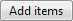

# Command Buttons in Windows 7

> [!NOTE]
> This design guide was created for Windows 7 and has not been updated for newer versions of Windows. Much of the guidance still applies in principle, but the presentation and examples do not reflect our [current design guidance](/windows/uwp/design/).

With command buttons in Windows 7, users initiate immediate actions.

A typical command button.

The default command button is invoked when users press the Enter key. It is assigned by the developer, but any command button becomes the default when users tab to it.

> [!Note]  
> Guidelines related to [layout](vis-layout.md) are presented in a separate article.

 

## Is this the right control?

To decide, consider these questions:

-   **Is the command button used to initiate an immediate action?** If not, use another control.
-   **Would a link be a better choice?** Use a link if:
    -   The action is to navigate to another page, window, or Help topic. **Exception**: Wizard navigation uses Back and Next command buttons.
    -   The command is embedded in a body of text.
    -   The command is secondary in nature. That is, it does not relate to the primary purpose of the window. In this case, either a lightweight command button or link would be appropriate.
    -   The command is part of a menu or group of related links.
    -   The label is lengthy, consisting of five or more words, thus giving a command button an awkward appearance.
-   **Would a combination of radio buttons and generic command buttons be a better choice?** Often radio buttons are used in conjunction with generic command buttons (OK, Cancel) in place of a set of specific command buttons when any of the following are true:
    -   There are five or more possible actions.
    -   Users need to view additional information before making a decision.
    -   Users need to interact with the choices (perhaps to see additional information) before making a decision.
    -   Users view the choices as options instead of different commands.

        **Correct:** 

        In this example, radio buttons are combined with OK and Cancel buttons to provide additional information about the options.

        **Incorrect:** 

        In this example, command buttons alone make it difficult for users to make an informed decision.

## Design concepts

**Using ellipses**

While command buttons are used for immediate actions, more information might be needed to perform the action. **Indicate a command that needs additional information (including confirmation) by adding an ellipsis at the end of the button label**.

In this example, the Print... command displays a Print dialog box to gather more information.

By contrast, in this example the Print command prints a single copy of a document to the default printer without any further user interaction.

**Proper use of ellipses is important to indicate that users can make further choices before performing the action, or even cancel the action entirely**. The visual cue offered by an ellipsis allows users to explore your software without fear.

**This doesn't mean you should use an ellipsis whenever an action displays another window**. Use an ellipsis only when additional information is required to perform the action. Consequently, **any command button whose implicit verb is to "show another window" doesn't take an ellipsis**, such as with the commands About, Advanced, Help (or any other command linking to a Help topic), Options, Properties, or Settings.

Generally, ellipses are used in user interfaces to indicate incompleteness. Commands that show other windows aren't incomplete; they must display another window and additional information isn't needed to perform their action. This approach eliminates screen clutter in situations where ellipses have little value.

**Note:** When determining if a command button needs an ellipsis, don't use the need to [elevate privileges](winenv-uac.md) as a factor. Elevation isn't information needed to perform a command (rather, it's for permission) and the need to elevate is indicated with the security shield.

**If you do only one thing...** Use a concise, specific, self-explanatory label that clearly describes the action that the command button performs, and use an ellipsis when appropriate.

## Usage patterns

Command buttons have several usage patterns:

|     Usage                                                                                                                                                                    |    Example                                                                                                                                                                                                                                                                                                                                                                                                                                                                                                                                                                                                                                                                                                                                                                                                                                                                                                                                                                                                                                                                                                                                                                                                                                                                                              |
|-------------------------------------------------------------------------------------------------------------------------------------------------------------------------|--------------------------------------------------------------------------------------------------------------------------------------------------------------------------------------------------------------------------------------------------------------------------------------------------------------------------------------------------------------------------------------------------------------------------------------------------------------------------------------------------------------------------------------------------------------------------------------------------------------------------------------------------------------------------------------------------------------------------------------------------------------------------------------------------------------------------------------------------------------------------------------------------------------------------------------------------------------------------------------------------------------------------------------------------------------------------------------------------------------------------------------------------------------------------------------------------------------------------------------------------------------------------------------------------|
| **Standard command buttons** You can use standard command buttons to initiate an immediate action.                                                            |   A standard command button.                                                                                                                                                                                                                                                                                                                                                                                                                                                                                                                                                                                                                                                                                                                                                                                                                                                                                                                                                                                                                                                                                                                                                        |
| **Default command buttons** The default command button in a window indicates the command button that will be activated when users press the Enter key.        |   A default command button.  Any command button becomes the default when users tab to it. If the input focus is on a control that isn't a command button, the command button with the default button attribute becomes the default. Only one command button in a window can be the default.                                                                                                                                                                                                                                                                                                                                                                                                                                                                                                                                                                                                                                                                                                                                                                                                                                                                                |
| **Lightweight command buttons** A lightweight command button is similar to a standard command button, except its button frame is shown only on mouse hover.   |   In this example, the command has a very lightweight appearance (similar to a [link](ctrl-links.md)) until the user hovers over the command, at which point it is drawn with a button frame.  You can use lightweight command buttons in situations where you would use a standard command button, but you want to avoid always showing the button frame. Lightweight command buttons are ideal for commands that you want to underemphasize and using a link wouldn't be appropriate.                                                                                                                                                                                                                                                                                                                                                                                                                                                                                                                                                                                                                                                                               |
| **Menu buttons** Use a menu button when you need a menu for a small set of related commands.                                                                  |   A menu button with a small set of related commands.  Use a menu button when a menu bar is undesirable, such as in a dialog box, toolbar, or other window that doesn't have a menu bar. A single downward-pointing triangle indicates that clicking the button will drop down a menu.                                                                                                                                                                                                                                                                                                                                                                                                                                                                                                                                                                                                                                                                                                                                                                                                                                                                               |
| **Split buttons** Use a split button to consolidate a set of variations of a command, especially when one of the commands is used most of the time.           |   a collapsed split button.  like a menu button, a single downward-pointing triangle indicates that clicking the rightmost portion of the button will drop down a menu.    a dropped-down split button.  in this example, a split button is used to consolidate six variations of the open command. the regular open command is used most of the time, so users normally don't need to see the other commands. using a split button saves a significant amount of screen space, while also providing powerful choices.  unlike a menu button, clicking the left portion of the button performs the action on the label directly. split buttons are effective in situations where the next action with a specific tool is likely to be the same as the last action. in this case, the label is changed to the last action, as with a color picker:    In this example, the label is changed to the last action.  |
| **Browse buttons** Use a browse button to display a dialog box to help users select a valid value.                                                            | dialog boxes launched by a browse button help users select files, folders, computers, users, colors, and so on. they are typically combined with an unconstrained control such as a text box. they're usually labeled browse, other, or more, and always have an ellipsis to indicate that more information is required.     a text box with a browse button.  for windows that have many browse buttons, you can use a short version:    A short browse button.                                                                                                                                                                                                                                                                                                                                                                                                                                                                                                                                                                                 |
| **Progressive disclosure buttons** Use a progressive disclosure button to show or hide infrequently used options.                                             | hiding infrequently used options until they are needed is called progressive disclosure. double chevrons are used to indicate progressive disclosure, and they point in the direction in which the revealing or hiding will take place:     after the button is clicked, its label changes to indicate that the next click will have the opposite effect:    For more information and examples, see [Progressive Disclosure Controls](ctrl-progressive-disclosure-controls.md).                                                                                                                                                                                                                                                                                                                                                                                                                                                                                                                                                                  |
| **Directional buttons** Use a directional button to indicate the direction in which an action will take place.                                                | in this case, a single angle bracket is used instead of a double chevron:     A directional button indicates the direction of action.                                                                                                                                                                                                                                                                                                                                                                                                                                                                                                                                                                                                                                                                                                                                                                                                                                                                                                                                                                                                                                      |

 

## Guidelines

### General

-   **Display a busy pointer if the result of clicking a command button isn't instantaneous.** Without feedback, users might assume that the click didn't happen and click again.
-   If the same command button appears in more than one window, **try to use the same label text and access key, and locate it in approximately the same place in each window when practical.**
-   **For command buttons with text labels, use a minimum button width and the standard command button height.** For more information, see [Recommended sizing and spacing](#recommended-sizing-and-spacing).
-   For each window **make the command buttons the same width**. If that's impractical, limit the number of different widths for command buttons with text labels to two.
-   When another control interoperates with a command button, such as a text box with a Browse button, **denote the relationship by placing the command button in one of three places:**
    -   To the right of and top-aligned with the other control.
    -   Below and left-aligned with the other control.
    -   Vertically centered between controls that interoperate (such as Add and Remove buttons between two interoperating list boxes).
-   If multiple command buttons interoperate with the same control, **vertically stack them to the right of and top-aligned with the other control, or horizontally place them left-aligned under the control.**
-   When command buttons are subordinate to other controls, **use the above placement and disable the subordinate command button until the superior control is selected.**
-   **Don't use narrow, short, or tall command buttons with text labels** because they tend to look unprofessional. Try to work with the default widths and heights.

**Correct:** 

In this example, the button size is standard and looks professional.

**Incorrect:** 

In this example, the button is too small.

**Incorrect:** 

In this example, the button has too much space around the label.

-   **Avoid combining text labels and graphics on command buttons.** Combining text and graphics usually adds unnecessary visual clutter and does not improve the user's comprehension. Consider combining text and graphics only when the graphic aids in comprehension, such as when it is a standard symbol for the command or it helps users visualize the results of the command. Otherwise, prefer text, but use either text or graphics.

**Correct:** 

In this example, the arrow graphic helps users visualize the results of the command.

**Correct:** 

In this example, standard symbols are combined with text to aid comprehension

**Incorrect:** 

In this example, the cancel graphic adds nothing to the text.

-   **Don't use command buttons to set state**. Use radio buttons or check boxes instead. Command buttons are only for initiating actions.

### Split buttons

-   **Make the most likely command the default behavior**. If there is more than one likely command, choose one that doesn't require additional information.
-   **If the most likely command is the last user selection, change the button label to the last selection.**
-   **Display the default command using bold text in the menu**. Doing so makes it easier for users to find the default command, especially when the default command is dynamic or the split button uses a graphic instead of a text label.

### Default values

-   Include a default command button on every dialog box. **Select the safest (to prevent loss of data or system access) and most secure command to be the default**. If safety and security aren't factors, select the most likely or convenient command.
-   **Don't make a destructive action the default command button** unless there is an easy way to undo the command.

## Recommended sizing and spacing

Recommended sizing and spacing for command buttons.

## Labels

-   Label every command button.
-   If the button has a graphic label only, assign its Name property to an appropriate text label. This enables assistive technology products such as screen readers to provide users with alternative information about the graphic.

    

    This example shows graphic buttons; internally, these buttons are labeled Previous, Next, and Copy.

-   For short browse buttons (labeled "..."), the internal label should be Browse.
-   Assign a unique [access key](glossary.md). For guidelines, see [Keyboard](inter-keyboard.md).

    **Exceptions:**

    -   Don't assign access keys to OK and Cancel buttons, because Enter is the access key for the default button (which is usually the OK button), and Esc is the access key for Cancel. Doing so makes the other access keys easier to assign.
    -   Don't assign access keys to short browse buttons (labeled "..."), because they can't be assigned uniquely.

-   Prefer specific labels over generic ones. Ideally users shouldn't have to read anything else to understand the label. Users are far more likely to read command button labels than static text.

    -   **Exception:** Don't rename the Cancel button if the meaning of cancel is unambiguous. Users shouldn't have to read all the buttons to determine which button cancels an action. However, rename Cancel if it is unclear what action is being canceled, such as when there are several pending actions.

    **Acceptable:**

    

    In this example, OK and Cancel are acceptable but unspecific labels.

    **Better:**

    

    In this example, Burn CD is more specific than OK.

    **Incorrect:**

    

    In this example, Cancel should be used instead of Don't Burn CD.

-   Start labels with an imperative verb and clearly describe the action that the button performs. Don't use ending punctuation.
    -   **Exception:** The following standard labels are acceptable without verbs: Advanced, Back, Details, Forward, Less, More, New, Next, No, OK, Options, Previous, Properties, Settings, and Yes.
-   While short labels are preferred, use enough text to explain the command sufficiently. Use a direct object (a noun after the verb) when the object is not apparent from context. Ideally users shouldn't have to read anything else to understand the label.

    **Acceptable:**

    

    In this example, a short label is acceptable if its meaning in context is readily apparent.

    **Better:** (if Add isn't clear)

    

    In this example, adding a noun to the verb aids users' comprehension.

    **Best:** (if Add or Add items aren't clear)

    

    In this example, the label is self-explanatory.

-   Use [sentence-style capitalization](glossary.md). Doing so is more appropriate for [Windows tone](text-style-tone.md)[Windows tone](https://msdn.microsoft.com/library/windows/desktop/aa974175.aspx) and the use of short phrases for command buttons.
    -   **Exception:** For legacy applications, you may use [title-style capitalization](glossary.md) if necessary to avoid mixing capitalization styles.
-   Don't use now in command button labels because the immediacy of the command can be taken for granted.

    -   **Exception:** When necessary, use now to differentiate commands that start a task from commands that perform a task immediately.

    

    In this example, clicking the command button goes to a window or page that allows users to download.

    

    In this example, clicking the command button performs the download.

    Only one command in a task flow should be labeled with now. So, for example, a **Download now** command should never be followed by another **Download now** command.

-   Don't use later in command button labels if it implies an action that won't happen. For example, don't use Install later (in contrast to Install now) unless that command installs at a later time. Instead, use either Don't install or Cancel.

    **Incorrect:**

    

    In this example, Restart Later incorrectly implies that command restarts automatically at a later time.

-   Use an Advanced button only for options that are relevant to advanced users or require advanced user knowledge. Don't use an Advanced button for features that are considered technologically advanced. For example, a printer's stapling feature is not an advanced option, but its color management system is.

    **Incorrect:** (if the options really aren't advanced)

    

    In this example, Advanced is misleading.

    **Correct:**

    

    In this example, the label is more specific and accurate.

-   For command buttons that open other windows, choose a label that uses part or all of the secondary window's title bar text. For example, a command button labeled Browse might open a dialog box entitled Browse for Folder. Using the same terminology throughout the task helps to keep users oriented.
-   When asking a question, use labels that match the question. Don't use OK/Cancel to answer Yes/No questions.

    **Correct:**

    

    In this example, the buttons answer the question.

    **Incorrect:**

    

    In this example, the buttons don't answer the question.

-   End the label with an ellipsis if the command requires additional information to execute.

    -   **Exception:** Graphic labels don't take an ellipsis.

    **Correct:** (if a Print options dialog is displayed)

    

    In this example, after the button is clicked, the Print options dialog is displayed and requires more information from the user.

-   Don't use an ellipsis when the successful completion of the action is simply to display another window. The following commands never take an ellipsis: About, Advanced, Options, Properties, Help.

    **Incorrect:**

    

    In this example, after the button is clicked, the Options dialog is displayed, but more information from the user is not required.

-   In case of ambiguity (for example, the command label lacks a verb), decide based on the most likely user action. If simply viewing the window is a common action, don't use an ellipsis.

    **Correct:**

    More colors...

    Version information

    In the first example, users are most likely going to choose a color, so using an ellipses is correct. In the second example, users are most likely going to view the version information, making ellipses unnecessary.

-   For browse buttons, use short browse buttons (labeled "...") when there are more than two browse buttons in a window. Always use the short version when you want to display a browse button in a grid.
-   For directional buttons, use a single angle bracket and have it point in the direction where the action takes place.

The following table shows some common command button labels and their usage.

| Button label | Meaning              | Access key   |
|-----------------------------|--------------------------------------------------------------------------------------------------------------|-----------------------------|
| **Back**          | In wizards and task flows, go to the previous page.                                                | 'B'               |
| **Browse...**     | Display a dialog box to look for a file or object.                                                 | 'B' or 'r'        |
| **Options**       | Display the choices available to users for customizing a program.                                  | 'O'               |
| **Pause**         | In progress dialog boxes, suspend the task.                                                        | 'P'               |
| **Personalize**   | Customize a core experience that is crucial to the user's personal identification with a program.  | 'P'               |
| **Preferences**   | Don't use. Use Options instead.                                                                    | Not applicable.   |
| **Properties**    | Display the attributes and settings for an object.                                                 | 'P' or first 'r'  |
| **Save**          | Save a group of settings, or save a file or object using its current name.                         | 'S'               |
| **Save as...**    | Save a file or object using a specified name.                                                      | Second 'a'        |
| **Settings**      | Don't use. Use Options instead.                                                                    | Not applicable.   |
| **Troubleshoot**  | Don't use. Use a specific Help link instead.                                                       | Not applicable.   |

 

For guidelines about commit button labels (OK, Cancel, Yes/No, Close, Stop, Apply, Next, Finish, Done), see [User Interface Text](text-ui.md).

## Documentation

When referring to command buttons:

-   Use the exact label text, including its capitalization, but don't include the access key underscore or ellipsis. Don't include the word button.
-   To describe user interaction, use click.
-   When possible, format the label using bold text. Otherwise, put the label in quotation marks only if required to prevent confusion.

Example: Click **Print** to print the document.

 

